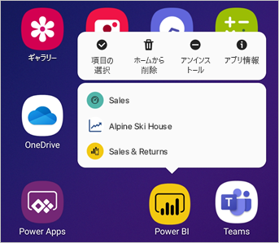

# Power BI Android アプリで Android アプリのショートカットを使用する

適用対象:

|  |  |
|:--- |:--- |
| Android フォン |Android タブレット |

Android 用 Power BI モバイル アプリでは、必要なレポートまたはダッシュボードにすぐにアクセスするための 2 つの簡単な方法 (**デバイスのホーム画面のショートカット**と**アプリ起動ツールのショートカット**) が提供され、アプリ内を移動する必要はありません。
 * **デバイスのホーム画面のショートカット**:任意のレポートまたはダッシュボードへのショートカットを作成し、デバイスのホーム画面にピン留めすることができます。 レポートまたはダッシュボードが、ワークスペースのいずれかに含まれている必要はありません。アプリ内にあるレポートやダッシュボード、あるいは外部 (B2B) テナントに配置されているレポートまたはダッシュボードへのショートカットを作成することもできます。
 * **アプリ起動ツールのショートカット**:デバイスのホーム画面でアプリ起動ツール アイコンをロング タップしてアプリ起動ツールを開くだけで、頻繁に表示されるレポートやダッシュボードに直接アクセスすることができます。 クイック アクセス メニューでは、頻繁に表示される 3 つの項目へのショートカットが提供されます。 これらの項目は時々変更されます。Power BI モバイル アプリでは、よく表示されるものを追跡し、それに応じてショートカットを変更します。

 >[!NOTE]
 >Android アプリのショートカットは、Android 8 以降で利用できます。

## 任意のレポートまたはダッシュボードへのショートカットを作成する

任意のレポートまたはダッシュボードへのショートカットを作成することができます。

1. [操作] メニューで、 **[その他のオプション]** をクリックして、 **[ショートカットの追加]** を選択します。

   ![[ショートカットの追加] 操作メニュー](media/mobile-app-quick-access-shortcuts/mobile-add-shortcut-action-menu.png)

   また、Power BI アプリで、ある項目によくアクセスしていることが確認された場合、その項目へのショートカットの作成が提案されます。 これは、次の 2 つの方法で行われます。
   * 頻繁に表示されるレポートとダッシュボードでは、項目を開いたときに、 **[ショートカットの追加]** オプションがバナーに表示されます。
   * リンクを頻繁に使用してレポートにアクセスしている場合 (たとえば、共有メールや注釈などから)、このリンクを数回使用した後、ショートカットを作成するかどうかを確認するウィンドウが開きます。 **[はい]** の場合、 **[ショートカットの追加]** ダイアログが開き (下記参照)、 **[後で行う]** の場合は、アクセスしようとしていた項目への移動が続行されます。
   
   以下に、これら 2 つのエクスペリエンスを示します。

   ![[ショートカットの追加] バナー](media/mobile-app-quick-access-shortcuts/mobile-add-shortcut-banner.png)

 1. **[ショートカットの追加]** ダイアログが開き、項目の名前が示されます。 必要に応じて、名前を編集できます。 完了したら、 **[追加]** をタップします。

    ![[ショートカットの追加] ダイアログ](media/mobile-app-quick-access-shortcuts/mobile-add-shortcut-dialog.png)

1. ショートカットを追加するかどうかを確認するよう求められます。 **[追加]** をタップして、デバイスのホーム画面にショートカットを追加します。

   

   入力した名前で、デバイスのホーム画面にショートカット ダッシュボードまたはレポート アイコンが追加されます。

   

## ショートカット名を編集する

ショートカットの名前を編集するには、操作メニューで、 **[その他のオプション]** を選択してから、 **[Edit shortcut name]\(ショートカット名の編集\)** を選びます

 ![[Edit shortcut name]\(ショートカット名の編集\)](media/mobile-app-quick-access-shortcuts/mobile-edit-shortcut.png)

## Power BI モバイル アプリの起動ツールを使用して頻繁に表示されるコンテンツにアクセスする

Power BI モバイル アプリの起動ツールを使用して、頻繁にアクセスされる項目に直接アクセスすることができます。

アプリ起動ツールをロング タップし、頻繁に表示される項目のクイック アクセス メニューを表示します。 その後、ショートカットをタップして目的の項目を開きます。

目的のショートカットのアイコンをデバイスのホーム画面にドラッグするだけで、一覧表示された項目のいずれかに対する永続的なショートカットを作成できます。

## 次の手順
* [Google Search でコンテンツを検索してアクセスする](mobile-app-find-access-google-search.md)
* iOS で Siri ショートカットを探す場合は、「[Power BI Mobile iOS アプリで Siri ショートカットを使用する](mobile-apps-ios-siri-shortcuts.md)」を参照してください。
* [Power BI モバイル アプリのお気に入り](mobile-apps-favorites.md)
