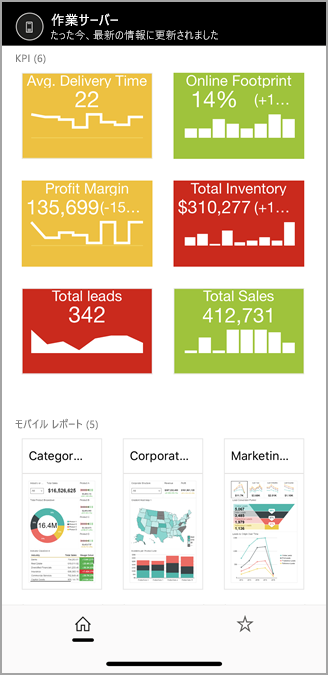
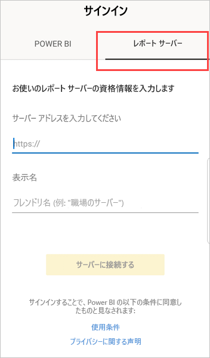
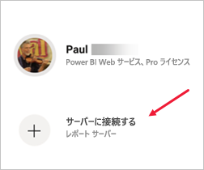
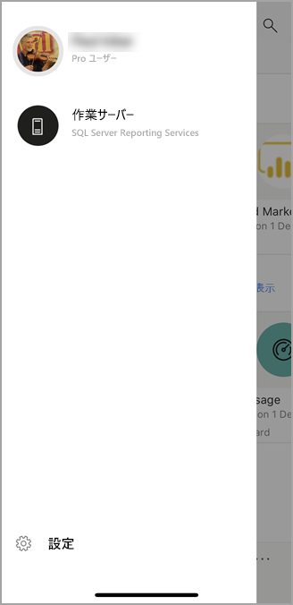

# Power BI モバイル アプリでオンプレミスのレポート サーバーのレポートと KPI を表示する

Power BI モバイル アプリを使って、タッチ対応のモバイルから、Power BI レポート サーバーと SQL Server 2016 Reporting Services (SSRS) のオンプレミスのビジネス情報に簡単にアクセスできます。

適用対象:

|  |  |  |  |
|:--- |:--- |:--- |:--- |
| iPhones |iPad |Android フォン |Android タブレット |

## 最初に行うこと
**モバイル アプリは、Power BI コンテンツを表示する場所で、作成する場所ではありません。**

* 組織内のレポートの作成者は、[Power BI Desktop で Power BI レポートを作成してから、それらを Power BI レポート サーバーの Web ポータルに発行します](../../report-server/quickstart-create-powerbi-report.md)。 
* [Web ポータルで KPI 権限](https://docs.microsoft.com/sql/reporting-services/working-with-kpis-in-reporting-services)を作成し、それらをフォルダー内に整理してお気に入りに設定し、簡単に検索できるようにすることもできます。 
* SQL Server 2016 Enterprise Edition Mobile Report Publisher で [Reporting Services のモバイル レポートを作成](https://docs.microsoft.com/sql/reporting-services/mobile-reports/create-mobile-reports-with-sql-server-mobile-report-publisher)し、[Reporting Services の Web ポータル](https://docs.microsoft.com/sql/reporting-services/web-portal-ssrs-native-mode)にそのレポートを公開します。  

Power BI モバイル アプリで最大 5 個のレポート サーバーに接続して、フォルダーやお気に入りに追加した Power BI レポートや KPI を表示します。 

## サーバーを接続せずにモバイル アプリでサンプルを参照する
Reporting Services の Web ポータルへのアクセス権がない場合でも、Reporting Services のモバイル レポートや KPI の機能を参照できます。 

1. 左上隅にある自分のプロファイル写真をタップし、スライドして現れるアカウント パネルの **[設定]** をタップします。

2. [設定] ページが開いたら、 **[Reporting Services のサンプル]** をタップし、サンプルの KPI やモバイル レポートを参照して操作します。
   
   

## オンプレミス レポート サーバーに接続する
Power BI モバイル アプリでオンプレミスの Power BI レポート、Reporting Services モバイル レポート、KPI を表示することができます。 

1. モバイル デバイスで Power BI アプリを開きます。 
2. Power BI にまだサインインしていない場合は、 **[レポート サーバー]** をタップします。
   
   
   
   Power BI アプリに既にサインインしている場合、左上隅にある自分のプロファイル写真をタップし、スライドして現れるアカウント パネルの **[設定]** をタップします。
3. [設定] ページが開いたら、 **[サーバーに接続]** をタップします。
   
    

    モバイル アプリは、何らかの方法でサーバーにアクセスする必要があります。 これを行うには、いくつかの方法があります。
     * 同じネットワークに接続して VPN を使うのが最も簡単な方法です。
     * Web アプリケーション プロキシを使って組織の外から接続することができます。 詳しくは、「[OAuth を使って Reporting Services に接続する](mobile-oauth-ssrs.md)」をご覧ください。
     * ファイアウォールで接続 (ポート) を開きます。

4. サーバー アドレスに入力し、必要であればサーバーにわかりやすい名前を付けます。 サーバーのアドレスには次の形式を使用します。
   
     `https://<servername>/reports`
   
     または
   
     `https://<servername>/reports`
   
   接続文字列の前に **http** または **https** を含めてください。
   
    ![[サーバーに接続] ダイアログ ボックス](./media/mobile-app-ssrs-kpis-mobile-on-premises-reports/power-bi-ios-connect-to-server-dialog.png)
5. サーバー アドレスを入力し、任意でわかりやすい名前を付けたら、 **[接続]** をタップし、入力を求められたらユーザー名とパスワードを入力します。
6. これで [アカウント] ウィンドウにサーバーが表示されます。この例では "Work server" という名前になっています。
   
   

## iOS または Android でオンプレミス レポート サーバーに接続する

iOS または Android のモバイル アプリで Power BI を表示している場合、IT 管理者によりアプリ構成ポリシーが定義されている可能性があります。 その場合、レポート サーバーへの接続が合理化されているので、レポート サーバーに接続するときに、たくさんの情報を入力する必要がありません。 

1. レポート サーバーでモバイル アプリが構成されていることを示すメッセージが表示されます。 **[サインイン]** をタップしてください。

    

2.  **[サーバーに接続]** ページには、レポート サーバーの詳細が既に入力されています。 **[接続]** をタップします。

    

3. 認証用のパスワードを入力し、 **[サインイン]** をタップします。 

    

これで、レポート サーバーに格納されている KPI と Power BI レポートを表示して操作できるようになりました。

## Power BI アプリで Power BI レポートと KPI を表示する
Power BI レポート、Reporting Services モバイル レポート、KPI は、Reporting Services の Web ポータルと同じフォルダーに表示されます。 

* Power BI レポートをタップします。 。 レポートが横モードで開き、Power BI アプリで対話することができます。

    > [!NOTE]
  > Power BI Report Server の Power BI レポートでは現在、ドリルアップとドリルダウンが有効になっていません。
  
    
* レポート所有者は、Power BI Desktop で Power BI モバイル アプリの[レポートを最適化する](../../create-reports/desktop-create-phone-report.md)ことができます。 携帯電話では、最適化されたレポートに特別なアイコン、、レイアウトが与えられます。
  
    
* [KPI] をタップすると、フォーカス モードで表示されます。
  
    

## お気に入りの KPI とレポートを表示する
KPI とレポートを Web ポータルでお気に入りとしてマークし、モバイル デバイスの 1 つの便利なフォルダーに Power BI のお気に入りダッシュボードと共に表示できます。

* ナビゲーション バーの **[お気に入り]** をタップします。
  
   ![ナビ ペインの [お気に入り]](./media/mobile-app-ssrs-kpis-mobile-on-premises-reports/power-bi-ipad-faves-pbi-report-server-update.png)
  
   Web ポータルのお気に入りの KPI とレポートはすべて、Power BI サービスの Power BI ダッシュボードと共にこのページに表示されます。
  
   ![[お気に入り] ページの Power BI レポートとダッシュボード](./media/mobile-app-ssrs-kpis-mobile-on-premises-reports/power-bi-ipad-favorites.png)

## レポート サーバーへの接続を削除する
1. [アカウント] ウィンドウを開き、 **[設定]** をタップします。
2. 接続を望まないサーバーの名前をタップします。
3. **[サーバーの削除]** をタップします。

## 次のステップ
* [Power BI とは?](../../fundamentals/power-bi-overview.md)  
* ご質問 [Power BI コミュニティで質問してみてください](https://community.powerbi.com/)。
