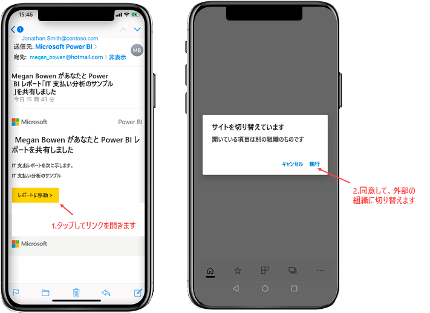
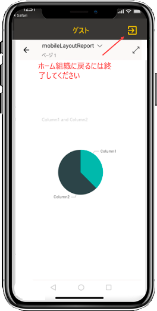
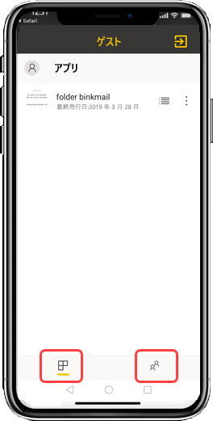

# 外部組織から共有されている Power BI コンテンツを表示する

Power BI と Azure Active Directory Business-to-Business (Azure AD B2B) との統合により、組織外のゲスト ユーザーに Power BI コンテンツを安全に配布することができます。 また、外部のゲスト ユーザーは、Power BI モバイル アプリを使用して、共有されている Power BI コンテンツにアクセスできます。 

適用対象:

|  |  |  |  |
|:--- |:--- |:--- |:--- |
| iPhone |iPad |Android フォン |Android タブレット |

## 共有コンテンツにアクセスする

**まず、外部組織の人に項目を共有してもらう必要があります。** 同じ組織または外部組織から、他の人が[あなたと項目を共有](../../service-share-dashboards.md)すると、その共有項目へのリンクを含む電子メールが送られてきます。 モバイル デバイスでこのリンクに従うと、Power BI モバイル アプリが開きます。 アプリで項目が外部組織から共有されていることが認識されると、アプリはあなたの ID を使用してその組織に再接続します。 その後、その組織からあなたに共有されたすべての項目がアプリによって読み込まれます。

> [!NOTE]
> これが外部のゲスト ユーザーとしてあなたに共有された最初の項目である場合は、ブラウザーで招待を要求する必要があります。 Power BI アプリで招待を要求することはできません。

外部組織に接続している間は常に、黒いヘッダーがアプリに表示されます。 このヘッダーは、自分がホーム組織に接続されていないことを示します。 自分のホーム組織に再度接続するには、ゲスト モードを終了します。

外部組織に接続するには Power BI アーティファクト リンクが必要ですが、アプリを切り替えると、(電子メールから開いた項目だけでなく) 自分と共有されているすべての項目にアクセスできます。 外部組織でアクセスできるすべての項目を表示するには、アプリ メニューに移動し、 **[自分と共有]** を選択します。 **[アプリ]** の下で、使用できるアプリを検索することもできます。

## 制限事項

- ユーザーは、アクティブな Power BI アカウントとホーム テナントを持っている必要があります。
- ユーザーが外部テナントから共有されているコンテンツにアクセスするには、事前に Power BI ホーム テナントにサインインする必要があります。
- 条件付きアクセスとその他の Intune ポリシーは、Azure AD B2B および Power BI モバイルではサポートされていません。 つまり、アプリではホーム組織のポリシーのみが適用されます (ある場合)。
- プッシュ通知は、(ユーザーが外部組織にゲストとして接続されている場合でも) ホーム組織サイトからのみ受信されます。 通知を開くと、アプリがユーザーのホーム組織サイトに再接続されます。
- ユーザーがアプリをシャットダウンすると、そのアプリが再度開かれたときに、ユーザーのホーム組織に自動的に接続されます。
- 外部組織に接続されている場合、一部のアクション (お気に入りの項目、データ アラート、コメント、共有) が無効になります。
- 外部組織に接続している間は、オフライン データを使用できません。
- お使いのデバイスにポータル サイト アプリがインストールされている場合は、そのデバイスを登録する必要があります。
