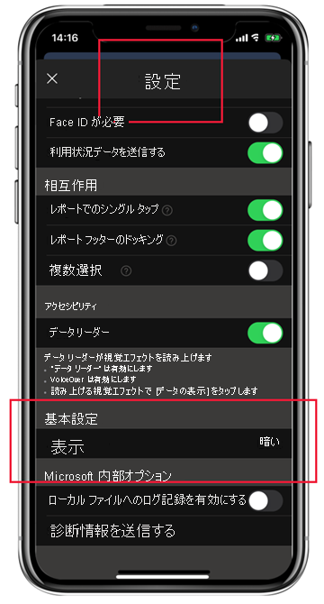

# ダーク モード

ユーザー個人の好みの表示設定に対応するため、iOS 用 Power BI モバイル アプリでは、ライトとダーク両方の画面モードがサポートされています。 ダーク モードでは、画面の明るさが低下し、コンテンツが見やすくなります。

 ダーク モードでは、すべてのアプリ エクスペリエンスが暗い背景で表示されます。 ただし、Power BI のコンテンツは影響を受けません。 レポート、ダッシュボード、アプリは、デザイナーが意図したように常に表示されます。
 
 既定の Power BI モバイル アプリでは、デバイスの設定を使用して、表示する画面の外観が決定されます。 デバイスがダーク モードに構成されている場合、アプリはダーク モードで表示されます。
 
 ライト モードとダーク モードを切り替えるには、またはデバイス設定でモードが決定されるようにするには、 **[設定] > [設定]** に移動し、 **[外観]** をタップして目的のモードを選択します。

