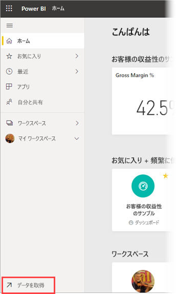
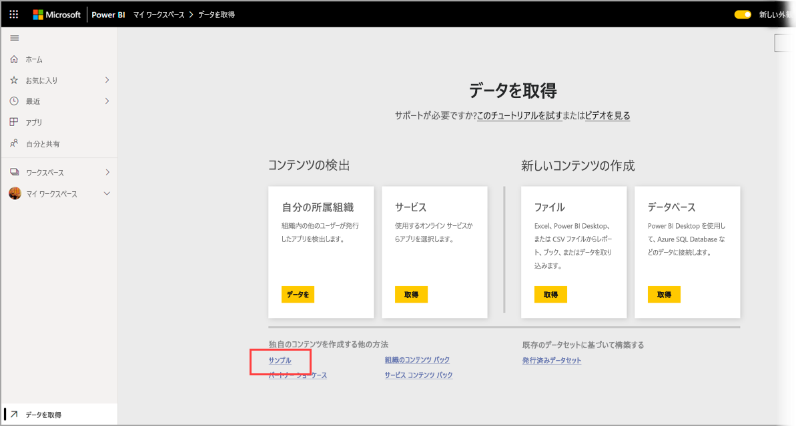
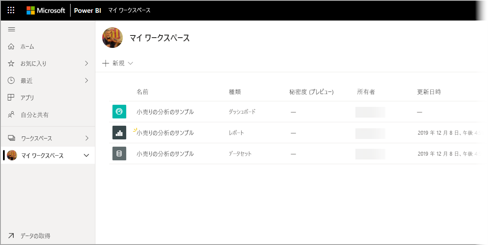

# Power BI サービスのマイ ワークスペースにサンプルをダウンロードする

ここに用意されている一部のモバイル アプリ ドキュメントでは、図示の目的で使用されるサンプル データがあります。 お使いのデバイスで使用するには、このサンプル データをお使いの Power BI サービスアカウントにダウンロードして、お使いのデバイスの Power BI Mobile アプリから表示します。 この記事では、お使いの Power BI サービス アカウントにサンプル データをダウンロードする方法について説明します。 

## 前提条件

データをダウンロードするには、Power BI サービス アカウントが必要です。 Power BI にまだサインアップしていない場合は、開始前に[無料の試用版にサインアップ](https://app.powerbi.com/signupredirect?pbi_source=web)してください。

## サンプルをダウンロードする

1. お使いのブラウザーで [Power BI サービス](https://app.powerbi.com)を開いてサインインします。

2. ナビゲーション ウィンドウの左下隅にある **[データの取得]** を選択します。 ナビゲーション ウィンドウが非表示になっていて、[データの取得] リンクが見えない場合、ナビゲーション ウィンドウの表示/非表示アイコン  をクリックして、ウィンドウを表示します。  
   
    

3. [データの取得] ページで、 **[サンプル]** リンクを選びます。
   
   

4. ダウンロードするサンプルを選択します。 必ず使用しているチュートリアル、クイックスタート、または記事で使用されているサンプルを選択してください。 選択したら、 **[接続]** をクリックします。
  
   ![[接続] を選択する](./media/mobile-apps-download-samples/opportunity-connect.png)
   
5. Power BI がサンプルをインポートし、新しいダッシュボード、レポート、データセットを [マイ ワークスペース] に追加します。
   
   
  
これで、お使いのモバイル デバイスでサンプルを表示する準備ができました。

## 次の手順
* [クイックスタート](mobile-apps-quickstart-view-dashboard-report.md)
* わからないことがある場合は、 [Power BI コミュニティのモバイル アプリ セクション](https://go.microsoft.com/fwlink/?linkid=839277)をご覧ください
