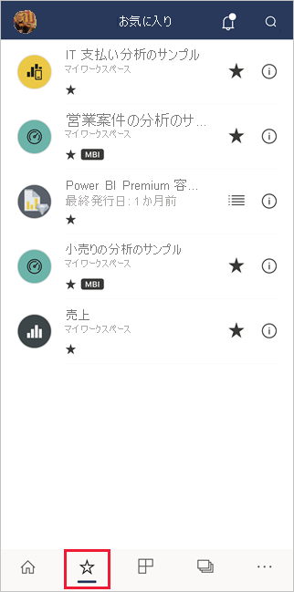
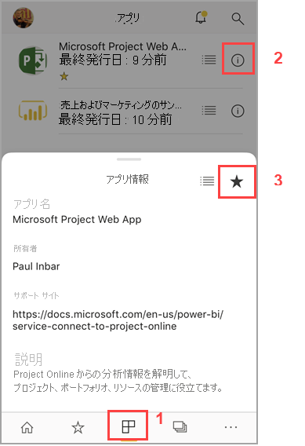
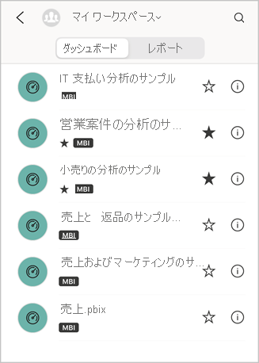
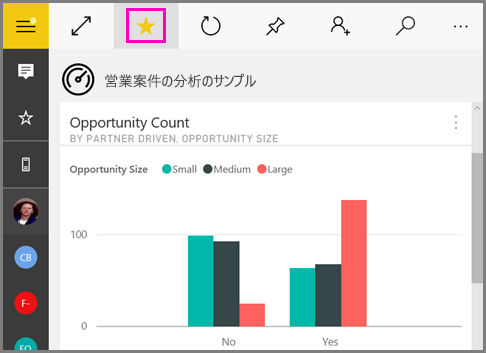
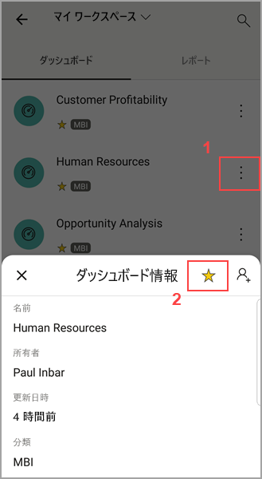
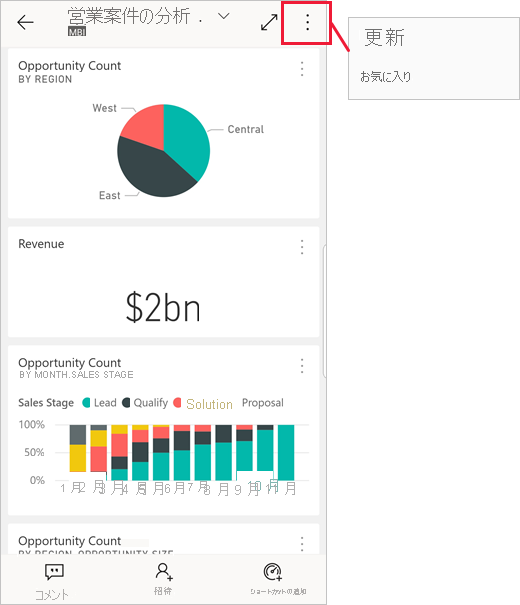
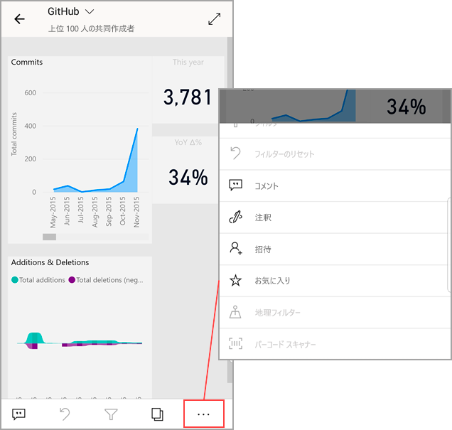

# Power BI モバイル アプリでお気に入りを作成し、表示する
適用対象:

|  |  |  |  |  |
|:--- |:--- |:--- |:--- |:--- |
| iPhone |iPad |Android フォン |Android タブレット |Windows 10 デバイス |

モバイル アプリで、お気に入りの Power BI ダッシュボード、レポート、アプリ、お気に入りのオンプレミスの Microsoft Power BI Report Server および Reporting Services の KPI とモバイル レポートを作成し、表示する方法について説明します。

Power BI モバイル アプリでお気に入りを作成すると、[Power BI サービス](https://powerbi.com)の [お気に入り] ページとすべてのモバイル デバイスにそれが表示されます。

[お気に入り] ページを表示するには、ナビゲーション バーのお気に入りアイコンをタップします。

また、[Power BI サービスで Power BI ダッシュボードとアプリをお気に入りに追加する](../end-user-favorite.md)こともできます。 お気に入りに追加したダッシュボードとアプリは、モバイル アプリの [お気に入り] ページに表示されます。

Power BI レポート サーバーまたは Reporting Services Web ポータルで KPI とレポートをお気に入りに設定し、Power BI のお気に入りのダッシュボードと共に、デバイスの便利なフォルダーで表示できます。

## アプリをお気に入りに追加する
1. 下部のナビゲーション バーにあるアプリ アイコンをタップして、アプリのページを表示します。

2. iOS デバイスでは、お気に入りにするアプリの名前の右側にある [情報] ボタンをタップします。 Android デバイスでは、[情報] ボタンではなく、その他のオプション (...) が表示されます。 

3. 開いた [アプリ情報] セクションで、星をタップします。
   
    
   
    これでアプリが、その他のお気に入りのダッシュボード、レポート、アプリと共に [お気に入り] ページに表示されるようになります。
   
## iOS と Windows 10 モバイル アプリでダッシュボードやレポートをお気に入りにする
ダッシュボードまたはレポートの一覧から、あるいはダッシュボードまたはレポート自体から、Power BI のダッシュボードまたはレポートをお気に入りにすることができます。

* モバイル アプリのダッシュボードまたはレポートの一覧で、名前の横にある白抜きの星をタップします。 . 星が黄色に変わります。 .
  
    
* ダッシュボードを使用している場合は、リボン内の白抜きの星  をタップします。 レポートを使用している場合、星は**その他のオプション** (...) の下にあります。星が黒  に変わります。
  
    

## Android モバイル アプリでダッシュボードまたはレポートをお気に入りにする
ダッシュボードまたはレポートの一覧から、あるいはダッシュボードまたはレポート自体から、ダッシュボードまたはレポートをお気に入りにすることができます。

* モバイル アプリのダッシュボードまたはレポートの一覧で、名前の横にある垂直線の**その他のオプション** (...) ボタンをタップし、表示される情報タブでお気に入りの星をタップします。
  
    

* ダッシュボードを使用しているときは、リボン内の白抜きの星をタップします . 星が濃い灰色に変わります。 .
  
    

* レポートを使用している場合は、下にスワイプしてリボンを表示し、**その他のオプション** (...) をタップして下にスクロールし、白抜きの星  を見つけてタップします。 星が濃い灰色  になります。
  
    

## Power BI レポート サーバーおよび Reporting Services のレポートと KPI をお気に入りに登録する
Power BI モバイル アプリでは、お気に入りの Power BI レポート サーバーおよび Reporting Services のレポートと KPI を表示できますが、モバイル アプリでそれらをお気に入りに登録することはできません。 [Web ポータルでお気に入りとしてタグを付け](../../report-server/tutorial-explore-report-server-web-portal.md#tag-your-favorites)ます。 

## 次の手順
* [Power BI のお気に入りのダッシュボード](../end-user-favorite.md) 
* わからないことがある場合は、 [Power BI コミュニティで質問してみてください](https://community.powerbi.com/)。

