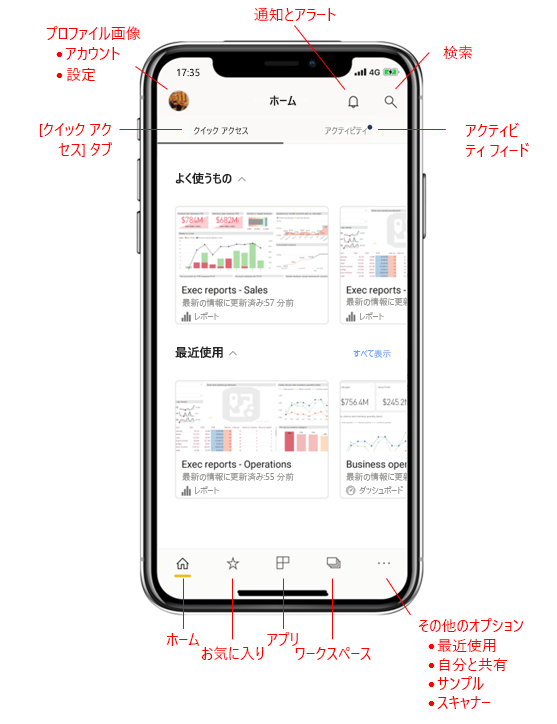
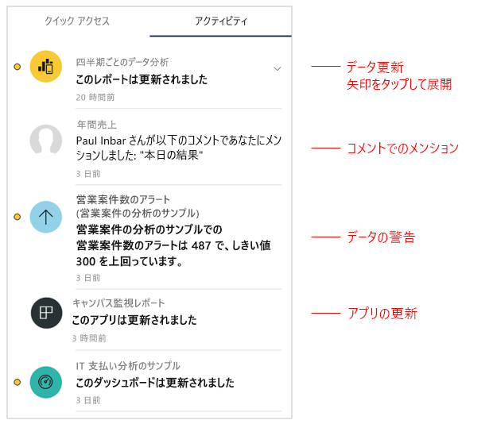
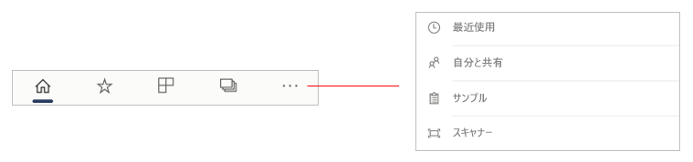
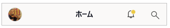
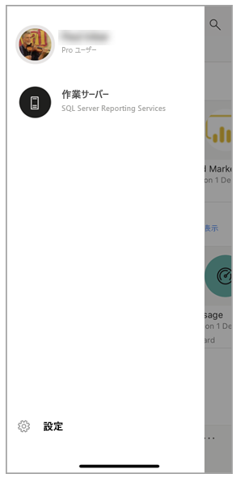
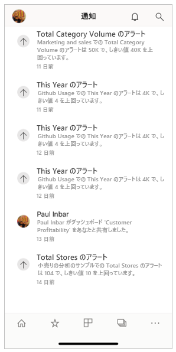
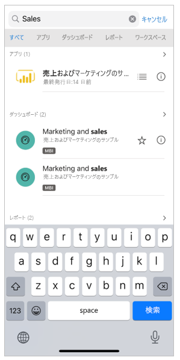

# モバイル アプリのホーム ページのクイック ツアー
このツアーでは、Power BI モバイル アプリのホーム ページと、必要なものをすばやく取得できるナビゲーション補助機能について説明します。

適用対象:

|  |  |  |
|:--- |:--- |:--- |
| iPhone | iPad | Android | 

Power BI Mobile アプリを開くと、ホーム ページが表示されます。ここから、最も頻繁に表示するまたは最近表示したレポート、ダッシュボード、アプリにすばやくアクセスできます。 さらに、Power BI コンテンツで起こっていることに関する最新情報を知らせるアクティビティ フィードや、必要なコンテンツにすばやくアクセスするための便利なナビゲーション補助機能もあります。

 
## [クイック アクセス] タブ

[クイック アクセス] タブには、頻繁に表示するおよび最近表示したレポート、ダッシュボード、アプリが、2 つの折りたたみ可能なセクションにグループ化されて表示されます。 最近表示した項目の一覧を表示するには、[最近使用] の右にある **[すべて表示]** をタップします。 

## アクティビティ フィード

アクティビティ フィードを使用すると、Power BI コンテンツで起こっていることを追跡できます。 ここには、最新の通知、アラート、コメント、および @mentions がすべて表示されます。

フィード内の更新には次のものが含まれます。
* **更新されたデータ**: お気に入りまたは [最近使用] 内のレポートまたはダッシュボードのいずれかにある基になるデータが更新されたとき。
* **新しいコメント**: お気に入りまたは [最近使用] 内のレポートまたはダッシュボードにだれかがコメントを作成したときや、だれかにコメントで自分がメンションされたとき。
* **データ アラート**: [データ アラート](mobile-set-data-alerts-in-the-mobile-apps.md)で以前に設定したしきい値にデータが達したとき。
* **アプリの更新プログラム**: 使用しているアプリにアプリの作成者が更新プログラムを発行したとき。

 さらに詳しく調査するには、アクティビティ項目をタップして、関連する場所に移動します。

アクティビティ項目は集約されるため、同じアプリまたはワークスペースからのすべてのデータ更新が一緒にグループ化されます。 画面右側の  矢印を使用すると、集約された項目を展開して表示することができます。 最新使用した項目は常に一覧の一番上に表示されます。

## ナビゲーション バー

ページの下部にナビゲーション バーが表示されます。

ナビゲーション バーを使用すると、次にすばやくアクセスできます。

*  **ホーム**: ホーム ページに戻る。
*  **お気に入り**: [お気に入り](mobile-apps-favorites.md)としてマークしたレポート、ダッシュボード、アプリ。
*  **アプリ**: ご自分のアカウントにインストールされているアプリ。
*  **ワークスペース**: コンテンツ作成者が作成しているレポートとダッシュボードがまとめて保持されている作業フォルダー。
*  **最近使用**: 最近表示した項目。
*  **自分と共有**: 他のユーザーが自分と共有した項目。
*  **サンプル**: Power BI の機能について学習するために使用できる Power BI サンプル。
*  **スキャナー**: [バーコード](mobile-apps-scan-barcode-iphone.md)や [QR コード](mobile-apps-qr-code.md)をスキャンするスキャナーとして使用できるデバイス カメラ。

## ヘッダー

ページの上部にあるヘッダーには、表示している Power BI ページ、レポート、またはダッシュボードの名前が表示されます。

ヘッダーには、次のナビゲーション項目があります。
* **プロフィール画像またはアバター**: サイド パネルが開きます。ここで、[Power BI サービスとレポート サーバーのアカウントを切り替える](mobile-app-ssrs-kpis-mobile-on-premises-reports.md)ことができます。また、Power BI モバイル アプリの設定にアクセスすることもできます。

    

* **通知**: [通知ページ](mobile-apps-notification-center.md)が開きます。ここで、通知を表示したりアクセスしたりできます。 通知ベルのドットは、新しい通知があることを示します。

    

* **検索**: ご使用のサブスクリプション内の Power BI コンテンツを検索します。

    

## 次のステップ
このツアーでは、Power BI モバイル アプリのホーム ページについて説明しました。 Power BI モバイル アプリの使用に関する詳細については、次をご覧ください。 
* [ダッシュボードとレポートを調べる](mobile-apps-quickstart-view-dashboard-report.md)
* [Power BI モバイル アプリでレポートを確認する](mobile-reports-in-the-mobile-apps.md)
