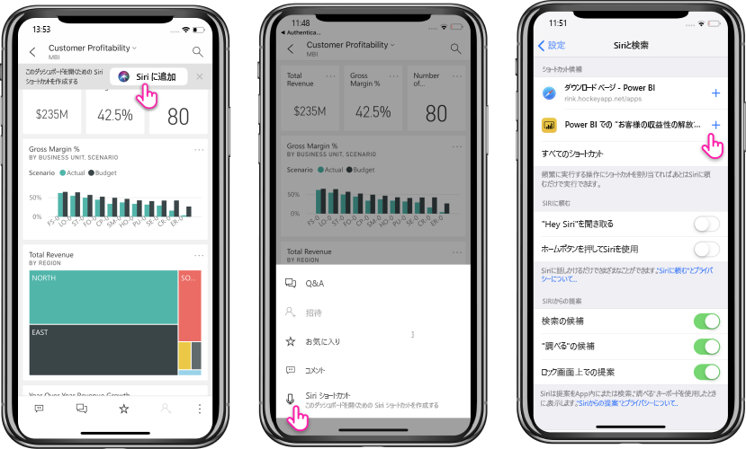

# Power BI Mobile iOS アプリで Siri ショートカットを使用する (プレビュー)

Siri ショートカットを使用して、必要な Power BI コンテンツに直接アクセスします。

よく使用するレポートやダッシュボードに簡単かつ素早くアクセスするには、Siri ショートカットの統合を使用します。 項目へのショートカットを作成すると、そのデータを見る必要があるときにはいつでも Siri にその起動を頼むことができます。

## レポートまたはダッシュボードの Siri ショートカットを作成する

レポートおよびダッシュボードへの Siri ショートカットを作成するには、次の 3 通りの方法があります。

- **[Siri に追加]** オプションがあるバナーが、よく使用するレポートとダッシュボードに追加されます。 アクションをタップして、 **[Siri に追加]** ページを開きます。
    
- **レポート**または**ダッシュボード**の操作メニュー (...) の **[Siri ショートカット]** アクションを使用します。
    
- デバイス設定 ( **[設定]**  >  **[Siri と検索]** ) で **[ショートカット候補]** を使用します。 候補内の項目にショートカットを追加するには、プラス (+) ボタンを使用します。
     
     

Power BI レポートでは、ショートカットの作成時に表示されている現在のページがショートカットによってキャプチャされます。 

すべてのオプションで **[Siri に追加]** ページが開かれます。 このページでは、後で Siri を使ってレポートまたはダッシュボードを開くために使用するフレーズを録音する必要があります。 
   
![[Siri に追加] ページ](./media/mobile-apps-ios-siri-search/power-bi-siri-add-page.png)
    

## Siri ショートカットを使用して、レポートまたはダッシュボードを表示する

ショートカットを作成すると、Siri に頼むだけで、ショートカットを作成したダッシュボードまたはレポートにアクセスすることができます。
Siri をアクティブ化して、ショートカット用に録音したフレーズを話します。 Siri によって Power BI が起動され、要求されたレポートまたはダッシュボードが表示されます。 

Power BI レポートの場合は、ショートカットを作成したときにキャプチャされたページが表示されます。

  
  

## Siri ショートカットのフレーズを編集する 
ショートカットのフレーズを編集するには、**レポート**または**ダッシュボード**の操作メニュー (...) で **[Siri ショートカット]** ボタン使用します。**フレーズを再録音**するためのオプションがある [Siri ショートカット] ページが開かれます。 

## Siri ショートカットを削除する 
ショートカットを削除するには、項目に移動して、操作メニュー (...) から **[Siri ショートカット]** アクションをタップします。 **[Siri ショートカット]** ページが開きます。 **[ショートカットを削除]** を選択します。

> [!NOTE]
> Power BI アプリとの Siri ショートカットの統合は、iOS12 以降を実行している iPhone および iPad で使用できます。
> 

## 次の手順
次の手順に従って、Power BI Mobile アプリの詳細を確認します。 

* [Power BI iPhone モバイル アプリ](http://go.microsoft.com/fwlink/?LinkId=522062)をダウンロードする
* [Twitter で @MSPowerBI](https://twitter.com/MSPowerBI) をフォローする
* [Power BI コミュニティの会話](http://community.powerbi.com/)に参加する

