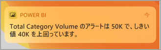
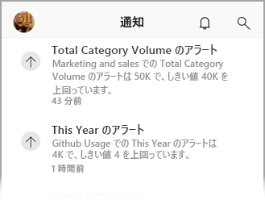
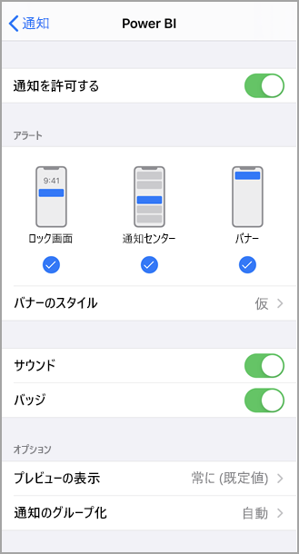
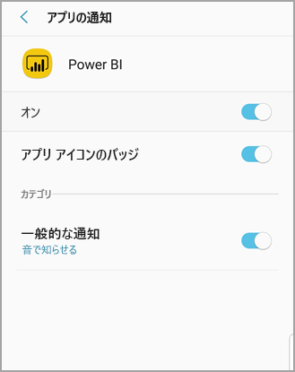

# Power BI モバイル アプリで通知を受け取る
適用対象:

|  |  |  |  |  |
|:--- |:--- |:--- |:--- |:--- |
| iPhone |iPad |Android フォン |Android タブレット |Windows 10 デバイス |

>[!NOTE]
>**Windows 10 Mobile を使用するスマートフォン**に対する Power BI モバイル アプリのサポートは、2021 年 3 月 16 日に廃止されます。 [詳細情報](https://go.microsoft.com/fwlink/?linkid=2121400)

通知は、Power BI サービスまたはモバイル デバイスのユーザーに合わせた Power BI エクスペリエンスに関連する情報を提示します。 通知を開くと、[自分で設定したアラート](mobile-set-data-alerts-in-the-mobile-apps.md)、共有されている新しいダッシュボードに関する一連のメッセージ フィード、グループ ワークスペースの変更、Power BI イベントや会議などに関する情報が表示されます。

> [!NOTE]
> iOS デバイスで[更新バージョンの Power BI アプリ](https://powerbi.microsoft.com/mobile/)に初めてサインインすると、Power BI からの通知を受けるかどうかを確認するメッセージが表示されます。 また、デバイスの**設定**で Power BI からの通知を受ける方法についても構成できます。 
> 
> 

## モバイル デバイスで通知を表示する
1. モバイル デバイスで通知を受信すると、Power BI の既定では、音が鳴り、通知バナーが表示されます。
   
   
   

   [Power BI からの通知を表示する方法は変更](mobile-apps-notification-center.md#change-or-turn-off-notifications-on-your-mobile-device)できます。
2. 通知を受け取った場合、モバイル デバイスで Power BI にサインインすると、黄色のドットが通知ベルのアイコン  (iOS と Android) またはグローバル ナビゲーション ボタン  (Windows 10 デバイス) に表示されます。 

3. 通知センターに通知を表示するには、通知ベル  (iOS と Android) または通知センター アイコン ![[通知] アイコン](./media/mobile-apps-notification-center/power-bi-windows-10-notification-icon.png) (Windows 10 デバイス) をタップします。
   
    最新の通知から先に表示され、未読のメッセージは強調表示されます。 通知は、削除するか、100 件の上限に達するまで 90 日間保持されます。
   
   
4. iOS デバイスと Android デバイスの通知を消去するには、タップし、長押ししてスワイプします。 Windows 10 デバイスの場合は、右クリックして **[消去]** を選択します。

## モバイル デバイスで通知を変更または無効にする
Power BI からの通知を表示する方法は変更できます。

1. iOS のデバイスで **[設定]**  >  **[通知]** の順に選択します。 
   
    Android フォンで **[設定]**  >  **[通知]** の順に選択します。
   
    Windows デバイスの場合、 **[設定]** の **[システム]**  >  **[通知+アクション]** を選択します。
2. アプリの一覧で、 **[Power BI]** を選択します。 
3. ここでは、通知を完全にオフにするか、必要な通知を選択することができます。
   
    **iPhone の場合**
   
    
   
    **Android フォンの場合**
   
    

    **Windows 10 デバイスの場合**

    

## 次の手順
* [Power BI サービスでのデータ アラート](../../create-reports/service-set-data-alerts.md)
* [iPhone アプリでデータ アラートを設定する (Power BI for iOS)](mobile-set-data-alerts-in-the-mobile-apps.md)
* [Windows 10 用の Power BI モバイル アプリでデータ アラートを設定する](mobile-set-data-alerts-in-the-mobile-apps.md)
* [モバイル デバイスの最新バージョンの Power BI アプリをダウンロードする](https://powerbi.microsoft.com/mobile/)
