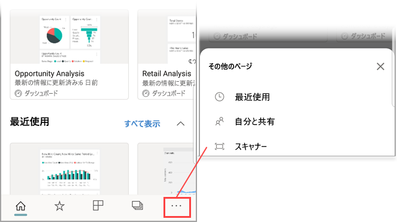
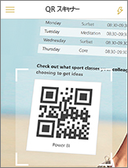

# モバイル デバイスから Power BI QR コードをスキャンする
適用対象:

|  |  |  |  |
|:--- |:--- |:--- |:--- |
|iPhones |iPad |Android フォン |Android タブレット |

Power BI の QR コードは、実際の任意の項目を、関連する BI 情報に直接接続できます。ナビゲーションや検索の必要はありません。

たとえば、ダッシュボードまたはレポートを共有している仕事仲間がダッシュボード内のレポートまたはタイルに向けて [Power BI サービスで QR コードを作成](../../create-reports/service-create-qr-code-for-tile.md)し、その QR コードを電子メールや特定の項目のような重要な場所に配置したとします。 

Power BI アプリのスキャナーや電話にインストールされている他の任意の QR スキャナーを使用して、または電話にインストールされているその他のスキャナーをスキャンして、関連タイルまたはレポートにただちにアクセスできます。 

同僚とダッシュボードまたはレポートを共有していない場合は、モバイル アプリから直接、アクセスを要求することができます。 

> [!NOTE]
> [Power BI for Mixed Reality アプリでレポートの QR コードをスキャンする](mobile-mixed-reality-app.md#scan-a-report-qr-code-in-holographic-view)こともできます。

## Power BI スキャナーによる iPhone での Power BI QR コードのスキャン

1. ナビゲーション バーの **[その他のオプション]** (...) をタップし、 **[スキャナー]** をタップします。

    

2. カメラが有効になっていない場合は、Power BI アプリでカメラを使用することを承認する必要があります。 これは、1 回限りの承認です。 
 
3. Power BI QR コードにスキャナーをポイントします。 
   
    
4. タイルまたはレポートは、Augmented Reality でバックグラウンド上に表示されるように見えます。
   
    

5. レポートまたはタイルをタップしてフォーカス モードで開くか、スキャナーに戻ります。

### iPhone 上の外部スキャナーからの QR コードのスキャン
1. スマートフォンにインストールされているスキャナーからタイルまたはレポートにただちにアクセスするには、関連する Power BI QR コードにスキャナーをポイントします。 
2. Power BI アプリをインストールしていない場合は、[Apple App Store](https://go.microsoft.com/fwlink/?LinkId=522062) にリダイレクトされるので、それを iPhone にダウンロードします。

## Power BI スキャナーによる Android デバイスでの Power BI QR コードのスキャン

1. ナビゲーション バーの **[その他のオプション]** (...) をタップし、 **[スキャナー]** をタップします。

    

2. カメラが有効になっていない場合は、Power BI アプリでカメラを使用することを承認する必要があります。 これは、1 回限りの承認です。 

3. Power BI QR コードにスキャナーをポイントします。 
   
    
4. タイルまたはレポートは、Power BI で自動的に開きます。
   
    

### Android デバイスの外部スキャナーからの QR コードのスキャン
1. Android デバイスにインストールされているスキャナーから、タイルまたはレポートにただちにアクセスするには、関連する Power BI QR コードにスキャナーをポイントします。 
2. Power BI アプリをインストールしていない場合は [Google Play にリダイレクトされるので、そこでアプリをダウンロード](https://go.microsoft.com/fwlink/?LinkID=544867)します。 

## 次のステップ
* [モバイル アプリで現実世界から Power BI データに接続する](mobile-apps-data-in-real-world-context.md)
* [Power BI サービスでタイルの QR コードを作成する](../../create-reports/service-create-qr-code-for-tile.md)
* [Power BI サービスでレポートの QR コードを作成する](../../create-reports/service-create-qr-code-for-report.md)
* [Power BI for Mixed Reality アプリで QR コードをスキャンする](mobile-mixed-reality-app.md)こともできます。
* ご質問 [Power BI コミュニティで質問してみてください](https://community.powerbi.com/)。
