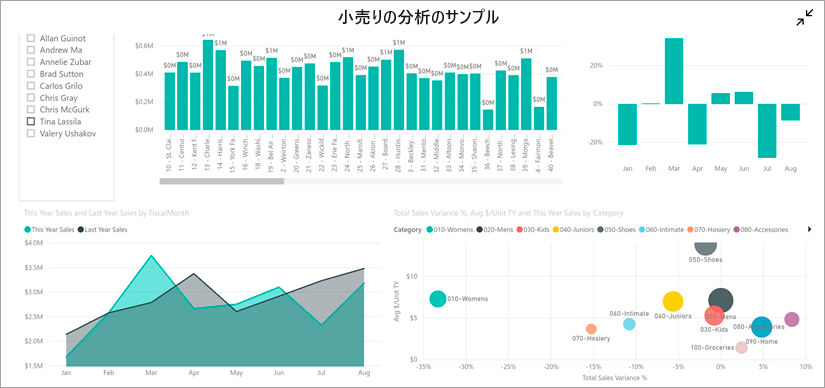
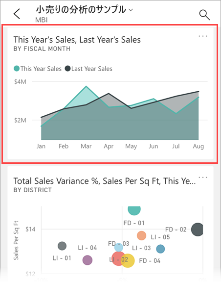
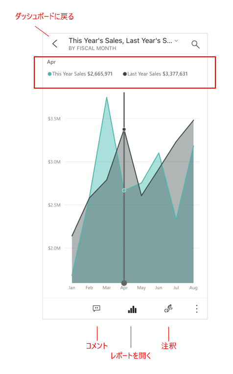
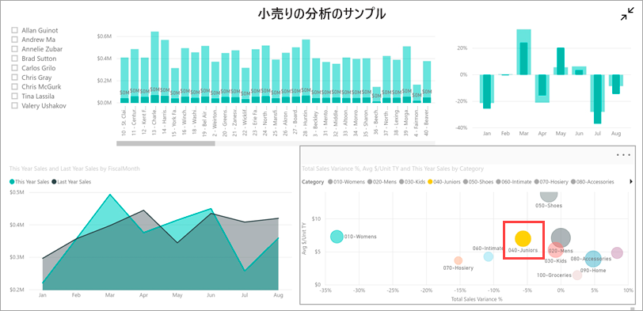
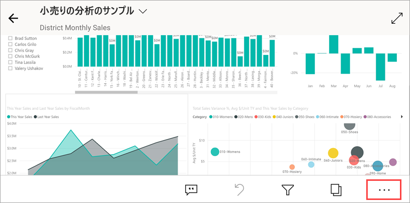
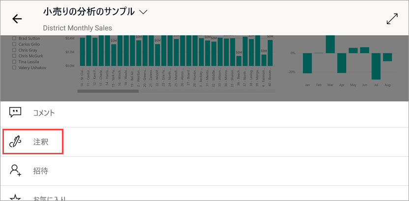
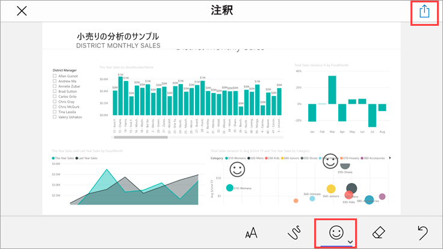
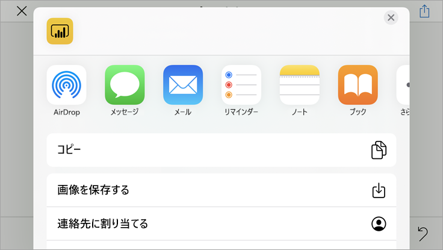
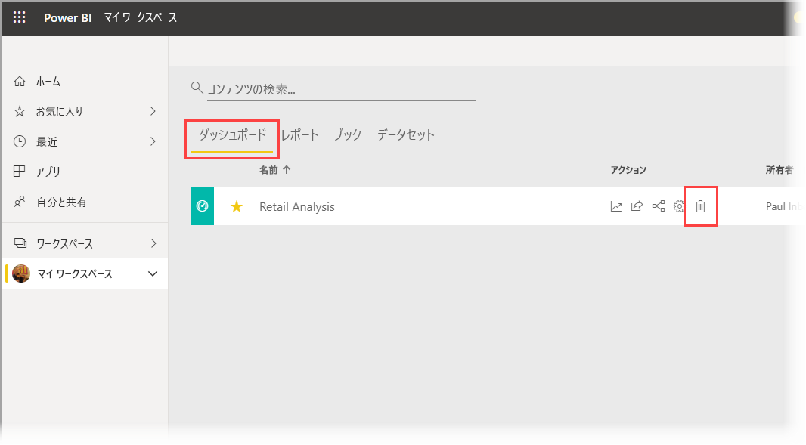

# クイック スタート: Power BI モバイル アプリでダッシュボードとレポートを調べる
このクイックスタートでは、Power BI Mobile アプリのクイック ツアーを行い、サンプルのダッシュボードとレポートについて説明します。 iOS 用 Power BI アプリが表示されますが、他のデバイスでも簡単に理解することができます。

適用対象:

|  |  |  |  |
|:--- |:--- |:--- |:--- |
| iPhone | iPad | Android | Windows 10 |

ダッシュボードは、会社のライフ サイクルとプロセスへの入口です。 ビジネスの現在の状態を 1 つの場所から監視する概要が表示されます。 レポートは、データの対話型表示で、データから得られるさまざまな発見と分析情報を表す視覚エフェクトが含まれます。 

## 前提条件

* **Power BI にサインアップする**:Power BI にサインアップしていない場合は、[無料の試用版にサインアップ](https://app.powerbi.com/signupredirect?pbi_source=web)してください。
* **お使いのデバイス用の Power BI アプリをインストールする**:[App Store](https://apps.apple.com/app/microsoft-power-bi/id929738808) (iOS) または [Google Play](https://play.google.com/store/apps/details?id=com.microsoft.powerbim&amp;amp;clcid=0x409) (Android) から Power BI モバイル アプリ** をダウンロードします。
* **小売りの分析のサンプルをダウンロードする**:このクイックスタートの最初の手順では、Power BI サービスで小売りの分析のサンプルをダウンロードします。 まず、Power BI アカウントに[サンプルをダウンロードする方法を確認](./mobile-apps-download-samples.md)してください。 小売りの分析のサンプルを必ず選択してください。

前提条件を見たし、小売りの分析のサンプルを Power BI アカウントにダウンロードしたら、このクイック ツアーを始めることができます。

## モバイル デバイスでダッシュボードを表示する
1. デバイスで Power BI アプリを開き、Power BI アカウントの資格情報 (ブラウザーの Power BI サービスで使ったものを同じです) を使ってサインインします。
 
1. **[ワークスペース]** アイコン  をタップし、 **[マイ ワークスペース]** を選択し、小売りの分析のサンプルをタップして開きます。

    ![[マイ ワークスペース] のダッシュボード](./media/mobile-apps-quickstart-view-dashboard-report/power-bi-android-quickstart-dashboard.png)
   
    Power BI のダッシュボードの外観は、モバイル デバイスと Power BI サービスとで少し異なります。 すべてのタイルは同じ幅で表示され、上から下に 1 つずつ配置されます。

5. 下部のツールバーにある星形アイコン  をタップし、お気に入りのダッシュボードにします。 モバイル アプリでお気に入りにすると Power BI サービスでもお気に入りになり、逆の場合も同じです。

6. 下にスクロールし、"This Year's Sales, Last Year's Sales" 塗りつぶし折れ線グラフをタップします。

    

    フォーカス モードで開きます。

7. フォーカス モードで、グラフの **Apr** をタップします。 4 月の値がグラフの上部に表示されます。

    

8. 画面の下部にある [レポート] アイコン ![[レポート] アイコン](./media/mobile-apps-quickstart-view-dashboard-report/power-bi-android-quickstart-report-icon.png) をタップします (Android デバイスの場合は、画面の上部に表示される場合があります)。 このタイルに関連するレポートが、横モードで開きます。

    

9. バブル チャートで黄色の "040 - Juniors" バブルをタップします。 他のグラフの関連する値が強調表示されることを確認します。 

    

10. 上方向にスワイプして下部にツールバーを表示し、 **[その他のオプション]** (...) をタップします。

    

11. 一覧を下にスクロールし、 **[注釈]** を選択します。

    

12. 注釈ツールバーで、スマイル アイコンをタップし、スマイルを追加するレポート ページをタップします。
 
    

13. 次に右上隅にある **[共有]** をタップします。

14. レポートを共有する方法を選択します。  

    

    このスナップショットを、組織の内部または外部にいる誰とでも共有できます。 相手が組織の内部にいて自分の Power BI アカウントを持っている場合は、小売りの分析サンプルのレポートを開くこともできます。

## リソースをクリーンアップする

このクイックスタートが完了した後、希望する場合は、小売りの分析のサンプルのダッシュ ボード、レポート、データセットを削除することができます。

1. Power BI サービス ([Power BI サービス](https://app.powerbi.com)) を開いてサインインします。

2. ナビゲーション ペインで、 **[マイ ワークスペース]** を選択します。

3. [ダッシュボード] タブを選択し、ごみ箱をクリックします。

    

    次に、[レポート] タブをクリックし、同じ操作を行います。

4. 次に [データセット] タブを選択し、 **[その他のオプション]** (...) をクリックし、 **[削除]** を選択します。 

    ![データセットの [削除] を選択します](./media/mobile-apps-quickstart-view-dashboard-report/power-bi-android-quickstart-delete-retail-datasets.png)

## 次の手順

このクイックスタートでは、モバイル デバイスを使ってサンプルのダッシュボードとレポートを調べました。 Power BI サービスでの作業についてさらにご覧ください。 

> [!div class="nextstepaction"]
> [クイック スタート:Power BI サービス内の移動](../end-user-experience.md)

