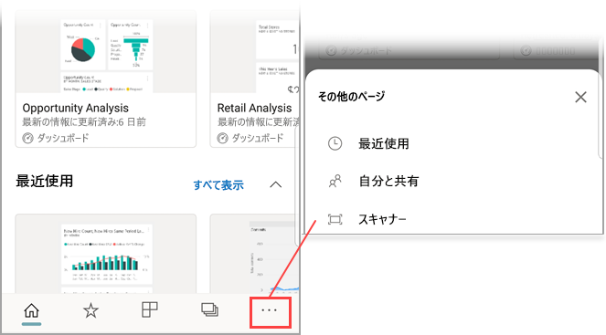

# デバイスで Power BI モバイル アプリからバーコードをスキャンする
現実世界でバーコードをスキャンし、Power BI モバイル アプリでフィルターされた BI 情報に直接アクセスできます。

適用対象:

|  |  |  |  |
|:--- |:--- |:--- |:--- |
|iPhone |iPad |Android フォン |Android タブレット |

たとえば、同僚が [Power BI Desktop のレポートのバーコード フィールドにタグを付け](../../desktop-mobile-barcodes.md)、そのレポートを自分と共有したとします。 

デバイスの Power BI アプリのスキャナーで製品バーコードをスキャンすると、そのバーコードのレポート (またはレポートの一覧) が表示されます。 そのバーコードにフィルター処理されたレポートを開くことができます。

## Power BI スキャナーでバーコードをスキャンする
1. ナビゲーション バーの **[その他のオプション]** (...) をタップし、 **[スキャナー]** をタップします。

    

2. カメラが有効になっていない場合は、Power BI アプリでカメラを使用することを承認する必要があります。 これは、1 回限りの承認です。 
4. 製品のバーコードをスキャナーでポイントします。 そのバーコードに関連付けられたレポートの一覧が表示されます。
5. そのバーコードに従って自動的にフィルター処理されたレポート名をタップして、デバイスで開きます。

## レポートを開いているときに他のバーコードでフィルターする
あるバーコードでフィルター処理されたレポートをデバイスで表示しているときに、そのレポートを別のバーコードでフィルター処理したい場合があります。

* バーコード アイコンにフィルター  がある場合、フィルターがアクティブになり、レポートをバーコードでフィルターすることができます。 
* アイコンにフィルター  が含まれていない場合、フィルターはアクティブにならず、レポートはバーコードでフィルターされません。 

いずれの方法でも、アイコンをタップすると浮動スキャナーがある小さなメニューが開きます。

* スキャナーを新しい項目に移動すると、レポートのフィルターは別のバーコード値に変わります。 
* フィルターされていないレポートに戻るには、 **[Clear barcode filter]** (バーコード フィルターのクリア) を選択します。
* レポート フィルターを、現在のセッション内でスキャンしたバーコードのいずれかに変更するには、 **[Filter by recent barcodes]** (最近のバーコードでフィルター) を選択します。

## バーコードのスキャンに関する問題
ここでは、製品でバーコードをスキャンするときに表示される可能性があるメッセージについて説明します。

### "レポートをフィルター処理できませんでした..."
フィルター対象に選択したレポートは、このバーコード値を含まないデータ モデルに基づいています。 たとえば、レポートに "mineral water" という製品が含まれていません。  

### レポートのすべてまたは一部のビジュアルに値が含まれていない
スキャンしたバーコード値はモデル内に存在しますが、レポートのすべてまたは一部のビジュアルに、この値が含まれていないため、フィルターからは空の状態が返されます。 他のレポート ページを見るか、Power BI デスクトップでレポートを編集してこの値を含めます。 

### "バーコードでフィルターをかけられるレポートはお持ちでないようです。"
これは、バーコード対応のレポートがないことを意味します。 バーコード スキャナーは、 **[バーコード]** とマークされた列があるレポートのみをフィルターできます。  

自分またはレポート所有者が Power BI Desktop で列に **[バーコード]** とタグを付けていることを確認します。 詳細については、[Power BI Desktop でバーコード フィールドにタグを付ける方法](../../desktop-mobile-barcodes.md)に関するページを参照してください。

### "レポートをフィルター処理できませんでした - このバーコードはレポート データに存在しないようです。"
フィルター対象に選択したレポートは、このバーコード値を含まないデータ モデルに基づいています。 たとえば、レポートに "mineral water" という製品が含まれていません。 別の製品をスキャンする、別のレポートを選択する (複数のレポートを使用できる場合)、またはフィルターされていないレポートを表示することができます。 

## 次の手順
* [Power BI Desktop のバーコード フィールドにタグを付ける](../../desktop-mobile-barcodes.md)
* [Power BI のダッシュボードのタイル](../end-user-tiles.md)
* [Power BI のダッシュボード](../end-user-dashboards.md)

