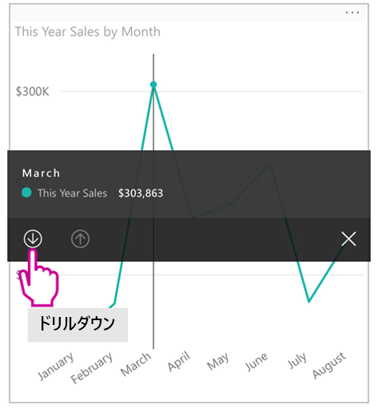
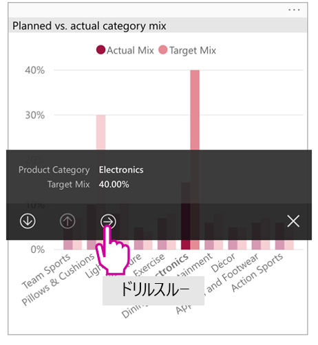
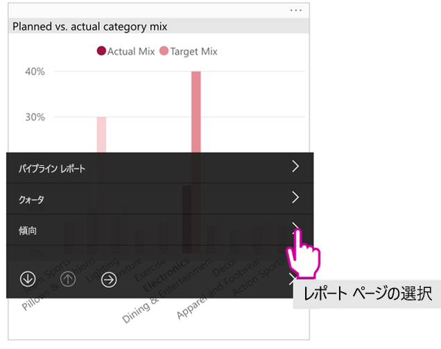

# 電話用に最適化された Power BI レポートを表示する

適用対象:

|  |  |
|:--- |:--- |
| iPhone |Android フォン |

スマートフォンで Power BI レポートを表示すると、レポートがスマートフォン向けに最適化されているかどうかが Power BI によって確認されます。 最適化されている場合、Power BI では、最適化されたレポートが縦表示で自動的に開きます。

電話用に最適化されたレポートが存在しない場合でもレポートは開きますが、最適化されていない横長ビューです。 電話用に最適化されたレポートでも、電話を横向きにすると、レポートが元のレポート レイアウトの最適化されていないビューで開きます。 一部のページのみを最適化している場合、縦長ビューに、レポートを横長で使用できることを示すメッセージが表示されます。

Power BI レポートの他のすべての機能は、引き続き電話用に最適化されたレポートで機能します。 実行できることの詳細については、次を参照してください。

* [iPhone でのレポート](mobile-reports-in-the-mobile-apps.md)。 
* [Android フォンでのレポート](mobile-reports-in-the-mobile-apps.md)。

## 電話でレポート ページをフィルター処理する
電話用に最適化されたレポートにフィルターが定義されている場合、電話でレポートを表示するときに、これらのフィルターを使うことができます。 レポートは、Web 上のレポートに適用されているフィルターでフィルター処理されてからスマートフォン上で開きます。 ページにアクティブなフィルターがあることを示すメッセージが表示されます。 スマートフォンでフィルターを変更できます。

1. ページの下部にあるフィルター アイコン  をタップします。 
2. 基本的または詳細なフィルター処理を使って、関心がある結果を表示します。
   
    

## ビジュアルをクロス強調表示する
縦表示のビジュアルのクロス強調表示は、Power BI サービスや横長ビューのスマートフォンの場合と同じように機能します。1 つのビジュアルでデータを選択すると、そのページの他のビジュアルの関連するデータが強調表示されます。

詳しくは、[Power BI のフィルターと強調表示について](../../power-bi-reports-filters-and-highlighting.md)のページを参照してください。

## ビジュアルを選択する
電話レポートで、ビジュアルを選択すると、そのビジュアルが強調表示され、フォーカスされて、キャンバスのジェスチャが無効になります。

ビジュアルが選択されている場合、ビジュアル内でスクロールなどの操作を実行できます。 ビジュアルを選択解除するには、ビジュアル領域外の任意の場所に触れるだけです。

## フォーカス モードでビジュアルを開く
スマートフォンの場合、レポートにはフォーカス モードもあります。1 つのビジュアルを大きく表示したり、いろいろ試したりすることが簡単になります。

* 電話レポートで、ビジュアルの右上隅にある省略記号 **[...]** をタップし、 **[フォーカス モードに展開]** をタップします。
  
    

フォーカス モードでの実行内容は、レポート キャンバスに持ち込まれます。その逆も可能です。 たとえば、ビジュアルの値を強調表示してから、レポート全体に戻ると、ビジュアルで強調表示した値にレポートがフィルター処理されます。

画面サイズの制限により、フォーカス モードでは、一部の操作のみ実行できます。

* ビジュアルに表示される情報に**ドリルダウン**します。 詳しくは、電話レポートの[ドリルダウンとドリルアップ](mobile-apps-view-phone-report.md#drill-down-in-a-visual)に関するページを参照してください。
* ビジュアル内の値を**並べ替え**ます。
* **[元に戻す]** :ビジュアルで使用した探索手順をクリアし、レポートの作成時に設定された定義に戻します。
  
    ビジュアルからすべての探索をクリアするには、省略記号 **[...]** **[元に戻す]** の順にタップします。
  
    
  
    レポート レベルで元に戻すことができます。試しに実行したことがすべてのビジュアルから消去されます。ビジュアル レベルで元に戻す場合、選択したビジュアルから試しに実行したことが消去されます。   

## ビジュアルをドリルダウンする
ビジュアルで階層レベルが定義されている場合、ビジュアルに表示されている詳細情報にドリルダウンした後、ドリルアップして戻ることができます。 [ビジュアルへのドリルダウンの追加](../end-user-drill.md)は、Power BI サービスまたは Power BI Desktop で行います。

ドリルダウンには次のような種類があります。

### 値でドリルダウン
1. ビジュアル内のデータ ポイントで長くタップします (タップしたまま押さえます)。
2. ツールヒントが表示されます。階層が定義されている場合、ツールヒント フッターにドリルダウンと上矢印が表示されます。
3. 下矢印をタップしてドリルダウンします。

    
    
4. 上矢印をタップしてドリルアップします。

### 次のレベルにドリル
1. 電話のレポートでは、右上隅にある省略記号 **[...]** 、 **[フォーカス モードに展開]** の順にタップします。
   
    
   
    この例では、バーには州の値が表示されています。
2. 左下の [探索] アイコン  をタップします。これは左下にあります。
   
    
3. **[次のレベルを表示する]** または **[次のレベルに展開]** をタップします。
   
    
   
    今度は、バーに都市の値が表示されます。
   
    
4. 左上隅の矢印をタップすると、下位レベルの値がまだ展開された状態で、電話レポートに戻ります。
   
    
5. 上位の元のレベルに戻るには、省略記号 **[...]** を再びタップし、 **[元に戻す]** をタップします。
   
    

## 値からドリルスルーする
ドリルスルーでは、あるレポートページ内の値が他のレポートページと接続されます。 データ ポイントから別のレポートページにドリルスルーすると、データ ポイント値を使用し、ドリルスルーしたページにフィルターが適用されます。あるいは、選択したデータのコンテキストで表示されます。
レポート作成者は、レポートを作成するときに[ドリルスルーを定義](https://docs.microsoft.com/power-bi/desktop-drillthrough)できます。

1. ビジュアル内のデータ ポイントで長くタップします (タップしたまま押さえます)。
2. ツールヒントが表示されます。ドリルスルーが定義されている場合、ツールヒント フッターにドリルスルー矢印が表示されます。
3. 矢印をタップしてドリルスルーします。

    

4. ドリルスルーするレポート ページを選択します。

    

5. アプリのヘッダーにある [戻る] ボタンを使用すると、開始したページに戻ります。

## 次の手順
* [Power BI 電話アプリ用に最適化したレポートを作成する](../../desktop-create-phone-report.md)
* [Power BI でダッシュボードの Phone ビューを作成する](../../service-create-dashboard-mobile-phone-view.md)
* [任意のサイズに最適化されるレスポンシブ ビジュアルを作成する](../../visuals/desktop-create-responsive-visuals.md)
* 他にわからないことがある場合は、 [Power BI コミュニティで質問してみてください](https://community.powerbi.com/)。

