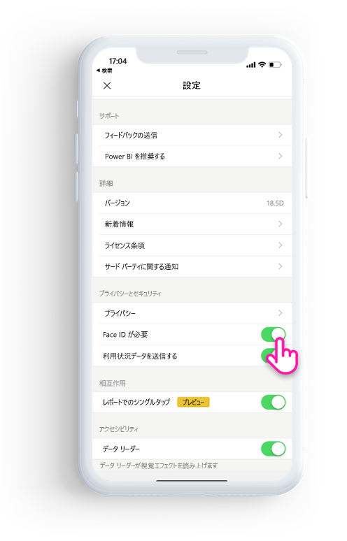
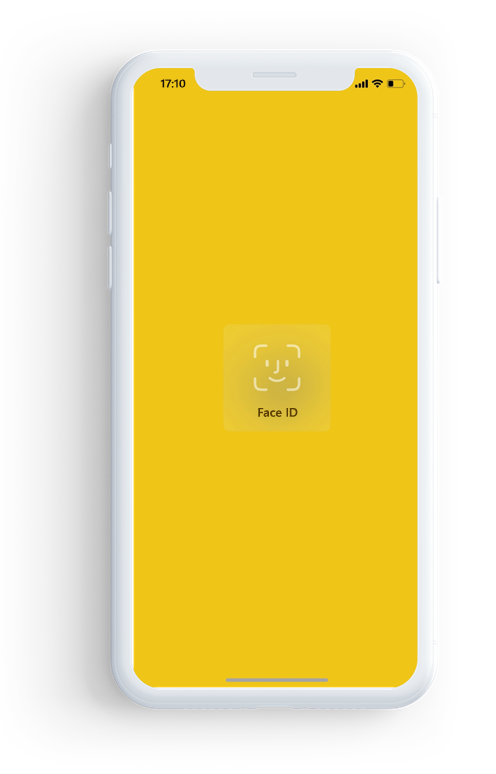

# Face ID、Touch ID、またはパスコードで Power BI アプリを保護する 

多くの場合、Power BI で管理されているデータは社外秘であり、保護され、承認されたユーザーのみによってアクセスされる必要があります。 

Power BI iOS アプリでは、追加 ID を構成することによって、ご利用のデータを保護することができます。 アプリを起動するたび、またはアプリをバックグラウンドからフォアグラウンドに移動するときに、Face ID、Touch ID、またはパスコードを提供する必要があります。

|  |  |
|:--- |:--- |
| iPhone |iPad |

## アプリ設定で Face ID、Touch ID、またはパスコードをオンにする

Power BI で追加 ID を使用するには、**[プライバシーとセキュリティ]** の下でアプリ設定に移動します。 ご利用のデバイスの機能に基づいて、Face ID、Touch ID、またはパスコードをオンにするオプションが表示されます。

この設定をオンにすると、アプリにアクセスするには、Power BI を起動するたび、またはバックグラウンドから移動するたびに、自分の ID を指定するよう求められます。 

Face ID、Touch ID、またはパスコードを要求する判断は、デバイスの機能に基づいて、iOS によって行われます。 ご利用のデバイスで Face ID がサポートされる場合、Face ID を使用する必要があります。 Touch ID がサポートされる場合は、Touch ID を使用する必要があります。 どちらもサポートされない場合は、パスコードを指定する必要があります。

## MDM を使用して Face ID、Touch ID、またはパスコードを適用する

一部の組織では、セキュリティ ポリシーとコンプライアンス要件があり、ビジネス上の機密データにアクセスするには、追加 ID を強制する必要があります。 

Power BI モバイル iOS アプリでは、管理者が Microsoft Intune やその他のモバイル デバイス管理 (MDM) のソリューションからアプリ構成設定をプッシュすることで、その設定を制御できます。 管理者はアプリ保護ポリシーを使用して、すべてのユーザーまたはユーザーのグループに対してこの設定をオンにすることができます。

|キー  |種類  |説明  |
|---------|---------|---------|
| com.microsoft.powerbi.mobile.ForceDeviceAuthentication | ブール値 | 既定値は False です。  True に設定した場合、アプリで任意の Power BI データを表示するには、アプリによってユーザーは Face ID、Touch ID、またはパスコードで自身を識別するように強制されます。 デバイス上で構成された Face ID、Touch ID、またはパスコードを所有していないユーザーは、Power BI にアクセスする前に構成するように要求されます。  |

## 次の手順

[MDM を使用してリモートで Power BI iOS アプリを構成する](mobile-app-configuration.md)
