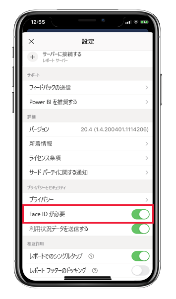
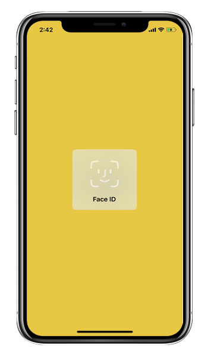
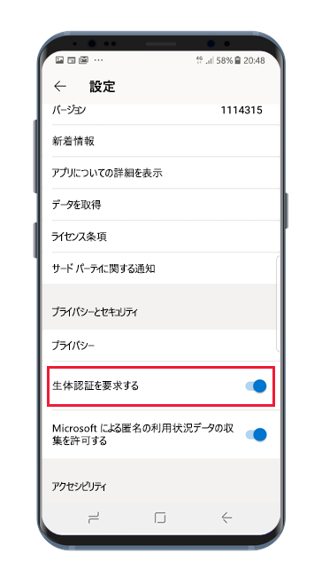
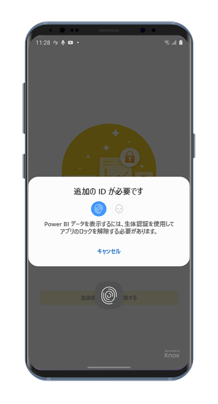

# Face ID、Touch ID、パスコード、または生体認証データで Power BI アプリを保護する 

多くの場合、Power BI で管理されているデータは社外秘であり、保護され、承認されたユーザーのみによってアクセスされる必要があります。 

iOS や Android 用の Power BI アプリでは、追加 ID を構成することによって、ご利用のデータを保護することができます。 その後、アプリが起動するか、フォアグラウンドになるたびに、ID が必要になります。 iOS では、これは、Face ID、Touch ID、またはパスコードを入力することを意味します。 Android では、生体認証データ (指紋 ID) を入力することを意味します。

適用対象:

|  |  |  |  |
|:--- |:--- |:--- |:--- |
|iPhones |iPad |Android フォン |Android タブレット |

## iOS で Face ID、Touch ID、またはパスコードをオンにする

iOS 用 Power BI モバイル アプリで追加 ID を使用するには、 **[プライバシーとセキュリティ]** の下でアプリ設定に移動します。 Face ID、Touch ID、またはパスコードをオンにするオプションが表示されます。 表示されるオプションは、ご利用のデバイスの機能によって異なります。

この設定をオンにすると、アプリを起動するか、フォアグラウンドにするたびに、アプリにアクセスできるようになる前に ID の入力が求められます。

入力を求められる ID の種類は、ご利用のデバイスの機能によって異なります。 ご利用のデバイスで Face ID がサポートされる場合、Face ID を使用する必要があります。 Touch ID がサポートされる場合は、Touch ID を使用する必要があります。 どちらもサポートされない場合は、パスコードを指定する必要があります。 以下の画像は、Face ID 認証画面を示しています。

## Android で生体認証データ (指紋 ID) をオンにする

Android 用 Power BI モバイル アプリで追加 ID を使用するには、 **[プライバシーとセキュリティ]** の下でアプリ設定に移動します。 生体認証データをオンにするオプションが表示されます。

この設定をオンにすると、アプリを起動するか、フォアグラウンドにするたびに、アプリにアクセスできるようになる前に生体認証データ (指紋 ID) の入力が求められます。

以下の画像は指紋認証画面を示しています。

>[!NOTE]
>モバイル アプリの [Require Biometric Authentification]\(生体認証が必要\) 設定を使用できるようにするには、まず、Android デバイスで生体認証を設定する必要があります。 デバイスで生体認証がサポートされていない場合は、このモバイル アプリ設定を使用して、Power BI データへのアクセスをセキュリティで保護することはできません。
>
>管理者がモバイル アプリの[セキュリティで保護されたアクセスをリモートでオンにした](#mdm-enforcement-of-secure-access-to-your-power-bi-mobile-app)場合、アプリにアクセスするためにデバイスに生体認証を設定する必要があります (まだそのようにしていない場合)。 デバイスで生体認証がサポートされていない場合、リモート設定による影響はありません。 モバイル アプリへのアクセスは、セキュリティで保護されていないままになります。

## Power BI モバイル アプリへのセキュリティで保護されたアクセスの MDM による強制。

一部の組織では、セキュリティ ポリシーとコンプライアンス要件があり、ビジネス上の機密データにアクセスするには、追加 ID を強制する必要があります。

これをサポートする場合、Power BI モバイル アプリを使用すると、管理者は Microsoft Intune やその他のモバイル デバイス管理 (MDM) ソリューションからアプリ構成設定をプッシュすることで、モバイル アプリのセキュリティで保護されたアクセス設定を制御できます。 管理者はアプリ保護ポリシーを使用して、すべてのユーザーまたはユーザーのグループに対してこの設定をオンにすることができます。 詳細については、[MDM を使用する Power BI モバイル アプリのリモートでの構成](mobile-app-configuration.md#data-protection-settings-ios-and-android)に関する記述を参照してください。

## 次のステップ
* [MDM を使用してリモートで Power BI モバイル アプリを構成する](mobile-app-configuration.md)
