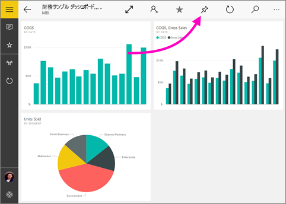
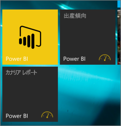

# Power BI モバイル アプリから Windows 10 のスタート画面にダッシュボードをピン留めする
Windows 10 用の Power BI モバイル アプリから Power BI のダッシュボードを Windows のスタート画面にピン留めすることができます。 これが*ライブ タイル*になります。 スタート画面でタイルをタップすると、Windows 10 用の Power BI モバイル アプリでダッシュボードが開きます。

>[!NOTE]
>**Windows 10 Mobile を使用するスマートフォン**に対する Power BI モバイル アプリのサポートは、2021 年 3 月 16 日に廃止されます。 [詳細情報](https://go.microsoft.com/fwlink/?linkid=2121400)

## スタート画面にライブ タイルとしてダッシュボードをピン留めする
1. ダッシュボードを開きます。
2. **[スタート画面にピン留め]** ![[スタート画面にピン留め] アイコン](./media/mobile-pin-dashboard-start-screen-windows-10-phone-app/power-bi-windows-10-pin-start-icon.png) をタップします。
   
   
   
   デバイスのスタート画面に移動して、ライブ タイルを表示します。
   
   

## 次の手順
* Windows ストアから [Windows 10 用の Power BI モバイル アプリをダウンロード](https://go.microsoft.com/fwlink/?LinkID=526478)  
* [Windows 10 用の Power BI モバイル アプリの概要](mobile-windows-10-phone-app-get-started.md)  
* [Power BI とは?](../../fundamentals/power-bi-overview.md)
* わからないことがある場合は、 [Power BI コミュニティで質問してみてください](https://community.powerbi.com/)。

