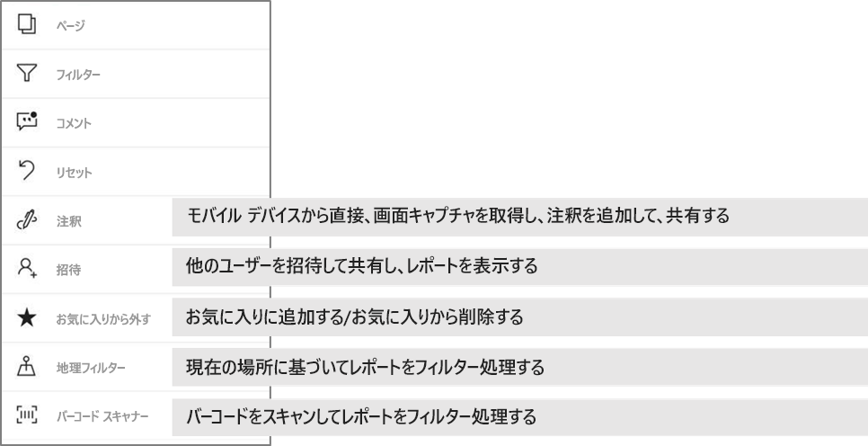

# Power BI モバイル アプリのレポートを調べる
適用対象:

|  |  |  |  |  |
|:--- |:--- |:--- |:--- |:--- |
| iPhone |iPad |Android フォン |Android タブレット |Windows 10 デバイス |

Power BI レポートは、データの対話型表示で、データから得られるさまざまな発見と洞察を表す視覚化が付いています。 Power BI モバイル アプリでは、3 段階のプロセスの 3 つ目の手順でレポートを表示できます。

1. [Power BI Desktop でレポートを作成します](../../desktop-report-view.md)。 Power BI Desktop で[スマートフォン用にレポートを最適化](mobile-apps-view-phone-report.md)することもできます。 
2. そのレポートを Power BI サービス [(https://powerbi.com)](https://powerbi.com) または [Power BI Report Server](../../report-server/get-started.md) に公開します。  
3. 次に、Power BI モバイル アプリでこれらのレポートを操作します。

## モバイル アプリで Power BI レポートを開く
Power BI レポートは、入手した場所に応じてモバイル アプリのそれぞれの場所に保存されます。 具体的には、アプリ、自分と共有、ワークスペース (マイ ワークスペースを含む)、またはレポート サーバーに保存されます。 関連するダッシュボードからレポートにアクセスしたり、一覧が表示されたりすることがあります。

リストおよびメニューでは、レポート名の横にアイコンが表示され、このアイテムがレポートであることがわかります。 

 

Power BI Mobile アプリのレポートには、次の 2 つのアイコンがあります。

* ![[レポート] アイコン](./media/mobile-reports-in-the-mobile-apps/report-default-icon.png) アプリで横向きに表示されるレポートを示し、ブラウザーの場合と同じような外観になります。

*  電話に最適化されたレポート ページが少なくとも 1 つ含まれ、縦に表示されるレポートを示します。 

> [!NOTE]
> 電話を横向きに保持すると、レポート ページに電話レイアウトがある場合でも、常に横レイアウトが表示されます。 

ダッシュボードからレポートを表示するには、タイルの右上にある省略記号 [...] をタップして、**[レポートを開く]** をタップします。
  
  
  
  すべてのタイルからレポートを開くことができるわけではありません。 たとえば、Q&A ボックスに質問して作成するタイルをタップしてもレポートは開きません。 
  
## レポートの操作
アプリでレポートを開いたら、操作を開始できます。 レポートとそのデータを使用して実行できる操作は多数あります。 レポート フッターには、レポートに対して実行するアクションが表示されます。 レポートに表示されるデータをタップおよびロング タップすることにより、データを細分化できます。

### タップとロング タップの使用
タップはマウス クリックと同じことです。 したがって、データ ポイントに基づいてレポートをクロス強調表示したい場合は、そのデータ ポイントをタップします。
スライサーの値をタップすると、その値が選択され、レポートの残りの部分がその値によってスライスされます。 リンク、ボタン、またはブックマークをタップすると、作成者によって定義された操作に基づいてアクティブ化されます。

おそらくお気付きでしょうが、ビジュアルをタップすると、枠線が表示されます。 枠線の右上隅には、省略記号 [...] が表示されています。それをタップすると、そのビジュアルに対して実行できる操作のメニューが表示されます。

### ツールヒントとドリル操作

データ ポイントをロング タップ (タップして保持) すると、このデータ ポイントが表す値を示すツールヒントが表示されます。 

レポート作成者がレポートページのツールヒントを構成していた場合、既定のヒントはレポート ページのツールヒントに置き換えられます。

> [!NOTE]
> レポートのツールヒントは、640 ピクセルのサイズと 320 のビューポートを超えるデバイスでサポートされています。 デバイスのサイズが小さい場合、アプリでは既定のツールヒントが使用されます。

レポート作成者は、データ内の階層と、レポート ページ間の関係を定義できます。 階層を使用すると、ビジュアルや値から別のレポート ページにドリルダウン、ドリルアップ、ドリルスルーできます。 そのため、値をロング タップすると、ツールヒントに加えて、関連するドリル オプションがフッターに表示されます。 

*ドリルスルー*では、ビジュアルの特定の部分をタップすると、タップした値にフィルター処理され、レポートの別のページに移動します。 レポートの作成者は、別のページに移動できる、1 つまたは複数のドリルスルー オプションを定義できます。 どれをドリルスルーするかを選択することができます。 "戻る" ボタンで前のレポート ページに戻ることができます。

[Power BI Desktop でドリルスルーを追加する](../../desktop-drillthrough.md)方法をご確認ください。
   
   > [!IMPORTANT]
   > Power BI Mobile アプリでは、マトリックス ビジュアルおよびテーブル ビジュアルでのドリル操作は、セルの値でのみ行うことができ、列見出しと行見出しではできません。
   
   
   
### レポート フッターでの操作の使用
レポート フッターには、現在のレポート ページまたはレポート全体に対して実行できる操作が表示されます。 フッターでは最も役に立つ操作にすばやくアクセスでき、すべての操作には省略記号 [...] からアクセスできます。

フッターから実行できる操作は次のとおりです。
1) レポート フィルターとクロス強調表示の選択を、元の状態に戻します。
2) 会話ウィンドウを開き、このレポートのコメントを表示または追加します。
3) フィルター ウィンドウを開き、レポートに現在適用されているフィルターを表示および変更します。
4) このレポートのすべてのページの一覧を表示します。 ページ名をタップすると、そのページが読み込まれて表示されます。
レポート ページ間を移動するには、画面の端から中央に向けてスワイプします。
5) すべてのレポート操作を表示します。

#### すべてのレポート操作
レポート フッターの [...] オプションをタップすると、レポートに対して実行できるすべての操作が表示されます。 

一部の操作は、特定のレポート機能に依存するため、無効になっている場合があります。
例:
1) レポート内のデータが作成者によって地理的なデータと分類されている場合は、**現在の場所でのフィルター処理**が有効になります。 「[レポートで地理的データを識別する](https://docs.microsoft.com/power-bi/desktop-mobile-geofiltering)」をご覧ください。
2) **バーコードのスキャンによるレポートのフィルター処理**は、レポート内のデータセットがバーコードとしてタグ付けされている場合にのみ有効になります。 [Power BI Desktop でバーコードにタグ付けする方法](https://docs.microsoft.com/power-bi/desktop-mobile-barcodes)。 
3) **[招待]** は、ユーザーがこのレポートを他のユーザーと共有するアクセス許可を持っている場合にのみ有効になります。 ユーザーがアクセス許可を持っているのは、レポートの所有者である場合、または所有者によって "再共有" アクセス許可を付与されている場合のみです。
4) Power BI Mobile アプリからの共有を禁止する [Intune 保護ポリシー](https://docs.microsoft.com/intune/app-protection-policies)が組織で適用されている場合、**[注釈を付けて共有]** が無効になることがあります。 

## 次の手順
* [電話用に最適化された Power BI レポートの表示と対話](mobile-apps-view-phone-report.md)
* [電話用に最適化されたバージョンのレポートの作成](../../desktop-create-phone-report.md)
* わからないことがある場合は、 [Power BI コミュニティで質問してみてください](http://community.powerbi.com/)。

