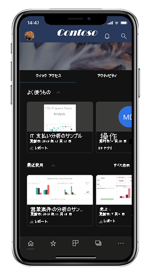
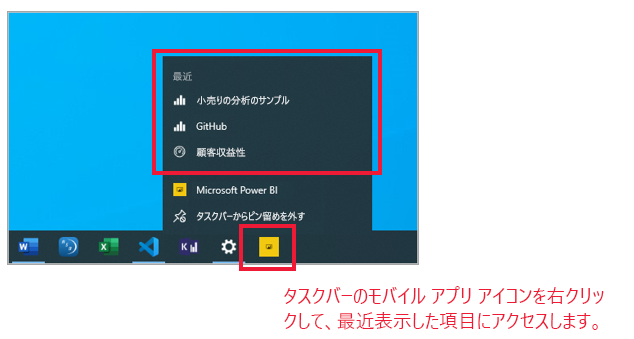
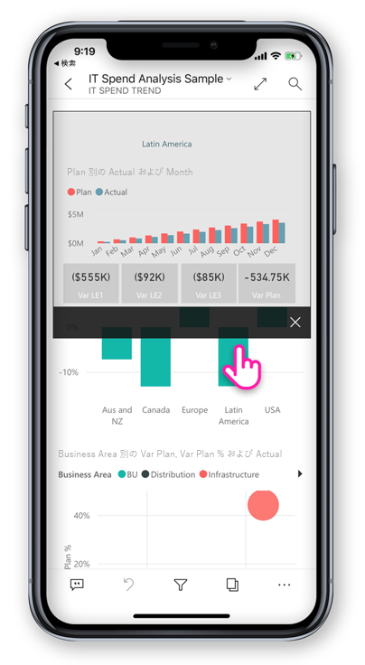

# Power BI 用モバイル アプリの新機能
関連する最新情報については、次の資料を参照してください。

* [モバイル アプリ向けの Power BI チームのブログ](https://powerbi.microsoft.com/blog/tag/mobile/)
* [Power BI Desktop の新機能](../../fundamentals/desktop-latest-update.md)  
* [Power BI サービスの新機能](../../fundamentals/service-whats-new.md)

>[!NOTE]
>**Windows 10 Mobile を使用するスマートフォン**に対する Power BI モバイル アプリのサポートは、2021 年 3 月 16 日に廃止されます。 [詳細情報](https://go.microsoft.com/fwlink/?linkid=2121400)

## 2020 年 7 月
### Windows 用 Power BI モバイル アプリで組織のブランド化がサポートされるようになりました
これで、組織のブランド化のテーマと一致するように、Power BI のルック アンド フィールに管理者が行ったすべての変更が、Power BI モバイル アプリにも表示されます。 このような変更には、上部のナビゲーション バーの新しい配色、組織のロゴ、およびバナー画像が含まれる場合があります。  

### リモート構成を使用してシングル サインオンを無効にする (iOS および Android)
IT 管理者は、Power BI モバイル アプリへのシングル サインオンをリモートで無効にして、マルチユーザー デバイスのセキュリティとアクセス許可のコンプライアンスを強化できるようになりました。 [詳細情報](mobile-app-configuration.md#disable-single-sign-on-ios-and-android)

## 2020 年 6 月
### スライドショーでのブックマークの表示 (Windows)
データ内の特定の分析情報を強調表示するために、レポートと個人用のブックマークをプレゼンテーションの一部として自動的にスライドショーに含めることができるようになりました。
[ぜひお試しください。](mobile-windows-10-app-presentation-mode.md#use-presentation-mode)

## 2020 年 5 月
### Power BI モバイルにダーク モードが追加されました (iOS)
iOS13 用 Power BI モバイル アプリで、新しいダーク モードをお試しください。 ダーク モードでは、暗い背景に明るいテキストが表示され、画面の明るさが下がり、内容が見やすくなります。 アプリの表示設定でテーマを切り替えることができます。 [詳細情報](mobile-apps-dark-mode.md)

### プレゼンテーション モードでのブックマークの適用 (Windows)
プレゼンテーション モードでレポートを表示するときに、個人用とレポートの両方のブックマークをレポート ページに適用して、データに関するストーリーを表示できるようになりました。 [ぜひお試しください。](mobile-windows-10-app-presentation-mode.md#use-presentation-mode)

## 2020 年 4 月

### ワークスペースからの共有が利用可能
ワークスペースからレポートとダッシュボードを共有する機能が追加されました。 Power BI サービスの場合と同様に、"マイ ワークスペース" からのコンテンツや、ワークスペースの所有者が許可している場合は他のワークスペースからのコンテンツを共有できるようになりました。 

### ダッシュボードで全画面表示モードがサポートされるようになりました (iOS および Android)
ダッシュボードを全画面表示モードで表示できるようになり、ダッシュボード コンテンツを表示するためのスペースが増えました。 

## 2020 年 3 月

### ショートカットと Google Search を使用してコンテンツを起動する (Android)
ショートカットと Google Search の両方を Power BI アプリに統合することで、データの検索と起動がより簡単になりました。 デバイスのホーム画面から直接、お気に入りのレポートやダッシュボードに簡単にアクセスするためのショートカットを作成します。 その後、Google Search を使用して、Power BI コンテンツをすばやく検索して開きます。 詳細については、[Android アプリのショートカット](mobile-app-quick-access-shortcuts.md)および [Google Search](mobile-app-find-access-google-search.md) に関するページを参照してください。

### デバイスの保護を使用したセキュリティ強化 (プレビュー) (Android)
デバイスの組み込みの保護機能を使用して、Power BI アプリをセキュリティで保護し、必要なプライバシーを確保します。 Power BI アプリへのアクセスに生体認証 (指紋 ID) を求めることで、確実にデータを非公開にし、自分だけに表示されるようにします。 [詳細については、ネイティブのセキュリティで保護されたアクセスに関するページを参照してください](mobile-native-secure-access.md)

### iPad でスキャンを利用できるようになりました
iPad から直接、バーコードをスキャンしてレポートをフィルター処理したり、QR コードを使用してレポートをすばやく開いたりできるようになりました。  

### フィルター処理のエクスペリエンスの更新
Power BI アプリのフィルターに、新機能と新しいデザインが追加されました。 これには、レポートのビジュアルに影響を与える適用されたフィルターの可視性の強化と、フィルターをロックしたり、非表示にしたりする機能が含まれます。 これらの変更により、Power BI サービスでのフィルター処理との互換性も向上します。

## 2020 年 2 月

### 複数選択モード (Android および iOS)

レポート ページで複数のデータ ポイントを選択する機能が追加されました。 複数選択が有効になっている場合、タップする各データ ポイントは、選択した他のデータ ポイントに追加され、ページ上のすべてのビジュアルで、結合された結果が自動的に強調表示されます。 複数選択モードを有効にするには、[モバイル アプリの設定](./mobile-app-interaction-settings.md)ページに移動します。

>[!NOTE]
>複数選択モードは、レポート サーバーの次回のリリースの Power BI Report Server でサポートされます。

### iPhone 用モバイル アプリでレポート フッターを常に表示できるようになりました

Android フォンの場合と同様、iPhone でも、レポート ページの下部にレポート フッターをドッキングすることを選択でき、ページ上の操作に関係なく、常に表示され使用できるようになりました。 これにより、そこで提供されるすべてのオプションを簡単に使用できるようになります。 フッターをドッキングするには、[モバイルアプリの設定](./mobile-app-interaction-settings.md)ページの **[レポート フッターのドッキング]** スイッチを切り替えます。

### PBIRS レポートのサポート (プレビュー) (Windows)

Power BI アプリで Power BI Report Server (PBIRS) レポートを開くことができるようになりました。

### 最近使った項目にすばやくアクセスする (Windows)

Windows タスクバーの Power BI アプリのアイコンを右クリックして、最近表示した項目の一覧を取得します。 リストの項目をクリックすると、簡単にアクセスできます。

## 2020 年 1 月

### プレゼンテーション モードで作成された注釈を共有する (Windows)

プレゼンテーション中に作成した注釈はプレゼンテーションの欠かせない部分、ディスカッションの主要な要素となります。 プレゼンテーション モードでレポートに注釈を付けるときに、レポート ページのスナップショットを同僚と共有できるようになりました。 [詳細情報](./mobile-windows-10-app-presentation-mode.md#use-presentation-mode)

## 2019 年 12 月

### ドッキングされたレポート フッターと更新ボタン - レポートの対話式操作に関する新しいエクスペリエンス (Android)

Android ユーザーから、レポート使用時のエクスペリエンスが最適でないという意見がありました。レポート フッターが使いにくい、また、一部のデバイスでは引っ張って更新が過度に反応するということでした。 そのため、このリリースでは、次の動作が変更されています。
* **ドッキングされたレポート フッター** - スマートフォンでレポートを開くと、レポート フッターがレポート ページの下部にドッキングされているのがわかります。ページでの操作に関係なく、常にそこに表示されていて使用することができます。 これにより、そこで提供されるすべてのオプションを簡単に使用できるようになります。
* **レポート ヘッダー上の更新ボタン**- また、レポート ヘッダーに更新ボタンがあり、意図したまさにそのときにレポートを簡単に更新できるようになります。

以前の動作を希望するユーザーは、モバイル アプリの新しい拡張された[対話式操作の設定](./mobile-app-interaction-settings.md)を使用して、それらの動作を復元できます。

さらに、IT 管理者は任意の MDM ツールを使用して、アプリ構成ファイルでユーザーの代わりに[新しい既定の設定をリモートでオーバーライドする](./mobile-app-configuration.md#interaction-settings-ios-and-android)ことができます。 このようにして、組織内のすべてのユーザーに対して同じ動作を構成できます。

> [!NOTE]
> 現在、更新ボタンとレポート フッターのドッキングの対話式操作の設定は、レポート サーバーのレポートには影響しません。 これは、レポート サーバーの 1 月のリリースで変更される予定です。

### モバイル アプリから既定のブックマークを設定する
レポートの既定のブックマークを Power BI モバイル アプリから直接設定できるようになりました。 これにより、レポートを開くたびに、既定のブックマークが自動的に適用されます。 [詳細情報](./mobile-reports-in-the-mobile-apps.md#bookmarks)

### Android タブレット上の場所によるフィルター処理
geo フィルタリングを使用すると、現在の場所に基づいてレポートをフィルター処理できます。 この機能が Android タブレット用 Power BI アプリでも使用できるようになりました。 [詳細情報](./mobile-apps-geographic-filtering.md)

## 2019 年 11 月

### Power BI アプリの新しい外観が既定で有効化されるようになりました
 
アプリを開くと、新しい外観とナビゲーションバーが自動的にオンになり、コンテンツを簡単に見つけて開くことができます。 開始点としてアプリの[ホーム ページ](mobile-apps-home-page.md)を使用します。最も重要なコンテンツと、あらゆる最新のアラートや通知などで最新の状態を維持する[アクティビティ フィード](mobile-apps-home-page.md#activity-feed)に簡単にアクセスできます。

### 最新の Power BI アクティビティをすべて表示する
 
アクティビティ フィードを使用すると、Power BI コンテンツで起こっていることをリアルタイムで追跡できます。 アプリのホーム ページに移動し、[アクティビティ] タブを開くだけで最新の通知、アラート、コメント、@mentions などがすべて表示されます。 [詳細情報](mobile-apps-home-page.md#activity-feed)

### レポートでブックマークを使用する

Power BI モバイルアプリでは、Power BI で作成されたブックマークがサポートされるようになりました。 アプリを開くと、レポート作成者によって作成されたブックマークと、自分で作成した個人用ブックマークを活用できます。 [詳細情報](mobile-reports-in-the-mobile-apps.md#bookmarks)

## 2019 年 10 月

### レポート サーバーのアクセス設定をリモートで構成するための Android サポート

Power BI モバイル アプリのレポート サーバーのアクセス設定をリモートで構成するための Android サポートを追加しました。 IT 管理者は、組織の MDM ツールを使用して、iOS と Android の両方のデバイスでこれらの設定をリモートで構成できるようになりました。 詳細については、「[リモートでレポート サーバーへの Power BI iOS モバイル アプリのアクセスを構成する](https://docs.microsoft.com/power-bi/report-server/configure-powerbi-mobile-apps-remote)」を参照してください。

### レポート間のドリルスルー

今月は、レポート間のドリルスルーのサポートが追加されました。 データ ポイントをタップしてドリルスルーし、他のレポートやレポート ページにアクセスできるようになりました。 ターゲット ページまでドリルスルーすると、そのページのコンテンツはドリルスルー設定に基づいてフィルター処理されます。

> [!NOTE]
> レポート間のドリルスルーは、レポート作成中にこの機能を有効にした場合にのみ使用できます。 [レポート間のドリルスルーについての詳細情報](https://docs.microsoft.com/power-bi/desktop-cross-report-drill-through)。

### データ機密ラベル

コンテンツの所有者がレポート、ダッシュボード、データセット、およびデータフローに設定した機密ラベルを表示して、データの機密度を分類できるようになりました。 機密ラベルは、コンテンツを他のユーザーとどのように共有できるかを決定します。 [Power BI のデータ機密ラベルについての詳細情報](https://docs.microsoft.com/power-bi/admin/service-security-data-protection-overview)。

### カスタム アプリ ナビゲーションのサポート (Windows)

iOS および Android に加えて、Windows デバイス用のカスタム アプリ ナビゲーションのサポートが追加されました ([9 月の新機能のエントリ](#september-2019)を参照してください)。

## 2019 年 9 月

### カスタム アプリ ナビゲーションのサポート (iOS と Android)

カスタム アプリ ナビゲーションのサポートが追加されました。 これで、Power BI Mobile でアプリを開くと、アプリの作成者によって作成されたカスタム ナビゲーション エクスペリエンスが使用できるようになります。 アプリのナビゲーションはコンテンツ別に整理できます。また、リンクや折りたたみ可能なセクションなど、新しい項目を含めることができます。
カスタム ナビゲーションの詳細は[こちら](https://powerbi.microsoft.com/blog/designing-custom-navigation-for-power-bi-apps-is-now-available/)を参照してください。

## 2019 年 8 月

### Power BI Mobile の新しい外観の導入 (プレビュー) (iOS および Android)

アプリを一新し、新しいエクスペリエンスを導入しました。よく使用されるコンテンツにすばやくアクセスできるホーム ページと、アプリ内を簡単に移動できる新しいナビ ペインが追加されています。 一新された新しいエクスペリエンスでは、必要なときに、必要なものをすばやく簡単に検索できます。
新しい外観はプレビュー段階であるため、利用するには有効にする必要があります。
詳しくは、[Power BI Mobile の新しい外観](https://powerbi.microsoft.com/blog/introducing-power-bi-mobile-apps-new-look-preview/)に関する記事をご覧ください。

### Azure Active Directory (AD) アプリケーション プロキシを使用したセキュリティで保護されたアクセス (iOS および Android)

Azure Active Directory チームと手を組み、Azure Active Directory (AAD) アプリケーション プロキシに Power BI モバイル アプリケーションを統合しました。 この構成を使用すると、複雑なオンプレミス構成を設定することなく、エンタープライズ境界内でホストされているレポート サーバーに Power BI Mobile アプリから接続できます。 [Power BI モバイルと Azure AD アプリケーション プロキシの統合](https://powerbi.microsoft.com/blog/access-on-prem-report-server-from-your-power-bi-mobile-app-with-azure-active-directory-application-proxy/)の詳細を参照してください。 [Azure AD アプリケーション プロキシと Power BI の構成方法](https://docs.microsoft.com/azure/active-directory/manage-apps/application-proxy-integrate-with-power-bi)を参照してください。

## 2019 年 7 月

### レポート ページのヒント

モバイル アプリでレポートを表示するときに、レポート ページのヒントがサポートされるようになりました。 レポートのツールヒントが関連付けられているビジュアルを長押しするだけで、表示されます。  

 
> [!NOTE]
> レポートのツールヒントは、640 ピクセルのサイズと 320 のビューポートを超えるデバイスでサポートされています。 小さいデバイスでは、既定のツールヒントが使用されます。

## 2019 年 6 月

### バーコード スキャンが Android で使用可能に
Android (スマートフォンおよびタブレット) の Power BI アプリを使用し、製品または店頭の棚に印刷されているバーコードをスキャンして、スキャンされた値でフィルターされた、関連する Power BI レポートが表示できるようになりました。 詳細については、[バーコードでデータをフィルターする方法](mobile-apps-scan-barcode-iphone.md)に関するページを参照してください。

### ADFS 構成 (iOS、Android) 上の PBI-RS でホストされている PBIX レポートのサポート

Power BI モバイル アプリから、ADFS 構成上の PBI-RS でホストされている Power BI レポート (PBIX) にアクセスできるようになりました。

## 2019 年 5 月

### Siri ショートカットのサポート (iOS)
ユーザーは、各自の Power BI のレポートとダッシュボードへの Siri ショートカットを作成した後、Siri 音声インターフェイスからそれらを直接開くことができます。 [Power BI iOS アプリで Siri ショートカットを使用する方法を参照する](https://powerbi.microsoft.com/blog/introducing-siri-integration-with-power-bi-mobile-ios-app-preview/)。

### デバイスの検索 (iOS)
iOS デバイスの検索 (スポットライト) との Power BI の統合。 iPhone または iPad でのコンテンツの検索も、Power BI のアイテムに含まれるようになりました。 ユーザーが、デバイスのネイティブ検索を使用したときに、検索条件と一致する Power BI レポート、ダッシュボード、アプリ、ワークスペース、およびユーザーが検索結果に表示されます。 [ブログ記事で詳細を確認する](https://powerbi.microsoft.com/blog/introducing-siri-integration-with-power-bi-mobile-ios-app-preview/)。

### シングル タップ レポート対話機能 - GA

シングル タップが一般提供されるようになり、新規ユーザーにとっては既定のタッチ操作になります。 ユーザーはそれをオフにすることができ、アプリ設定でダブル タップを有効にできます。

### 強化された条件付きアクセスの保護 (iOS、Android)

アプリ ポリシーが適用される前の Power BI へのアクセスを制限することでセキュリティを強化するために、AAD に[新しいアプリ保護ベースの条件付きアクセス機能](https://docs.microsoft.com/azure/active-directory/conditional-access/app-protection-based-conditional-access)が統合されました。

### デバイスの保護 (iOS)

ユーザーは、デバイスの組み込み保護を使用して、Face ID、Touch ID または Power BI にアクセスするためのパスコードを要求することによって、Power BI をセキュリティで保護することができます。 これは、アプリ設定を使用してユーザーが制御できますが、Intune やその他の MDM ツールを使用して管理者が制御することもできます。 [詳細情報](https://docs.microsoft.com/power-bi/consumer/mobile/mobile-ios-native-secure-access)

### 1 ページのレポートのスライド ショー (Windows)

スライド ショーでの 1 ページのレポートの自動更新もサポートされます。 そのため、レポートの基になるデータ ソースが更新された場合は、それがピックアップされ、ページ内のデータが更新されます。

## 2019 年 4 月

### 主要なインフルエンサーのビジュアル 

モバイル アプリで主要なインフルエンサーのビジュアルを利用できるようになりました。 このビジュアルを使用して、数回のタップでデータの主な推進要因の分析を実行できます。

### レポートのコンテンツへのコメントの追加 (Android および iOS)

コメントを使用して、レポートのページとビジュアルに対する共同作業とフィードバックの共有を実行できるようになりました。 Power BI サービスとモバイルでのレポートのコメントの詳細については、[こちらのブログ](https://powerbi.microsoft.com/blog/announcing-report-commenting-for-power-bi-service-and-mobile/)を参照してください。 

### 表示を全画面表示モードで最大化する (Android および iOS)

データに注目するときに、レポートのヘッダーとフッターを削除することでレポートの表示スペースを最大化できる新しいボタンが追加されました。

## 2019 年 3 月

### Power BI アプリでの外部ゲスト ユーザーのサポート (iOS、Android)

アプリ (B2B とも呼ばれる) から直接、他の組織から共有している Power BI コンテンツにアクセスできます。 Power BI モバイル アプリ B2B の詳細については、[こちら](https://powerbi.microsoft.com/blog/power-bi-mobile-apps-now-support-azure-ad-b2b-guest-users/)をご覧ください。

### スライド ショーでの Windows プレゼンテーション モードの強化 (Windows)

[スライド ショー](https://powerbi.microsoft.com/blog/enhancing-presentation-mode-with-slideshow-in-windows-power-bi-app/)では、オフィスにあるパブリック ディスプレイを使用して、レポート ページ間を自動的にローテーションする Power BI レポートを全画面で実行することができます。  

### ADFS と WAP 構成での PBI RS レポートのサポート (iOS のみ)

Power BI iOS アプリから、ADFS 構成上の PBI RS でホストされている Power BI レポート (PBIX) にアクセスできるようになりました。

### レポート ビジュアルでのシングル タップ操作の有効化

レポート対話機能が変更され、ビジュアル、ボタン、またはスライサーを 1 回タップするだけで、データをすぐに操作できるようになりました。 ユーザーは、ビジュアルを操作するときに、タップしてそれを選択し、操作するためにもう一度タップする必要はなくなりました。シングル タップで両方が実行されます。

> [!NOTE]
> 既存のユーザーは、アプリ設定でこの動作を有効にする必要があります。 詳細については、[シングル タップ レポート対話機能を構成する方法](https://docs.microsoft.com/power-bi/consumer/mobile/mobile-app-single-tap)に関する記事を参照してください。

## 2019 年 1 月 - 2 月
 
### Visio ビジュアル

Visio ビジュアルでのシングル サインオン (SSO) の有効化。これにより、アプリで Visio ビジュアルを使ってレポートを表示するときに追加のサインイン手順が不要になります。 

### Power BI Mobile の Windows アプリに対するダッシュボードのコメントの追加

ダッシュボードおよび特定のタイルに直接コメントを追加して、データについて説明できます。コメントは、ダッシュボードを表示していすべてのるユーザーに対して表示されます。 

## 2018 年 12 月

### 横方向のレポートにフィルターを使用できるようになりました 

レポートのフィルター ウィンドウを (電話レポートに加え) 横方向のレポートに使用できるようになりました。

## 2018 年 11 月

### 最新のビジュアル ヘッダー 

新しい '最新のビジュアル ヘッダー' を使用するレポートでは、ヘッダーにスペースが割り当てられなくなります。その結果、空きスペースが少なくなり、視覚エフェクトのスペースが増えます。

### プレゼンテーション モードの強化 (Windows)

Surface Hub および Windows 10 デバイスのプレゼンテーション モードが強化されました。  プレゼンテーションとコラボレーションのツールが改善され、クロムレスで大画面に最適化されたビューによる強化によりデータに集中しやすくなった Surface Hub の会議室操作をお試しください。 プレゼンテーション モードでは効果的なプレゼンテーションと、データに関するディスカッションを行うために役立つインクのようなツールも提供されます。 プレゼンテーション モードの詳細については、[こちら](https://powerbi.microsoft.com/blog/presentation-mode-in-power-bi-windows-app/)をご覧ください。

### タブレットの縦向きレイアウト (iOS と Android)

縦向きモードのタブレットでレポートを表示するために、電話レポート レイアウトが使用されるようになりました (存在する場合)。 Power BI サービスまたは Power BI Desktop で電話レイアウトを作成する方法については、[こちら](https://docs.microsoft.com/power-bi/desktop-create-phone-report/)をご覧ください。

### レポートのクエリ文字列のサポート 

クエリ文字列を含むレポート リンクがモバイル アプリで開き、クエリ文字列で定義された条件に基づいて事前にフィルターされるようになりました。 クエリ文字列を含むレポートの URL を作成する方法については、[こちら](https://docs.microsoft.com/power-bi/service-url-filters/)をご覧ください。  

### 資格情報の共有 (Android)

モバイル アプリからの Power BI へのサインインが、これまでより容易になりました。 共有資格情報により、デバイスで他の Microsoft 365 アプリの資格情報を使用して Power BI サービスでの認証を行うことで、サインイン プロセスが簡素化されました。

### アプリ内の URL (Android) 

他の Power BI 成果物を参照するレポート内のリンクが、アプリの内部で直接開くようになりました。 これにより、カスタム ナビゲーション フローを作成できます (レポートからダッシュボードへのリンクなど)。

### データを表示して値をコピーする

レポートのビジュアルの操作メニュー (...) から、基になるデータをテーブル形式で表示できるようになりました。 テーブル内でテーブルの値を長押しすると、選択してコピーすることができます (Intune のポリシーによりコピーが制限されていない場合)。

## 2018 年 10 月

### ページ分割されたレポートのプレビュー (すべてのデバイス)

ページ分割されたレポートを、Power BI サービスで使用できるようになりました。 Power BI サービスでページ分割されたレポートにアクセスできるユーザーは、モバイル アプリからもそれらのレポートにアクセスできます。 

Power BI の[モバイルでのページ分割されたレポートに関するブログ記事](https://powerbi.microsoft.com/blog/power-bi-paginated-reports-also-available-in-power-bi-mobile-apps-preview/)をご覧ください。

### 共有資格情報 (iOS)

モバイル アプリからの Power BI へのサインインが、これまでより容易になりました。 共有資格情報により、デバイスで他の Microsoft 365 アプリの資格情報を使用して Power BI サービスでの認証を行うことで、サインイン プロセスが簡素化されました。

### アプリ内 URL (iOS) 

他の Power BI 成果物を参照するレポート内のリンクが、アプリの内部で直接開くようになりました。 これにより、カスタム ナビゲーション フローを作成できます (レポートからダッシュボードへのリンクなど)。

### iOS12 と watchOS 5 のサポート 

iOS 向け Power BI アプリが更新され、モバイル デバイスやウォッチの新しい OS でシームレスに動作するようになりました。

## 2018 年 9 月

### ブラウザーでのスマートフォン レポートの編集 (すべてのデバイス)

これで、Power BI Desktop だけでなく Power BI サービスで既に発行されているレポートに対して、スマートフォン レポート レイアウトを作成できます。 これは、ブラウザーの編集モードで作成します。

### ダッシュボードのコメント (iOS と Android) 

ダッシュボードおよび特定のタイルに直接コメントを追加して、データについて説明できます。コメントは、ダッシュボードを表示していすべてのるユーザーに対して表示されます。 また、@mentioning することで、組織内の他のユーザーをメッセージ交換にプルすることもできます。 @mentioned の対象となったユーザーは、携帯電話へのメッセージでプッシュ通知を受信します。

iOS デバイスと Android デバイスで現在使用できます。 Windows は近日サポートされる予定です。

Power BI の[ダッシュボードのコメントに関するブログ投稿](https://powerbi.microsoft.com/blog/announcing-dashboard-comments-in-power-bi/)をご覧ください。

### シングル サインオン (Windows)

シングル サインオン (SSO) では、Windows 用 Power BI モバイルで最も多く要求された機能の 1 つです。 現在では、プライマリ組織アカウントを使用して、ドメインに参加している Windows モバイル デバイスにサインインするだけでなく、Power BI サービスにもシームレスにサインインすることができます。 [SSO および Windows モバイル アプリ](mobile-windows-10-app-single-sign-on-sso.md)の詳細を参照してください。

## 先月

### 2018 年 7 月

#### iOS と Android のみ

**共有のフィルター**

共有のフィルターとスライサーを含むレポートを受信できるようになりました。

**背景画像のサポート**

モバイル デバイスでレポートを横向きモードで表示するとき、Web 上の Power BI と同じ背景画像を利用できます。

### 2018 年 6 月

#### フル キャンバス レポート

上下のアクション バーは、レポートの読み込み後、すぐに非表示になります。その分、レポートで一度に表示される部分が増えます。

#### スマートフォン レポートのキャンバス サイズの拡大

スマートフォン レポートのキャンバス サイズを拡大し、ビジュアルのための場所を以前より多くしました。

### 2018 年 5 月

#### モバイル ドリルスルー: すべてのモバイル アプリ

レポート作成者がアクションを定義していた場合、選択したデータ ポイントからモバイル アプリ内の他のレポート ページにドリルスルーできます。 

#### [戻る] ボタン: すべてのモバイル アプリ

スワイプするか、操作バーのレポート ページを選択するか、ドリルスルーを使用してレポート内を移動しているときに、[戻る] ボタンを使用すると、閲覧していた前のページに戻ります。 

#### ダッシュボード テーマ: すべてのモバイル アプリ

レポート作成者が Power BI サービスのダッシュボード テーマをカスタマイズすると、モバイル アプリでもダッシュボードの外観と雰囲気が変更されます。 ただし、背景画像は表示されません。

#### iOS:リモートでレポート サーバーへの Power BI iOS モバイル アプリのアクセスを構成する

IT 管理者は MDM ツールを使用し、レポート サーバーへの Power BI iOS モバイル アプリのアクセスを構成できるようになりました。 詳細については、「[Configure Power BI iOS mobile app access to a report server remotely](../../report-server/configure-powerbi-mobile-apps-remote.md)」 (リモートでレポート サーバーへの Power BI iOS モバイル アプリのアクセスを構成する) を参照してください。

#### Power BI for Mixed Reality アプリ (プレビュー)

Power BI for Mixed Reality アプリが Microsoft ストアに登場しました。 仮想世界に専念した状態でダッシュボードとレポートを表示するか、あるいは使用環境のコンテキストで特定の場所にダッシュボードとレポートを配置して表示します。 コンテキストのために新しい「[Introducing Power BI on Hololens](https://www.youtube.com/watch?v=J_X_nOFUBss)」(Hololens での Power BI の紹介) のビデオを見るか、新しい [Power BI for Mixed Reality](mobile-mixed-reality-app.md) に関する記事をご覧ください。

### 2018 年 4 月

#### モバイルでのドリルダウンとドリルアップ

モバイル デバイスでドリルダウンとドリルアップを行って、レポートのビジュアルを調べることができます。 この新しい機能にアクセスするには、レポートのビジュアルを長押ししてツールヒント メニューを開いた後、データを掘り下げるためのドリル ボタンをタップします。 詳細については、[モバイル アプリのドリルアップとドリルダウン](https://powerbi.microsoft.com/blog/drill-down-up-in-power-bi-mobile-apps/)に関するページをご覧ください。

#### 固定フィルター

レポートのフィルターとスライサーが最近更新され、Web 上の Power BI からPower BI モバイル アプリに自動的に保存されるようになりました。 現在、モバイル アプリで設定したフィルターとスライサーは、Web 上の Power BI に自動的に保存されます。

### 2018 年 3 月

#### Power BI for Mixed Reality アプリ (プレビュー)

最新のデータ傾向に応じて、Power BI for Mixed Reality アプリが作成されました。 仮想世界に専念した状態でダッシュボードとレポートを表示するか、あるいは使用環境のコンテキストで特定の場所にダッシュボードとレポートを配置して表示します。 詳細については、新しい [Power BI for Mixed Reality アプリ](mobile-mixed-reality-app.md)に関するページを参照してください。

#### レポートおよびダッシュボードを外部と共有する

ダッシュボードおよびレポートを、組織の外部にいるユーザーと、アプリから直接共有します。 外部共有は、組織とソーシャル アカウントの両方に対して有効です。 

#### 固定フィルター

Web 上の Power BI でフィルターおよびスライサーを設定すると、フィルターの選択はモバイル アプリにも保存されるので、中断したところから再開できます。

#### iPad でレポートを更新する

iPad アプリの Power BI レポートに更新ボタンが追加されました。

### 2018 年 2 月

#### レポートの共有

モバイル アプリからレポートを直接共有できるようになりました。 [モバイル アプリからのダッシュボードとレポートの共有](mobile-share-dashboard-from-the-mobile-apps.md)について、詳細を確認してください。

#### 改善されたツールヒント

レポート ビジュアルでタップを長押ししてツールヒントにアクセスする際に、ビジュアル上で指をドラッグし、途中で各データ ポイントに関する詳細を調べられるようになりました。

### 2018 年 1 月

#### レポートのお気に入り

レポートにお気に入りのタグを付け、 **[お気に入り]** ページに表示します。 [Power BI モバイル アプリでのお気に入り](mobile-apps-favorites.md)の詳細については、こちらをご覧ください。

#### 共有レポートを表示する

誰かとレポートを共有すると、ダッシュボードの他に、 **[共有アイテム]** ページにレポートが一覧表示されます。

#### ハイパーリンク サポートの改善

Power BI ビジュアルのリンクをタップし、モバイル ブラウザーで開くことができるようになりました。

#### Intune 統合 (Android)

Intune モバイル デバイス管理を利用した、条件付きアクセスのサポート。

### 2017 年 12 月

#### 改善されたセキュリティ管理 

組織のデータに対するセキュリティを強化するために、Android デバイスの条件付きアクセス (CA) と Microsoft Intune モバイル デバイス管理 (MDM) のサポートを追加しました。 iOS では既に利用可能になっています。

#### アクセス許可の管理の強化

データセット、ダッシュボード、レポートへのユーザー アクセス許可をより正確に管理できるようにするいくつかの変更を行いました。

#### 自動インストール済みアプリ

Power BI に一部のアプリをインストールする必要はまったくありません。 組織内の Power BI アプリ作成者は、ダッシュボードとレポートのコレクションを含む*アプリ* を作成することができます。 その後、アプリを発行し、Power BI サービスと Power BI モバイル アプリに自動的にインストールされるように設定できます。 アプリが自動的にインストールされるように設定している場合は、次のように **[アプリ]** メニューに自動的に表示されます。

![Power BI モバイル アプリの [アプリ]](./media/mobile-whats-new-in-the-mobile-apps/power-bi-apps-mobile-apps.png)

### 2017 年 11 月
#### iPhone X 向けの最適化

すべてのデバイスで適切にデータを探索できるように、iPhone X 用のアプリのレイアウトを最適化しました。

### 2017 年 10 月
#### Android の電話レポート用フィルター

Power BI Desktop で電話用に最適化されたページを使用してレポートを作成した場合で、そのレポートにフィルターがある場合、それらのフィルターを Android の電話レポートで適用できるようになりました。 詳細については、Android の Power BI レポート用フィルターに関する記事を参照してください。

#### レポートでのデータの表示

レポート内の視覚エフェクトをテーブル ビューに切り替えて、データの背後にある数値を確認できるようになりました。 この機能を使用するには、レポートで視覚エフェクトの [...] メニューから [データの表示] をタップするか、展開された視覚エフェクトの操作メニューで新しいアイコンをタップします。

### 2017 年 9 月
#### iPhone の電話レポート用フィルター
Power BI Desktop で電話用に最適化されたページを使ってレポートを作成した場合で、そのレポートにフィルターがある場合、それらのフィルターを iPhone の電話フィルターで適用できるようになりました。 詳細については、[iPhone の電話レポート用フィルター](https://powerbi.microsoft.com/blog/filters-coming-for-phone-reports-on-ios/)に関する記事を参照してください。

### 2017 年 8 月
#### iOS のプロキシ設定のサポート
Power BI iOS モバイル アプリでプロキシ設定を使用できるようになりました。 これは、Power BI がモバイル デバイス上の VPN 接続を使用できるようになったため、より多くのユーザーや組織が外出先で安全に Power BI の機能を活用できるようになったことを意味します。

### 2017 年 7 月
「[Power BI Service and Mobile July Feature Summary](https://powerbi.microsoft.com/blog/power-bi-service-and-mobile-july-feature-summary/#ios-preview)」 (Power BI サービスとモバイル 7 月の機能の概要) をお読みください。

#### iOS デバイス
**iOS での新しい Q&A エクスペリエンス (プレビュー)** 自分が問い合わせた質問の回答をただ受け取るのでなく、自然言語を使用して範囲指定したインサイトを取得できるようになりました。 お探しのものがよくわからない場合でも、Q&A が目的のデータに関連するインサイトを事前に抽出します。 モバイル上で動作する新しい Q&A エクスペリエンスは、Microsoft Research チームとの共同開発によるものであり、弊社製品内の強力なテクノロジを紹介します。 チュートリアル「[iOS モバイル アプリでデータについて質問する](mobile-apps-ios-qna.md)」を試してみてください。

### レスポンシブ ビジュアル
**電話レポートおよびダッシュボード用のレスポンシブ ビジュアル** ダッシュ ボードまたはレポート内のビジュアルを*レスポンシブ*に設定することができます。これにより、ビジュアルは画面のサイズに関係なく、最大量のデータとインサイトを表示できるように動的に変化します。 [レスポンシブ ビジュアルに関するブログ](https://powerbi.microsoft.com/blog/power-bi-desktop-july-feature-summary-2/#responsiveVisuals)を参照してください。

### 2017 年 6 月
#### すべてのデバイス
**アプリをお気に入りに追加する** ダッシュ ボードは既にお気に入りに追加できるようになっています。 最近、[Power BI にアプリ追加され](../../collaborate-share/service-create-distribute-apps.md)、アプリをお気に入りに追加できるようになりました。 

### 2017 年 5 月
#### すべてのデバイス
**新しいメニュー:自分と共有** モバイル アプリ メニューの [自分と共有] に移動すると、自分と共有されているすべてのコンテンツが表示されます。

**新しいメニュー:アプリ** アプリは組織が作成したダッシュボードとレポートの集まりであり、データに基づく意思決定を短時間で簡単に行うための主要な指標を提供します。

Power BI コンテンツの編成については[ここ](mobile-apps-quickstart-view-dashboard-report.md)をご覧ください。

#### iOS および Android デバイス
**Power BI レポート サーバーのプレビュー**Power BI のレポートをオンプレミスで作成して公開します。 次に、[iOS または Android のモバイル デバイスでこれらを表示し、対話します](mobile-app-ssrs-kpis-mobile-on-premises-reports.md)。 

### 2017 年 4 月
2017 年 4 月のモバイル アプリ機能まとめは[ここ](https://powerbi.microsoft.com/blog/power-bi-mobile-apps-feature-summary-march-april-2017/)をご覧ください。

#### すべてのデバイス
**電話レポートの背景色** Power BI Desktop でレポートの背景色を定義すると、電話レポートの背景色が同じになります。 電話のレポート ページの最適化については[ここ](../../create-reports/desktop-create-phone-report.md)をご覧ください。

**モバイルに最適な Power BI ビジュアルの作成** この[開発者ガイド](https://github.com/Microsoft/PowerBI-visuals/blob/master/Tutorial/MobileGuideline.md)には、モバイル デバイスできれいに表示され、問題なく動作する Power BI ビジュアルの作成に関するヒントがあります。

#### iOS デバイス
**データに話しかける: 音声認識で質問する** 文字を入力する代わりに音声を認識させる方法で[データに問い合わせ](mobile-apps-ios-qna.md)できるようになりました。 

### 2017 年 3 月
「[Power BI mobile apps feature summary – March 2017](https://powerbi.microsoft.com/blog/power-bi-mobile-apps-feature-summary-march-2017/)」 (Power BI モバイル アプリの機能の概要 – 2017 年 3 月) をお読みください。

#### すべてのデバイス
**スライサーの相互作用**

時間スライサーのタッチ操作が向上しました。

#### iOS デバイス
**Q&A でデータに質問する - 情報を得る** Q&A でデータについての質問をしてみて、結果を笑顔またはしかめっ面のアイコンでお知らせください。

**よく使う操作に 3D タッチを利用する** iPhone 6s 以降のホーム画面で Power BI アプリ アイコンを深押しすると、通知、検索、または最近使ったダッシュボードにアクセスできます。

**右から左へ記述する言語のサポート** Power BI モバイル アプリは右から左へ記述する言語に対応するようになりました。 ここで、"右から左へ記述する言語" とはヘブライ語やアラビア語の記述方法を指します。これらの言語は右から左へ記述され、コンテキストの整形を必要とします。 「[Power BI モバイル アプリでサポートされる言語](mobile-apps-supported-languages.md)」の一覧をご覧ください。

#### Android デバイス
**複数の SSRS サーバーへの接続** 

最大で 5 つの SQL Server Reporting Services (SSRS) サーバーに同時に接続できるようになりました。

**ダッシュボードへのアクセス要求** 

アクセス権がないダッシュボードの QR コードをスキャンする場合に、モバイル アプリからアクセス許可の要求を送信できるようになりました。

### 2017 年 2 月
#### すべてのデバイス
**簡単になったスクロール** 

脇にあるスクロール バーをタッチするのではなく、グラフ自体をタッチすることで、レポートの横棒グラフと縦棒グラフをスクロールできるようになりました。

#### iOS デバイス
**Q&A のプレビューによるデータに関する質問** 

Q&A を使って自分の言葉でデータに関する質問をすると、Power BI が答えてくれます。 Q&A は、Power BI サービス (https://powerbi.com ) で既に提供されています。 また、[iPhone または iPad のモバイル アプリで使用する](mobile-apps-ios-qna.md)こともできます。

**複数の SSRS サーバーへの接続** 

最大で 5 つの SQL Server Reporting Services (SSRS) サーバーに同時に接続できるようになりました。

#### Android タブレット
Android タブレット用 **Power BI モバイル アプリ**がグローバルに使用できるようになりました。 [Android タブレットで Power BI](mobile-android-app-get-started.md) を利用してください。

#### iOS および Android デバイス
**ダッシュボードのタイル用の新しいメニュー** 基になるレポートへの移動、タイルの展開、アラートの管理など、すべてをダッシュボードのタイルのメニューから直接実行できます。 

このメニューは、iOS、横モードの Android フォン、Android タブレットのための新機能です。 Windows および縦モードの Android フォンには既に導入されていました。

### 2017 年 1 月
[2017 年 1 月のモバイル アプリの機能の概要を示したブログ](https://powerbi.microsoft.com/blog/power-bi-mobile-apps-feature-summary-january-2017)をお読みください。

#### すべてのデバイス
**テーブルやマトリックスに 100 行より多くを読み込む** ダッシュ ボードまたはレポートに大きなテーブルまたはマトリックスがある場合、タイルで可能な限り多くのデータを表示できます。 フォーカス モードでは、下にスクロールして追加の行を読み込むことができます。

**電話レポート - 一般提供** Power BI の電話レポートが一般に提供されるようになりました。 Power BI Desktop では、既存レポートの縦表示をモバイル ビューアー用に調整できます。 詳しくは、「[Power BI 電話アプリ用に最適化したレポートを作成する](../../create-reports/desktop-create-phone-report.md)」および「[電話用に最適化された Power BI レポートの表示と対話](mobile-apps-view-phone-report.md)」をご覧ください。

#### iOS
**Active Directory フェデレーション サービス (ADFS) プレビューを使った SSRS 認証** 組織のアカウントを使って、モバイル デバイスからオンプレミスの SQL Server Reporting Services サーバーにサインインできるようになりました。 詳しくは、「[Using OAuth to connect to Reporting Services](mobile-oauth-ssrs.md)」 (OAuth を使って Reporting Services に接続する) をご覧ください。

#### Android
**Active Directory フェデレーション サービス (ADFS) プレビューを使った SSRS 認証** 組織のアカウントを使って、モバイル デバイスからオンプレミスの SQL Server Reporting Services サーバーにサインインできるようになりました。 詳しくは、「[Using OAuth to connect to Reporting Services](mobile-oauth-ssrs.md)」 (OAuth を使って Reporting Services に接続する) をご覧ください。

**新機能と強化された機能:インサイトの簡単な注釈付けと共有** Android デバイスで、共有と注釈付けが完全に機能するようになりました。 改良されたメニューにより、インサイトの注釈付けと共有が簡単にすばやくできるようになり、注釈を付けたレポートを Power BI アプリから直接共有することもできます。

### 2016 年 12 月
[2016 年 12 月のモバイル アプリの機能の概要を示したブログ](https://powerbi.microsoft.com/blog/power-bi-mobile-apps-feature-summary-december-2016)をお読みください。

#### すべてのデバイス
**オフライン時のバック グラウンド更新**

オフラインにしていても最新のデータにアクセスできるように、アプリのバックグラウンドで更新を実行します。このため、しばらくアクセスしていない場合でも、ビジネス情報が最新の状態になります。 特定のダッシュボードが常に最新の状態になるようにするには、該当するダッシュボードをお気に入りとしてマークします。 詳細については、「[Power BI モバイル アプリでデータをオフライン表示する](mobile-apps-offline-data.md)」を参照してください。

#### iOS デバイス
**注釈付けと共有**

iOS 用 Power BI モバイル アプリから、タイル、レポート、視覚エフェクトの注釈付けおよび共有を行うことができるようになりました。 

* [iPhone の場合](mobile-annotate-and-share-a-tile-from-the-mobile-apps.md)
* [iPad の場合](mobile-annotate-and-share-a-tile-from-the-mobile-apps.md)

**ダッシュボードへのアクセス要求**

アクセス権がないダッシュボードの QR コードをスキャンする場合に、モバイル アプリからアクセス許可の要求を送信できるようになりました。

**イメージ タイル上のカスタム URL**

イメージ タイルのカスタム URL がダッシュボードの所有者によって定義されている場合、タイルをタップすると、タイルがフォーカス モードで開くことなく該当する URL に直接移動できます。 

#### iPhone
**Apple Watch の機能強化**

Apple Watch のデータを Watch アプリから直接更新できるようになりました。 データを更新するには、ダッシュボードのインデックス ページを強めに押します (これを行うためには、iPhone のバック グラウンドで Power BI モバイル アプリが実行されている必要があります)。

#### Android
**イメージ タイル上のカスタム URL**

イメージ タイルのカスタム URL がダッシュボードの所有者によって定義されている場合、タイルをタップすると、タイルがフォーカス モードで開くことなく該当する URL に直接移動できます。 また、定義済みのカスタム URL を含むダッシュボード タイルでは、閲覧者をアプリ内のレポートにリダイレクトできるようになりました。

### 2016 年 11 月
[2016 年 11 月の Power BI モバイル アプリ機能の概要](https://powerbi.microsoft.com/blog/power-bi-mobile-apps-feature-summary-november-2016/)をお読みください。

#### Android タブレット
**Android タブレット向けの Power BI モバイル アプリ** プレビューはここにあります。

* [Android タブレットで Power BI](mobile-android-app-get-started.md) を体験してください。
* [Android タブレットで Reporting Services モバイル レポートと KPI](mobile-app-ssrs-kpis-mobile-on-premises-reports.md) をお試しください。

#### Android デバイス
**プレビュー:Intune モバイル アプリケーション管理** Android デバイスで Power BI Pro を使用している場合、Microsoft Intune モバイル アプリケーション管理 (MAM) の Power BI プレビューをプレビューできます。 

**お気に入り** Android デバイスでお気に入りのダッシュボードにタグを付けてください。[お気に入りの Power BI ダッシュボード、Reporting Services モバイル レポート、KPI](mobile-android-app-get-started.md#view-your-favorite-dashboards-and-reports) がすべて 1 つの場所に集められ、表示されるので便利です。 

#### iOS デバイス
**リンク** タイルと視覚エフェクトの URL をクリックできるようになりました。ブラウザーで開くことができます。

#### Windows デバイス
**地図を中心に配置**し、自分の近くのデータに集中的に取り組む

### 2016 年 9、10 月
[2016 年 10 月の Power BI モバイル アプリ機能の概要](https://powerbi.microsoft.com/blog/power-bi-mobile-apps-feature-summary-october-2016/)をお読みください。

#### すべてのデバイス
**ランディング ページとしてのお気に入り** いずれかのダッシュボードをお気に入りとしてマークしている場合、ランディング ページはお気に入りのエントリになります。 

**ナビゲーション機能の強化** メイン ナビゲーションの表示が新しくなり、グループ ナビゲーションはグループ カタログに移動されました。 

**レポートおよびダッシュボードのパフォーマンスの向上** Power BI モバイル アプリでのレポートとダッシュボードの読み込みのエクスペリエンスが向上しました。

**アラート通知の強化** データ ドリブン アラートの通知に、アラートをトリガーしたものと理由についての詳細が含まれるようになりました。

#### iPhone の iOS
**Apple Watch の更新の強化** Apple Watch モバイル アプリが Watch OS3 用に強化されました。

#### Android フォン
**手動タイル更新の追加** ダッシュボード タイルを手動で更新できるようになりました。 DirectQuery に基づくタイルの場合、データセットから最新のデータが取得されます。

#### Windows 10 スマートフォン
**場所によるフィルター処理** Windows 10 スマートフォンでは、現在の場所に基づいてレポートをフィルター処理し、必要なデータだけを見ることができるようになりました。

**SandDance 視覚エフェクト** このカスタム視覚エフェクトを Surface Hub で利用できるようになりました。

### 2016 年 8 月
#### すべてのスマートフォン
**お気に入り** すべての Power BI モバイル アプリからお気に入りのダッシュボードを表示し、iOS および Windows 10 デバイス用の Power BI モバイル アプリでお気に入りのリストを管理します。 [Power BI モバイル アプリでのお気に入り](mobile-apps-favorites.md)の詳細については、こちらをご覧ください。

**ダッシュボードのデータの分類** ダッシュボードの所有者がダッシュボードを割り当てたデータの分類を表示します。 [ダッシュボードの分類](../../create-reports/service-data-classification.md)の詳細については、こちらをご覧ください。

**データドリブン アラート** KPI、ゲージ、カード タイルのデータが事前設定どおりに変化すると、アラートで通知されます。 詳細については、以下をご覧ください。

* [Android フォン用の Power BI アプリでデータ アラートを設定する](mobile-set-data-alerts-in-the-mobile-apps.md)。 
* [iPhone アプリ (Power BI for iOS) でデータ アラートを設定する](mobile-set-data-alerts-in-the-mobile-apps.md)。 
* [Windows 10 用の Power BI モバイル アプリでデータ アラートを設定する](mobile-set-data-alerts-in-the-mobile-apps.md)。

#### iPhone と iPad の iOS
**iPad のフォーカス モードでのタイル全画面** iPad でタイルをタップすると、タイルがフォーカス モードで全画面表示され、iPad の画面サイズ全体を利用できます。

**タイルの手動更新** iOS 用 Power BI モバイル アプリでダッシュボードを開き、画面の上部からプルダウンすることにより、タイルを手動で更新します。 

**Intune MAM のサポート** Microsoft Intune モバイル アプリケーション管理 (MAM) 機能のサポートが追加されました。

詳しくは、[Power BI モバイル アプリでの Microsoft Intune に関するページ](../../admin/service-admin-mobile-intune.md)をご覧ください。

#### Windows 10 デバイス
**全画面表示モードとプレゼンテーション モード** Surface Hub ではレポートをプレゼンテーション モードで表示し、Windows 10 デバイスではダッシュボード、レポート、タイルを全画面モードで表示します。

### 2016 年 7 月
#### すべてのスマートフォン
Power BI サービスでは、[スマートフォン独自の縦モードのダッシュボード ビューを作成](../../create-reports/service-create-dashboard-mobile-phone-view.md)できるようになりました。 

#### Android フォン
**[お気に入り] タブ** 1 つの場所からすべてのお気に入りダッシュボードにアクセスします。

**セキュリティ管理の改善** 特定のダッシュボードに表示されるビジネス データのリスク分類を選択します。

**警告とバナーの機能拡張** モバイル アプリの警告とバナーが機能拡張されました。

**レポート ページの QR コード** サービスで生成された QR コードは、レポート全体ではなく、特定のページにリンクします。

**アラートの機能拡張** データ ドリブン アラートがデバイスのロケールに基づいて書式設定されるようになりました。

#### iPhone と iPad の iOS
**セキュリティ管理の改善** 特定のダッシュボードに表示されるビジネス データのリスク分類を選択します。

**モバイル分析情報** クラスター化された縦棒グラフ タイルのまとめデータ (最大、最小、すべて)。

**手動更新の機能拡張** ダッシュボード タイルを手動で更新できるようになりました。 直接クエリに基づくタイルの場合、データ モデルから最新のデータが取得されます。

**警告とバナーの機能拡張** モバイル アプリの警告とバナーが機能拡張されました。

**レポート ページの QR コード** サービスで生成された QR コードは、レポート全体ではなく、特定のページにリンクします。

**全般的な機能拡張** モバイル アプリのタイルのエラー メッセージが改善されました。

#### Windows 10 デバイス
**セキュリティ管理の改善** 特定のダッシュボードに表示されるビジネス データのリスク分類を選択します。

**警告とバナーの機能拡張** モバイル アプリの警告とバナーが機能拡張されました。

### 2016 年 6 月
詳細については、[6 月の Power BI Mobile Apps ブログの投稿](https://powerbi.microsoft.com/blog/power-bi-mobile-apps-update-june-2016/)を参照してください。

#### Augmented Reality で QR コードが表示されるようになりました (iOS)
Power BI サービスで生成された QR コードをスキャンすると、Augmented Reality にタイルが表示されるようになりました。 

詳細については、[現実世界のデータに接続する方法](mobile-apps-data-in-real-world-context.md)に関するページを参照してください。

#### データをバーコードでフィルターする (iPhone)
製品または店頭の棚に印刷されているバーコードをスキャンして、スキャンされた値でフィルターされた、関連する Power BI レポートを表示できるようになりました。 

詳細については、[バーコードでデータをフィルターする方法](mobile-apps-scan-barcode-iphone.md)に関するページを参照してください。

#### SQL Server 2016 Reporting Services モバイル レポート
Reporting Services KPI またはモバイル レポートから別のモバイル レポートまたは任意のカスタム URL にドリルスルーできます。

#### 通知センター
Power BI モバイル アプリの通知センターには、自分と共有されている新しいデータまたはダッシュボードや、属するグループの変更が表示されます。

### 2016 年 5 月
#### iOS デバイスと Android フォン
* **QR コード** を**レポート**にも使用できるようになりました。 Power BI アプリでコードをスキャンして、関連するレポートに直接アクセスできます。ナビゲーションや検索は必要ありません。
* **データ管理が改善された** SQL Server 2016 Reporting Services:デバイスの読み込み時間が短縮され、データ消費量が削減されています。
* **SQL Server 2016 テーマのモバイル レポート**:デバイスのモバイル レポートのテーマを参照してください。
* **geo フィルタリング**:現在地でレポートをフィルターします。

### 2016 年 4 月
詳しくは、[4 月の Power BI Mobile Apps ブログ](https://powerbi.microsoft.com/blog/power-bi-mobile-apps-update-april-2016/)をご覧ください。

#### すべてのアプリ
* レポート スライサーで複数のオプションを選択します。

#### Android モバイル アプリ
* Android フォンで **SQL Server 2016 [Reporting Services モバイル レポート](mobile-app-ssrs-kpis-mobile-on-premises-reports.md)** が使用できるようになりました。
* **レポート ギャラリー** レポート ギャラリーで直接、レポートを開きます。
* **NTLM 認証**は、SQL Server 2016 Reporting Services のモバイル レポートをサポートします。

#### Windows 10 デバイス用の Power BI アプリ
* **プレゼンテーション モード** Power BI アプリからプレゼンテーション モードで Power BI ダッシュボードとレポートを表示します。
* Windows 10 デバイスで **SQL Server 2016 [Reporting Services モバイル レポート](mobile-app-windows-10-ssrs-kpis-mobile-reports.md)** が使用できるようになりました。
* ダッシュボード タイルにマウスを移動すると、**データ ツールヒント**が表示されます。

### 2016 年 3 月
[2016 年 3 月の Power BI モバイル アプリのブログ](https://powerbi.microsoft.com/blog/power-bi-mobile-apps-update-march-2016/)をお読みください。

#### iPhone モバイル アプリ
**Apple Watch**[Apple Watch](mobile-apple-watch.md) で Power BI のタイルと KPI を表示します。

**iOS 9.0 以降** Power BI の最良のエクスペリエンスと新機能については、iOS 9.0 以降を実行しているデバイスでのみサポートしています。

**グローバル検索** 必要なデータをすばやく検索できるように、新しい "最近の表示" リストとグローバル検索を追加しました。

**レポート ギャラリー** レポート ギャラリーで直接、レポートを開きます。

**オフラインの新しいデータ** 新しいバックグラウンド更新により、オンラインのときにキャッシュされたデータが自動的に更新されます。そのため[オフラインのときでも](mobile-apps-offline-data.md)最新のデータを使用できます。 

**Bing タイルと R タイル** フォーカス モードで Bing タイルと R タイルを開きます。

#### Android モバイル アプリ
**SQL Server 2016 モバイル レポートと KPI** [SQL Server 2016 モバイル レポートと KPI](mobile-app-ssrs-kpis-mobile-on-premises-reports.md) を表示し、SSRS フォルダー間を移動します。

**レポートの表示** ダッシュボードでタイルからレポートを開きます。

**オフラインの新しいデータ** 新しいバックグラウンド更新により、オンラインのときにキャッシュされたデータが自動的に更新されます。そのため[オフラインのときでも](mobile-apps-offline-data.md)最新のデータを使用できます。 

#### Windows 10 デバイス用の Power BI アプリ
**クイック アクセス** 新しい "最近の表示" リストとグローバル検索でダッシュボード、レポート、およびグループにすばやくアクセスして、必要なデータを検索できます。

**Bing タイルと R タイル** フォーカス モードで Bing タイルと R タイルを開きます。

**スタート画面のライブ タイル数の増加** ライブ タイルとして[複数の KPI と行カードをスタート画面にピン留め](mobile-pin-dashboard-start-screen-windows-10-phone-app.md)して、ひとめで重要なメトリックをすべて確認できます。

**ピンチ操作で拡大/縮小** タブレット上で、ピンチ操作で拡大/縮小を使用して、より詳しくダッシュボードを調査できます。

**通知** データセット、レポート、およびダッシュボードが新しいデータで更新されたときに通知を受け取ります。

**レポート ギャラリー** レポート ギャラリーで直接、レポートを開きます。

### 2016 年 2 月
#### Android
[Android フォンで横モード](mobile-apps-view-dashboard.md#view-dashboards-on-your-android-phone)でダッシュボードを表示できます。 

#### Windows 10 デバイス用の Power BI アプリ
[Windows 10 Phone でレポート](mobile-reports-in-the-mobile-apps.md)を表示できます。

より短時間での [Windows 10 モバイル ダッシュボードでの分析情報の獲得](mobile-tiles-in-the-mobile-apps.md):タイルのスナップショットを共有したり、ダッシュボードから直接レポートを開いたりできます。

### 2016 年 1 月
1 月の機能強化はすべて、2015 年 12 月にリリースされた新しい [Windows 10 Phone 用の Power BI アプリ](mobile-windows-10-phone-app-get-started.md)に既に組み込まれています。 他のモバイル デバイス用の Power BI アプリへの展開は現在進行中です。 これらの機能強化については、ブログ投稿をお読みください。

**リアルタイム データのサポート** ダッシュボードがリアルタイムで更新されるため、手動で更新する必要がありません。

**オフライン インジケーター** シグナルを受信していない場合は、ダッシュボードの上部にオフライン インジケーターが表示されます。

**キャッシュされたデータにアクセス** キャッシュされたデータが期限切れになることはなくなりました。オフラインの間、キャッシュされたデータに無期限にアクセスできます。

**R タイルと Web ウィジェット** これら新しい種類のタイルがモバイル デバイスのダッシュボードに表示されます。

**Bing ダッシュボード** Power BI サービスで、[Bing の検索結果のダッシュボード](../../connect-data/service-connect-to-services.md)を作成し、モバイル デバイスで表示できるようになりました。

**レポート ページをダッシュボードにタイルとしてピン留め** Power BI サービスで、レポート ページ全体をダッシュボードにピン留めし、iPhone または Android フォン上の Power BI アプリでレポート ページを表示できるようになりました。

### 2015 年 12 月
Power BI チームは、大きないくつかの追加と更新をもって、2015 年を晴れ晴れと終了しました。

#### iOS の SQL Server 2016 Reporting Services モバイル レポート
Power BI アプリの SQL Server モバイル レポートを iOS デバイス (iPad または iPhone) で表示できるようになりました。 詳細情報:

* [iOS 用 Power BI アプリの SQL 16 SSRS](https://powerbi.microsoft.com/blog/sql-16-ssrs-on-power-bi-app-for-ios/
) のブログの投稿
* [iPhone および iPad アプリでの SQL Server モバイル レポートおよび KPI の表示](mobile-app-ssrs-kpis-mobile-on-premises-reports.md)に関するドキュメント

#### Windows 10 Phone 用 Power BI アプリ
新しい Windows 10 Phone 用 Power BI アプリは、タッチとモバイルの生産性向上用に最適化されています。 ダッシュボードとレポートを表示し、データを確認できるように同僚を招待し、メールで知識を共有して、チームを積極的に関与させます。 さらに、[Power BI ダッシュボードを Windows Phone のスタート画面にピン留め](mobile-pin-dashboard-start-screen-windows-10-phone-app.md)できます。

* [Windows 10 Phone 用 Power BI アプリのブログの投稿](https://powerbi.microsoft.com/blog/announcing-the-power-bi-app-for-windows-10-mobile/)をお読みください。
* [Windows 10 Phone 用 Power BI アプリの概要](mobile-windows-10-phone-app-get-started.md)。

#### その他の追加事項
詳しくは、[Power BI モバイル アプリに関するブログの 12 月の投稿](https://powerbi.microsoft.com/blog/power-bi-mobile-apps-update-2d00-december-2015/)をお読みください。

* 仕事仲間がダッシュボードを共有してくれると、通知が送られてきます。 (iOS)
* ダッシュボードにピン留めされたレポート ページをすべて表示します。 (iOS と Android)
* Android フォンで [QR コードをスキャン](https://powerbi.microsoft.com/blog/bridge-the-gap-between-your-physical-world-and-your-bi-using-qr-codes/)し、関連するタイルに直接進んでください。

### 2015 年 11 月
[Power BI モバイルに関するブログの 2015 年 11 月の投稿](https://powerbi.microsoft.com/blog/power-bi-mobile-apps-update-2d00-november-2015/)をお読みください。

#### すべての Power BI モバイル アプリ
* 新しい開始の操作性。
* グラフ データ容量の向上。

#### iOS および Android モバイル アプリ
* 企業では、[iOS 用と Android 用の Power BI モバイル アプリを Microsoft Intune で構成](../../admin/service-admin-mobile-intune.md)し、デバイスとアプリケーションを管理できるようになりました。

#### iPhone モバイル アプリ
* iPhone から直接[画像タイルをダッシュボードに追加](mobile-iphone-app-get-started.md)します。
* [Power BI サービスで QR コードを作成](../../create-reports/service-create-qr-code-for-tile.md)し、iPhone からそれをスキャンして、Power BI アプリの特定のタイルを開きます。

#### Windows デバイス用の Power BI アプリ
* [タイルから特定の URL に直接リンク](../../create-reports/service-dashboard-edit-tile.md#hyperlink)します。

### 2015 年 10 月
[Power BI モバイルに関するブログの 10 月中旬の投稿](https://powerbi.microsoft.com/blog/power-bi-mobile-mid-october-updates-are-here/)をお読みください。

#### すべての Power BI モバイル アプリ
* 比率ベースの Y 軸を持つ折れ線グラフは、実際のデータに基づいて視覚化の範囲を計算できるようになりました。 グラフは、既定値からではなく、グラフ内の最下位データ ポイントから始まるようになりました。
* 折れ線グラフ、縦棒グラフ、および横棒グラフに、データ ラベルを付けることができるようになりました。 
  
    

#### iPhone
* グループの最新のダッシュボードに関する最新情報を確認できます。チーム メンバーがグループのいずれかにダッシュボードを追加するたびに iPhone に通知が送信されてきます。
  
    
* 携帯電話の向きを変えるだけで、ダッシュボードを水平に表示できるようになりました。 詳しくは、[iPhone アプリの横モード](https://powerbi.microsoft.com/blog/enjoy-the-landscape-with-the-power-bi-iphone-app/)に関する記事をご覧ください。
  
    

### 2015 年 9 月
Power BI モバイル アプリの向上 -- Android、iOS (iPhone と iPad)、Windows。 [Power BI モバイルに関するブログの 9 月中旬の投稿](https://powerbi.microsoft.com/blog/power-bi-mobile-mid-september-updates-are-here/)をお読みください。

#### Android
* グループ ワークスペースのサポート:グループ ワークスペース内で同僚と共同作業できるようになりました。 
* 認証されていないユーザーのサポート:ユーザーがアプリにサインインできないいくつかのシナリオで、サポートへの連絡とフィードバックの送信を行うための早くて便利な方法が追加されました。
* ロールベースのセキュリティを使用してダッシュボードにアクセスする場合のユーザー エクスペリエンスの向上。          
* グラフのデータ書式設定とすべてのダッシュボード タイルの配置の改善。 

#### iOS (iPhone と iPad)
* 新規および改善されたナビゲーション:新しいドロワー ナビゲーションにより画面スペースが最大化され、アプリ全体のナビゲーションが改善されました。 
* グループ ワークスペース:グループ ワークスペース内で同僚と共同作業できるようになりました。 
* 認証プロセスのアップグレードや、品質、パフォーマンス、機能の改善により、SSO (シングル サインオン) のサポートなど、アプリの認証プロセスが拡張されます。 
* 折れ線グラフのデータ表現の向上による X 軸の圧縮の向上。
* ロールベースのセキュリティを使用する場合のユーザー エクスペリエンスの向上。
* マトリックス グラフ タイルのタッチ最適化の改善:マトリックスのデータのスクロールが簡単になり、すべてのデータを容易かつ直観的に表示できます。
* グラフのデータ書式設定とダッシュボード タイルの配置の改善。 
* iOS 7 サポートの廃止:Power BI の最高のセキュリティ標準を維持するため、iOS 7 がインストールされているデバイスはサポートされなくなりました。 iOS 8 以上が必要です。 
* フィードバックとレーティングの送信をアプリに追加:フィードバックを送信してレーティングの入力を行うアプリ内機能が追加され、ロードマップに対するコミュニティの影響力を高め、問題を直接昇格させることがアプリから簡単にできるようになりました。

#### Windows
* インフォーカス モードでのマップ タイルのレンダリングを改善することによる画面スペースの最大化。
* ロールベースのセキュリティを使用してダッシュボードにアクセスする場合のユーザー エクスペリエンスの向上。 
* 新機能によりダッシュボード タイル間を行き来することができ、ダッシュボードに戻って次のタイルを選択せずに、直接インフォーカス モードで探索できます。
* その他の安定性とパフォーマンスの向上。