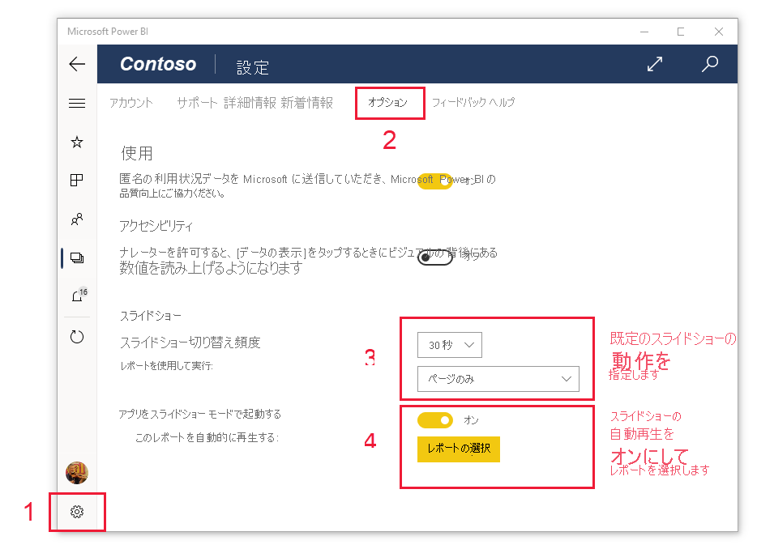

# Surface Hub と Windows 10 デバイスで、プレゼンテーション モードでレポートとダッシュボードを表示する
Windows 10 デバイスと Surface Hub で、プレゼンテーション モードを使用し、レポートとダッシュボードを全画面表示できます。 プレゼンテーション モードは、会議やカンファレンスで、またはオフィスの専用プロジェクターで Power BI を表示する場合や、小さい画面上の領域を最大化するためだけにも役立ちます。

プレゼンテーション モードの場合:
* すべての "クロム" (ナビゲーション バーやメニュー バーなど) は表示されなくなり、レポート内のデータに集中しやすくなります。
* 操作ツール バーを使用できるようになり、データと対話したり、プレゼンテーションを制御したりできます。
* ページ、ブックマーク、またはページとブックマークの両方を自動的に順番に表示する、スライドショーを再生できます。

>[!NOTE]
>**Windows 10 Mobile を使用するスマートフォン**に対する Power BI モバイル アプリのサポートは、2021 年 3 月 16 日に廃止されます。 [詳細情報](https://go.microsoft.com/fwlink/?linkid=2121400)

## プレゼンテーション モードを使用する
Power BI モバイル アプリで **[全画面表示]** アイコンをタップすると、全画面表示モードに切り替わります。
![[全画面表示] アイコン](././media/mobile-windows-10-app-presentation-mode/power-bi-full-screen-icon.png) アプリのクロムが消え、画面の下部または右側と左側 (画面のサイズによって変わります) に操作ツール バーが表示されます。

このツール バーからタップして、次の操作を実行できます。

|||
|-|-|
|![[戻る] アイコン](./media/mobile-windows-10-app-presentation-mode/power-bi-windows-10-presentation-back-icon.png)|前のページに**戻ります**。 アイコンを長押しすると、階層リンク ウィンドウがポップアップ表示され、レポートやダッシュボードを含むフォルダーに移動できます。|
||プレゼンテーション内のレポートの別のページに**ページを切り替えます**。|
||**ブックマークを適用**して、そのブックマークによってキャプチャされるデータの特定のビューを表示します。 個人用とレポートの両方のブックマークを適用できます。|
||Surface ペンを使ってレポート ページ上に描画したり、注釈を付けたりするときの**インクの色を選択します**。|
||Surface ペンを使ってレポート ページ上に描画したり、注釈を付けたりするために作成した**インク マークを消します**。          |
||**既定のビューにリセット**し、プレゼンテーション中に行ったすべてのフィルター、スライサー、またはその他のデータ ビューの変更をクリアします。|
|![[共有] アイコン](./media/mobile-windows-10-app-presentation-mode/power-bi-windows-10-share-icon.png)|プレゼンテーション ビューの画像を同僚と**共有します**。 この画像には、プレゼンテーション中に Surface ペンで書いたすべての注釈が含まれます。|
||レポートを**更新します**。|
|![[再生] アイコン](./media/mobile-windows-10-app-presentation-mode/power-bi-windows-10-presentation-play-icon.png)|**スライドショーを再生します**。操作バーを非表示にして、スライドショーを開始します。 セレクターを使用すると、ページ、ブックマーク、またはページとブックマークの両方の間での自動切り替えを選択できます。 既定では、スライドショーでは 30 秒ごとに自動的にページが切り替わります。 これらの設定は、[ **[設定] > [オプション]** ](#slideshow-settings) で変更できます。 スライドショーについての[詳細情報](#slideshows)を参照してください|
||プレゼンテーション モードを**終了します**。|
|![[検索] アイコン](./media/mobile-windows-10-app-presentation-mode/power-bi-windows-10-presentation-search-icon.png)|Power BI 内の他の成果物を**検索します**。|

ツール バーを切り離し、画面上の任意の場所にドラッグ アンド ドロップできます。 これは大きな画面の場合に便利です。レポートの特定の領域に集中的に取り組むとき、その隣にツールを配置します。 ツール バーを指で触れ、レポート キャンバスまでスワイプします。

## スライドショー

スライドショーを再生して、自動的にプレゼンテーションを順番に表示することができます。 ページ、ブックマーク、またはページとブックマークの両方を順番に表示するようにスライドショーを設定できます。

操作ツール バーの **[再生]** ボタンを選択すると、スライドショーが開始します。 コントローラーが表示され、スライドショーを一時停止したり、再生されている内容 (ページ、ブックマーク、またはページとブックマークの両方) を変更したりできます。

 コントローラーには、現在表示されているビュー (ページまたはブックマークとページ) の名前が表示されます。 上の図では、**Sales** という名前のレポート内で、現在 **Sales Performance** ページ上の **Asia Pacific** ブックマークが表示されていることを確認できます。

### スライドショーの設定

既定では、スライドショーでは 30 秒ごとに 1 回ページが切り替わります。 これらの既定の設定を変更するには、次に示すように、 **[設定] > [オプション]** の順に移動します。

## 次の手順
* [Power BI サービスから全画面表示モードでダッシュボードとレポートを表示する](../end-user-focus.md)
* わからないことがある場合は、 [Power BI コミュニティで質問してみてください](https://community.powerbi.com/)。
