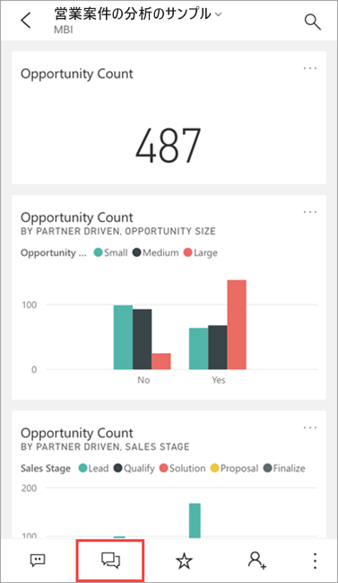
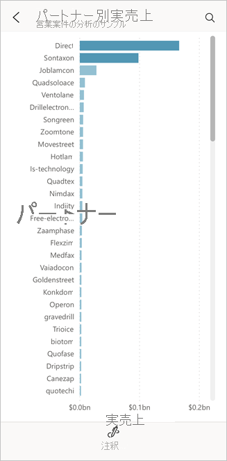
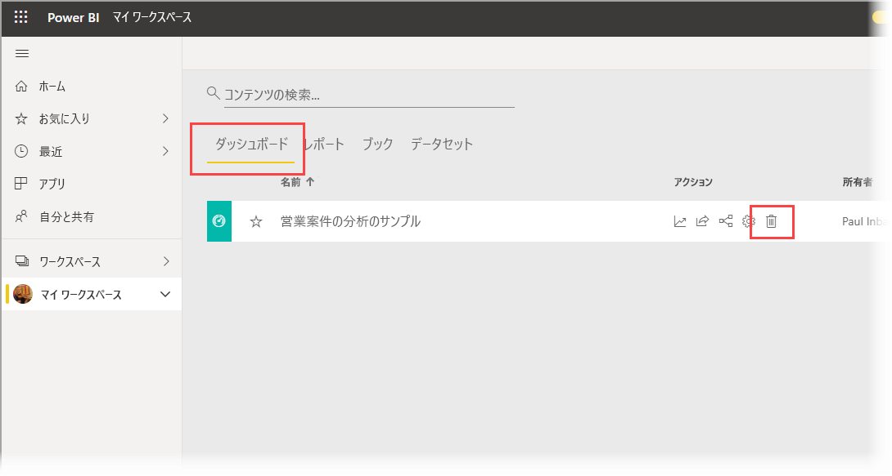
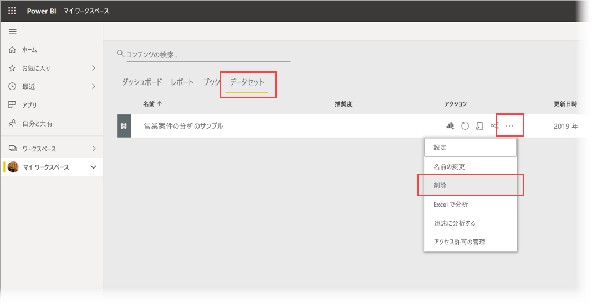

# チュートリアル:Power BI iOS アプリの Q&A 仮想アナリストでデータについて質問する

データについて学習する最も簡単な方法は、自分の言葉でデータについて質問することです。 このチュートリアルでは、iPad または iPhone で Microsoft Power BI モバイル アプリの Q&A 仮想アナリストを使用して、サンプル データについて質問したり、おすすめの分析情報を見たりします。 

適用対象:

|  |  |
|:--- |:--- |
| iPhone |iPad |

Q&A 仮想アナリストは、[Power BI サービス](https://powerbi.com)の基になる Q&A データにアクセスする対話型の BI エクスペリエンスです。 それはデータの分析情報を示します。質問は、キー入力することも、音声入力することもできます。

このチュートリアルでは、次のことを行います。

> [!div class="checklist"]
> * iOS 用 Power BI モバイル アプリをインストールします
> * Power BI のサンプル ダッシュボードとレポートをダウンロードします
> * モバイル アプリがどのようなおすすめ分析情報を提案するかを見ます

## 前提条件

* **Power BI にサインアップする**:Power BI にサインアップしていない場合は、[無料の試用版にサインアップ](https://app.powerbi.com/signupredirect?pbi_source=web)してください。
* **Power BI for iOS アプリをインストールする**:Apple App Store から iPad、iPhone、iPod Touch に [iOS アプリをダウンロード](https://apps.apple.com/app/microsoft-power-bi/id929738808)します。 次のバージョンが Power BI for iOS アプリをサポートしています。
  * iOS 11 以降の iPad。
  * iOS 11 以降の iPhone 5 以上。 
  * iOS 11 以降の iPod Touch。
* **サンプル データをダウンロードする**:最初のステップでは、Power BI サービスの**営業案件の分析サンプル**をダウンロードします。 この方法については、「[Power BI サービスのマイ ワークスペースにサンプルをダウンロードする](./mobile-apps-download-samples.md)」を参照してください。

前提条件を満たし、サンプル データをダウンロードしたら、お使いの iOS デバイスでサンプルを表示できます。

## おすすめのインサイトを試す
1. iPhone または iPad で Power BI アプリを開き、Power BI アカウントの資格情報 (ブラウザーの Power BI サービスで使ったものを同じです) を使ってサインインします。

2. ホーム ページのナビゲーション バーで **[ワークスペース]** アイコンをタップします。

    

3. [ワークスペース] ページが開いたら、 **[マイ ワークスペース]** をタップし、 **[営業案件の分析サンプル]** ダッシュボードをタップして開きます。

3. [営業案件の分析サンプル] ダッシュボードで、アクション メニューの Q&A 仮想アナリスト アイコンをタップします。

    

    Q&amp;A 仮想アナリストにより、作業を開始するいくつかの候補が提供されます。

    

3. **[featured insights]\(おすすめのインサイト\)** をタップします。

4. Q&A 仮想アナリストがいくつかインサイトを提案します。 右にスクロールして、 **[Insight 2]\(インサイト 2\)** をタップします。

    

   Q&A 仮想アナリストがインサイト 2 を表示します。

    

5. グラフをタップして、フォーカス モードで開きます。

    

6. 左上隅にある矢印をタップして、Q&A 仮想アナリスト エクスペリエンスに戻ります。

## リソースをクリーンアップする

チュートリアルが終わったら、営業案件の分析のサンプルのダッシュボード、レポート、データセットを削除してもかまいません。

1. Power BI サービス ([Power BI サービス](https://app.powerbi.com)) を開いてサインインします。

2. ナビゲーション ペインで、 **[マイ ワークスペース]** を選択します。

3. [ダッシュボード] タブをクリックし、[営業案件の分析サンプル] 行で [ごみ箱] をクリックします。

    

    今度は [レポート] タブを選択し、同じ操作を行います。

4. 今度は [データセット] タブを選択し、 **[その他のオプション]** (...) をクリックし、 **[削除]** を選択します。

    

## 次の手順

iOS 用 Power BI モバイル アプリで Q&A 仮想アナリストを試してみました。 Power BI サービスでの Q&A についてさらに学習してください。
> [!div class="nextstepaction"]
> [Power BI での Q&A](../end-user-q-and-a.md)