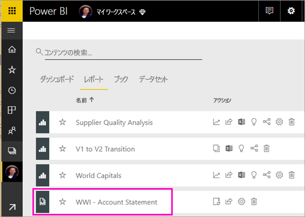
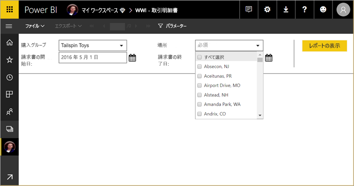
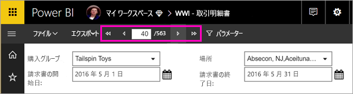
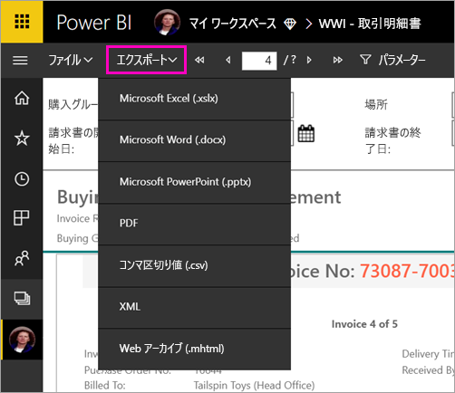

# ページ分割されたレポートを Power BI サービスで表示する

この記事では、ページ分割されたレポートを Power BI サービスに対して表示する方法について説明します。 ページ分割されたレポートは、レポート ビルダーで作成され、Premium 容量内のワークスペースにアップロードされるレポートです。 ワークスペース名の横にあるダイヤモンド形のアイコン  を探します。 

ページ分割されたレポートには固有のアイコンがあります。 。

次に示す複数の形式でページ分割されたレポートをエクスポートすることもできます。 

- Microsoft Excel
- Microsoft Word
- Microsoft PowerPoint
- PDF
- コンマ区切り値
- XML
- Web アーカイブ (.mhtml)

## ページ分割されたレポートを表示する

1. ワークスペースで、ページ分割されたレポートを選択します。

    

2. レポートにパラメーターが指定されている場合は、次の図に示すように、最初に開いたときにレポートが表示されない可能性があります。 パラメーターを選択し、 **[レポートの表示]** を選択します。 

     

    パラメーターはいつでも変更することができます。

1. ページの上部にある矢印を選択するか、ボックスにページ番号を入力して、レポートのページを移動します。
    
   

4. **[エクスポート]** を選択して、ページ分割されたレポートのエクスポート形式を探します。

    

## 次のステップ

[Power BI サービスでのページ分割されたレポート](end-user-paginated-report.md)
