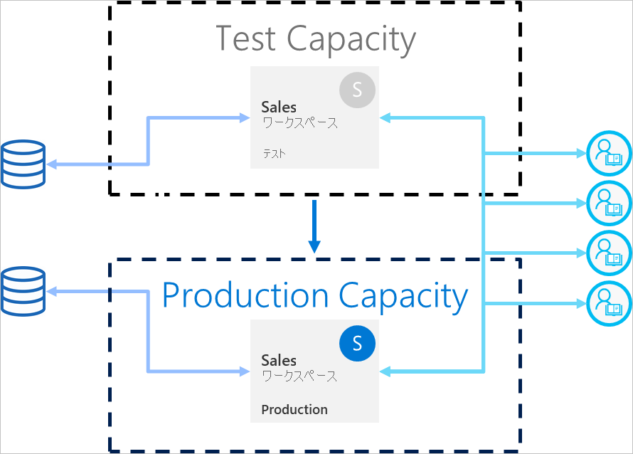

# デプロイ パイプラインのベスト プラクティス

この記事では、コンテンツのライフサイクルを通してコンテンツを管理する BI 作成者向けのガイダンスを提供します。 ここでは、BI コンテンツ ライフサイクルの管理ツールとしてデプロイ パイプラインを利用することに重点を置いています。

この記事は、次の 4 つのセクションに分かれています。

* **コンテンツの準備** - ライフサイクル管理のためにコンテンツを準備します。

* **開発** - デプロイ パイプラインの開発ステージでコンテンツを作成するための最適な方法について説明します。

* **テスト** - デプロイ パイプラインのテスト ステージを使用して環境をテストする方法について説明します。

* **運用** - コンテンツを使用できるようにする際は、デプロイ パイプラインの運用ステージを利用します。

## コンテンツの準備

コンテンツを、そのライフサイクル全体にわたって継続的に管理するために準備します。 次のどの手順を実行する場合も、このセクションの情報を必ず確認してください。

* コンテンツを運用にリリースする

* 特定のワークスペースのデプロイ パイプラインの使用を開始する

* 作業を公開する

### 各ワークスペースを完全な分析のパッケージとして扱う

理想的には、ワークスペースには、組織の 1 つの側面 (部署、事業単位、プロジェクト、または縦組織) の完全なビューが含まれている必要があります。 これにより、さまざまなユーザーのアクセス許可を管理しやすくなり、ワークスペース全体のコンテンツ リリースを計画的なスケジュールに従って制御できるようになります。  

組織全体で使用される[一元化されたデータセット](../connect-data/service-datasets-across-workspaces.md)を使用している場合は、次の 2 種類のワークスペースを作成することをお勧めします。

* **モデリングとデータ ワークスペース** - これらのワークスペースには、すべての一元化されたデータセットが含まれます

* **レポート ワークスペース** - これらのワークスペースには、すべての依存レポートとダッシュボードが含まれます

### アクセス許可モデルを計画する

デプロイ パイプラインは、独自の[アクセス許可](deployment-pipelines-process.md#permissions)を持つ Power BI オブジェクトです。 さらに、このパイプラインには、独自のアクセス許可を持つワークスペースが含まれています。

セキュリティで保護された簡単なワークフローを実装するには、パイプラインの各部分にアクセスできるユーザーを計画します。 いくつかの考慮事項を次に示します。

* パイプラインにアクセスできるユーザーは誰か

* パイプラインへのアクセス許可を持つユーザーが各ステージで実行できる操作は何か

* テスト ステージでコンテンツを確認するユーザーは誰か

* テスト ステージのレビュー担当者はパイプラインにアクセスできる必要があるかどうか

* 運用ステージへのデプロイを監視するユーザーは誰か

* どのワークスペースを割り当てているのか

* ワークスペースを割り当てるステージはどれか

* 割り当てようとしているワークスペースのアクセス許可を変更する必要があるかどうか

### 異なる複数のステージを異なるデータベースに接続する

運用データベースは常に安定し、使用可能である必要があります。 開発データセットまたはテスト データセットの BI 作成者によって生成されたクエリで過負荷にならないようにすることをお勧めします。 開発用とテスト用に、個別のデータベースを構築します。 これにより、運用データが保護され、運用データのボリューム全体で開発データベースが過負荷になることがなくなります。過負荷により、処理速度が低下する可能性があります。

>[!NOTE]
>組織で[共有の一元化されたデータセット](../connect-data/service-datasets-share.md)を使用している場合は、この推奨事項をスキップできます。

### モデルでパラメーターを使用する

Power BI サービスでデータセットのデータ ソースを編集することはできないため、静的接続文字列を使用する代わりに[パラメーター](/power-query/power-query-query-parameters)を使用して、インスタンス名やデータベース名などの接続の詳細情報を格納することをお勧めします。 これにより、Power BI サービス Web ポータルを使用して、または後のステージで [API](/rest/api/power-bi/datasets/updateparametersingroup) 使用して接続を管理できます。

デプロイ パイプラインでは、開発、テスト、および運用の各ステージに特定の値を設定するようにパラメーター ルールを構成できます。

接続文字列にパラメーターを使用しない場合は、データ ソース ルールを定義して、特定のデータセットの接続文字列を指定できます。 ただし、これはデプロイ パイプラインのすべてのデータ ソースでサポートされているわけではありません。 データ ソースのルールを構成できることを確認するには、[データセット ルールの制限事項](deployment-pipelines-get-started.md#dataset-rule-limitations)に関するセクションを参照してください。

パラメーターには、クエリ、フィルター、およびレポートに表示されるテキストを変更するなど、追加の用途があります。

## 開発

このセクションでは、デプロイ パイプラインの開発ステージでの作業に関するガイダンスを提供します。

### Power BI Desktop を使用したレポートとデータセットの編集

ローカルの開発環境として Power BI Desktop を検討してください。 Power BI Desktop を使用すると、レポートとデータセットへの更新を試して調査し、確認することができます。 作業が完了したら、新しいバージョンを開発ステージにアップロードできます。 次の理由により、(Power BI サービスではなく) デスクトップで .pbix ファイルを編集することをお勧めします。

* 同じツールですべての変更が行われている場合は、同じ .pbix ファイルで他の作成者と共同作業する方が簡単です。

 * オンラインで変更を行い、.pbix ファイルをダウンロードしてから再度アップロードすると、レポートとデータセットが重複して作成されます。

* バージョン管理を使用して、.pbix ファイルを最新の状態に保つことができます。

### .pbix ファイルのバージョン管理

レポートとデータセットのバージョン履歴を管理する場合は、[Power BI の OneDrive との自動同期](../connect-data/service-connect-to-files-in-app-workspace-onedrive-for-business.md)を使用します。 これにより、ファイルは常に最新バージョンで更新されます。 また、必要に応じて古いバージョンを取得することもできます。

>[!NOTE]
>OneDrive (または他のリポジトリ) との自動同期は、デプロイ パイプラインの開発ステージの .pbix ファイルでのみ使用してください。 デプロイ パイプラインのテスト ステージおよび運用ステージでは、.pbix ファイルを同期しないでください。 これにより、パイプライン全体でコンテンツをデプロイする際に問題が発生します。

### レポートとダッシュボードの開発からモデル開発を分離する

エンタープライズ規模のデプロイでは、データセットの開発とレポートとダッシュボードの開発を分離することをお勧めします。 レポートまたはデータセットにのみ変更を昇格させるには、デプロイ パイプラインの [選択的デプロイ] オプションを使用します。  

このアプローチは、データセットとレポート用に個別の .pbix ファイルを作成することにより、Power BI Desktop から開始する必要があります。 たとえば、データセット .pbix ファイルを作成し、開発ステージにアップロードすることができます。 その後、レポート作成者は、レポートに対してのみ新しい .pbix を作成し、ライブ接続を使用して[公開されたデータセットにこれを接続する](../connect-data/service-datasets-discover-across-workspaces.md)ことができます。 この手法を使用すると、個別の作成者がモデリングと視覚化を別々に処理し、個別に運用環境にデプロイすることができます。

[共有データセット](../connect-data/service-datasets-share.md)があれば、このメソッドを複数のワークスペースで使用することもできます。

### XMLA の読み取り/書き込み機能を使用してモデルを管理する

モデル開発をレポートおよびダッシュボード開発から分離することで、ソース管理、差分変更のマージ、自動プロセスなどの高度な機能を使用できるようになります。 これらの変更は、完成したコンテンツをテスト ステージおよび運用ステージにデプロイできるように、開発ステージで行う必要があります。 これにより、変更は他の依存アイテムとの統合プロセスを経て、運用ステージにデプロイされます。

XMLA の r/w 機能を使用して、外部ワークスペースで[共有データセット](../connect-data/service-datasets-share.md)を管理することにより、モデリング開発を視覚化から分離できます。 共有データセットは、複数のパイプラインで管理されているさまざまなワークスペースの複数のレポートに接続できます。

## テスト

このセクションでは、デプロイ パイプラインのテスト ステージでの作業に関するガイダンスを提供します。

### 運用環境をシミュレートする

新しいレポートまたはダッシュボードに問題がないことを確認する以外にも、エンド ユーザーの視点からどのように動作するかを確認することが重要です。 デプロイ パイプラインのテスト ステージでは、テスト目的で運用環境をシミュレートすることができます。

テスト環境では、次の 3 つの要素に対応していることを確認してください。

* データ ボリューム

* 使用量ボリューム

* 運用環境と同様の容量

テスト時には、運用ステージと同じ容量を使用できます。 ただし、これによって、ロード テスト中に運用が不安定になる可能性があります。 運用が不安定になることを回避するには、テストに運用容量のリソースに似た別の容量を使用します。 余分なコストを回避するには、[Azure A 容量](../developer/embedded/azure-pbie-create-capacity.md)を使用して、テスト時間に対してのみ支払いを行うことができます。

### データセット ルールを実際のデータ ソースで使用する

テスト ステージを使用して実際のデータ使用状況をシミュレートしている場合は、開発データ ソースとテスト データ ソースを分離することをお勧めします。 開発データベースは比較的小さくする必要があるため、テスト データベースは運用データベースにできるだけ類似したものにする必要があります。 [データ ソース ルール](deployment-pipelines-get-started.md#step-4---create-dataset-rules)を使用すると、テスト ステージのデータ ソースを切り替えることができます。

データ ソースからインポートするデータの量を制御することは、テスト ステージで運用データ ソースを使用している場合に便利です。 これを行うには、Power BI Desktop でデータ ソース クエリにパラメーターを追加します。 パラメーター ルールを使用して、インポートされるデータの量を制御するか、パラメーターの値を編集します。
容量を過負荷にしたくない場合は、この方法を使用することもできます。

### パフォーマンスの計測

運用ステージをシミュレートする場合は、[レポートの負荷と相互作用](../guidance/monitor-report-performance.md)を確認し、加えた変更によって影響を受けるかどうかを確認します。

また、[容量の負荷を監視](../admin/service-admin-premium-monitor-capacity.md)して、運用環境に至る前に極端な負荷をキャッチできるようにする必要があります。  

>[!NOTE]
>更新を運用ステージにデプロイした後、再び容量の負荷を監視することをお勧めします。

### 関連アイテムの確認

関連する時間は、データセットまたはレポートの変更によって影響を受ける可能性があります。 テスト中に、変更が既存のアイテムに影響を与えたり、既存のアイテムのパフォーマンスが低下したりしないことを確認します。これは、更新されたアイテムによって異なります。

ワークスペースの[系列ビュー](../collaborate-share/service-data-lineage.md)を使用して、関連するアイテムを簡単に見つけることができます。

### アプリをテストする

アプリを通じてエンド ユーザーにコンテンツを配布する場合は、アプリの新しいバージョンを確認してから、運用環境にデプロイしてください。 各デプロイ パイプライン ステージには独自のワークスペースがあるため、開発ステージおよびテスト ステージにアプリを簡単に公開および更新できます。 これにより、エンド ユーザーの視点からアプリをテストできます。

>[!IMPORTANT]
>デプロイ プロセスには、アプリのコンテンツや設定の更新は含まれません。 コンテンツまたは設定に変更を適用するには、必要なパイプライン ステージでアプリを手動で更新する必要があります。

## 実稼働

このセクションでは、デプロイ パイプラインの運用ステージに関するガイダンスを提供します。

### 運用環境にデプロイできるユーザーを管理する

運用環境へのデプロイは慎重に行う必要があるため、特定の担当者のみがこの繊細な操作を管理できようにすることをお勧めします。 しかし、特定のワークスペースのすべての BI 作成者にパイプラインへのアクセス許可を付与したい場合もあります。 これは、運用[ワークスペースのアクセス許可](deployment-pipelines-process.md#permissions)を使用して管理できます。  

コンテンツをステージ間でデプロイするには、両方のステージに対してメンバーまたは管理者のアクセス許可を持っている必要があります。 運用環境にデプロイするユーザーにのみ、運用ワークスペースのアクセス許可を付与してください。 他のユーザーは、運用ワークスペースの共同作成者またはビューアーのロールを持つことができます。 これらのユーザーは、パイプライン内のコンテンツを表示することはできますが、デプロイすることはできません。

さらに、コンテンツ作成プロセスの一部であるユーザーのみにパイプラインのアクセス許可を有効にすることで、パイプラインへのアクセスを制限する必要があります。

### 運用ステージの可用性を保証するルールを設定する

[データセット ルール](deployment-pipelines-get-started.md#step-4---create-dataset-rules)は、運用環境のデータが常に接続され、ユーザーが使用できるようにするための強力な方法です。 データセット ルールが適用されると、エンドユーザーが邪魔されることなく関連情報を見ることができることを保証しながら、デプロイを実行できます。

データ ソースとデータセットで定義されているパラメーターに対して、運用データセット ルールが設定されていることを確認してください。

### 運用アプリを更新する

パイプラインでのデプロイによりワークスペースのコンテンツは更新されますが、関連付けられているアプリは自動的に更新されません。 コンテンツの配布にアプリを使用している場合は、エンド ユーザーがすぐに最新バージョンを使用できるようにするため、運用環境にデプロイした後にアプリを更新することを忘れないでください。  

### コンテンツのクイック修正

クイック修正が必要なバグが運用環境に存在する場合でも、新しい .pbix バージョンを運用ステージに直接アップロードしたり、Power BI サービスでオンラインで変更したりすることは避けてください。 これらのステージにコンテンツが既に存在する場合、テストおよび開発ステージへ逆方向にデプロイすることはできません。 また、最初にテストを行わずに修正プログラムをデプロイすることは、好ましくありません。 したがって、この問題を適切に処理するには、開発ステージで修正を行い、それを他のデプロイ パイプライン ステージにプッシュします。 これにより、運用環境にデプロイする前に、修正プログラムが動作するかどうかを確認できます。 パイプライン全体でのデプロイには数分しかかかりません。

## 次の手順

>[!div class="nextstepaction"]
>[デプロイ パイプラインの概要](deployment-pipelines-overview.md)

>[!div class="nextstepaction"]
>[デプロイ パイプラインの使用を開始する](deployment-pipelines-get-started.md)

>[!div class="nextstepaction"]
>[デプロイ パイプライン プロセスを理解する](deployment-pipelines-process.md)

>[!div class="nextstepaction"]
>[デプロイ パイプラインのトラブルシューティング](deployment-pipelines-troubleshooting.md)