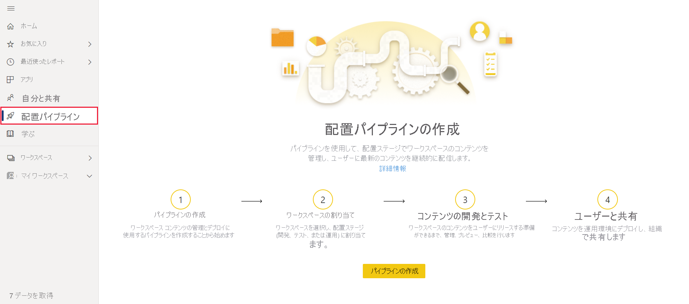
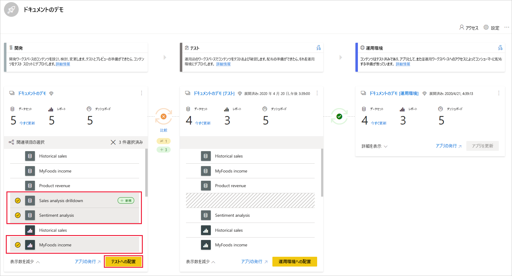
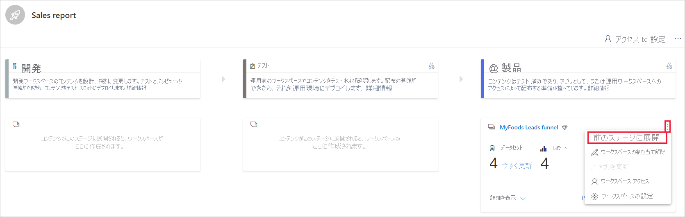
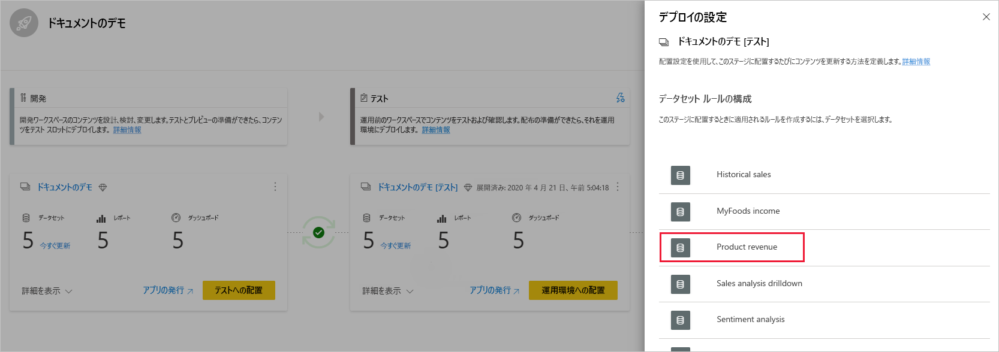
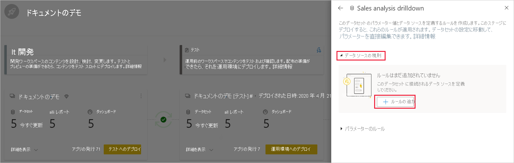

# デプロイ パイプラインの使用を開始する (プレビュー)

この記事では、デプロイ パイプラインを使用するために必要な基本設定について説明します。

## デプロイ パイプラインへのアクセス

次の条件が満たされている場合、デプロイ パイプラインの機能にアクセスできます。

* Power BI の [Pro ユーザー](../admin/service-admin-purchasing-power-bi-pro.md)である

* Premium 容量を持つ組織に属している

* [新しいワークスペース エクスペリエンス](../collaborate-share/service-create-the-new-workspaces.md)の管理者である

>[!NOTE]
> また、既にパイプラインを作成している場合や、パイプラインが共有されている場合は、[デプロイ パイプライン] ボタンが表示されます。

## 手順 1 - デプロイ パイプラインの作成

デプロイ パイプラインを作成するには、次の手順を実行します。

1. Power BI サービスのナビゲーション ウィンドウで、 **[デプロイ パイプライン]** を選択し、 **[パイプラインの作成]** をクリックします。

2. *[デプロイ パイプラインの作成]* ダイアログ ボックスで、パイプラインの名前と説明を入力し、 **[作成]** をクリックします。

パイプラインを作成したら、他のユーザーと共有したり、パイプラインを削除したりできます。 パイプラインを他のユーザーと共有すると、そのユーザーに[パイプラインへのアクセス許可](deployment-pipelines-process.md#user-with-pipeline-access)が与えられます。 パイプラインのアクセス許可が与えられたユーザーは、パイプラインを表示、共有、編集、および削除できます。

## 手順 2 - デプロイ パイプラインへのワークスペースの割り当て

パイプラインを作成したら、管理するコンテンツをパイプラインに追加する必要があります。 パイプラインにコンテンツを追加するには、パイプライン ステージにワークスペースを割り当てます。 ワークスペースはどのステージにも割り当てることができます。 

デプロイ パイプラインには、1 つのワークスペースを割り当てることができます。 デプロイ パイプラインでは、パイプラインのさまざまなステージで使用するワークスペース コンテンツの複製が作成されます。

デプロイ パイプラインにワークスペースを割り当てるには、次の手順に従います。

1. 新しく作成されたデプロイ パイプラインで、 **[ワークスペースの割り当て]** をクリックします。

2. *[ワークスペースを選択する]* ドロップダウン メニューで、パイプラインに割り当てるワークスペースを選択します。

3. ワークスペースを割り当てるステージを選択します。

### ワークスペースの割り当ての制限事項

* ワークスペースは、[新しいワークスペース エクスペリエンス](../collaborate-share/service-create-the-new-workspaces.md)である必要があります。

* このワークスペースの管理者である必要があります。

* このワークスペースが、他のパイプラインに割り当てられていないことを確認します。

* ワークスペースは、 [premium 容量](../admin/service-premium-what-is.md)に存在する必要があります。

* パイプライン ステージに [Power BI サンプル](../create-reports/sample-datasets.md)を含むワークスペースを割り当てることはできません。

>[!NOTE]
>デプロイ パイプラインで使用できるワークスペースのみが、選択できるワークスペースの一覧に表示されます。

## 手順 3 - 空のステージにデプロイする

ソース ワークスペースのメンバーまたは管理者である [Pro ユーザー](../admin/service-admin-purchasing-power-bi-pro.md)は、空のステージ (コンテンツが含まれていないステージ) にコンテンツをデプロイできます。 デプロイを完了するには、ワークスペースが容量に存在している必要があります。

空のステージにコンテンツをデプロイする場合、アイテム間のリレーションシップは維持されます。 たとえば、ソース ステージのデータセットにバインドされているレポートは、そのデータセットと共に複製され、その複製はターゲット ワークスペースでも同様にバインドされます。

デプロイが完了したら、データセットを更新します。 詳細については、[空のステージへのコンテンツのデプロイ](deployment-pipelines-process.md#deploying-content-to-an-empty-stage)に関する記事を参照してください。

### すべてのコンテンツをデプロイする

デプロイ元のステージを選択し、[デプロイ] ボタンをクリックします。 デプロイ プロセスでは、重複するワークスペースがターゲット ステージに作成されます。 このワークスペースには、現在のステージに存在するすべてのコンテンツが含まれます。

### 選択的デプロイ

特定のアイテムのみをデプロイするには、 **[詳細を表示]** リンクをクリックして、デプロイするアイテムを選択します。 [デプロイ] ボタンをクリックすると、選択したアイテムのみが次のステージにデプロイされます。

ダッシュボード、レポート、およびデータセットは関連付けられており、依存関係があるため、[select related]\(関連アイテムの選択\) ボタンを使用して、これらのアイテムが依存しているすべてのアイテムを確認できます。 たとえば、次のステージにレポートをデプロイする場合は、[select related]\(関連アイテムの選択\) ボタンをクリックすると、レポートが接続されているデータセットにマークが付けられ、両方が一度にデプロイされるため、レポートが中断されません。

>[!NOTE]
> * レポートまたはダッシュボードが依存しているアイテムがデプロイ先のステージに存在しない場合、そのレポートまたはダッシュボードを次のステージにデプロイすることはできません。
> * データセットを使用せずにレポートまたはダッシュボードをデプロイすると、予期しない結果になることがあります。 これは、ターゲット ステージのデータセットが変更され、デプロイ元のステージにあるデータセットと同じではなくなった場合に発生する可能性があります。

### 逆方向のデプロイ

前のステージにデプロイすることもできます。たとえば、既存のワークスペースを運用ステージに割り当ててから、最初にテスト ステージにデプロイし、次に開発用のステージにデプロイします。

前のステージへのデプロイは、前のステージのコンテンツが空の場合にのみ機能します。 前のステージにデプロイする場合、特定のアイテムを選択することはできません。 ステージ内のすべてのコンテンツがデプロイされます。

## 手順 4 - データセット ルールを作成する

デプロイ パイプラインで作業する場合、異なるステージで構成が異なる場合があります。 たとえば、各ステージは異なるデータベースまたは異なるクエリ パラメーターを持つことがあります。 開発ステージでは、データベースからサンプル データをクエリしますが、テスト ステージおよび運用ステージではデータベース全体に対してクエリを実行します。

パイプラインのステージ間でコンテンツをデプロイする場合、データセット ルールを構成することで、一部の設定をそのまま維持しながらコンテンツを変更できます。

データセット ルールは、各データセットのデータ ソースとパラメーターに対して定義されます。 これらは、特定のデータセットのデータ ソースまたはパラメーターの値を決定します。 たとえば、運用ステージのデータセットが運用データベースを指すようにするには、このためのルールを定義します。 このルールは、適切なデータセットの下、運用ステージで定義されます。 ルールが定義されると、テストから運用にデプロイされたコンテンツは、データセット ルールで定義されている値を継承し、ルールが変更されず、かつ有効である限り、常に適用されます。

>[!NOTE]
> データセット ルールは、ソースとターゲットのデータ ソースの種類が同じ場合にのみ機能します。

### データセット ルールの作成

1. データセット ルールを作成するパイプライン ステージで、 **[Deployment settings]\(デプロイの設定\)** をクリックします。

    

2. [Deployment settings]\(デプロイの設定\) ウィンドウで、ルールを作成するデータセットを選択します。

    

3. 作成するルールの種類を選択し、リストを展開してから **[ルールの追加]** をクリックします。

     

### データセット ルールの種類

作成できるルールには、次の 2 種類があります。

* **データ ソース ルール** データ ソースの一覧は、ソース パイプライン ステージのデータセットから取得されます。 データ ソースの一覧から、置換するデータ ソースを選択します。 次のいずれかの方法を使用して、ソース ステージの値に置き換わる値を選択します。

    1. 一覧から選択します。

    2. **[その他]** をクリックし、新しいデータ ソースを手動で追加します。 同じ種類のデータ ソースにのみ変更できます。

* **パラメーターのルール** パラメーターの一覧からパラメーターを選択します。現在の値は表示されています。 値を、各デプロイ後に有効にする値に編集します。

### データセット ルールの制限事項

* データセット ルールを作成するには、データセットの所有者である必要があります。

* データセット ルールを開発ステージで作成することはできません。

* アイテムが削除されると、そのルールも削除されます。 これらのルールを復元することはできません。

* ルールで定義されたデータ ソースまたはパラメーターがソース データセットから変更または削除された場合、ルールは無効になり、デプロイは失敗します。

* データ ソース ルールは、次のデータ ソースに対してのみ定義できます。
    * Azure Analysis Services
    * SQL Server Analysis Services (SSAS)
    * Azure SQL Server
    * [データベースのインポート]
    * OData フィード
    * Oracle
    * SapHana (インポート モードでのみサポートされます。ダイレクト クエリ モードではサポートされません)
    * SharePoint
    * Teradata

    その他のデータ ソースについては、[パラメーターを使用してデータ ソースを構成する](deployment-pipelines-best-practices.md#use-parameters-in-your-model)ことをお勧めします。

## 手順 5 - 1 つのステージから別のステージへのコンテンツのデプロイ

パイプライン ステージにコンテンツを作成したら、次のステージにデプロイできます。 別のステージへのコンテンツのデプロイは、通常、パイプラインで何らかのアクションを実行した後に行われます。 たとえば、開発ステージでコンテンツに対して開発を行ったり、テスト ステージでコンテンツをテストしたりなどです。 ステージ間でコンテンツを移動するための一般的なワークフローは、開発からテスト、そしてテストから運用です。 このプロセスの詳細については、[既存のワークスペースにコンテンツをデプロイする](deployment-pipelines-process.md#deploy-content-to-an-existing-workspace)方法に関するセクションを参照してください。

コンテンツをデプロイ パイプラインの次のステージにデプロイするには、ステージの下部にある [デプロイ] ボタンをクリックします。

テスト ステージおよび運用ステージのカードを確認するときに、最後のデプロイ時間を確認できます。 これは、コンテンツがそのステージに最後にデプロイされた日時を示します。

デプロイ時間は、ステージが最後に更新されたときを確立するのに役立ちます。 また、テストと運用デプロイの間の時間を追跡する場合にも便利です。

## ステージの比較

2 つの連続したステージにコンテンツがある場合、コンテンツはコンテンツ アイテムのメタデータに基づいて比較されます。 この比較内容には、データの比較やステージ間の更新時間は含まれません。

 

2 つの連続したステージ間の相違点をすばやく視覚的に把握できるようにするため、ステージの間には比較用のアイコン インジケーターが表示されています。 比較インジケーターには、次の 2 つの状態があります。

* **緑色のインジケーター** – 両方のステージの各コンテンツ アイテムのメタデータは同じです。

* **オレンジ色のインジケーター** – 次の条件のいずれかが満たされた場合に表示されます。
    * 各ステージのコンテンツ アイテムの一部が、変更または更新されています (メタデータが異なります)。
    * ステージ間のアイテム数に違いがあります。

2 つの連続したステージが異なる場合は、オレンジ色の比較アイコンの下に **[比較]** リンクが表示されます。 リンクをクリックすると、[比較] ビューの両方のステージでコンテンツ アイテム リストが開きます。 比較ビューを使用すると、各パイプライン ステージのアイテム間の変更や相違点を追跡できます。 変更されたアイテムには、次のいずれかのラベルが付きます。

* **[New]\(新規\)** – ソース ステージの新しいアイテム。 これは、ターゲット ステージには存在しないアイテムです。 デプロイ後、このアイテムはターゲット ステージに複製されます。

* **[Different]\(差分あり\)** – ソースとターゲットの両方のステージに存在するアイテムで、最後のデプロイの後にいずれかのバージョンが変更されています。 デプロイ後、変更が行われた場所に関係なく、ターゲット ステージのアイテムがソース ステージのアイテムで上書きされます。

* **[Missing from]\(不足\)** – このラベルは、アイテムがソース ステージにはないが、ターゲット ステージには表示されていることを示します。

    >[!NOTE]
    >デプロイは、 *[Missing from]\(不足\)* しているアイテムには影響しません。

 

## コンテンツのオーバーライド

ソース ステージのコンテンツに変更を加えた後にデプロイすると、ターゲット ステージで変更した内容が上書きされます。 *[デプロイ]* をクリックすると、上書きされるアイテムの数を示す警告が表示されます。

[次のステージにコピーされるアイテム](deployment-pipelines-process.md#deployed-items)、および[コピーされないアイテム](deployment-pipelines-process.md#unsupported-items)の詳細については、[デプロイ プロセスについて理解する](deployment-pipelines-process.md)方法に関する記事を参照してください。

## 次の手順

>[!div class="nextstepaction"]
>[デプロイ パイプラインの概要](deployment-pipelines-overview.md)

>[!div class="nextstepaction"]
>[デプロイ パイプライン プロセスを理解する](deployment-pipelines-process.md)

>[!div class="nextstepaction"]
>[デプロイ パイプラインのトラブルシューティング](deployment-pipelines-troubleshooting.md)

>[!div class="nextstepaction"]
>[デプロイ パイプラインのベスト プラクティス](deployment-pipelines-best-practices.md)
