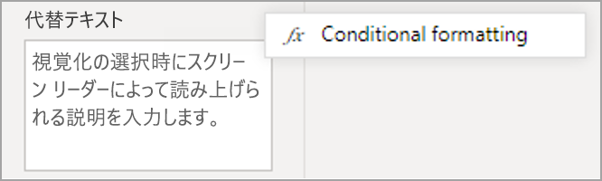
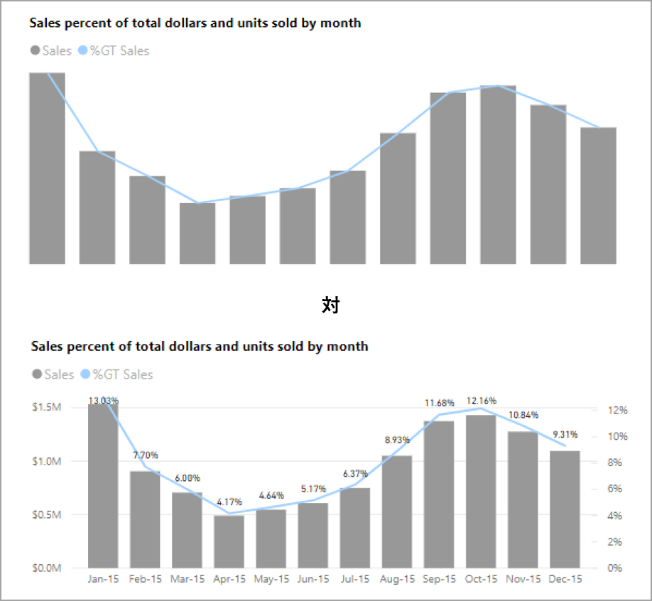
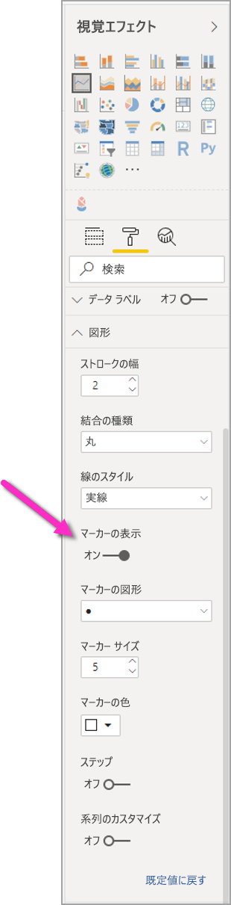
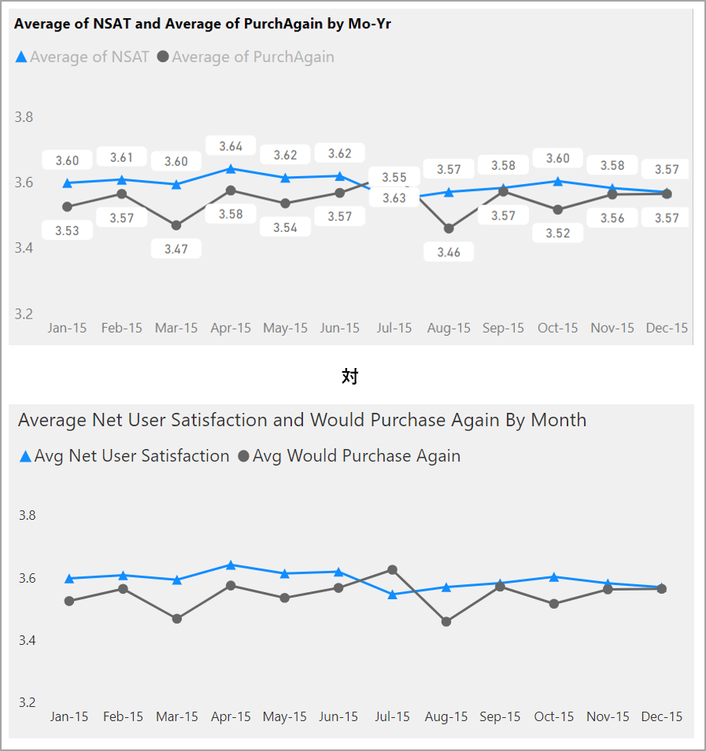
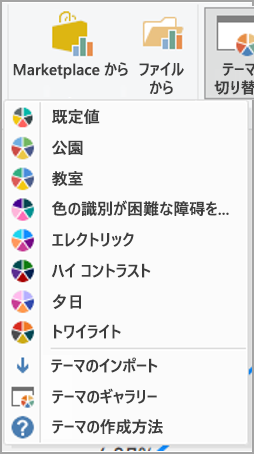

# アクセシビリティ対応の Power BI レポートを設計する
説得力のあるレポートを設計および作成しながら、アクセシビリティ対応の設計にすることもできます。 レポートを作成する場合は、対象者が誰であっても、特別な設計の種類に適合させる必要なく、可能な限り多くのユーザーが使用できるようにレポートを作成する必要があります。

この記事では、Power BI でアクセシビリティ対応のレポートを作成するためのアクセシビリティ機能とツールについて説明します。

一般的に、スクリーン リーダーで Power BI を使用する場合は、スキャン モードまたはブラウズ モードをオフにすることをお勧めします。

スクリーン リーダーを使用してレポートの作成プロセスを改善するには、コンテキスト メニューを使用します。 このメニューを使用すると、 **[フィールド]** リストで、ウェル内のフィールドを上または下に移動できます。 このメニューではまた、 **[凡例]** や **[値]** などの他のウェルにフィールドを移動することもできます。

![[フィールド] ウェルのコンテキスト メニューを使って、フィールドの上下移動や他の領域への移動を行うことができます](media/desktop-accessibility/accessibility-09.png)

## アクセシビリティ機能の種類

Power BI にはアクセシビリティ対応のレポートを作成する機能が用意されていますが、それらをレポートに組み込むかどうかはレポート作成者次第です。 この記事で説明するアクセシビリティ機能には、次の 3 つのカテゴリがあります。

* 組み込みのアクセシビリティ機能 (構成は不要)
* 組み込みのアクセシビリティ機能 (構成が必要)
* その他のヒントと考慮事項

以下のセクションでは、これらの各カテゴリについて説明します。

## 組み込みのアクセシビリティ機能

Power BI には、製品に組み込まれていて、レポート作成者が構成する必要のないアクセシビリティ機能が備わっています。 これらの機能は次のとおりです。

* キーボード ナビゲーション
* スクリーン リーダーの互換性
* ハイ コントラストの色のビュー
* フォーカス モード
* [データを表示します] テーブル

また、レポート使用エクスペリエンスに役立つ機能もあります。 これらの機能について説明する記事については、この記事の最後にある「[次の手順](#next-steps)」セクションを参照してください。

これらの組み込みアクセシビリティ機能のそれぞれについて見ていきましょう。 

### キーボード ナビゲーション

レポート作成者は、利用者がキーボードを使用してレポート内を移動できるかどうかを心配する必要はありません。 Power BI のビジュアルはすべてキーボードでナビゲート可能であり、レポート利用者は、ビジュアル内のデータ ポイントを調べたり、ページ タブを切り替えたり、クロス強調表示、フィルター処理、スライスなどの対話機能にアクセスしたりできます。

レポート利用者がレポート内を移動すると、レポート内でユーザーがいる場所を示すフォーカスが表示されます。 使用されているブラウザーによって、フォーカス モードの表示が異なる場合があります。

最も頻繁に使用されるキーボード ショートカットにアクセスするには、 *?* キーを押して キーボード ショートカット ダイアログを表示できます。 詳細については、この記事の最後にある「[次の手順](#next-steps)」セクションで、アクセシビリティの高いユーザー エクスペリエンスとキーボード ショートカットに関する記事をご覧ください。

### スクリーン リーダーの互換性

一般に、キーボード ナビゲーションを備えた Power BI 内のすべてのオブジェクトには、スクリーン リーダーとの互換性もあります。 レポート利用者がビジュアルに移動すると、スクリーン リーダーによって、タイトル、ビジュアルの種類、および設定されている場合は代替テキストが読み上げられます。

### ハイ コントラストの色のビュー

Power BI では、レポートに対するハイ コントラストがサポートされています。 Windows でハイ コントラスト モードを使用している場合、Power BI Desktop では、Windows で使用されているハイ コントラストのテーマが自動的に検出されて、その設定がレポートに適用されます。 Power BI サービスやその他の場所に発行する場合、ハイ コントラストの色はそのレポートに従います。

Power BI サービスでも、Windows 用に選択されているハイ コントラストの設定を検出しようとしますが、検出の効率と正確さは Power BI サービスに使用されているブラウザーによって異なります。 Power BI サービスでテーマを手動で設定する場合は、右上隅の **[ビュー] > [ハイ コントラストの色]** を選択して、レポートに適用するテーマを選択します。

### フォーカス モード
レポート利用者がダッシュボードでビジュアルを表示している場合、ビジュアルのコンテキスト メニューに移動して、 **[フォーカス モードで開く]** を選択することで、画面のより広い領域を占めるようにビジュアルを拡大できます。

### [データを表示します] テーブル
レポート利用者は、**Alt + Shift + F11** キーを押すことにより、ビジュアル内のデータを表形式で表示することもできます。 この表は、ビジュアルのコンテキスト メニューで **[データを表示します]** を選択した場合と似ていますが、スクリーン リーダー対応の表が表示されます。

![[データを表示します] テーブル](media/desktop-accessibility/accessibility-creating-reports-04.png)

## 構成が必要な組み込みのアクセシビリティ機能

Power BI には、製品に組み込まれていてレポート作成者が構成する必要のあるアクセシビリティ機能があります。  次のような機能があります。

* 代替テキスト
* タブ オーダー
* タイトルとラベル
* マーカー
* レポートのテーマ

## 代替テキスト

Alt テキスト (代替テキストの説明) は、レポート ページ上のビジュアルと画像の外観と機能をスクリーン リーダー ユーザーに説明するために使用されます。 レポート作成者は、レポートに意味のある情報を伝えるすべてのオブジェクトに、代替テキストを追加する必要があります。 代替テキストを提供すると、レポート利用者は、ビジュアル、画像、図形またはテキストボックスを見ることができなくても、ビジュアルが何を伝えるものであるか理解できるようになります。 Power BI Desktop レポートのすべてのオブジェクトには、(ビジュアルや図形などの) オブジェクトを選択して、 **[視覚化]** ペインで **[書式]** セクションを選択し、 **[全般]** を展開し、一番下までスクロールし、 **[代替テキスト]** テキスト ボックスに入力を行い、代替テキストを入力することができます。 **[代替テキスト]** テキスト ボックスには、250 文字の制限があります。

![[代替テキスト] ボックス](media/desktop-accessibility/accessibility-creating-reports-05.png)

代替テキストには、レポート利用者がビジュアルから得られる分析情報に関する情報が含まれている必要があります。 スクリーン リーダーでビジュアルのタイトルと種類が読み上げられるので、説明を入力するだけで済みます。 次のビジュアルの代替テキストの例を以下に示します。*売れた製品の色別のネット ユーザーの満足度は、製品のクラスによってさらに分類されます。*

Power BI のデータは動的なので、分析情報や特定のデータ ポイントの読み上げを静的な代替テキストに含めるのは適切ではない場合があることに注意してください。 動的な代替テキストを使用する場合は、代替テキストの条件付き書式について説明している次のセクションを参照してください。

### 代替テキストの条件付き書式

Power BI を優れたものにしている機能の 1 つは、そのデータが動的であることです。 DAX のメジャーと条件付き書式を使用して、動的な代替テキストを作成できます。 そのようにすると、スクリーン リーダーで、レポート利用者が見ているデータに固有の値を読み上げることができます。

### タブ オーダー
タブ オーダーを設定すると、ユーザーがレポートのビジュアルを視覚的に処理する方法と一致する順序で、キーボード ユーザーがレポート内を移動できるようにすることができます。 レポートに装飾的な図形や画像を含める場合は、タブ オーダーからそれらを削除する必要があります。 

タブ オーダーを設定するには、リボンの **[表示]** タブを選択し、 **[選択ウィンドウ]** ボタンを選択して、[選択項目] ペインを表示します。

![[選択項目] ペインを表示するための [表示] メニュー](media/desktop-accessibility/accessibility-creating-reports-08.png)

**[選択項目] ペイン**で、 **[タブ オーダー]** を選択すると、レポートの現在のタブ オーダーが表示されます。 オブジェクトを選択してから、上下の矢印ボタンを使用して階層内でオブジェクトを移動したり、マウスでオブジェクトを選択して、一覧内の適切な位置にドラッグしたりできます。 オブジェクトの横にある数字をクリックすると、オブジェクトがタブ オーダーから非表示になります。

![[選択項目] ペインでのタブ オーダー](media/desktop-accessibility/accessibility-creating-reports-09.png)

### タイトルとラベル
ビジュアルとレポート ページのタイトルは、レポート利用者のための重要なアクセシビリティ機能です。 レポートのタイトルでは、頭字語や専門用語を使用しないようにします。新しいユーザーまたは組織の外部にいるユーザーとレポートを共有した場合、用語や頭字語の意味がわからない可能性があります。 次の図では、タイトルに頭字語が含まれるビジュアル (左側) と、わかりやすいタイトルのビジュアル (右側) を示します。

ビジュアル内では、タイトル、軸ラベル、凡例値、およびデータ ラベルが読みやすく、理解しやすいことを確認します。 次の図を比べてください。最初の図には数値や説明がほとんどありませんが、2 番目の図には多数あります。

データ ラベルでは、ビジュアル内の系列ごとにラベルをオンまたはオフにしたり、系列の上または下にラベルを配置したりすることもできます。 データ ラベルは Power BI が最適と考える線の上または下の位置に表示されますが、あまり明確ではないことがあります。 次のビジュアルでは、データ ラベルがゴチャゴチャしていて読みやすくありません。

データ ラベルを系列の上または下に配置すると、特に複数の線を含む折れ線グラフを使用している場合に役立ちます。 いくつかの調整を行うことで、データ ラベルがより適切に表示されるようになりました。

### マーカー

情報を伝達する唯一の方法として色 (特徴の条件付き書式を含む) を使用するのは、最善の方法ではありません。 代わりに、マーカーを使用して異なる系列を伝えることができます。

線、面、複合、散布、バブルの各ビジュアルでは、マーカーをオンにし、線ごとに異なるマーカーの図形を使用できます。

マーカーをオンにするには、[視覚化] ペインで [書式] セクションを選択し、 **[図形]** セクションを展開して、スクロール ダウンして **[マーカー]** トグルを探し、それを **[オン]** にします (次の図を参照)。 

**[系列のカスタマイズ]** を選択し、各線の名前 (または [領域] グラフを使用している場合は領域) をその [図形] セクションのドロップダウン ボックスから選択することもできます。 ドロップダウン リストの下では、選択した線に使用されるマーカーの形状、色、サイズなどの多くの側面を調整できます。

レポート作成者にデータ ラベルとマーカーを有効にすることを勧めていますが、すべてのビジュアルで有効にすると、注意がそらされ、レポートのアクセシビリティが低下する可能性があります。 次の図では、データ ラベルとマーカーの両方が含まれるビジュアルと、データ ラベルがオフになっているわかりやすいバージョンを比較できます。

ビジュアルまたはレポートが繁雑すぎるかどうかわからない場合は、[Squint Test](https://chrome.google.com/webstore/detail/the-squint-test/gppnipfbappicilfniaimcnagbpfflpg) (目を細めて見るテスト) を行ってテストします。  データ ポイントよりデータ ラベルに目が引かれる場合は、データ ラベルをオフにします。

### テーマ、コントラスト、および色覚障碍対応の色

レポートのテキストと背景色の間に十分なコントラストがあることを確認します。 WCAG 2.1 の成功条件 1.4.3 では、テキストと背景色のコントラスト比は 4.5:1 以上である必要があると説明されています。 [Color Contrast Analyzer](https://developer.paciellogroup.com/resources/contrastanalyser/)、[WebAIM](https://webaim.org/resources/contrastchecker/)、[Accessible Colors](https://accessible-colors.com/) など、レポートの色を確認するために使用できるツールがいくつかあります。

また、レポート閲覧者の中に色覚に障碍を持つ人がいる可能性も考慮する必要があります。 [Coblis](https://www.color-blindness.com/coblis-color-blindness-simulator/) や [Vischeck](https://www.vischeck.com/vischeck/vischeckImage.php) などのツールを使用すると、さまざまな色覚障碍を持つレポート閲覧者の見え方をシミュレートすることができます。  レポートで使用する色を減らしたり、モノクロのパレットを使用したりすると、アクセシビリティの低いレポートの作成を軽減するのに役立ちます。

視覚障碍があるユーザーにとって、特定の色の組み合わせは特に識別が困難です。 次のような組み合わせが含まれます。 

* 緑と赤
* 緑と茶
* 青と紫
* 緑と青
* 明るい緑と黄
* 青とグレー
* 緑とグレー
* 緑と黒

1 つのグラフまたは同じレポート ページで、これらの色を一緒に使用することは避けます。 Power BI には、レポートのアクセシビリティを高めるのに役立つ組み込みテーマがいくつか用意されていますが、この記事で示されている追加ツールを使用してレポートを確認することをお勧めします。

## ヒントと考慮事項
ここでは、アクセシビリティを考慮してレポートを作成するときに留意すべきガイダンス、ヒント、考慮事項について説明します。

### 対象ユーザーの要望を理解する

レポートの作成は反復的なプロセスです。 ページにビジュアルを配置する前に、何人かのレポート利用者と話し合って、利用者がレポートから得たい情報と、その望ましい表示方法についての理解を深めます。  

アクセシビリティの組み込みは、このプロセスの一部にする必要があります。 自分の構想が、レポート利用者の考えと異なることがわかる場合があります。 レポートの初期ドラフトを準備したら、それをレポート利用者に見てもらい、さらに多くのフィードバックを収集します。 レポート作成者は、フィードバックを収集することにより、将来、不満を持つレポート利用者から変更要求が大量に届くのを軽減することができます。

### レポートをシンプルで一貫性のあるものに保つ

レポートを可能な限りシンプルにしておきます。 1 つのビジュアルに多くのものを詰め込もうとすることがよくあります。 多くの場合、複数のビジュアルに分割することで、より簡単で理解しやすくなります。 データの異なるファセットが示されている場合は複数のビジュアルを使用することを検討し、フィルターや視覚的な操作を使用してリッチなエクスペリエンスを作成します。 同時に、ページ上のビジュアルの数を最小限に抑えます。 不要な冗長性とページの煩雑さを避けるようにします。 同じことを 2 つのビジュアルで示す必要はありません。 レポート利用者は、多すぎるビジュアルからもたらされるすべての情報によって圧倒されたり、集中を持続できず気が散ったりする可能性があります。 これにより、レポートが簡単に使い捨てられるようになるだけでなく、ページ上のビジュアルが多すぎると、レポートのパフォーマンスが低下する可能性があります。

レポート全体でビジュアル要素のフォントの色とスタイルを統一することにより、レポートの一貫性を保ちます。 データ ラベルや軸タイトルの場合と同じように、すべてのビジュアルのタイトルに同じフォント サイズを使用します。 複数のレポート ページでスライサーを使用する場合は、レポートのすべてのページで同じ場所に配置します。

### 視覚障碍者のためのテストを行う

視覚障碍のある利用者にレポートがどのように見えるかを簡単にテストするには、画面またはモバイル デバイスの明るさを下げてみます。  目を細めて見るテストを行うのに役立つブラウザー アドオンが用意されています。

## レポートのアクセシビリティ チェックリスト

アクセシビリティのためのツールと機能が提供されているだけでなく、Power BI には、レポートの作成時に使用できる次のようなチェックリストが用意されています。 このチェックリストは、レポートを公開する前に、レポートがアクセシビリティを備え、最大限の利用者が使用できることを確認するのに役立ちます。 

### すべてのビジュアル

* タイトル、軸ラベル、データ ラベルのテキストと背景の色のコントラストが、4.5:1 以上であることを確認します。
* 情報を伝達する唯一の手段として色を使用しないようにします。 テキストまたはアイコンを使用して、色を補完または置き換えます。
* 不要な専門用語や頭字語を置き換えます。
* ページ上のすべての非装飾ビジュアルに、**代替テキスト**を追加します。
* レポートページが色覚障碍を持つユーザー対応になっていることを確認します。

### スライサー
* レポート ページに複数のスライサーのコレクションがある場合は、ページ間でデザインが統一されていることを確認します。 可能な限り、同じフォント、色、空間位置を使用します。

### テキストボックス
* フォントと背景の色のコントラストが 4.5:1 以上であることを確認します。
* スクリーン リーダーで読み上げられるように、**代替テキスト** ボックスにテキストの内容を入力します。

### ビジュアル対話
* 対話によってしか重要な情報にアクセスできませんか。 その場合は、重要な結論がより明確になるよう、ビジュアルが事前にフィルター処理されるようにビジュアルを再調整します。
* ナビゲーションにブックマークを使用していますか。 キーボードでレポート内を移動してみて、キーボードのみのユーザーでも受け入れられるエクスペリエンスであることを確認します。

### 並べ替え順序
* ページ上の各ビジュアルの並べ替え順序が意図的に設定されていますか。 アクセシビリティの高い **[データを表示します]** テーブルには、ビジュアルに設定されている並べ替え順序でデータが表示されます。

### ヒント
* 重要な情報を伝えるためにヒントを使用しないでください。 運動機能に障碍のあるユーザーやマウスを使用しないユーザーは、ヒントにアクセスするのが困難です。
* ヒントは補助情報としてグラフに追加します。 それは、各ビジュアルのアクセシビリティの高い **[データを表示します]** テーブルに含まれます。

### ビデオ
* ページのレンダリング時に自動的に開始されるビデオは使わないようにします。
* ビデオでは、キャプションまたはトランスクリプトを提供します。

### オーディオ
* ページのレンダリング時に自動的に開始されるオーディオは使わないようにします。
* オーディオではトランスクリプトを提供します。

### 図形
* 装飾的な図形がタブ オーダーで非表示としてマークされていることを確認し、スクリーン リーダーによって読み上げられないようにします。
* 装飾的な図形を多用しすぎて邪魔になることがないようにします。
* 図形を使用してデータ ポイントを読み上げるときは、**代替テキスト**を使用して読み上げられる内容を説明します。

### イメージ
* 画像を使用してデータ ポイントを読み上げるときは、**代替テキスト**を使用して読み上げられる内容を説明します。
* 装飾的な画像がタブ オーダーで非表示としてマークされていることを確認し、スクリーン リーダーによって読み上げられないようにします。
* 装飾的な画像を多用しすぎて邪魔になることがないようにします。

### Power BI ビジュアル
* Power BI ビジュアルに対するアクセシビリティの高い **[データを表示します]** テーブルを確認します。 表示される情報が十分でない場合は、別のビジュアルを探します。
* "*再生軸*" カスタム ビジュアルを使用する場合は、自動的に再生されないようにします。 変化する値を開始/停止するにはユーザーが再生/一時停止ボタンを選択する必要があることを明確にします。

### ページ上のビジュアル間
* タブ オーダーを設定し、装飾的なアイテムについてはタブ オーダーをオフにします (アイテムを非表示としてマークします)。

## 考慮事項と制限事項
アクセシビリティ機能には、既知の問題と制限がいくつかあります。 これらの問題と制限事項について、次の一覧で説明します。

* **Power BI Desktop** でスクリーン リーダーを使用する場合、**Power BI Desktop** でいずれかのファイルを開く前にご利用のスクリーン リーダーを開くと最良のエクスペリエンスが得られます。

## 次の手順

Power BI のアクセシビリティに関する記事のコレクションは次のとおりです。

* [Power BI でのアクセシビリティの概要](desktop-accessibility-overview.md) 
* [アクセシビリティ ツールを使用した Power BI レポートの使用](desktop-accessibility-consuming-tools.md)
* [アクセシビリティ ツールを使用した Power BI レポートの作成](desktop-accessibility-creating-tools.md)
* [Power BI レポートのアクセシビリティ キーボード ショートカット](desktop-accessibility-keyboard-shortcuts.md)
* [レポートのアクセシビリティ チェックリスト](#report-accessibility-checklist)
