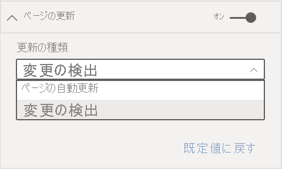

# Power BI Desktop でのページの自動更新 

重要なイベントを監視する場合、ソース データが更新された場合にすぐにデータを更新することが重要です。 たとえば、製造業では、機械が誤動作している場合、または誤動作に近い状態の場合に把握できることが重要です。

Power BI のページの自動更新機能を使用すると、アクティブなレポート ページから、定義した間隔で [DirectQuery ソース](https://docs.microsoft.com/power-bi/desktop-directquery-about)の新しいデータのクエリを実行することができます。

## ページの自動更新の使用

ページの自動更新は、DirectQuery データ ソースでのみ使用できます。

ページの自動更新を使用するには、更新を有効にするレポート ページを選択します。 **[視覚化]** ペインで **[書式]** ボタン (ペイント ローラー) を選択し、ペインの下部付近にある **[ページの更新]** を見つけます。 

![[ページの更新] の場所](media/desktop-automatic-page-refresh/automatic-page-refresh-01.png)

次の図は、 **[ページの更新]** カードを示します。 番号付きの要素については、図の後で説明します。

![[ページの更新] カード](media/desktop-automatic-page-refresh/automatic-page-refresh-02.png)

1.    ページの更新をオンまたはオフにします
2.    ページの更新間隔の数値
3.    ページの更新間隔の単位

このカードでは、ページの更新を有効にし、更新期間を選択できます。 既定値は 30 分です。 (最小更新間隔は 1 秒です)。設定した間隔でレポートの更新が開始されます。 

## ページの更新間隔の決定

ページの自動更新が有効な場合、Power BI Desktop からは常に DirectQuery ソースにクエリが送信されます。 クエリが送信された後、データが返される前に遅延があります。 そのため、更新間隔を短くするには、構成された間隔内でクエリからクエリ対象のデータが正常に返されることを確認する必要があります。 データが間隔内に返されない場合、視覚化の更新頻度は構成より少なくなります。

ベスト プラクティスとして、更新間隔は、想定する新しいデータの到着率と一致する必要があります。

* 新しいデータが 20 分ごとにソースに到着する場合、更新間隔を 20 分未満にすることはできません。 

* 新しいデータが毎秒到着する場合、間隔を 1 秒に設定します。 

1 秒のような短い更新間隔の場合は、次のような要因を考慮します。
- DirectQuery データ ソースの種類
- クエリによって生成される負荷
- 容量のデータセンターからレポート ビューアーまでの距離 

Power BI Desktop のパフォーマンス アナライザーを使用して、戻り時間を推定することができます。 パフォーマンス アナライザーを使用すると、各視覚化のクエリでソースからの結果を返すのに十分な時間があるかどうかを確認できます。 また、時間がかかっている場所を決定することもできます。 パフォーマンス アナライザーからの結果に基づいて、データ ソースを調整たり、レポートで他の視覚化やメジャーを試してみたりできます。

次の図は、パフォーマンス アナライザーの DirectQuery の結果を示しています。

このデータ ソースの他の特性について考えてみましょう。 

-    データは 2 秒間隔で到着します。 
-    パフォーマンス アナライザーでは、最大クエリ + 表示時間が約 4.9 秒 (4,688 ミリ秒) と表示されます。 
-    データ ソースは、1 秒あたり約 1,000 個の同時クエリを処理するように構成されています。 
-    約 10 人のユーザーが同時にレポートを表示すると想定しています。

その結果、次の式のようになります。

**5 個ビジュアル x 10 人のユーザー = 約 50 個のクエリ**

この計算の結果では、データ ソースでサポートできるよりはるかに大きい負荷であることが示されています。 データは 2 秒の速度で到着するため、これを更新頻度にする必要があります。 ただし、クエリが完了するまでに約 5 秒かかるため、5 秒を超える値に設定する必要があります。 

また、この結果は、レポートをサービスに発行すると異なる場合があることにも注意してください。 この違いが発生するのは、クラウドでホストされている Azure Analysis Services インスタンスがレポートで使用されるためです。 必要に応じて、更新間隔を調整することもできます。 

クエリと更新のタイミングを考慮するために、Power BI では、残りの更新クエリがすべて完了すると、次の更新クエリのみが実行されます。 そのため、更新間隔がクエリの処理にかかる時間よりも短い場合でも、Power BI では残りのクエリが完了した後でのみ再更新されます。 

次に、容量の管理者としてパフォーマンスの問題が発生した場合に検出して診断する方法を見てみましょう。 パフォーマンスとトラブルシューティングに関するその他の質問と回答については、後の「[よく寄せられる質問](#frequently-asked-questions)」セクションでも確認できます。

## Power BI サービスでのページの自動更新

Power BI Desktop で作成され、Power BI サービスに発行されたレポートのページの自動更新間隔を設定することもできます。 

Power BI サービスでレポートのページ自動更新を構成するには、Power BI Desktop で使用したのと似た手順を使用します。 Power BI サービスで構成した場合、ページの自動更新では[埋め込み Power BI](../developer/embedded/embedding.md) コンテンツもサポートされます。 この図では、Power BI サービスの **[ページの更新]** の構成が示されています。

以下の説明は、番号が付けられた要素に対応しています。 

1.    ページの更新をオンまたはオフにします。
2.    ページの更新間隔の数値。 整数でなければなりません。
3.    ページの更新間隔の単位。

### ページの更新間隔

Power BI サービスで許容されるページの更新間隔は、レポートのワークスペースの種類の影響を受けます。 これは、次のレポートに適用されます。

* ページの自動更新が有効なワークスペースへのレポートの発行
* 既にワークスペースにあるページの更新間隔の編集
* サービスでのレポートの直接作成

Power BI Desktop には、更新間隔に関する制限はありません。 1 秒ごとの更新間隔に設定することもできます。 ただし、レポートが Power BI サービスに発行されるときは、特定の制限が適用されます。 以降のセクションでは、これらの制限について説明します。

### 更新間隔に関する制限事項

Power BI サービスでは、ワークスペースや、Premium サービスを使用しているかどうかなどの要因に基づいて、ページの自動更新に対する制限が適用されます。

これらの制限のしくみをわかりやすくするため、容量とワークスペースに関する背景から説明します。

"*容量*" は、Power BI の重要な概念です。 それにより、Power BI コンテンツのホストと配信に使用される一連のリソース (ストレージ、プロセッサ、メモリ) が表されます。 容量は共有または専用です。 "*共有容量*" は、Microsoft の他のお客様と共有されます。 "*専用容量*" は、1 人のお客様に完全にコミットされます。 専用容量の概要については、「[Premium 容量を管理する](../admin/service-premium-capacity-manage.md)」を参照してください。

共有容量の場合、ワークロードは他のお客様と共有される計算リソースで実行されます。 容量ではリソースを共有する必要があるため、最大モデル サイズ (1 GB) や最大日次更新頻度 (1 日 8 回) の設定など、"*フェア プレイ*" を確保するための制限が課されます。

Power BI の "*ワークスペース*" は、容量内に存在します。 それらによって、セキュリティ、コラボレーション、デプロイ コンテナーが表されます。 各 Power BI ユーザーには、**マイ ワークスペース**と呼ばれる個人用のワークスペースが用意されます。 追加のワークスペースを作成して、コラボレーションとデプロイを有効にすることができます。 それらは "*ワークスペース*" と呼ばれます。 既定では、ワークスペース (個人用のワークスペースも含む) は、共有容量内に作成されます。

2 つのワークスペース シナリオの詳細を次に示します。

**共有ワークスペース**。 通常のワークスペース (Premium 容量の一部ではないワークスペース) の場合、ページの自動更新の最小間隔は 30 分 (許容される最小間隔) です。

**Premium ワークスペース**。 Premium ワークスペースでページの自動更新を使用できるかどうかは、Premium 管理者が Power BI Premium の容量に対して設定したワークロード設定によって変わります。 ページの自動更新を設定する機能に影響する可能性がある変数は 2 つあります。

 - **機能のオンとオフ**。 容量管理者がこの機能を無効にした場合、発行されたレポートでどの種類のページの更新も設定できません。

 - **最小更新間隔**。 この機能を有効にする場合、容量管理者は最小更新間隔を設定する必要があります。 間隔が最小値よりも少ない場合、Power BI サービスでは、容量管理者によって設定された最小間隔に合わせて間隔が上書きされます。 そのオーバーライドは、次の表では "容量管理者のオーバーライド" と呼ばれています。 

次の表は、この機能を使用できる場所と、各容量の種類と[ストレージ モード](../connect-data/service-dataset-modes-understand.md)の制限を詳しく説明したものです。

| ストレージ モード | 専用容量 | 共有された容量 |
| --- | --- | --- |
| DirectQuery | **サポートされている**: はい  **最小更新間隔**: 1 秒  **容量管理者のオーバーライド**: はい | **サポートされている**: はい  **最小更新間隔**: 30 分間  **容量管理者のオーバーライド**: いいえ |
| インポート | **サポートされている**: いいえ  **最小更新間隔**: 該当なし  **容量管理者のオーバーライド**: 該当なし | **サポートされている**: いいえ  **最小更新間隔**: 該当なし  **容量管理者のオーバーライド**: 該当なし |
| 混合モード (DirectQuery とその他のデータ ソース) | **サポートされている**: はい  **最小更新間隔**: 1 秒  **容量管理者のオーバーライド**: はい | **サポートされている**: はい  **最小更新間隔**: 30 分間  **容量管理者のオーバーライド**: いいえ |
| ライブ接続 AS | **サポートされている**: いいえ  **最小更新間隔**: 該当なし  **容量管理者のオーバーライド**: 該当なし | **サポートされている**: いいえ  **最小更新間隔**: 該当なし  **容量管理者のオーバーライド**: 該当なし |
| ライブ接続 PBI | **サポートされている**: いいえ  **最小更新間隔**: 該当なし  **容量管理者のオーバーライド**: 該当なし | **サポートされている**: いいえ  **最小更新間隔**: 該当なし  **容量管理者のオーバーライド**: 該当なし |

> [!NOTE]
> ページの自動更新対応レポートを Power BI Desktop からサービスに発行するときに、データセット設定メニューで DirectQuery データ ソースの資格情報を指定する必要があります。

## 考慮事項と制限事項

Power BI Desktop または Power BI サービスでページの自動更新を使用する場合に注意が必要な点がいくつかあります。

* ページの自動更新では、Import、LiveConnect、および Push ストレージ モードはサポートされません。  
* 少なくとも 1 つの DirectQuery データ ソースを持つ複合モデルがサポートされています。
* Power BI Desktop には、更新間隔に関する制限はありません。 1 秒ごとの間隔に設定することもできます。 レポートが Power BI サービスに発行されると、この記事で[前](#restrictions-on-refresh-intervals)に説明したように、特定の制限が適用されます。

### パフォーマンス診断

ページの自動更新は、シナリオを監視し、急速に変化するデータを探索する場合に便利です。 ただし、容量またはデータ ソースに過度の負荷がかかることがあります。

データ ソースに過度の負荷がかからないように、Power BI には次の保護策が用意されています。

- 対話型のクエリ (ページの読み込み、クロス フィルタリングの視覚化など) が確実に優先されるように、すべてのページの自動更新クエリは低い優先度で実行されます。
- 次の更新サイクルの前にクエリが完了しない場合、前のクエリが完了するまで、Power BI から新しい更新クエリは発行されません。 たとえば、更新間隔を 1 秒に設定し、クエリにかかる平均時間が 4 秒の場合、Power BI からは実質的に 4 秒ごとにクエリが発行されます。

それでもパフォーマンスのボトルネックが発生する可能性がある領域は 2 つあります。

1. **容量**。 クエリは、まず Premium 容量に到達し、レポートの視覚化から生成された DAX クエリが折りたたまれ、ソース クエリに評価されます。
2. **DirectQuery データ ソース**。 前の手順で変換されたクエリは、ソースに対して実行されます。 ソースは、SQL Server インスタンスや SAP Hana ソースなどです。

管理者は [Premium Capacity Metrics アプリ](../admin/service-admin-premium-monitor-capacity.md)を使用して、低優先度のクエリによって使用されている容量のサイズを視覚化できます。

低優先度のクエリは、ページの自動更新クエリとモデル更新クエリで構成されます。 現在、ページの自動更新クエリとモデル更新クエリの負荷を区別する方法はありません。

容量が低優先度のクエリで過負荷になっていることがわかった場合は、次のいくつかの操作を実行できます。

- より大きな Premium SKU を依頼します。
- レポートの所有者に、更新間隔を短くするように依頼します。
- 容量管理者ポータルでは、次のことができます。
   - その容量のページの自動更新を無効にします。
   - 最小更新間隔を上げます。これは、その容量のすべてのレポートに影響します。

### よく寄せられる質問

**私はレポート作成者です。Power BI Desktop でレポートの更新間隔を 1 秒に定義しましたが、発行後、サービスでレポートが更新されません。**

* そのページについて、ページの自動更新がオンになっていることを確認します。 この設定はページごとに行われるため、更新するレポートの各ページで設定をオンにする必要があります。
* Premium 容量がアタッチされているワークスペースにアップロードしたかどうかを確認します。 そうでない場合、更新間隔は 30 分にロックされます。
* レポートが Premium ワークスペースにある場合は、アタッチされた容量に対してこの機能が有効にされているかどうかを管理者に確認します。 また、容量の最小更新間隔がレポートの間隔よりも低いか同じであることを確認します。

**私は容量管理者です。ページの自動更新間隔の設定を変更しましたが、変更が反映されません。言い換えると、自動ページ更新を有効にしましたが、レポートは想定よりも遅い速度で更新されているか、更新されません。**

* 容量管理者 UI で行われたページの自動更新設定の変更は、レポートに反映されるまでに最大 5 分かかります。
* 容量のページの自動更新を有効にするだけでなく、有効にするレポートのページについても有効にする必要があります。

**個人用レポートが混合モードで動作しています。(混合モードとは、レポートに DirectQuery 接続とインポート データ ソースがあることを意味します)。一部の視覚化が更新されません。**

- 視覚化で Import テーブルが参照されている場合は、これは想定される動作です。 ページの自動更新は Import ではサポートされません。
- このセクションの最初の質問を参照してください。

**レポートはサービスで正常に更新されていましたが、突然停止しました。**

* ページを更新してみて、問題が自動的に解決されるかどうかを確認してください。
* 容量管理者に確認してください。管理者が機能を無効にしたか、または最小更新間隔を上げた可能性があります。 (このセクションの 2 番目の質問を参照してください。)

**私はレポート作成者です。視覚化が指定した頻度で更新されません。更新間隔が長くなっています。**

* クエリの実行に時間がかかると、更新間隔が遅れます。 ページの自動更新では、すべてのクエリの実行が完了するまで待ってから、新しいものが実行されます。
* 容量管理者が、レポートに設定したものよりも高い最小更新間隔を設定している可能性があります。 容量管理者に、最小更新間隔を下げるように依頼してください。

**ページの自動更新クエリはキャッシュから提供されますか。**

* いいえ。 すべてのページの自動更新クエリでは、キャッシュされたデータはバイパスされます。

## 次の手順

詳細については、次の記事を参照してください。

* [Power BI で DirectQuery を使用する](../connect-data/desktop-directquery-about.md)
* [Power BI Desktop で複合モデルを使用する](../transform-model/desktop-composite-models.md)
* [パフォーマンス アナライザーを使用してレポート要素のパフォーマンスを確認する](desktop-performance-analyzer.md)
* [Power BI Premium 容量の展開と管理](../guidance/whitepaper-powerbi-premium-deployment.md)
* [Power BI Desktop のデータ ソース](../connect-data/desktop-data-sources.md)
* [Power BI Desktop でのデータの整形と結合](../connect-data/desktop-shape-and-combine-data.md)
* [Power BI Desktop で Excel ブックに接続する](../connect-data/desktop-connect-excel.md)   
* [Power BI Desktop にデータを直接入力する](../connect-data/desktop-enter-data-directly-into-desktop.md)   
