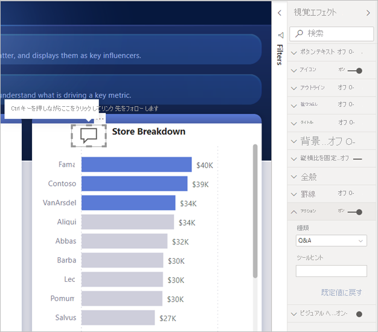
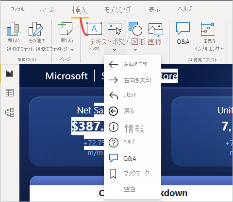
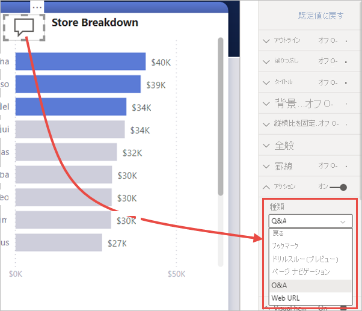
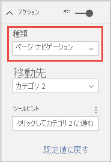

# Power BI でボタンを使用する
Power BI で**ボタン**を使用したレポートを作成すると、ユーザーが Power BI コンテンツにマウス ポインターを重ねたり、クリックや対話操作を行うことができる、アプリのように動作する魅力的な環境を作成できます。 ボタンは、**Power BI Desktop** と **Power BI サービス**のレポートに追加できます。 ご自分のレポートを Power BI サービスで共有すると、それらはあなたのユーザーに対してアプリのように動作します。

## レポート内にボタンを作成する

### Power BI Desktop でボタンを設定する

**Power BI Desktop** でボタンを作成するには、 **[挿入]** リボンで **[ボタン]** を選択すると、ドロップダウン メニューが表示されます。ここでは、次の図のように、オプションのコレクションからボタンを選択できます。 

### Power BI サービスでボタンを作成する

**Power BI サービス**でボタンを作成するには、レポートを編集ビューで開きます。 上部のメニュー バーで **[ボタン]** を選択すると、次の図のように、オプションの集合から希望するボタンを選択できるドロップダウン メニューが表示されます。 

## ボタンをカスタマイズする

ボタンは、Power BI Desktop で作成しても、Power BI サービスで作成しても、残りの手順は同じです。 そのボタンをレポート キャンバス上で選択すると、 **[視覚化]** ウィンドウに、あなたの要件に合わせてボタンをカスタマイズできる多くの方法が示されます。 たとえば、 **[視覚化]** ウィンドウのカードでスライダーを切り替えると、 **[ボタン テキスト]** をオンまたはオフにできます。 また、さまざまなプロパティのうち、ボタンのアイコン、ボタンの塗りつぶし、タイトル、およびユーザーがレポートまたはボタンを選択したときに行われるアクションを変更することができます。

## アイドル状態、マウスのポイント時、または選択時のボタンのプロパティを設定する

Power BI のボタンには 3 つの状態があります: 既定 (マウスでポイントされていないとき、または選択されていないときに表示されます)、マウスのポイント時、または選択時 (通常、*クリック*時として参照されます)。 **[視覚化]** ウィンドウのカードの多くは、ボタンをカスタマイズするために十分な柔軟性があり、3 つの状態を基に個別に変更できます。

**[視覚化]** ウィンドウの次のカードでは、3 つの状態に基づいてボタンの書式設定または動作を調整できます。

* ボタンのテキスト
* アイコン
* 枠線
* 塗りつぶし

各状態に表示されるボタンを選択するには、カードのいずれかを展開して、カードの上部に表示されるドロップダウンを選択します。 次の図では、 **[アイコン]** カードが展開され、ドロップダウンが選択され、3 つの状態が表示されています。

## ボタンにアクションを選択する

ユーザーが Power BI でボタンを選択されたときに実行されるアクションを選択できます。 **[視覚化]** ウィンドウの **[アクション]** カードからボタン アクションのオプションにアクセスできます。

ボタン アクションのオプションは次のとおりです。

- **[戻る]** では、ユーザーはレポートの前のページに戻ります。 これは、ドリルスルー ページで便利です。
- **[ブックマーク]** では、現在のレポートに定義されたブックマークに関連付けられたレポート ページを表示できます。 [Power BI のブックマークについて詳しくは、こちら](desktop-bookmarks.md)をご覧ください。 
- **[ドリルスルー]** では、ブックマークを使用せずに、ユーザーの選択に基づいてフィルター処理されたドリルスルー ページに移動できます。 [レポートのドリルスルー ボタンについて、詳しくはこちら](desktop-drill-through-buttons.md)をご覧ください。
- **[ページ ナビゲーション]** では、レポート内の別のページに、この場合もブックマークを使用せずに、ユーザーを移動できます。 詳細については、この記事の「[ページ ナビゲーションの作成](#create-page-navigation)」を参照してください。
- **[Q&A]** では、 **[Q&A Explorer]** \(Q&A エクスプローラー\) ウィンドウが開きます。 

特定のボタンには、既定のアクションが自動的に選択されます。 たとえば、 **[Q&A]** ボタンの種類では、既定のアクションとして **[Q&A]** を自動的に選択します。 [このブログの投稿](https://powerbi.microsoft.com/blog/power-bi-desktop-april-2018-feature-summary/#Q&AExplorer)を確認すると、**Q&A Explorer** の詳細を確認できます。

使用するボタン上で *Ctrl キーを押しながらクリック*して、レポートを作成するボタンを試したり、テストしたりすることができます。 

## ページ ナビゲーションを作成する

**[アクション]** の種類の **[ページ ナビゲーション]** では、ブックマークをまったく保存または管理せずに、ナビゲーション エクスペリエンス全体を構築できます。

ページ ナビゲーション ボタンを設定するには、アクションの種類が **[ページ ナビゲーション]** のボタンを作成し、 **[宛先]** ページを選択します。

カスタム ナビゲーション ウィンドウを構築し、ナビゲーション ボタンを追加することができます。 ご自分のナビゲーション ウィンドウに表示するページを変更するときに、ブックマークを編集して管理する必要はありません。

また、他の種類のボタンで行えるのと同様に、ヒントを条件付きで書式設定することもできます。

## 条件付きでナビゲーション先を設定する

条件付き書式を使用することで、メジャーの出力に基づいてナビゲーション先を設定できます。 たとえば、ユーザーの選択に基づいてさまざまなページに移動する 1 つのボタンを使用することで、レポート キャンバス上の領域を節約することができます。

:::image type="content" source="media/desktop-buttons/button-navigate-go.png" alt-text="[移動] ボタンを使用して移動する":::
 
上に示した例を作成するには、まず、ナビゲーション先の名前を含む単一列テーブルを作成します。

:::image type="content" source="media/desktop-buttons/button-create-table.png" alt-text="テーブルの作成":::

Power BI では、文字列の完全一致を使用してドリルスルー先を設定します。そのため、入力した値がドリルスルー ページ名と完全に一致していることを再確認してください。

テーブルを作成した後、それを単一選択スライサーとしてページに追加します。

:::image type="content" source="media/desktop-buttons/button-navigate-slicer.png" alt-text="移動スライサー":::

次に、ページ ナビゲーション ボタンを作成し、移動先の条件付き書式オプションを選択します。

:::image type="content" source="media/desktop-buttons/button-set-page-nav-destination.png" alt-text="ページ ナビゲーション ボタン":::
 
作成した列の名前 (ここでは、**Select a destination**) を選択します。

:::image type="content" source="media/desktop-buttons/button-select-destination.png" alt-text="Select a destination":::

これで、ボタンによって、ユーザーの選択に応じてさまざまなページに移動できるようになりました。

:::image type="content" source="media/desktop-buttons/button-navigate-go.png" alt-text="[移動] ボタンを使用して移動する":::
 
### ナビゲーション用の図形と画像

ページ ナビゲーションのアクションは、ボタンだけでなく図形と画像でもサポートされています。 組み込み図形の 1 つを使用した例を次に示します。

:::image type="content" source="media/desktop-buttons/button-navigation-arrow.png" alt-text="ナビゲーションに矢印を使用する":::
 
画像を使用した例を次に示します。

:::image type="content" source="media/desktop-buttons/button-navigation-image.png" alt-text="ナビゲーションに画像を使用する":::
 
## ボタンでの画像の塗りつぶしのサポート

ボタンでは、画像の塗りつぶしがサポートされます。 画像の塗りつぶしと組み込みのボタンの状態 (既定、ポイント時、押したとき、無効 (ドリルスルー用)) を組み合わせることで、ボタンの外観をカスタマイズできます。

:::image type="content" source="media/desktop-drill-through-buttons/drill-through-fill-images.png" alt-text="ドリルスルー ボタンの画像の塗りつぶし":::

**[塗りつぶし]** を **[オン]** に設定してから、異なる状態用の画像を作成します。

:::image type="content" source="media/desktop-drill-through-buttons/drill-through-fill-state-settings.png" alt-text="画像の塗りつぶしの設定":::

## 次の手順
ボタンと似た機能またはボタンと相互作用する機能の詳細については、次の記事をご覧ください。

* [Power BI レポートでドリルスルーを使用する](desktop-drillthrough.md)
* [Power BI でブックマークを使用して詳細情報を共有し、ストーリーを作成する](desktop-bookmarks.md)
* [ドリルスルー ボタンを作成する](desktop-drill-through-buttons.md)

