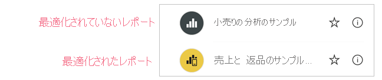

# モバイル アプリ用に Power BI レポートを最適化する
モバイル ユーザーは、任意の Power BI レポート ページを横向きに表示できます。 ただし、レポート作成者は、モバイル デバイス用に最適化され、縦向きで表示される追加のビューを作成できます。 このデザイン オプション (Power BI Desktop と Power BI サービスの両方で使用できます) を使用すると、作成者は、出先のモバイル ユーザーにとって意味のある視覚化だけを選択して再配置することができます。

.

Power BI には、モバイルに最適化されたバージョンのレポートを作成するのに役立つさまざまな機能が用意されています。
* スマートフォン エミュレーター キャンバスに視覚化をドラッグ アンド ドロップすることで、モバイル最適化レポートを作成できるモバイル レイアウト ビュー。
* 小さいモバイル画面での使用に最適化できる視覚化とスライサー。

これらの機能を使用して、魅力的な対話形式のモバイル最適化レポートをデザインおよび構築することができます。

## レポート ページのモバイルに最適化された縦バージョンを作成する

最初のステップは、通常の Web ビューでレポートをデザインして作成することです。 レポートを作成したら、スマートフォンとタブレット用にそれを最適化できます。

モバイル最適化ビューを作成するには、モバイル レイアウト ビューを開きます。
   * Power BI Desktop の **[表示]** リボンを選択し、 **[モバイル レイアウト]** を選択します。
   * Power BI サービスでは、 **[その他のオプション] (...) > [レポートの編集] > [モバイルレイアウト]** を選択します。

   携帯電話のような形状のスクロール可能なキャンバスと、元のレポート ページにあるすべての視覚化の一覧が含まれる **[視覚化]** ペインが表示されます。

   .

* **[視覚化]** ペインの各視覚化には、簡単に識別できる名前が表示されます。
* 各視覚化には、表示インジケーターもあります。 視覚化の表示インジケーターは、Web レポート ビューの現在の状態における視覚化の表示状態に応じて変化します。 表示インジケーターは、ブックマークを使用する場合に便利です。

## モバイル レイアウト キャンバスに視覚化を追加する
モバイル レイアウトに視覚化を追加するには、それを **[視覚化]** ペインからスマートフォン キャンバスにドラッグします。 視覚化をキャンバスにドラッグすると、グリッドにスナップされます。 または、[視覚化] ペインで視覚化をダブルクリックすると、視覚化がキャンバスに追加されます。

Web レポート ページの一部またはすべての視覚化を、モバイル最適化レポートのページに追加できます。 各視覚化を追加できるのは 1 回だけであり、すべての視覚化を含める必要はありません。

>[!NOTE]
> 非表示の視覚化をキャンバスにドラッグ アンド ドロップできます。 それらは配置されますが、現在の Web レポート ビューで表示状態が変更されない限り、表示されません。

視覚化は、相互に重ねて配置することができ、ブックマークを使用して対話型のレポートを作成したり、画像の上に視覚化を重ねて魅力的なレポートを作成したりできます。

キャンバスに視覚化を配置したら、視覚化を選択するとエッジの周囲に表示されるハンドルをドラッグしてサイズを変更できます。 サイズ変更中に視覚化の縦横比を維持するには、**Shift** キーを押しながらサイズ変更ハンドルをドラッグします。

次の図では、 **[視覚化]** ペインからキャンバスに視覚化をドラッグ アンド ドロップする方法と、それらの一部をサイズ変更およびオーバーレイする方法を示します。

   

電話レポートのグリッドは、さまざまなサイズの電話に向けてスケーリングされます。このため、電話の画面が小さくても大きくても、レポートの見栄えがよくなります。

## モバイル レイアウト キャンバスから視覚化を削除する
モバイル レイアウトから視覚化を削除するには、スマートフォン キャンバス上の視覚化の右上隅にある **[X]** をクリックするか、または視覚化を選択して **Delete** キーを押します。

**[視覚化]** ペインの消しゴムをクリックすることで、キャンバスからすべての視覚エフェクトを削除できます。

モバイル レイアウト キャンバスから削除した視覚化は、キャンバスからのみ削除されます。 [視覚化] ペインの視覚化は表示されたままになり、元のレポートは影響を受けません。

## モバイル最適化レポートで使用するために視覚化とスライサーを構成する

### ビジュアル

既定では、多くの視覚化 (特にグラフ型の視覚化) はレスポンシブになっています。  つまり、画面のサイズに関係なく、最大量のデータと分析情報が表示されるように動的に変化します。

視覚化のサイズが変化するとき、Power BI ではデータが優先されます。 たとえば、視覚化が小さくなっても有益な情報が提供されるように、自動的にパディングが削除され、凡例が視覚化の上部に移動される場合があります。

 
何らかの理由でレスポンシブを無効にする必要がある場合は、視覚化の書式設定の **[全般]** セクションで行うことができます。

### スライサー

スライサーは、レポート データのキャンバス上のフィルター処理を行います。 通常のレポートの作成モードでスライサーをデザインするとき、スライサーの一部の設定を変更して、モバイル最適化レポートでそれらを使いやすくすることができます。
* レポートの閲覧者が選択できる項目を 1 つだけにするか複数にするかを決定できます。
* スライサーを縦向き、横向き、またはレスポンシブにすることができます (レスポンシブのスライサーは横向きにする必要があります)。

スライサーをレスポンシブにすると、スライサーのサイズとシェイプの変更に応じて表示されるオプションの数が増減します。 高さを変えたり、幅を変えたりできます。 非常に小さくすると、レポート ページにフィルターのアイコンだけが表示されるようになります。

 
詳細については、[レスポンシブ スライサーの作成](power-bi-slicer-filter-responsive.md)に関するページをお読みください。

## モバイル最適化レポートを発行する
レポートのモバイル最適化バージョンを発行するには、[メイン レポートを Power BI Desktop から Power BI サービスに発行します](desktop-upload-desktop-files.md)。 これにより、モバイル最適化バージョンも同時に発行されます。

## スマートフォンまたはタブレットで最適化されたレポートと最適化されていないレポートを表示する

Power BI モバイル アプリでは、モバイル最適化レポートは特別なアイコンで示されます。

電話では、レポートがモバイルに最適化されているかどうかがアプリによって自動的に検出されます。
* モバイル最適化レポートが存在する場合、アプリによって自動的にモバイル最適化モードでレポートが開かれます。
* モバイル最適化レポートが存在しない場合は、レポートは最適化されていない横長ビューで開かれます。

電話を横向きに持つと、レポートが最適化されているかどうかに関係なく、元のレポート レイアウトの最適化されていないビューでレポートが開かれます。

一部のページのみが最適化されている場合は、閲覧者が最適化されていないページに移動すると、横表示に切り替えるように求められます。 スマートフォンまたはタブレットを横向きにすると、横モードでページを表示できるようになります。 [詳しくは、縦モード用に最適化された Power BI レポートとの対話に関するページを参照してください](../consumer/mobile/mobile-apps-view-phone-report.md)。

## モバイル最適化レイアウトを作成するときの考慮事項
* 複数ページのレポートの場合、すべてのページまたは数ページだけを最適化できます。
* レポート ページの背景色を定義した場合、モバイル最適化レポートにも同じ背景色が設定されます。
* モバイル最適化レポートについてだけ、書式設定を変更することはできません。 書式設定は、マスターとモバイルのレイアウトで一貫しています。 たとえば、フォント サイズは同じになります。
* 書式設定、データセット、フィルター、またはその他の属性の変更など、視覚化を変更するには、Web レポート作成モードに戻ります。

## 次の手順
* [Power BI でダッシュボードの Phone ビューを作成する](service-create-dashboard-mobile-phone-view.md)。
* [電話用に最適化された Power BI レポートを表示する](../consumer/mobile/mobile-apps-view-phone-report.md)。
* [レポートとダッシュボードの作成に関する Power BI のドキュメント](https://docs.microsoft.com/power-bi/create-reports/)。
* 他にわからないことがある場合は、 [Power BI コミュニティで質問してみてください](https://community.powerbi.com/)。