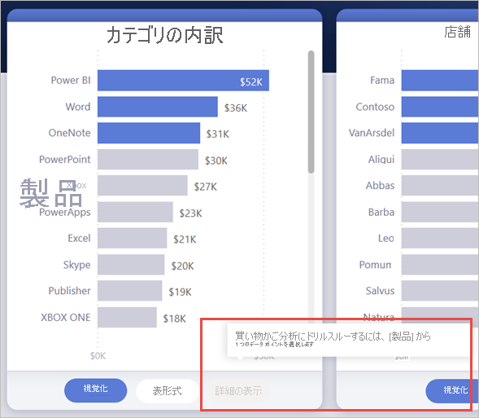
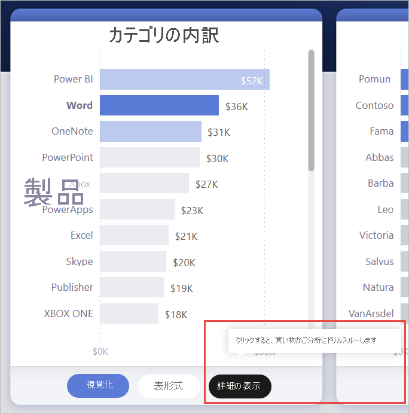
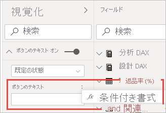
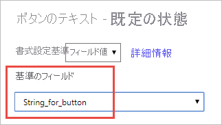
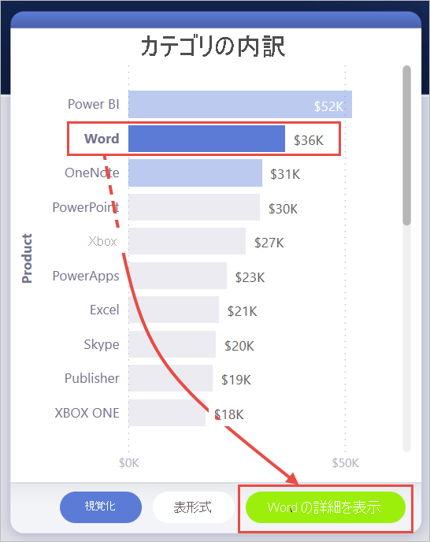
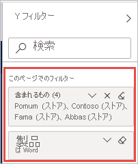

# <a name="create-a-drill-through-button-in-power-bi-preview"></a>Power BI でドリルスルー ボタンを作成する (プレビュー)

Power BI でボタンを作成するときに、 **[ドリルスルー (プレビュー)]** アクションを選択できます。 このアクションの種類では、特定のコンテキストに対してフィルター処理された詳細情報を取得するためにフォーカスされたページにドリルスルーするボタンが作成されます。

ドリルスルー ボタンを使用すると、レポート内の重要なドリルスルー シナリオが見つけやすくなります。

この例では、ユーザーがグラフ内の Word バーを選択すると、 **[詳細の表示]** ボタンが有効になります。

![[詳細の表示] ボタン](media/desktop-drill-through-buttons/power-bi-drill-through-visual-button.png)

**[詳細の表示]** ボタンを選択すると、[マーケット バスケット分析] ページにドリルスルーします。 左側のビジュアルからわかるように、ドリルスルー ページが Word 用にフィルター処理されました。


## <a name="set-up-a-drill-through-button"></a>ドリルスルー ボタンを設定する

ドリルスルー ボタンを設定するには、まず、レポート内に[有効なドリルスルー ページを設定する](desktop-drillthrough.md)必要があります。 次に、アクションの種類として**ドリルスルー**を含むボタンを作成し、 **[Destination]\(送信先\)** としてドリルスルー ページを選択する必要があります。

ドリルスルー ボタンには 2 つの状態 (ドリルスルーが有効な場合と無効な場合) があるため、2 つのツールヒント オプションが表示されます。


ツールヒントのボックスを空白のままにすると、Power BI によって自動的にツールヒントが生成されます。 このツールヒントは、[Destination]\(送信先\) フィールドとドリルスルー フィールドに基づいています。

ボタンが無効になっているときに自動生成されるツールヒントの例を次に示します。

"[マーケット バスケット分析 (Destination]\(送信先\) ページ) をドリルスルーするには、Product (ドリルスルー フィールド) からデータポイントを 1 つ選択します。"



ボタンが有効になっているときに自動生成されるツールヒントの例を次に示します。

"クリックすると、マーケット バスケット分析 ([Destination]\(送信先\) ページ) にドリルスルーします。"



ただし、カスタム ツールヒントを提供する場合は、常に静的な文字列を入力できます。 ツールヒントでは、条件付き書式はまだサポートされていません。

条件付き書式を使用すると、フィールドの選択した値に基づいてボタンのテキストを変更できます。 これを行うには、DAX 関数 SELECTEDVALUE に基づいて目的の文字列を出力するメジャーを作成する必要があります。

Product の値が選択されていない場合に "製品の詳細を表示" を出力するメジャーの例を次に示します。それ以外の場合は、"[選択された Product ] の詳細を表示" を出力します。

```
String_for_button = If(SELECTEDVALUE('Product'[Product], 0) == 0), "See product details", "See details for " & SELECTEDVALUE('Product'[Product]))
```

このメジャーを作成したら、ボタンのテキストに **[条件付き書式]** オプションを選択します。



次に、ボタンのテキストに作成したメジャーを選択します。



製品を 1 つ選択すると、ボタンのテキストが次のように読み上げられます。

"Word の詳細を表示"



製品が選択されていないか、複数の製品が選択されている場合は、ボタンが無効になり、ボタンのテキストが次のように読み上げられます。

"製品の詳細を表示"


## <a name="pass-filter-context"></a>フィルター コンテキストを渡す

このボタンは、通常のドリルスルーと同様に機能します。そのため、ドリルスルー フィールドを含むビジュアルをクロスフィルター処理することで、追加のフィールドにフィルターを渡すこともできます。 たとえば、 **[Ctrl** + **クリック]** とクロスフィルター処理を実行すると、ドリルスルー ページに Store の複数のフィルターを渡すことができます。これは、選択によって、ドリルスルー フィールドの Product を含むビジュアルがクロスフィルター処理されるためです。


ドリルスルー ボタンを選択すると、Store と Product の両方に対するフィルターが [destination]\(送信先\) ページに渡されることがわかります。



### <a name="ambiguous-filter-context"></a>あいまいなフィルター コンテキスト

ドリルスルー ボタンは 1 つのビジュアルに関連付けられるわけではないため、選択範囲があいまいな場合、ボタンは無効になります。

この例では、2 つのビジュアルの両方に Product の選択が 1 つ含まれているため、ボタンは無効になっています。 どのビジュアルのどのデータポイントをドリルスルーかについてがあいまいです。


## <a name="limitations"></a>制限事項

- このボタンでは、1 つのボタンを使用して複数の送信先を設定することはできません。
- このボタンは、同じレポート内のドリルスルーのみをサポートしています。言い換えると、レポート間のドリルスルーはサポートしていません。
- ボタンの無効状態の書式設定は、レポートのテーマの色クラスに関連付けられています。 色クラスに関する詳細は[こちら](desktop-report-themes.md#setting-structural-colors)を参照してください。
- ドリルスルー アクションは、組み込みのすべてのビジュアルに対して機能し、AppSource からインポートされた "*一部の*" ビジュアルと連携します。 ただし、AppSource からインポートされた "*すべての*" ビジュアルで動作することは保証されていません。

## <a name="next-steps"></a>次のステップ
ボタンと似た機能またはボタンと相互作用する機能の詳細については、次の記事をご覧ください。

* [ボタンを作成する](desktop-buttons.md)
* [Power BI レポートでドリルスルーを使用する](desktop-drillthrough.md)
* [Power BI でブックマークを使用して詳細情報を共有し、ストーリーを作成する](desktop-bookmarks.md)

