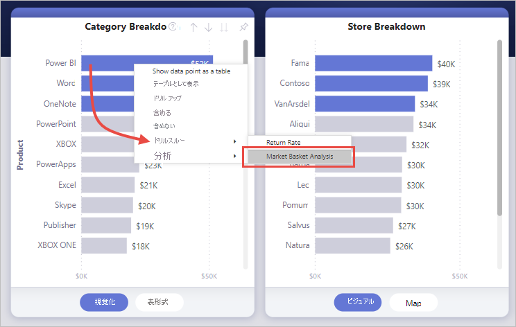
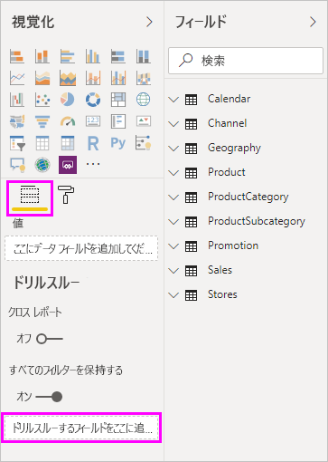
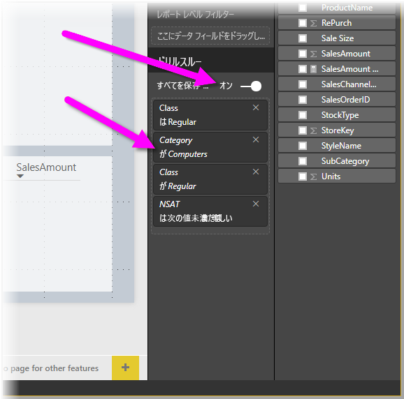
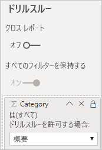

# Power BI レポートでドリルスルーを設定する
Power BI レポートの*ドリルスルー*を利用すると、サプライヤー、顧客、メーカーなど、特定のエンティティに焦点を置いたページをあなたのレポートに作成できます。 ドリルスルーを使用するあなたのレポートの読者は、他のレポート ページのデータ ポイントを右クリックします。すると、ドリルスルーして、そのコンテキストでフィルター処理されたそれに焦点を置いたページで詳細を取得できます。 ユーザーがクリックしたときに詳細に[ドリルスルーするボタンを作成](desktop-drill-through-buttons.md)することもできます。

ドリルスルーは、Power BI Desktop または Power BI サービスで、ご自分のレポートに設定することができます。

## ドリルスルーの宛先ページを設定する
1. ドリルスルーを設定するには、ドリルスルーを用意するエンティティの種類用のビジュアルを含むレポート ページを作成します。 

    たとえば、製造元用のドリルスルーを用意したいとします。 この場合には、売上合計、合計出荷単位、カテゴリ別の売上、地域別の売上などを表示するビジュアルを含むドリルスルー ページを作成します。 このようにすると、そのページにドリルスルーすると、選択した製造元に固有のビジュアルが表示されます。

2. その後、そのドリルスルー ページの **[視覚化]** ウィンドウの **[フィールド]** セクションで、ドリルスルー対象のフィールドを**ドリルスルー フィルター**までドラッグします。

    

    **[ドリルスルー フィルター]** ウェルにフィールドを追加すると、Power BI によって *[戻る]* ボタンのビジュアルが自動作成されます。 そのビジュアルは、発行されたレポートではボタンになります。 Power BI サービスでレポートを表示するユーザーは、このボタンを使用して、元のレポート ページに戻ります。

    

> [!IMPORTANT]
> 同じレポート内のページへのドリルスルーを構成して実行することはできますが、別のレポートのページにドリルスルーすることはできません。  

## [戻る] ボタンに独自の画像を使用する    
 戻るボタンは画像なので、そのビジュアルの画像を任意の画像に置き換えることができます。 戻るボタンとして機能することには変わりはなく、レポート ユーザーは元のページに戻ることができます。 

戻るボタンに独自の画像を使用するには、次の手順のようにします。

1. **[ホーム]** タブで **[イメージ]** を選択します。 その後、ご自分の画像を探してドリルスルー ページ上に配置します。

2. ドリルスルー ページで、ご自分の新しい画像を選択します。 **[形式のイメージ]** ペインで、 **[アクション]** スライダーを **[オン]** に設定し、 **[種類]** を **[戻る]** に設定します。 これで、その画像が [戻る] ボタンとして機能します。

    ![イメージを読み込んで [種類] を [戻る] に設定する](media/desktop-drillthrough/drillthrough_05.png)

    
     これで、ユーザーがごあなたのレポート内のデータ ポイントを右クリックすると、そのページをドリルスルーできるコンテキスト メニューを表示できます。 

    

    レポート利用者がドリルスルーを選択すると、ページが絞り込まれ、右クリックしたデータ ポイントに関する情報が表示されます。 たとえば、Contoso (製造元) に関するデータ ポイントを右クリックし、ドリルスルーを選択したものとします。 Contoso でフィルター処理されたドリルスルー ページに移動されます。

## ドリルスルーですべてのフィルターを渡す

適用されているフィルターをすべてドリルスルー ウィンドウに渡すことができます。 たとえば、製品の特定のカテゴリのみを選択し、ビジュアルをそのカテゴリでフィルター処理した状態で、ドリルスルーを選択できます。 それらのすべてのフィルターが適用されたドリルスルーがどのようになるか確認します。

適用されたすべてのフィルターを維持するには、 **[視覚化]** ウィンドウの **[ドリルスルー]** セクションで、 **[すべてのフィルターを保持する]** を **[オン]** に設定します。 

その状態でビジュアルにドリルスルーすると、ソース ビジュアルに一時的なフィルターが適用された結果として、適用されたフィルターを確認できます。 **[視覚化]** ウィンドウの **[ドリルスルー]** セクションでは、これらの一時的なフィルターは斜体で表示されます。 

ツールヒント ページでこれを行うこともできますが、ツールヒントが正常に機能しないため、悪い影響があります。 そのため、ツールヒントで行うことはお勧めしません。

## ドリルスルーにメジャーを追加する

ドリルスルー ウィンドウには、すべてのフィルターを渡せるだけではなく、ドリルスルー領域にメジャーまたは集計済みの数値列を追加することもできます。 これを適用するには、ドリルスルー フィールドを **[ドリルスルー]** カードにドラッグします。 

メジャー (または集計済みの数値列) を追加するときに、フィールドがビジュアルの "*値*" 領域で使用されていると、そのページをドリルスルーすることができます。

ご自分のレポートでドリルスルーを使用する方法は以上です。 これは、ご自分のドリルスルー フィルターで選択したエンティティの情報を拡大して表示する優れた方法です。

## 次のステップ

次の記事にも興味をもたれるかもしれません。

* [Power BI でレポート間のドリルスルーを使用する](desktop-cross-report-drill-through.md)
* [Power BI Desktop でスライサーを使用する](../visuals/power-bi-visualization-slicers.md)
