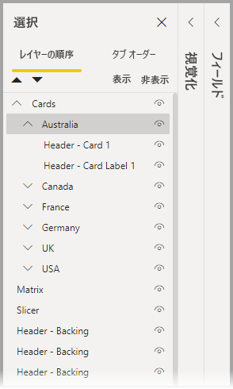
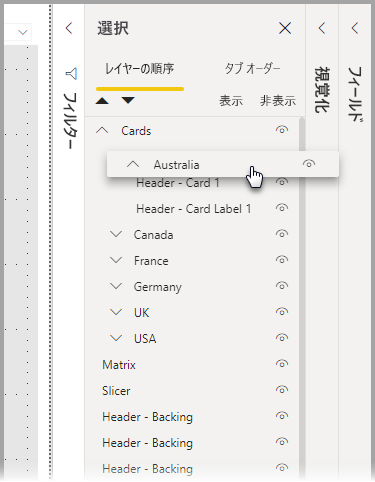
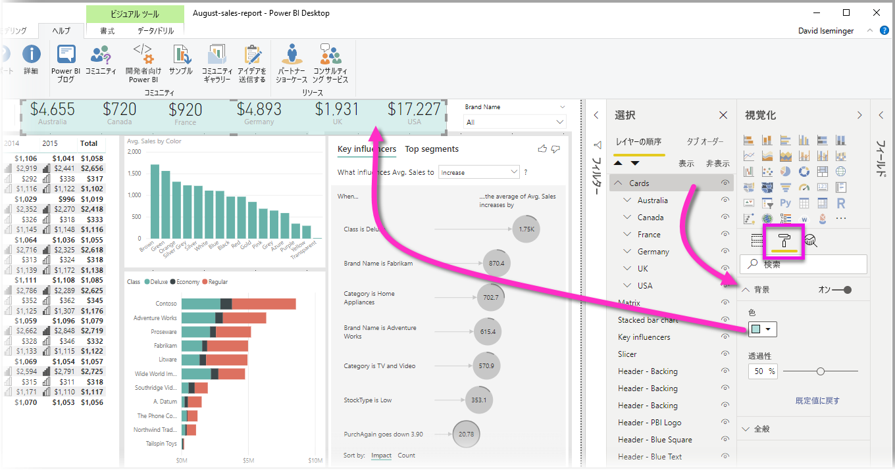

# Power BI Desktop レポートでビジュアルをグループ化する
**Power BI Desktop** で**グループ化**を使用すると、PowerPoint で項目をグループ化するのと同じように、レポート内でビジュアルをグループ化できます。これには、ボタン、テキストボックス、図形の画像、その他作成したあらゆるビジュアルが含まれます。 レポート内のビジュアルをグループ化すると、グループを 1 つのオブジェクトのように扱い、レポート内での移動、サイズ変更、およびレイヤーの操作をより簡単かつ迅速に、直感的に行うことができます。

## グループの作成

Power BI Desktop でビジュアルのグループを作成するには、キャンバスから最初のビジュアルを選択し、次に CTRL ボタンを押したままグループに含める 1 つ以上のビジュアルをクリックします。その後、そのビジュアルのコレクションを右クリックし、表示されるメニューから **[グループ]** を選択します。

グループは **[選択項目]** ウィンドウに表示されます。 レポートにはビジュアルのグループを必要な数だけ作成することができます。また、ビジュアルのグループを入れ子にすることもできます。 次の図では、 *[オーストラリア]* グループは *[カード]* グループの下に入れ子になっています。 グループを展開するには、グループ名の横にあるキャレットを選択します。折りたたむには、再度キャレットを選択します。 

**[選択項目]** ウィンドウでは、個々のビジュアルをドラッグ アンド ドロップしてグループに含めたり、グループから削除したり、グループを入れ子にしたり、入れ子からグループや個別のビジュアルを削除したりすることもできます。 調整する視覚化をドラッグし、必要な場所に配置するだけです。 重なりがある場合、ビジュアルのレイヤー化は、 *[レイヤーの順序]* 一覧での順序によって決まります。

グループ名の変更は簡単です。 **[選択]** ペインでグループ名をダブルクリックし、グループの新しい名前を入力するだけです。

グループ化を解除するには、グループを選択し、右クリックして、表示されるメニューから **[グループ解除]** を選択します。

## ビジュアルまたはグループの表示と非表示を切り替える

**[選択項目]** ウィンドウを使用すると、グループの表示と非表示を簡単に切り替えることができます。 グループを非表示にするには、グループ名 (または個々の視覚化) の横にある目のボタンを選択して、視覚化またはグループを非表示にするか表示するかを切り替えます。 次の図では、 *[オーストラリア]* グループは非表示に、 *[カード]* グループに入れ子されている残りのグループは表示になっています。

グループを非表示にすると、そのグループ内のすべてのビジュアルが非表示となり、目のボタンが淡色表示されることで示されます (グループ全体が非表示になっているため、オンとオフを切り替えることはできません)。 グループ内の特定のビジュアルのみを非表示にするには、そのビジュアルの横にある目のボタンを切り替えるだけで、グループ内のそのビジュアルのみが非表示になります。

## グループ内のビジュアルの選択

ビジュアルのグループ内の項目に移動して選択するには、いくつかの方法があります。 次のリストで、動作について説明します。

* グループ内の空の領域 (ビジュアル間の空白など) をクリックしても何も選択されません
* グループ内の視覚化をクリックするとグループ全体が選択され、2 回目のクリックで個々の視覚化が選択されます
* グループを選択し、レポート キャンバス上の別のオブジェクトを選択した後、右クリック メニューから **[グループ]** を選択すると、入れ子になったグループが作成されます
* 2 つのグループを選択して右クリックすると、選択したグループを入れ子にするのではなく、結合するためのオプションが表示されます

## 背景色を適用する

次の図に示すように、 **[視覚化]** ウィンドウの **[書式設定]** セクションを使用して、グループに背景色を適用することもできます。 

背景色を適用した後、グループ内のビジュアル間の領域をクリックすると、グループが選択されます (比較対象として、グループ内のビジュアル間の空白部分をクリックした場合はグループは選択されません)。 

## 次の手順
グループ化の詳細については、次のビデオを参照してください。

* [Power BI Desktop でのグループ化- ビデオ](https://youtu.be/sf4n7VXoQHY?t=10)

次の記事にも興味をもたれるかもしれません。

* [Power BI Desktop でレポート間のドリルスルーを使用する](desktop-cross-report-drill-through.md)
* [Power BI Desktop でスライサーを使用する](../visuals/power-bi-visualization-slicers.md)
