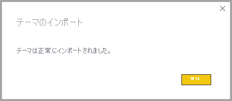
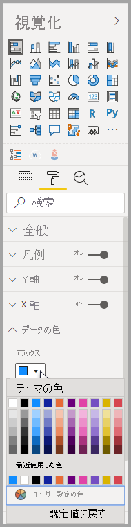
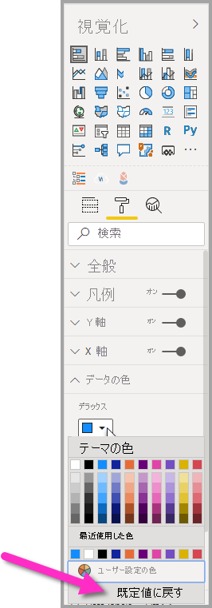

# <a name="use-report-themes-in-power-bi-desktop"></a>Power BI Desktop でレポート テーマを使用する

Power BI Desktop の "*レポート テーマ*" を使うと、コーポレート カラーを使用したり、アイコンのセットを変更したり、新しい既定のビジュアルの書式設定を適用したりなど、デザインの変更をお使いのレポート全体に適用できます。 レポート テーマを適用すると、お使いのレポートのすべてのビジュアルで、選択されたテーマの色と書式設定が既定値として使用されます。 いくつかの例外が適用されますが、それについてはこの記事の後半で説明します。

レポート テーマは **[表示]** リボンに移動し、リボンの **[テーマ]** セクションでドロップダウンの矢印ボタンを選択し、任意のテーマを選択するという方法で選択できます。 利用できるテーマは、Microsoft PowerPoint など、他の Microsoft 製品で見られるテーマに似ています。


2 種類のレポート テーマがあります。組み込みのレポート テーマとカスタムのレポート テーマ ファイルです。

- **組み込み**のレポート テーマには、Power BI Desktop と共にインストールされる、さまざまな種類の定義済みの配色が用意されています。 組み込みのレポート テーマは、Power BI Desktop のメニューから直接選択できます。

- **カスタム** レポート テーマは、現在のテーマを調整し、それをカスタム テーマとして保存するか、JSON ファイルを利用して独自のカスタマイズ テーマを作成するという方法で作成されます。 JSON ファイルでは、この記事の後半で説明しますが、レポート テーマのさまざまな面を細かく制御します。 

それでは、レポート テーマのしくみとカスタマイズ レポート テーマの作成方法を見てみましょう。


## <a name="how-report-themes-work"></a>レポート テーマのしくみ

レポート テーマを Power BI Desktop レポートに適用するには、次のいずれかのオプションから選択します。

* Power BI Desktop に組み込まれている[利用可能な組み込みレポート テーマ](#built-in-report-themes)から選択する
* **[テーマのカスタマイズ]** ダイアログを使用してテーマをカスタマイズする
* [カスタム テーマの JSON ファイルをインポートする](#import-custom-report-theme-files)

それでは、これらのオプションについてそれぞれ詳しく見ていきます。

> [!NOTE]
> テーマは、Power BI Desktop を使用する場合にのみ適用できます。 Power BI サービス内の既存のレポートにテーマを適用することはできません。 

### <a name="built-in-report-themes"></a>組み込みのレポート テーマ

使用可能な組み込みのレポート テーマから選択するには:

1. **[表示]** リボンから **[テーマ]** ドロップダウン矢印ボタン **[テーマの切り替え]** を選択します。

   

2. ドロップダウン メニューが表示されたら、付属のテーマの中から選択します。

   

   これで、そのレポート テーマがレポートに適用されます。

    次の表に、使用可能な組み込みのレポート テーマを示します。
    
    | 組み込みのレポート テーマ | 既定の色順序 |
    |------ |---------- |
    | 既定値 | |
    | Highrise (ハイライズ) | |
    | 役員 | |
    | Frontier (フロンティア)| |
    | イノベーション | |
    | Bloom (ブルーム) | |
    | Tidal (タイダル)| |
    | Temperature (温度) | |
    | Solar (太陽)| |
    | Divergent (ダイバージェント) | |
    | Storm (ストーム) | |
    | Classic (クラシック) | |
    | 公園 | |
    | 教室 | |
    | 色の識別が困難な障碍を抱えるユーザーにとって安全 | |
    | エレクトリック | |
    | ハイ コントラスト | |
    | 夕日 | |
    | トワイライト | |
    
3. Power BI コミュニティのメンバーが作成したテーマのコレクションを、テーマ ドロップダウンから **[テーマのギャラリー]** を選択するという方法で閲覧することもできます。

   

    ギャラリーから、気に入ったテーマを選択し、関連付けられている JSON ファイルをダウンロードできます。 

    ダウンロードしたファイルをインストールするには、 **[テーマ]** ドロップダウンから **[テーマを参照]** を選択し、JSON ファイルをダウンロードした場所に移動し、それを選択して Power BI Desktop に新しいテーマとしてテーマをインポートします。

    成功すると、Power BI には、インポートの成功ダイアログが表示されます。

   

## <a name="customize-report-themes"></a>レポート テーマをカスタマイズする

Power BI Desktop 内で直接カスタマイズを行うか、またはレポート テーマの JSON ファイルを使用することで、 **[視覚化]** ペインの **[書式]** セクションに一覧表示されるほぼすべての要素をカスタマイズおよび標準化できます。 目標は、レポートの既定の外観を、詳細なレベルで完全に制御できるようになることです。

レポート テーマは次の 2 つの方法でカスタマイズできます。

- [Power BI Desktop でテーマを作成およびカスタマイズする](#create-and-customize-a-theme-in-power-bi-desktop)
- [カスタムのレポート テーマの JSON ファイルを作成およびカスタマイズする](#introduction-to-report-theme-json-files)

後続のセクションでこれらの手法を交互に見ていきましょう。

### <a name="create-and-customize-a-theme-in-power-bi-desktop"></a>Power BI Desktop でテーマを作成およびカスタマイズする

Power BI Desktop でテーマを直接カスタマイズするには、目的のテーマに近いものを選択し、いくつかの調整を行います。 まず、目的のテーマに近いものを選択し、次の手順を行います (あるいは、どれでも良いので 1 つ選択し、大幅なカスタマイズを加えます)。

1. **[表示]** リボンから **[テーマ]** ドロップダウン ボタンを選択し、 **[現在のテーマのカスタマイズ]** を選択します。

   

2. ダイアログが表示されたら、そこで現在のテーマにあらゆる種類の変更を行い、設定を新しいテーマとして保存できます。

   

次のカテゴリに該当するテーマ設定をカスタマイズできます。これは **[テーマのカスタマイズ]** ウィンドウに反映されています。

- **[名前と色]** :テーマの名前と色の設定には、[テーマの色](#how-report-theme-colors-stick-with-your-reports)、センチメントの色、分岐の色、[構造色 (詳細)](#setting-structural-colors) が含まれます。
- **Text**:テキスト設定には、フォント ファミリ、サイズ、および色が含まれ、これにより、ラベル、タイトル、カードと KPI、およびタブ ヘッダーに対する[プライマリ テキスト クラスの既定値](#setting-formatted-text-defaults)が設定されます。
- **[ビジュアル]** :ビジュアルの設定には、背景、境界線、ヘッダー、ツールヒントが含まれます。
- **ページ**: ページ要素の設定には、壁紙と背景などが含まれます。
- **[フィルター ペイン]** :フィルター ペインの設定には、背景色、透明度、フォントとアイコンの色、サイズ、フィルター カードなどが含まれます。

変更が完了したら、 **[適用して保存]** を選択してテーマを保存します。 これで、ご自分のテーマを現在のレポートで使用したり、エクスポートしたりできるようになりました。

このようにして現在のテーマをカスタマイズすると、テーマをすばやく簡単にカスタマイズできます。 ただし、テーマをより細かく調整することもできます。それには、テーマの [JSON ファイル](#report-theme-json-file-format)を変更する必要があります。

> [!TIP]
> **[テーマのカスタマイズ]** ダイアログのコントロールを使用して、最も一般的なレポート テーマのオプションをカスタマイズできます。 さらに細かく制御する場合は、必要に応じて、テーマの JSON ファイルをエクスポートし、そのファイルの設定を手動で変更することで、微調整できます。 微調整した JSON ファイルの名前を変更し、後でインポートすることができます。

### <a name="import-custom-report-theme-files"></a>カスタムのレポート テーマ ファイルをインポートする

カスタム レポート テーマ ファイルを次の手順でインポートすることもできます。

1. **[表示]** リボンを選択し、 **[テーマ]** ドロップダウン ボタンから **[テーマを参照]** を選択します。

   

   表示されたウィンドウで、JSON テーマ ファイルがある場所を参照できます。

2. 次の図には、使用可能ないくつかの休暇テーマ ファイルが示されています。 3 月用の休暇のテーマ、*St Patricks Day.json* を選択します。

   

   テーマ ファイルが正常に読み込まれると、Power BI Desktop に成功メッセージが表示されます。

   

## <a name="introduction-to-report-theme-json-files"></a>レポート テーマの JSON ファイルの概要

 前のセクションで言及されている基本的な JSON ファイル (St Patricks Day.json) を開くと、次のように表示されます。

 ```json
    {
        "name": "St Patrick's Day",
        "dataColors": ["#568410", "#3A6108", "#70A322", "#915203", "#D79A12", "#bb7711", "#114400", "#aacc66"],
        "background":"#FFFFFF",
        "foreground": "#3A6108",
        "tableAccent": "#568410"
    }
```

このレポート テーマの JSON ファイルには、次の行が含まれています。

- **name**:レポート テーマの名前です。 必須フィールドはこのフィールドのみです。
- **dataColors**:Power BI Desktop ビジュアルのデータ用に使用する、色の 16 進数コードのリストです。 このリストには、必要な数の色を含めることができます。
- **background**、**firstLevelElements**、および **tableAccent** (など): 色クラスです。 色クラスを使用すると、レポート内の多くの構造色を一度に設定できます。

この JSON ファイルを基礎として使用して、インポートするカスタムのレポート テーマ ファイルを独自に作成できます。 レポートの基本色だけを調整する場合は、ファイル内の名前と 16 進コードを変更します。

レポート テーマの JSON ファイルでは、変更する書式設定のみを定義します。 この JSON ファイルで指定しないものは、すべて Power BI Desktop の既定の設定に戻ります。

JSON ファイルを作成する利点はさまざまです。 たとえば、すべてのグラフで 12 のフォント サイズを使用したり、あるビジュアルで特定のフォント ファミリを使用したり、特定の種類のグラフに対してデータ ラベルをオフにしたりするように指定できます。 JSON ファイルを使用することで、お使いのグラフやレポートを標準化するレポート テーマ ファイルを作成することができ、組織のレポートに一貫性を与えやすくなります。

JSON ファイルの形式について詳しくは、「[レポート テーマの JSON ファイル書式](#report-theme-json-file-format)」をご覧ください。

> [!NOTE]
> [ **[テーマのカスタマイズ]** ダイアログ ボックス](#create-and-customize-a-theme-in-power-bi-desktop)でのカスタム JSON レポート テーマの変更は安全です。  ダイアログでは、制御できないテーマの設定は変更されず、レポート テーマに加えられた変更がインプレースで更新されます。

## <a name="how-report-theme-colors-stick-with-your-reports"></a>レポート テーマの色がレポートに維持されるしくみ

Power BI サービスにレポートを発行するとき、お使いのレポート テーマの色は維持されます。 **[書式]** パネルの **[データの色]** セクションには、お使いのレポート テーマが反映されます。

レポート テーマで使用できる色を表示するには:

1. ビジュアルを選択します。

2. **[視覚化]** ペインの **[書式]** セクションで、 **[データの色]** を選択します。

3. 項目のドロップダウンを選択し、レポート テーマの **[テーマの色]** 情報を表示します。

   

この例では、St. Patrick's Day レポート テーマから多数の緑色と茶色を適用した後、テーマの色を表示します。 すべて緑色になっているのは、 これらの色が、インポートして適用したレポート テーマの一部であるためです。

色パレットの色は、現在のテーマによって異なります。 たとえば、あるデータ ポイントに対して、一番上の行の 3 番目の色を選択したとします。 その後、別のテーマに変更すると、そのデータ ポイントの色が自動的に更新され、新しいテーマの一番上の行の 3 番目の色になります。この動作は Microsoft Office でテーマを変更する場合と同様です。

レポートのテーマを設定すると、レポート全体のビジュアルで使用される既定の色が変更されます。 Power BI では、レポートに表示される一意の色がビジュアル内に十分に存在するように、数百の色で構成されるリストが保持されています。 Power BI でビジュアルのシリーズに色が割り当てられるときは、シリーズ色の割り当て順で色が選択されます。 テーマをインポートすると、データ シリーズの色のマッピングがリセットされます。 

Power BI では、動的なシリーズの色が追跡され、他のビジュアルの値に対して同じ色が使用されます。 *動的シリーズ*では、ビジュアルに表示されるシリーズの数は、メジャー、値、またはその他の側面によって変化する可能性があります。 たとえば、レポートに *[地域別の利益]* を表示する場合、含まれる販売地域の数は 5 であったり 9 であったりします。 地域の数は動的であるため、動的シリーズと見なされます。 

逆に、*静的シリーズ*では、シリーズの数がわかっています。 たとえば、 *[利益]* と *[収益]* は静的シリーズです。 静的シリーズの場合、Power BI ではテーマ パレット内のインデックスによって色が割り当てられます。 既定の色の割り当てをオーバーライドするには、書式設定ペインの **[データの色]** で色を選択します。 場合によっては、スライサーの選択を変更して、考えられるシリーズの値をすべて表示し、その色も設定する必要があります。 **[プロパティ]** ペインを使用して 1 つのビジュアルに色を明示的に設定した場合、インポートされたテーマは、明示的に定義された色のいずれにも適用されません。 

明示的に選択された色にテーマを適用できるようにするには、色が明示的に設定されているビジュアルに対して **[データの色]** セクションの **[既定値に戻す]** を使用して、明示的な色の適用を無効にし、テーマが適用されるようにします。


### <a name="situations-when-report-theme-colors-wont-stick-to-your-reports"></a>レポート テーマの色がレポートに維持されない状況

カラー ピッカーの **[カスタム色]** オプションを使用して、ビジュアル内の特定のデータ ポイントに、カスタム色のセット (または個別の色) を適用したとします。 レポート テーマを適用しても、そのカスタマイズしたデータ ポイントの色はオーバーライド "*されません*"。

または、 **[テーマの色]** セクションを使用して、データ ポイントの色を手動で設定する必要があるとします。 新しいレポート テーマを適用しても、それらの色は更新 "*されません*"。 既定の色に戻し、新しいレポート テーマを適用するとそれらが更新されるようにするには、カラー ピッカーで **[既定値に戻す]** を選択するか、 **[テーマの色]** パレットから色を選択します。



多くの Power BI ビジュアルでは、レポート テーマが適用されません。

## <a name="custom-report-theme-files-you-can-use-right-now"></a>今すぐ使用できるカスタムのレポート テーマ ファイル

レポート テーマの使用を開始しますか? [テーマ ギャラリー](https://community.powerbi.com/t5/Themes-Gallery/bd-p/ThemesGallery)でカスタムのレポート テーマを確認するか、以下のあらかじめ用意されているカスタムのレポート テーマの JSON ファイルをお試しください。これらは、ダウンロードしてお使いの Power BI Desktop レポートにインポートすることができます。

- [波形テーマ](https://community.powerbi.com/t5/Themes-Gallery/Waveform/m-p/140536)。 このレポート テーマは、レポート テーマの最初のリリースを発表した[ブログ記事](https://powerbi.microsoft.com/blog/power-bi-desktop-march-feature-summary/)で紹介されました。 [Waveform.json をダウンロード](https://go.microsoft.com/fwlink/?linkid=843924)。

  

- [色覚障碍対応のテーマ](https://community.powerbi.com/t5/Themes-Gallery/Color-Blind-Friendly/m-p/140597)。
このレポート テーマは、視覚障碍のある方が読みやすいものになっています。 [ColorblindSafe-Longer.json をダウンロード](https://go.microsoft.com/fwlink/?linkid=843923)。

  .

- Apothecary.json を含む Power View テーマ シリーズ。 [Power View テーマを zip ファイルでダウンロード](https://go.microsoft.com/fwlink/?linkid=843925)。

  

- バレンタイン デーのテーマ。

  

  バレンタイン デーの JSON ファイルのコードを次に示します。

   ```json
       {
           "name": "Valentine's Day",
           "dataColors": ["#990011", "#cc1144", "#ee7799", "#eebbcc", "#cc4477", "#cc5555", "#882222", "#A30E33"],
           "background":"#FFFFFF",
           "foreground": "#ee7799",
           "tableAccent": "#990011"
       }
   ```

手始めに使うのに適したレポート テーマをいくつか次に示します。

- [ヒマワリ トワイライト](https://community.powerbi.com/t5/Themes-Gallery/Sunflower-Twilight/m-p/140749)
- [プラム](https://community.powerbi.com/t5/Themes-Gallery/Plum/m-p/140711)
- [秋](https://community.powerbi.com/t5/Themes-Gallery/Autumn/m-p/140746)
- [ハイ コントラスト](https://community.powerbi.com/t5/Themes-Gallery/Color-Blind-Friendly/m-p/140597)

レポート テーマを使用すると、お使いの Power BI Desktop レポートに、ご自身や組織、さらには現在の季節や休暇などを色鮮やかに反映させることができます。

## <a name="export-report-themes"></a>レポート テーマをエクスポートする

現在適用されているレポート テーマを直接、Power BI Desktop から JSON ファイルにエクスポートできます。 レポート テーマをエクスポートした後、他のレポートでそれを再利用できます。 このオプションを使用すると、ほとんどの組み込みテーマの JSON ファイルをエクスポートできます。 唯一の例外は基本テーマ (Classic および Default) です。インポートされた他のテーマは、これらを基礎とします。

現在適用されているテーマを Power BI Desktop からエクスポートするには:

1. **[ファイル]**  >  **[オプションと設定]**  >  **[オプション]** の順に選択します。

2. **[プレビュー機能]** セクションで、 **[現在のテーマのカスタマイズ]** を選択してから、 **[OK]** を選択します。

   プレビュー機能を有効にするために、Power BI Desktop を再起動するように求められる場合があります。 再起動したら、現在適用されているテーマのエクスポートを開始できます。

3. **[ホーム]** リボンから、 **[テーマの切り替え]**  >  **[現在のテーマのエクスポート]** の順に選択します。

4. **[名前を付けて保存]** ダイアログ ボックスから JSON ファイルを保存するディレクトリを参照して、 **[保存]** を選択します。

## <a name="report-theme-json-file-format"></a>レポート テーマの JSON ファイル書式

最も基本的なレベルにおいて、テーマの JSON ファイルに必須の行は、**name** の 1 つだけです。

```json
{
    "name": "Custom Theme"
}
```

**name** 以外はすべて省略可能です。つまり、具体的に書式設定したいプロパティだけを自由にテーマ ファイルに追加し、残りについては引き続き Power BI の既定値を使用することができます。

### <a name="setting-theme-colors"></a>テーマの色の設定

**name** の下には、基本的なデータの色に関連する次のプロパティを追加できます。

- **dataColors**:Power BI Desktop のビジュアルのデータを表す、図形の色を設定するために使用する色の 16 進数コードのリスト。 このリストには、必要な数の色を含めることができます。 このリストのすべての色を使用したうえで、ビジュアルにさらに色が必要な場合は、Power BI の既定の色パレットの使用に戻ります。
- **good**、**neutral**、**bad**:これらのプロパティを使って、ウォーターフォール図や KPI ビジュアルで使用される状態の色を設定できます。
- **maximum**、**center**、**minimum**、**null**:これらの色を使って、条件付き書式設定ダイアログ ボックスのさまざまなグラデーション色を設定できます。

これらの色が定義されている基本的なテーマは、次のようになる可能性があります。

```json
{
    "name": "Custom Theme",
    "dataColors": [
        "#118DFF",
        "#12239E",
        "#E66C37",
        "#6B007B",
        "#E044A7",
        "#744EC2",
        "#D9B300",
        "#D64550",
        "#197278",
        "#1AAB40"
    ],
    "good": "#1AAB40",
    "neutral": "#D9B300",
    "bad": "#D64554",
    "maximum": "#118DFF",
    "center": "#D9B300",
    "minimum": "#DEEFFF",
    "null": "#FF7F48"
}
```

### <a name="setting-structural-colors"></a>構造色の設定

次に、**background** や **firstLevelElements** など、さまざまな色クラスを追加できます。 これらの色クラスでは、ビジュアル要素の軸グリッド線、強調表示色、背景色など、レポート内の要素の構造色を設定します。

次の表は、書式設定できる 6 つの色クラスを示しています。  **色クラス**の名前は、[ **[テーマのカスタマイズ]** ダイアログボックス](#create-and-customize-a-theme-in-power-bi-desktop)にある [名前と色] セクションの [詳細] サブセクションの名前に対応しています。

|色クラス  |書式設定の対象  |
|---------|---------|
| **firstLevelElements** <br> **foreground**    (非推奨) | ラベルの背景色 (外部データ ポイントの場合) <br> 傾向線の色 <br>  テキスト ボックスの既定の色 <br> テーブルとマトリックスの値および合計のフォントの色、データ バーの軸の色 <br> カードのデータ ラベル <br> ゲージ コールアウトの値の色 <br> KPI 目標の色 <br>  KPI テキストの色 <br> スライサー項目の色 (フォーカス モードの場合)  <br> スライサー ドロップダウン項目のフォントの色 <br> スライサー数値入力のフォントの色 <br> スライサー ヘッダーのフォントの色 <br> 散布図の比率の線の色 <br> 折れ線グラフの予測線の色 <br> マップの引き出し線の色 <br> フィルター ウィンドウとカードのテキストの色|
| **secondLevelElements** <br> **foregroundNeutralSecondary** (非推奨) | "light" [セカンダリ テキスト クラス](#setting-formatted-text-defaults) <br> ラベルの色  <br> 凡例ラベルの色 <br> 軸ラベルの色 <br> テーブルとマトリックスのヘッダーのフォントの色 <br> ゲージ ターゲットとターゲットの引き出し線の色 <br>  KPI の傾向軸の色 <br> スライサーのスライダーの色 <br> スライサー項目のフォントの色 <br> スライサーの枠線の色 <br> 折れ線のグラフポイント時の色 <br> 複数行カードのタイトルの色 <br> リボン グラフの線の色 <br> 図形マップの境界線の色 <br> ボタン テキストのフォントの色 <br> ボタン アイコンの線の色 <br> ボタンの枠線の色 |
| **thirdLevelElements** <br >**backgroundLight** (非推奨) | 軸のグリッド線の色 <br> テーブルとマトリックスのグリッドの色 <br> スライサー ヘッダーの背景色 (フォーカス モードの場合)  <br> 複数行カードの枠線の色  <br> 図形の塗りつぶしの色 <br> ゲージの円弧の背景色 <br> 適用されたフィルター カードの背景色 <br> 背景 = FFFFFF の場合: <br> ボタンの塗りつぶしの色は無効 <br> ボタンの枠線の色は無効 <br> |
| **fourthLevelElements** <br> **foregroundNeutralTertiary** (非推奨) | 凡例の淡色表示の色 <br> カードのカテゴリ ラベルの色 <br> 複数行カードのカテゴリ ラベルの色 <br> 複数行カードのバーの色 <br> じょうごグラフの変換率の線の色 <br> ボタン テキストのフォントの色は無効 <br> ボタン アイコンの線の色は無効 <br> |
| **background** | ラベルの背景色 (内部データ ポイントの場合) <br> スライサーのドロップダウン項目の背景色  <br> ドーナツ グラフの線の色 <br> ツリーマップの線の色 <br> 複合グラフの背景色 <br> ボタンの塗りつぶしの色 <br> フィルター ウィンドウと使用可能なフィルター カードの背景色 |
| **secondaryBackground** <br> **backgroundNeutral** (非推奨) | テーブルとマトリックスのグリッドの枠線の色 <br> 図形マップの既定の色 <br> リボン グラフのリボンの塗りつぶしの色 (系列一致オプションがオフになっている場合) <br> 背景 != FFFFFF の場合: <br> ボタンの塗りつぶしの色は無効 <br> ボタンの枠線の色は無効 <br> |
| **tableAccent** | テーブルとマトリックスのグリッドの枠線の色をオーバーライドする (存在する場合) |

色クラスを設定するサンプル テーマを次に示します。

```json
{
    "name": "Custom Theme",
    "firstLevelElements": "#252423",
    "secondLevelElements": "#605E5C",
    "thirdLevelElements": "#F3F2F1",
    "fourthLevelElements": "#B3B0AD",
    "background": "#FFFFFF",
    "secondaryBackground": "#C8C6C4",
    "tableAccent": "#118DFF"
}
```

> [!TIP]
> "濃色のテーマ"、または "白" の **background** スタイル上の一般的な "黒" の **firstLevelElements** とは異なるその他のカラフルなテーマを作成する場合は、必ず、他の構造色と[プライマリ テキスト クラスの色](#setting-formatted-text-defaults)の値も設定してください。  これにより確実に、(たとえば) ラベルの背景があるグラフのデータ ラベルが予測されるスタイルと一致して読み取り可能となり、軸のグリッド線が表示されるようになります。

### <a name="setting-formatted-text-defaults"></a>書式設定されたテキストの既定値の設定

次に、JSON ファイルにテキスト クラスを追加できます。 テキスト クラスは、色クラスに似ていますが、レポート全体でテキストのグループに対するフォント サイズ、色、およびファミリを更新できるように設計されています。

テキスト クラスは 12 個ありますが、レポート内のすべてのテキストの書式設定を変更するために設定する必要があるのは、"*プライマリ クラス*" と呼ばれる 4 つのクラスだけです。  これら 4 つのプライマリ クラスは、[ **[テーマのカスタマイズ]** ](#create-and-customize-a-theme-in-power-bi-desktop) ダイアログ ボックスの [テキスト] セクションで設定できます。[全般] は **label**、[タイトル] は **title**、[カードと KPI] は **callout**、[タブ ヘッダー] は **header** に対応します。

"*セカンダリ クラス*" と見なされる他のテキスト クラスのプロパティは、関連付けられているプライマリ クラスから自動的に派生されます。 多くの場合、セカンダリ クラスでは、プライマリ クラスと比較して、より明るい網掛けのテキストの色や、ある割合で拡大または縮小されたテキスト サイズが選択されます。

"**ラベル**" クラスを例にして説明します。 **ラベル** クラスの既定の書式設定は、Segoe UI、#252423 (濃い灰色)、12 ポイントです。 このクラスは、テーブルとマトリックスの値の書式を設定するために使用されます。 通常、テーブルまたはマトリックスの合計には同様の書式が設定されますが、目立つように**太字ラベル** クラスを使って太字になっています。ただし、テーマの JSON でそのクラスを指定する必要はありません。Power BI によって自動的にそれが行われます。 後ほどお使いのテーマに 14 ポイントのフォントのラベルを指定する場合、**太字ラベル** クラスも更新する必要はありません。**ラベル** クラスからテキストの書式設定が継承されるためです。

以下の表には、次の情報が示されています。

- 4 つの各プライマリ テキスト クラス、それで設定される書式、およびその既定の設定
- 各セカンダリ クラス、それで設定される書式、プライマリ クラスと比較して異なる既定の設定

|プライマリ クラス  |セカンダリ クラス  |JSON クラス名  | 既定の設定  |関連付けられているビジュアル オブジェクト  |
|---------|---------|---------|---------|---------|
| コールアウト | 該当なし | callout | DIN <br> #252423 <br> 45 ポイント |カードのデータ ラベル <br> KPI インジケーター|
|ヘッダー|該当なし|header|Segoe UI Semibold <br> #252423 <br> 12 ポイント |主要インフルエンサーのヘッダー |
| タイトル || title |DIN <br> #252423 <br> 12 ポイント |カテゴリ軸のタイトル <br> 値軸のタイトル <br> 複数行カードのタイトル* <br> スライサー ヘッダー|
|-| 大きいタイトル | largeTitle |14 ポイント |ビジュアル タイトル |
|ラベル ||label |Segoe UI<br>#252423<br>10 ポイント |テーブルとマトリックスの列見出し <br> マトリックスの行見出し<br>テーブルとマトリックスのグリッド<br>テーブルとマトリックスの値 |
|-|中太字 |semiboldLabel| Segoe UI Semibold | 主要インフルエンサーのプロファイル テキスト
|-|大 |largeLabel |12 ポイント | 複数行カードのデータ ラベル |
|-|小 |smallLabel |9 ポイント |参照線のラベル* <br>スライサーの日付範囲ラベル<br> スライサーの数値入力のテキスト スタイル<br>スライサーの検索ボックス<br>主要インフルエンサーのインフルエンサー テキスト|
|-|明るい |lightLabel |#605E5C |凡例のテキスト<br>ボタンのテキスト<br>カテゴリ軸のタイトル<br>じょうごグラフのデータ ラベル<br>じょうごグラフの変換率のラベル<br>ゲージ ターゲット<br>散布図のカテゴリ ラベル<br>スライサー項目|
|-|太字 |boldLabel |Segoe UI Bold |マトリックスの小計<br>マトリックスの総計<br>テーブルの合計 |
|-|大で明るい |largeLightLabel |#605E5C<br>12 ポイント |カードのカテゴリ ラベル<br>ゲージ ラベル<br>複数行カードのカテゴリ ラベル |
|-|小で明るい |smallLightLabel |#605E5C<br>9 ポイント |データ ラベル<br>値軸のラベル|

*\* 星印の付いた項目も、レポート テーマの最初のデータ色に基づいて色付けされます。*

> [!TIP]
> テキスト クラスの "*明るい*" バリエーションでは、上記に定義されている[構造色](#setting-structural-colors)の明るい色を使用します。  "濃色のテーマ" を作成する場合は、必ず、"firstLevelElements" (プライマリ テキストの色と一致)、"secondLevelElements" (テキストに対して予測される "明るい" 色と一致)、および "background" (コントラストが最初と 2 番目のレベルの要素の色の両方に対して十分である) の色も設定してください。

プライマリ テキスト クラスのみを設定するテーマの例を次に示します。

```json
{
    "name": "Custom Theme",
    "textClasses": {
        "callout": {
            "fontSize": 45,
            "fontFace": "DIN",
            "color": "#252423"
        },
        "title": {
            "fontSize": 12,
            "fontFace": "DIN",
            "color": "#252423"
        },
        "header": {
            "fontSize": 12,
            "fontFace": "Segoe UI Semibold",
            "color": "#252423"
        },
        "label": {
            "fontSize": 10,
            "fontFace": "Segoe UI",
            "color": "#252423"
        }
    }
}
```

セカンダリ クラスはプライマリ クラスから継承されるため、テーマ ファイル内でそれらを設定する必要はありません。 しかし、その継承規則を使用したくない場合 (たとえば、テーブルの合計をその値の太字バージョンにしたくない場合など) は、プライマリ クラスの書式設定と同様に、テーマ ファイルでセカンダリ クラスを明示的に書式設定できます。

### <a name="setting-visual-property-defaults-visualstyles"></a>視覚エフェクトのプロパティの既定値の設定 (`visualStyles`)

最後に、レポートのすべてのビジュアルの書式設定がより細かく制御された、拡張形式の JSON ファイルを作成するには、JSON ファイルに **visualStyles** セクションを追加して、書式設定の詳細を入れ子にします。 **visualStyles** セクションのテンプレート化された例を以下に示します。

```json
    "visualStyles": {
        "<visualName>": {
            "<styleName>": {
                "<cardName>": [{
                    "<propertyName>": <propertyValue>
                }]
            }
        }
    }
```

**VisualName** セクションと **cardName** セクションでは、特定のビジュアルとカード名を使用します。 現在、**styleName** は常にアスタリスク (*) ですが、今後のリリースでは、ビジュアル用に異なるスタイルを作成し、名前を付けることができるようになります (テーブルとマトリックスのスタイル機能に似ています)。 **propertyName** は書式設定オプションの名前であり、**propertyValue** はその書式設定オプションの値です。

**visualName** と **cardName** については、プロパティを持つすべてのビジュアルまたはカードにその設定を適用する場合は、引用符で囲んだアスタリスクを使用します。 ビジュアル名とカード名の両方にアスタリスクを使用すると、実質的に、レポート内でグローバルに設定を適用することになります (すべてのビジュアルのすべてのテキストに対するフォント サイズや特定のフォント ファミリなど)。

ビジュアル スタイルを使用していくつかのプロパティを設定する例を次に示します。

```json
{
   "name":"Custom Theme",
   "visualStyles":{
      "*": {
         "*": {
            "*": [{
                "wordWrap": true
            }],
            "categoryAxis": [{
                "gridlineStyle": "dotted"
            }],
            "filterCard": [
              {
                "$id": "Applied",
                "foregroundColor": {"solid": {"color": "#252423" } }
              },
              {
                "$id":"Available",
                "border": true
              }
            ]
         }
      },
      "scatterChart": {
         "*": {
            "bubbles": [{
                  "bubbleSize": -10
            }]
         }
      }
   }
}
```

この例では、次の設定が行われます。

- すべての場所で右端での折り返しを有効にする
- カテゴリ軸があるすべてのビジュアルで、グリッド線のスタイルを点線に設定する
- 使用可能および適用済みのフィルター カードのいくつかの書式を設定する ("$id" を使用して異なるバージョンのフィルター カードを設定している書式設定に注意してください)
- 散布図のバブル サイズを -10 に設定する。

> [!NOTE]
> 調整したい書式設定要素を指定するだけでかまいません。 JSON ファイルに含まれていない書式設定要素は、既定の値と設定に戻ります。

### <a name="visualstyles-definition-list"></a>`visualStyles` 定義リスト

このセクションの表では、視覚エフェクトの名前 (**visualName**)、カードの名前 (**cardName**)、プロパティの名前 (**propertyName**)、および JSON ファイルの作成に必要な列挙を定義します。

| visualName の値 |
| --- |
| areaChart |
| barChart |
| basicShape |
| card |
| clusteredBarChart |
| clusteredColumnChart |
| columnChart |
| comboChart |
| donutChart |
| filledMap |
| funnel |
| gauge |
| hundredPercentStackedBarChart |
| hundredPercentStackedColumnChart |
| image |
| KPI |
| lineChart |
| lineClusteredColumnComboChart |
| lineStackedColumnComboChart |
| map |
| multiRowCard |
| pieChart |
| pivotTable |
| ribbonChart |
| scatterChart |
| shapeMap |
| slicer |
| stackedAreaChart |
| tableEx |
| treemap |
| waterfallChart |

次の表では、**cardName** 値を定義します。 各セルの最初の値は、JSON ファイルでの用語です。 2 番目の値は、Power BI Desktop のユーザー インターフェイスで表示されるカードの名前です。

| cardName の値 |
| --- |
| axis:ゲージの軸 |
| breakdown:詳細 |
| bubbles:バブル |
| calloutValue:吹き出しの値 |
| card:カード |
| cardTitle:カード タイトル |
| categoryAxis:X 軸 |
| categoryLabels:カテゴリ ラベル |
| columnFormatting:フィールドの書式 |
| columnHeaders:列見出し |
| dataLabels:データ ラベル |
| fill:塗りつぶし |
| fillPoint:フィル ポイント |
| forecast:予測 |
| general:全般 |
| goals:目標 |
| grid:グリッド |
| header:ヘッダー |
| imageScaling:スケーリング |
| indicator:インジケーター |
| items:項目 |
| labels:データ ラベル |
| legend:凡例 |
| lineStyles:図形 |
| mapControls:マップの制御 |
| mapStyles:マップ スタイル |
| numericInputStyle:数値入力 |
| percentBarLabel:コンバージョン レート ラベル |
| plotArea:プロット エリア |
| plotAreaShading:対称網掛け |
| ratioLine:比率線 |
| referenceLine:定数線 |
| ribbonChart:リボン |
| rotation:回転 |
| rowHeaders:行見出し |
| selection:選択範囲のコントロール |
| sentimentColors:センチメント カラー |
| shape:図形 |
| slider:スライダー |
| status:色の設定 |
| subTotals:小計 |
| target:ターゲット |
| total:総計 |
| trend:傾向線 |
| trendline:トレンド軸 |
| valueAxis:Y 軸 |
| values:値 |
| wordWrap:右端での折り返し |
| xAxisReferenceLine:X 軸の定数線 |
| y1AxisReferenceLine:定数線 |
| zoom:ズーム |

### <a name="properties-within-each-card"></a>各カード内のプロパティ

次のセクションでは、各カードに含まれるプロパティを定義します。 カード名の後で各プロパティ名を指定します。 プロパティごとに、書式設定ペインが表示される場合に表示される名前、書式設定オプションの動作の説明、および書式設定オプションの種類を指定します。 この方法により、テーマ ファイルで使用できる値の種類を知ることができます。

**dateTime** を使用するときは、日付は ISO 日付にして一重引用符を付けます。また、datetime を先頭に付けます。 次の例を参照してください。

  "datetime'2011-10-05T14:48:00.000Z'"

ブール値は true または false です。 文字列は、"this is a string" のように、二重引用符で囲む必要があります。 数値は、引用符のない値自体だけです。

色では、次の形式が使用されます。カスタムの 16 進数コードによって "FFFFFF" が置き換えられる例を次に示します。

    { "solid": { "color": "#FFFFFF" } }

ドロップダウン書式設定オプションで最もよく使用される列挙値は、ペインに表示される任意のオプションに設定できます。たとえば、凡例の位置に対する "RightCenter" や、円データ ラベルに対する "Data value, percent of total" などです。 列挙オプションは、プロパティ リストの後で示します。

```json
{
      "general":{
        "responsive": {
          "type": [
            "bool"
          ],
          "displayName": [
            "(Preview) Responsive"
          ],
          "description": [
            "The visual will adapt to size changes"
          ]
        },
        "legend": {
        "show": {
          "type": [
            "bool"
          ],
          "displayName": [
            "Show"
          ]
        },
        "position": {
          "type": [
            "enumeration"
          ],
          "displayName": [
            "Position"
          ],
          "description": [
            "Select the location for the legend"
          ]
        },
        "showTitle": {
          "type": [
            "bool"
          ],
          "displayName": [
            "Title"
          ],
          "description": [
            "Display a title for legend symbols"
          ]
        },
        "labelColor": {
          "type": [
            "fill"
          ],
          "displayName": [
            "Color"
          ]
        },
        "fontFamily": {
          "type": [
            "formatting"
          ],
          "displayName": [
            "Font family"
          ]
        },
        "fontSize": {
          "type": [
            "formatting"
          ],
          "displayName": [
            "Text Size"
          ]
        }
      },
      "categoryAxis": {
        "show": {
          "type": [
            "bool"
          ],
          "displayName": [
            "Show"
          ]
        },
        "axisScale": {
          "type": [
            "enumeration"
          ],
          "displayName": [
            "Scale type"
          ]
        },
        "start": {
          "type": [
            "numeric",
            "dateTime"
          ],
          "displayName": [
            "Start"
          ],
          "description": [
            "Enter a starting value (optional)"
          ]
        },
        "end": {
          "type": [
            "numeric",
            "dateTime"
          ],
          "displayName": [
            "End"
          ],
          "description": [
            "Enter an ending value (optional)"
          ]
        },
        "axisType": {
          "type": [
            "enumeration"
          ],
          "displayName": [
            "Type"
          ]
        },
        "showAxisTitle": {
          "type": [
            "bool"
          ],
          "displayName": [
            "Title"
          ],
          "description": [
            "Title for the X-axis",
            "Title for the Y-axis"
          ]
        },
        "axisStyle": {
          "type": [
            "enumeration"
          ],
          "displayName": [
            "Style"
          ]
        },
        "labelColor": {
          "type": [
            "fill"
          ],
          "displayName": [
            "Color"
          ]
        },
        "fontFamily": {
          "type": [
            "formatting"
          ],
          "displayName": [
            "Font family"
          ]
        },
        "fontSize": {
          "type": [
            "formatting"
          ],
          "displayName": [
            "Text Size"
          ]
        },
        "labelDisplayUnits": {
          "type": [
            "formatting"
          ],
          "displayName": [
            "Display units"
          ],
          "description": [
            "Select the units (millions, billions, etc.)"
          ]
        },
        "labelPrecision": {
          "type": [
            "numeric"
          ],
          "displayName": [
            "Value decimal places"
          ],
          "description": [
            "Select the number of decimal places to display for the values"
          ]
        },
        "concatenateLabels": {
          "type": [
            "bool"
          ],
          "displayName": [
            "Concatenate labels"
          ],
          "description": [
            "Always concatenate levels of the hierarchy instead of drawing the hierarchy."
          ]
        },
        "preferredCategoryWidth": {
          "type": [
            "numeric"
          ],
          "displayName": [
            "Minimum category width"
          ]
        },
        "titleColor": {
          "type": [
            "fill"
          ],
          "displayName": [
            "Title color"
          ]
        },
        "titleFontFamily": {
          "type": [
            "formatting"
          ],
          "displayName": [
            "Font family"
          ]
        },
        "titleFontSize": {
          "type": [
            "formatting"
          ],
          "displayName": [
            "Title text size"
          ]
        },
        "position": {
          "type": [
            "enumeration"
          ],
          "displayName": [
            "Position"
          ],
          "description": [
            "Select left or right"
          ]
        },
        "color": {
          "type": [
            "fill"
          ],
          "displayName": [
            "Color"
          ],
          "description": [
            "Select color for data labels"
          ]
        },
        "duration": {
          "type": [
            "numeric"
          ]
        }
      },
      "valueAxis": {
        "show": {
          "type": [
            "bool"
          ],
          "displayName": [
            "Show"
          ]
        },
        "position": {
          "type": [
            "enumeration"
          ],
          "displayName": [
            "Position"
          ],
          "description": [
            "Select left or right"
          ]
        },
        "axisScale": {
          "type": [
            "enumeration"
          ],
          "displayName": [
            "Scale type"
          ]
        },
        "start": {
          "type": [
            "numeric",
            "dateTime"
          ],
          "displayName": [
            "Start"
          ],
          "description": [
            "Enter a starting value (optional)"
          ]
        },
        "end": {
          "type": [
            "numeric",
            "dateTime"
          ],
          "displayName": [
            "End"
          ],
          "description": [
            "Enter an ending value (optional)"
          ]
        },
        "showAxisTitle": {
          "type": [
            "bool"
          ],
          "displayName": [
            "Title"
          ],
          "description": [
            "Title for the Y-axis",
            "Title for the X-axis"
          ]
        },
        "axisStyle": {
          "type": [
            "enumeration"
          ],
          "displayName": [
            "Style"
          ]
        },
        "labelColor": {
          "type": [
            "fill"
          ],
          "displayName": [
            "Color"
          ]
        },
        "fontFamily": {
          "type": [
            "formatting"
          ],
          "displayName": [
            "Font family"
          ]
        },
        "fontSize": {
          "type": [
            "formatting"
          ],
          "displayName": [
            "Text Size"
          ]
        },
        "labelDisplayUnits": {
          "type": [
            "formatting"
          ],
          "displayName": [
            "Display units"
          ],
          "description": [
            "Select the units (millions, billions, etc.)"
          ]
        },
        "labelPrecision": {
          "type": [
            "numeric"
          ],
          "displayName": [
            "Value decimal places"
          ],
          "description": [
            "Select the number of decimal places to display for the values"
          ]
        },
        "titleColor": {
          "type": [
            "fill"
          ],
          "displayName": [
            "Title color"
          ]
        },
        "titleFontFamily": {
          "type": [
            "formatting"
          ],
          "displayName": [
            "Font family"
          ]
        },
        "titleFontSize": {
          "type": [
            "formatting"
          ],
          "displayName": [
            "Title text size"
          ]
        },
        "axisLabel": {
          "type": [
            "none"
          ],
          "displayName": [
            "Y-Axis (Column)"
          ]
        },
        "secShow": {
          "type": [
            "bool"
          ],
          "displayName": [
            "Show secondary"
          ]
        },
        "alignZeros": {
          "type": [
            "bool"
          ],
          "displayName": [
            "Align zeros"
          ],
          "description": [
            "Align the zero tick marks for both value axes"
          ]
        },
        "secAxisLabel": {
          "type": [
            "none"
          ],
          "displayName": [
            "Y-Axis (Line)"
          ]
        },
        "secPosition": {
          "type": [
            "enumeration"
          ],
          "displayName": [
            "Position"
          ],
          "description": [
            "Select left or right"
          ]
        },
        "secAxisScale": {
          "type": [
            "enumeration"
          ],
          "displayName": [
            "Scale type"
          ]
        },
        "secStart": {
          "type": [
            "numeric"
          ],
          "displayName": [
            "Start"
          ],
          "description": [
            "Enter a starting value (optional)"
          ]
        },
        "secEnd": {
          "type": [
            "numeric"
          ],
          "displayName": [
            "End"
          ],
          "description": [
            "Enter an ending value (optional)"
          ]
        },
        "secShowAxisTitle": {
          "type": [
            "bool"
          ],
          "displayName": [
            "Title"
          ],
          "description": [
            "Title for the Y-axis"
          ]
        },
        "secAxisStyle": {
          "type": [
            "enumeration"
          ],
          "displayName": [
            "Style"
          ]
        },
        "secLabelColor": {
          "type": [
            "fill"
          ],
          "displayName": [
            "Color"
          ]
        },
        "secFontFamily": {
          "type": [
            "formatting"
          ],
          "displayName": [
            "Font family"
          ]
        },
        "secFontSize": {
          "type": [
            "formatting"
          ],
          "displayName": [
            "Text Size"
          ]
        },
        "secLabelDisplayUnits": {
          "type": [
            "formatting"
          ],
          "displayName": [
            "Display units"
          ],
          "description": [
            "Select the units (millions, billions, etc.)"
          ]
        },
        "secLabelPrecision": {
          "type": [
            "numeric"
          ],
          "displayName": [
            "Value decimal places"
          ],
          "description": [
            "Select the number of decimal places to display for the values"
          ]
        },
        "secTitleColor": {
          "type": [
            "fill"
          ],
          "displayName": [
            "Title color"
          ]
        },
        "secTitleFontFamily": {
          "type": [
            "formatting"
          ],
          "displayName": [
            "Font family"
          ]
        },
        "secTitleFontSize": {
          "type": [
            "formatting"
          ],
          "displayName": [
            "Title text size"
          ]
        }
      },
      "dataPoint": {
        "defaultColor": {
          "type": [
            "fill"
          ],
          "displayName": [
            "Default color",
            "Default Column Color"
          ]
        },
        "fill": {
          "type": [
            "fill"
          ],
          "displayName": [
            "Fill"
          ]
        },
        "defaultCategoryColor": {
          "type": [
            "fill"
          ],
          "displayName": [
            "Default color",
            "Default Column Color"
          ]
        },
        "showAllDataPoints": {
          "type": [
            "bool"
          ],
          "displayName": [
            "Show all"
          ]
        }
      },
      "labels": {
        "show": {
          "type": [
            "bool"
          ],
          "displayName": [
            "Show"
          ]
        },
        "showSeries": {
          "type": [
            "bool"
          ],
          "displayName": [
            "Show"
          ]
        },
        "color": {
          "type": [
            "fill"
          ],
          "displayName": [
            "Color"
          ],
          "description": [
            "Select color for data labels"
          ]
        },
        "labelDisplayUnits": {
          "type": [
            "formatting"
          ],
          "displayName": [
            "Display units"
          ],
          "description": [
            "Select the units (millions, billions, etc.)"
          ]
        },
        "labelPrecision": {
          "type": [
            "numeric"
          ],
          "displayName": [
            "Value decimal places"
          ],
          "description": [
            "Select the number of decimal places to display for the values"
          ]
        },
        "showAll": {
          "type": [
            "bool"
          ],
          "displayName": [
            "Customize series"
          ]
        },
        "fontSize": {
          "type": [
            "formatting"
          ],
          "displayName": [
            "Text Size"
          ]
        },
        "fontFamily": {
          "type": [
            "formatting"
          ],
          "displayName": [
            "Font family"
          ]
        },
        "labelDensity": {
          "type": [
            "formatting"
          ],
          "displayName": [
            "Label density"
          ]
        },
        "labelOrientation": {
          "type": [
            "enumeration"
          ],
          "displayName": [
            "Orientation"
          ]
        },
        "labelPosition": {
          "type": [
            "enumeration"
          ],
          "displayName": [
            "Position"
          ]
        },
        "percentageLabelPrecision": {
          "type": [
            "numeric"
          ],
          "displayName": [
            "% decimal places"
          ],
          "description": [
            "Select the number of decimal places to display for the percentages"
          ]
        },
        "labelStyle": {
          "type": [
            "enumeration"
          ],
          "displayName": [
            "Label style"
          ]
        }
      },
      "lineStyles": {
        "strokeWidth": {
          "type": [
            "numeric"
          ],
          "displayName": [
            "Stroke width"
          ]
        },
        "strokeLineJoin": {
          "type": [
            "enumeration"
          ],
          "displayName": [
            "Join type"
          ]
        },
        "lineStyle": {
          "type": [
            "enumeration"
          ],
          "displayName": [
            "Line style"
          ]
        },
        "showMarker": {
          "type": [
            "bool"
          ],
          "displayName": [
            "Show marker"
          ]
        },
        "markerShape": {
          "type": [
            "enumeration"
          ],
          "displayName": [
            "Marker shape"
          ]
        },
        "markerSize": {
          "type": [
            "numeric"
          ],
          "displayName": [
            "Marker size"
          ]
        },
        "markerColor": {
          "type": [
            "fill"
          ],
          "displayName": [
            "Marker color"
          ]
        },
        "showSeries": {
          "type": [
            "bool"
          ],
          "displayName": [
            "Customize series",
            "Show"
          ]
        },
        "shadeArea": {
          "type": [
            "bool"
          ],
          "displayName": [
            "Shade area"
          ]
        }
      },
      "plotArea": {
        "transparency": {
          "type": [
            "numeric"
          ],
          "displayName": [
            "Transparency"
          ],
          "description": [
            "Set transparency for background color"
          ]
        }
      },
      "trend": {
        "show": {
          "type": [
            "bool"
          ],
          "displayName": [
            "Show"
          ]
        },
        "displayName": {
          "type": [
            "text"
          ],
          "displayName": [
            "Name"
          ],
          "description": [
            "Set trend line name"
          ]
        },
        "lineColor": {
          "type": [
            "fill"
          ],
          "displayName": [
            "Color"
          ],
          "description": [
            "Set trend line color"
          ]
        },
        "transparency": {
          "type": [
            "numeric"
          ],
          "displayName": [
            "Transparency"
          ],
          "description": [
            "Set transparency for trend line color"
          ]
        },
        "style": {
          "type": [
            "enumeration"
          ],
          "displayName": [
            "Style"
          ],
          "description": [
            "Set trend line style"
          ]
        },
        "combineSeries": {
          "type": [
            "bool"
          ],
          "displayName": [
            "Combine Series"
          ],
          "description": [
            "Show one trend line per series or combine"
          ]
        }
      },
      "y1AxisReferenceLine": {
        "show": {
          "type": [
            "bool"
          ],
          "displayName": [
            "Show"
          ]
        },
        "value": {
          "type": [
            "numeric"
          ],
          "displayName": [
            "Value"
          ],
          "description": [
            "Set reference line numeric value"
          ]
        },
        "lineColor": {
          "type": [
            "fill"
          ],
          "displayName": [
            "Color"
          ],
          "description": [
            "Set reference line color"
          ]
        },
        "transparency": {
          "type": [
            "numeric"
          ],
          "displayName": [
            "Transparency"
          ],
          "description": [
            "Set transparency for reference line color"
          ]
        },
        "style": {
          "type": [
            "enumeration"
          ],
          "displayName": [
            "Line style"
          ]
        },
        "position": {
          "type": [
            "enumeration"
          ],
          "displayName": [
            "Position"
          ],
          "description": [
            "Arrange relative to chart data points"
          ]
        },
        "dataLabelShow": {
          "type": [
            "bool"
          ],
          "displayName": [
            "Data label"
          ],
          "description": [
            "Display a data label for the reference line"
          ]
        },
        "dataLabelColor": {
          "type": [
            "fill"
          ],
          "displayName": [
            "Color"
          ],
          "description": [
            "Set the reference line data label color"
          ]
        },
        "dataLabelDecimalPoints": {
          "type": [
            "numeric"
          ],
          "displayName": [
            "Decimal Places"
          ]
        },
        "dataLabelHorizontalPosition": {
          "type": [
            "enumeration"
          ],
          "displayName": [
            "Horizontal Position"
          ],
          "description": [
            "Set the horizontal position for the reference line data label"
          ]
        },
        "dataLabelVerticalPosition": {
          "type": [
            "enumeration"
          ],
          "displayName": [
            "Vertical Position"
          ],
          "description": [
            "Set the vertical position for the reference line data label"
          ]
        },
        "dataLabelDisplayUnits": {
          "type": [
            "formatting"
          ],
          "displayName": [
            "Display units"
          ],
          "description": [
            "Select the units (millions, billions, etc.)"
          ]
        }
      },
      "referenceLine": {
        "show": {
          "type": [
            "bool"
          ],
          "displayName": [
            "Show"
          ]
        },
        "displayName": {
          "type": [
            "text"
          ],
          "displayName": [
            "Name"
          ],
          "description": [
            "Set reference line name"
          ]
        },
        "value": {
          "type": [
            "numeric"
          ],
          "displayName": [
            "Value"
          ],
          "description": [
            "Set reference line numeric value"
          ]
        },
        "lineColor": {
          "type": [
            "fill"
          ],
          "displayName": [
            "Color"
          ],
          "description": [
            "Set reference line color"
          ]
        },
        "transparency": {
          "type": [
            "numeric"
          ],
          "displayName": [
            "Transparency"
          ],
          "description": [
            "Set transparency for reference line color"
          ]
        },
        "style": {
          "type": [
            "enumeration"
          ],
          "displayName": [
            "Line style"
          ]
        },
        "position": {
          "type": [
            "enumeration"
          ],
          "displayName": [
            "Position"
          ],
          "description": [
            "Arrange relative to chart data points"
          ]
        },
        "dataLabelShow": {
          "type": [
            "bool"
          ],
          "displayName": [
            "Data label"
          ],
          "description": [
            "Display a data label for the reference line"
          ]
        },
        "dataLabelColor": {
          "type": [
            "fill"
          ],
          "displayName": [
            "Color"
          ],
          "description": [
            "Set the reference line data label color"
          ]
        },
        "dataLabelDecimalPoints": {
          "type": [
            "numeric"
          ],
          "displayName": [
            "Decimal Places"
          ]
        },
        "dataLabelHorizontalPosition": {
          "type": [
            "enumeration"
          ],
          "displayName": [
            "Horizontal Position"
          ],
          "description": [
            "Set the horizontal position for the reference line data label"
          ]
        },
        "dataLabelVerticalPosition": {
          "type": [
            "enumeration"
          ],
          "displayName": [
            "Vertical Position"
          ],
          "description": [
            "Set the vertical position for the reference line data label"
          ]
        },
        "dataLabelDisplayUnits": {
          "type": [
            "formatting"
          ],
          "displayName": [
            "Display units"
          ],
          "description": [
            "Select the units (millions, billions, etc.)"
          ]
        }
      },
      "line": {
        "lineColor": {
          "type": [
            "fill"
          ],
          "displayName": [
            "Line color"
          ]
        },
        "transparency": {
          "type": [
            "numeric"
          ],
          "displayName": [
            "Transparency"
          ],
          "description": [
            "Set transparency for background color"
          ]
        },
        "weight": {
          "type": [
            "numeric"
          ],
          "displayName": [
            "Weight"
          ]
        },
        "roundEdge": {
          "type": [
            "numeric"
          ],
          "displayName": [
            "Round edges"
          ]
        }
      },
      "fill": {
        "show": {
          "type": [
            "bool"
          ],
          "displayName": [
            "Show"
          ]
        },
        "fillColor": {
          "type": [
            "fill"
          ],
          "displayName": [
            "Fill color"
          ]
        },
        "transparency": {
          "type": [
            "numeric"
          ],
          "displayName": [
            "Transparency"
          ],
          "description": [
            "Set transparency for background color"
          ]
        }
      },
      "rotation": {
        "angle": {
          "type": [
            "numeric"
          ],
          "displayName": [
            "Rotation"
          ]
        }
      },
      "categoryLabels": {
        "show": {
          "type": [
            "bool"
          ],
          "displayName": [
            "Show"
          ]
        },
        "color": {
          "type": [
            "fill"
          ],
          "displayName": [
            "Color"
          ],
          "description": [
            "Select color for data labels"
          ]
        },
        "fontSize": {
          "type": [
            "formatting"
          ],
          "displayName": [
            "Text Size"
          ]
        },
        "fontFamily": {
          "type": [
            "formatting"
          ],
          "displayName": [
            "Font family"
          ]
        }
      },
      "wordWrap": {
        "show": {
          "type": [
            "bool"
          ],
          "displayName": [
            "Show"
          ]
        }
      },
      "dataLabels": {
        "color": {
          "type": [
            "fill"
          ],
          "displayName": [
            "Color"
          ],
          "description": [
            "Select color for data labels"
          ]
        },
        "fontSize": {
          "type": [
            "formatting"
          ],
          "displayName": [
            "Text Size"
          ]
        },
        "fontFamily": {
          "type": [
            "formatting"
          ],
          "displayName": [
            "Font family"
          ]
        }
      },
      "cardTitle": {
        "color": {
          "type": [
            "fill"
          ],
          "displayName": [
            "Color"
          ],
          "description": [
            "Select color for data labels"
          ]
        },
        "fontSize": {
          "type": [
            "formatting"
          ],
          "displayName": [
            "Text Size"
          ]
        },
        "fontFamily": {
          "type": [
            "formatting"
          ],
          "displayName": [
            "Font family"
          ]
        }
      },
      "card": {
        "outline": {
          "type": [
            "enumeration"
          ],
          "displayName": [
            "Outline"
          ]
        },
        "outlineColor": {
          "type": [
            "fill"
          ],
          "displayName": [
            "Outline color"
          ],
          "description": [
            "Color of the outline"
          ]
        },
        "outlineWeight": {
          "type": [
            "numeric"
          ],
          "displayName": [
            "Outline weight"
          ],
          "description": [
            "Thickness of the outline in pixels"
          ]
        },
        "barShow": {
          "type": [
            "bool"
          ],
          "displayName": [
            "Show bar"
          ],
          "description": [
            "Display a bar to the left side of the card as an accent"
          ]
        },
        "barColor": {
          "type": [
            "fill"
          ],
          "displayName": [
            "Bar color"
          ]
        },
        "barWeight": {
          "type": [
            "numeric"
          ],
          "displayName": [
            "Bar thickness"
          ],
          "description": [
            "Thickness of the bar in pixels"
          ]
        },
        "cardPadding": {
          "type": [
            "numeric"
          ],
          "displayName": [
            "Padding"
          ],
          "description": [
            "Background"
          ]
        },
        "cardBackground": {
          "type": [
            "fill"
          ],
          "displayName": [
            "Background"
          ]
        }
      },
      "percentBarLabel": {
        "show": {
          "type": [
            "bool"
          ],
          "displayName": [
            "Show"
          ]
        },
        "color": {
          "type": [
            "fill"
          ],
          "displayName": [
            "Color"
          ],
          "description": [
            "Select color for data labels"
          ]
        },
        "fontSize": {
          "type": [
            "formatting"
          ],
          "displayName": [
            "Text Size"
          ]
        },
        "fontFamily": {
          "type": [
            "formatting"
          ],
          "displayName": [
            "Font family"
          ]
        }
      },
      "axis": {
        "min": {
          "type": [
            "numeric"
          ],
          "displayName": [
            "Min"
          ]
        },
        "max": {
          "type": [
            "numeric"
          ],
          "displayName": [
            "Max"
          ]
        },
        "target": {
          "type": [
            "numeric"
          ],
          "displayName": [
            "Target"
          ]
        }
      },
      "target": {
        "show": {
          "type": [
            "bool"
          ],
          "displayName": [
            "Show"
          ]
        },
        "color": {
          "type": [
            "fill"
          ],
          "displayName": [
            "Color"
          ],
          "description": [
            "Select color for data labels"
          ]
        },
        "labelDisplayUnits": {
          "type": [
            "formatting"
          ],
          "displayName": [
            "Display units"
          ],
          "description": [
            "Select the units (millions, billions, etc.)"
          ]
        },
        "labelPrecision": {
          "type": [
            "numeric"
          ],
          "displayName": [
            "Value decimal places"
          ],
          "description": [
            "Select the number of decimal places to display for the values"
          ]
        },
        "fontSize": {
          "type": [
            "formatting"
          ],
          "displayName": [
            "Text Size"
          ]
        },
        "fontFamily": {
          "type": [
            "formatting"
          ],
          "displayName": [
            "Font family"
          ]
        }
      },
      "calloutValue": {
        "show": {
          "type": [
            "bool"
          ],
          "displayName": [
            "Show"
          ]
        },
        "color": {
          "type": [
            "fill"
          ],
          "displayName": [
            "Color"
          ],
          "description": [
            "Select color for data labels"
          ]
        },
        "labelDisplayUnits": {
          "type": [
            "formatting"
          ],
          "displayName": [
            "Display units"
          ],
          "description": [
            "Select the units (millions, billions, etc.)"
          ]
        },
        "labelPrecision": {
          "type": [
            "numeric"
          ],
          "displayName": [
            "Value decimal places"
          ],
          "description": [
            "Select the number of decimal places to display for the values"
          ]
        }
      },
      "forecast": {
        "show": {
          "type": [
            "bool"
          ],
          "displayName": [
            "Show"
          ]
        },
        "displayName": {
          "type": [
            "text"
          ],
          "displayName": [
            "Name"
          ],
          "description": [
            "Set forecast name"
          ]
        },
        "confidenceBandStyle": {
          "type": [
            "enumeration"
          ],
          "displayName": [
            "Confidence band style"
          ],
          "description": [
            "Set forecast confidence band style"
          ]
        },
        "lineColor": {
          "type": [
            "fill"
          ],
          "displayName": [
            "Color"
          ],
          "description": [
            "Set forecast line color"
          ]
        },
        "transparency": {
          "type": [
            "numeric"
          ],
          "displayName": [
            "Transparency"
          ],
          "description": [
            "Set transparency for background color"
          ]
        },
        "style": {
          "type": [
            "enumeration"
          ],
          "displayName": [
            "Line style"
          ]
        },
        "transform": {
          "type": [
            "queryTransform"
          ]
        }
      },
      "bubbles": {
        "bubbleSize": {
          "type": [
            "formatting"
          ],
          "displayName": [
            "Size"
          ]
        }
      },
      "mapControls": {
        "autoZoom": {
          "type": [
            "bool"
          ],
          "displayName": [
            "Auto zoom"
          ]
        },
        "zoomLevel": {
          "type": [
            "numeric"
          ]
        },
        "centerLatitude": {
          "type": [
            "numeric"
          ]
        },
        "centerLongitude": {
          "type": [
            "numeric"
          ]
        }
      },
      "mapStyles": {
        "mapTheme": {
          "type": [
            "enumeration"
          ],
          "displayName": [
            "Theme"
          ]
        }
      },
      "shape": {
        "map": {
          "type": [
            "geoJson"
          ]
        },
        "projectionEnum": {
          "type": [
            "enumeration"
          ],
          "displayName": [
            "Projection"
          ],
          "description": [
            "Projection"
          ]
        }
      },
      "zoom": {
        "autoZoom": {
          "type": [
            "bool"
          ],
          "displayName": [
            "Auto zoom"
          ],
          "description": [
            "Zoom in on shapes with available data"
          ]
        },
        "selectionZoom": {
          "type": [
            "bool"
          ],
          "displayName": [
            "Selection zoom"
          ],
          "description": [
            "Zoom in on selected shapes"
          ]
        },
        "manualZoom": {
          "type": [
            "bool"
          ],
          "displayName": [
            "Manual zoom"
          ],
          "description": [
            "Allow user to zoom and pan"
          ]
        }
      },
      "xAxisReferenceLine": {
        "show": {
          "type": [
            "bool"
          ],
          "displayName": [
            "Show"
          ]
        },
        "value": {
          "type": [
            "numeric"
          ],
          "displayName": [
            "Value"
          ],
          "description": [
            "Set reference line numeric value"
          ]
        },
        "lineColor": {
          "type": [
            "fill"
          ],
          "displayName": [
            "Color"
          ],
          "description": [
            "Set reference line color"
          ]
        },
        "transparency": {
          "type": [
            "numeric"
          ],
          "displayName": [
            "Transparency"
          ],
          "description": [
            "Set transparency for reference line color"
          ]
        },
        "style": {
          "type": [
            "enumeration"
          ],
          "displayName": [
            "Line style"
          ]
        },
        "position": {
          "type": [
            "enumeration"
          ],
          "displayName": [
            "Position"
          ],
          "description": [
            "Arrange relative to chart data points"
          ]
        },
        "dataLabelShow": {
          "type": [
            "bool"
          ],
          "displayName": [
            "Data label"
          ],
          "description": [
            "Display a data label for the reference line"
          ]
        },
        "dataLabelColor": {
          "type": [
            "fill"
          ],
          "displayName": [
            "Color"
          ],
          "description": [
            "Set the reference line data label color"
          ]
        },
        "dataLabelDecimalPoints": {
          "type": [
            "numeric"
          ],
          "displayName": [
            "Decimal Places"
          ]
        },
        "dataLabelHorizontalPosition": {
          "type": [
            "enumeration"
          ],
          "displayName": [
            "Horizontal Position"
          ],
          "description": [
            "Set the horizontal position for the reference line data label"
          ]
        },
        "dataLabelVerticalPosition": {
          "type": [
            "enumeration"
          ],
          "displayName": [
            "Vertical Position"
          ],
          "description": [
            "Set the vertical position for the reference line data label"
          ]
        },
        "dataLabelDisplayUnits": {
          "type": [
            "formatting"
          ],
          "displayName": [
            "Display units"
          ],
          "description": [
            "Select the units (millions, billions, etc.)"
          ]
        }
      },
      "fillPoint": {
        "show": {
          "type": [
            "bool"
          ],
          "displayName": [
            "Show"
          ]
        }
      },
      "colorByCategory": {
        "show": {
          "type": [
            "bool"
          ],
          "displayName": [
            "Show"
          ]
        }
      },
      "plotAreaShading": {
        "show": {
          "type": [
            "bool"
          ],
          "displayName": [
            "Show"
          ]
        },
        "upperShadingColor": {
          "type": [
            "fill"
          ],
          "displayName": [
            "Upper shading"
          ],
          "description": [
            "Shading color of the upper region"
          ]
        },
        "lowerShadingColor": {
          "type": [
            "fill"
          ],
          "displayName": [
            "Lower shading"
          ],
          "description": [
            "Shading color of the lower region"
          ]
        },
        "transparency": {
          "type": [
            "numeric"
          ],
          "displayName": [
            "Transparency"
          ],
          "description": [
            "Set transparency for background color"
          ]
        }
      },
      "ratioLine": {
        "show": {
          "type": [
            "bool"
          ],
          "displayName": [
            "Show"
          ]
        },
        "lineColor": {
          "type": [
            "fill"
          ],
          "displayName": [
            "Color"
          ],
          "description": [
            "Set reference line color"
          ]
        },
        "transparency": {
          "type": [
            "numeric"
          ],
          "displayName": [
            "Transparency"
          ],
          "description": [
            "Set transparency for line color"
          ]
        },
        "style": {
          "type": [
            "enumeration"
          ],
          "displayName": [
            "Line style"
          ]
        }
      },
      "grid": {
        "outlineColor": {
          "type": [
            "fill"
          ],
          "displayName": [
            "Outline color"
          ],
          "description": [
            "Color of the outline"
          ]
        },
        "outlineWeight": {
          "type": [
            "numeric"
          ],
          "displayName": [
            "Outline weight"
          ],
          "description": [
            "Thickness of the outline in pixels"
          ]
        },
        "gridVertical": {
          "type": [
            "bool"
          ],
          "displayName": [
            "Vert grid"
          ],
          "description": [
            "Show/Hide the vertical gridlines"
          ]
        },
        "gridVerticalColor": {
          "type": [
            "fill"
          ],
          "displayName": [
            "Vert grid color"
          ],
          "description": [
            "Color for the vertical gridlines"
          ]
        },
        "gridVerticalWeight": {
          "type": [
            "numeric"
          ],
          "displayName": [
            "Vert grid thickness"
          ],
          "description": [
            "Thickness of the vertical gridlines in pixels"
          ]
        },
        "gridHorizontal": {
          "type": [
            "bool"
          ],
          "displayName": [
            "Horiz grid"
          ],
          "description": [
            "Show/Hide the horizontal gridlines"
          ]
        },
        "gridHorizontalColor": {
          "type": [
            "fill"
          ],
          "displayName": [
            "Horiz grid color"
          ],
          "description": [
            "Color for the horizontal gridlines"
          ]
        },
        "gridHorizontalWeight": {
          "type": [
            "numeric"
          ],
          "displayName": [
            "Horiz grid thickness"
          ],
          "description": [
            "Thickness of the horizontal gridlines in pixels"
          ]
        },
        "rowPadding": {
          "type": [
            "numeric"
          ],
          "displayName": [
            "Row padding"
          ],
          "description": [
            "Padding in pixels applied to top and bottom of every row"
          ]
        },
        "imageHeight": {
          "type": [
            "numeric"
          ],
          "displayName": [
            "Image height"
          ],
          "description": [
            "The height of images in pixels"
          ]
        },
        "textSize": {
          "type": [
            "numeric"
          ],
          "displayName": [
            "Text Size"
          ]
        }
      },
      "columnHeaders": {
        "outline": {
          "type": [
            "enumeration"
          ],
          "displayName": [
            "Outline"
          ]
        },
        "fontColor": {
          "type": [
            "fill"
          ],
          "displayName": [
            "Font color"
          ],
          "description": [
            "Font color of the cells"
          ]
        },
        "backColor": {
          "type": [
            "fill"
          ],
          "displayName": [
            "Background color"
          ],
          "description": [
            "Background color of the cells"
          ]
        },
        "wordWrap": {
          "type": [
            "bool"
          ],
          "displayName": [
            "Word wrap"
          ]
        },
        "fontFamily": {
          "type": [
            "formatting"
          ],
          "displayName": [
            "Font family"
          ]
        },
        "fontSize": {
          "type": [
            "formatting"
          ],
          "displayName": [
            "Text Size"
          ]
        },
        "autoSizeColumnWidth": {
          "type": [
            "bool"
          ],
          "displayName": [
            "Auto-size column width"
          ]
        },
        "urlIcon": {
          "type": [
            "bool"
          ],
          "displayName": [
            "URL icon"
          ],
          "description": [
            "Show an icon instead of the full URL"
          ]
        }
      },
      "values": {
        "outline": {
          "type": [
            "enumeration"
          ],
          "displayName": [
            "Outline"
          ]
        },
        "backColor": {
          "type": [
            "fill"
          ],
          "displayName": [
            "Color scales"
          ]
        },
        "fontColorPrimary": {
          "type": [
            "fill"
          ],
          "displayName": [
            "Font color"
          ],
          "description": [
            "Font color of the odd rows"
          ]
        },
        "backColorPrimary": {
          "type": [
            "fill"
          ],
          "displayName": [
            "Background color"
          ],
          "description": [
            "Background color of the odd rows"
          ]
        },
        "fontColorSecondary": {
          "type": [
            "fill"
          ],
          "displayName": [
            "Alternate font color"
          ],
          "description": [
            "Font color of the even rows"
          ]
        },
        "backColorSecondary": {
          "type": [
            "fill"
          ],
          "displayName": [
            "Alternate background color"
          ],
          "description": [
            "Background color of the even rows"
          ]
        },
        "urlIcon": {
          "type": [
            "bool"
          ],
          "displayName": [
            "URL icon"
          ],
          "description": [
            "Show an icon instead of the full URL"
          ]
        },
        "fontFamily": {
          "type": [
            "formatting"
          ],
          "displayName": [
            "Font family"
          ]
        },
        "fontSize": {
          "type": [
            "formatting"
          ],
          "displayName": [
            "Text Size"
          ]
        },
        "wordWrap": {
          "type": [
            "bool"
          ],
          "displayName": [
            "Word wrap"
          ]
        },
        "bandedRowHeaders": {
          "type": [
            "bool"
          ],
          "displayName": [
            "Banded row style"
          ],
          "description": [
            "Apply banded row style to the last level of the row group headers, using the colors of the values."
          ]
        },
        "valuesOnRow": {
          "type": [
            "bool"
          ],
          "displayName": [
            "Show on rows"
          ],
          "description": [
            "Show values in row groups rather than columns"
          ]
        }
      },
      "total": {
        "outline": {
          "type": [
            "enumeration"
          ],
          "displayName": [
            "Outline"
          ]
        },
        "fontColor": {
          "type": [
            "fill"
          ],
          "displayName": [
            "Font color"
          ],
          "description": [
            "Font color of the cells"
          ]
        },
        "backColor": {
          "type": [
            "fill"
          ],
          "displayName": [
            "Background color"
          ],
          "description": [
            "Background color of the cells"
          ]
        },
        "applyToHeaders": {
          "type": [
            "bool"
          ],
          "displayName": [
            "Apply to labels"
          ]
        },
        "totals": {
          "type": [
            "bool"
          ],
          "displayName": [
            "Totals"
          ]
        },
        "fontFamily": {
          "type": [
            "formatting"
          ],
          "displayName": [
            "Font family"
          ]
        },
        "fontSize": {
          "type": [
            "formatting"
          ],
          "displayName": [
            "Text Size"
          ]
        }
      },
      "columnFormatting": {
        "fontColor": {
          "type": [
            "fill"
          ],
          "displayName": [
            "Font color"
          ],
          "description": [
            "Font color of the cells"
          ]
        },
        "backColor": {
          "type": [
            "fill"
          ],
          "displayName": [
            "Background color"
          ],
          "description": [
            "Background color of the cells"
          ]
        },
        "styleHeader": {
          "type": [
            "bool"
          ],
          "displayName": [
            "Color header"
          ]
        },
        "styleValues": {
          "type": [
            "bool"
          ],
          "displayName": [
            "Color values"
          ]
        },
        "styleTotal": {
          "type": [
            "bool"
          ],
          "displayName": [
            "Color total"
          ]
        },
        "styleSubtotals": {
          "type": [
            "bool"
          ],
          "displayName": [
            "Color subtotals"
          ]
        }
      },
      "rowHeaders": {
        "outline": {
          "type": [
            "enumeration"
          ],
          "displayName": [
            "Outline"
          ]
        },
        "fontColor": {
          "type": [
            "fill"
          ],
          "displayName": [
            "Font color"
          ],
          "description": [
            "Font color of the cells"
          ]
        },
        "backColor": {
          "type": [
            "fill"
          ],
          "displayName": [
            "Background color"
          ],
          "description": [
            "Background color of the cells"
          ]
        },
        "wordWrap": {
          "type": [
            "bool"
          ],
          "displayName": [
            "Word wrap"
          ]
        },
        "fontFamily": {
          "type": [
            "formatting"
          ],
          "displayName": [
            "Font family"
          ]
        },
        "fontSize": {
          "type": [
            "formatting"
          ],
          "displayName": [
            "Text Size"
          ]
        },
        "stepped": {
          "type": [
            "bool"
          ],
          "displayName": [
            "Stepped layout"
          ],
          "description": [
            "Render row headers with stepped layout"
          ]
        },
        "steppedLayoutIndentation": {
          "type": [
            "numeric"
          ],
          "displayName": [
            "Stepped layout indentation"
          ],
          "description": [
            "Set the indentation, in pixels, applied to row headers"
          ]
        },
        "urlIcon": {
          "type": [
            "bool"
          ],
          "displayName": [
            "URL icon"
          ],
          "description": [
            "Show an icon instead of the full URL"
          ]
        }
      },
      "subTotals": {
        "outline": {
          "type": [
            "enumeration"
          ],
          "displayName": [
            "Outline"
          ]
        },
        "fontColor": {
          "type": [
            "fill"
          ],
          "displayName": [
            "Font color"
          ],
          "description": [
            "Font color of the cells"
          ]
        },
        "backColor": {
          "type": [
            "fill"
          ],
          "displayName": [
            "Background color"
          ],
          "description": [
            "Background color of the cells"
          ]
        },
        "fontFamily": {
          "type": [
            "formatting"
          ],
          "displayName": [
            "Font family"
          ]
        },
        "fontSize": {
          "type": [
            "formatting"
          ],
          "displayName": [
            "Text Size"
          ]
        },
        "rowSubtotals": {
          "type": [
            "bool"
          ],
          "displayName": [
            "Total row"
          ]
        },
        "columnSubtotals": {
          "type": [
            "bool"
          ],
          "displayName": [
            "Total column"
          ]
        },
        "applyToHeaders": {
          "type": [
            "bool"
          ],
          "displayName": [
            "Apply to labels"
          ]
        }
      },
      "selection": {
        "selectAllCheckboxEnabled": {
          "type": [
            "bool"
          ],
          "displayName": [
            "Select All"
          ]
        },
        "singleSelect": {
          "type": [
            "bool"
          ],
          "displayName": [
            "Single Select"
          ]
        }
      },
      "header": {
        "show": {
          "type": [
            "bool"
          ],
          "displayName": [
            "Show"
          ]
        },
        "fontColor": {
          "type": [
            "fill"
          ],
          "displayName": [
            "Font color"
          ],
          "description": [
            "Font color of the cells"
          ]
        },
        "background": {
          "type": [
            "fill"
          ],
          "displayName": [
            "Background"
          ]
        },
        "outline": {
          "type": [
            "enumeration"
          ],
          "displayName": [
            "Outline"
          ]
        },
        "textSize": {
          "type": [
            "numeric"
          ],
          "displayName": [
            "Text Size"
          ]
        },
        "fontFamily": {
          "type": [
            "formatting"
          ],
          "displayName": [
            "Font family"
          ]
        }
      },
      "items": {
        "fontColor": {
          "type": [
            "fill"
          ],
          "displayName": [
            "Font color"
          ],
          "description": [
            "Font color of the cells"
          ]
        },
        "background": {
          "type": [
            "fill"
          ],
          "displayName": [
            "Background"
          ]
        },
        "outline": {
          "type": [
            "enumeration"
          ],
          "displayName": [
            "Outline"
          ]
        },
        "textSize": {
          "type": [
            "numeric"
          ],
          "displayName": [
            "Text Size"
          ]
        },
        "fontFamily": {
          "type": [
            "formatting"
          ],
          "displayName": [
            "Font family"
          ]
        }
      },
      "numericInputStyle": {
        "fontColor": {
          "type": [
            "fill"
          ],
          "displayName": [
            "Font color"
          ],
          "description": [
            "Font color of the cells"
          ]
        },
        "textSize": {
          "type": [
            "numeric"
          ],
          "displayName": [
            "Text Size"
          ]
        },
        "fontFamily": {
          "type": [
            "formatting"
          ],
          "displayName": [
            "Font family"
          ]
        },
        "background": {
          "type": [
            "fill"
          ],
          "displayName": [
            "Background"
          ]
        }
      },
      "slider": {
        "show": {
          "type": [
            "bool"
          ],
          "displayName": [
            "Show"
          ]
        },
        "color": {
          "type": [
            "fill"
          ],
          "displayName": [
            "Color"
          ]
        }
      },
      "dateRange": {
        "includeToday": {
          "type": [
            "bool"
          ],
          "displayName": [
            "Include today"
          ]
        }
      },
      "sentimentColors": {
        "increaseFill": {
          "type": [
            "fill"
          ],
          "displayName": [
            "Increase"
          ]
        },
        "decreaseFill": {
          "type": [
            "fill"
          ],
          "displayName": [
            "Decrease"
          ]
        },
        "totalFill": {
          "type": [
            "fill"
          ],
          "displayName": [
            "Total"
          ]
        },
        "otherFill": {
          "type": [
            "fill"
          ],
          "displayName": [
            "Other"
          ]
        }
      },
      "breakdown": {
        "maxBreakdowns": {
          "type": [
            "integer"
          ],
          "displayName": [
            "Max breakdowns"
          ],
          "description": [
            "The number of individual breakdowns to show (rest grouped into Other)"
          ]
        }
      },
      "indicator": {
        "indicatorDisplayUnits": {
          "type": [
            "formatting"
          ],
          "displayName": [
            "Display units"
          ],
          "description": [
            "Select the units (millions, billions, etc.)"
          ]
        },
        "indicatorPrecision": {
          "type": [
            "numeric"
          ],
          "displayName": [
            "Value decimal places"
          ],
          "description": [
            "Select the number of decimal places to display for the values"
          ]
        },
        "kpiFormat": {
          "type": [
            "text"
          ],
          "displayName": [
            "Format"
          ]
        }
      },
      "trendline": {
        "show": {
          "type": [
            "bool"
          ],
          "displayName": [
            "Show"
          ]
        }
      },
      "goals": {
        "showGoal": {
          "type": [
            "bool"
          ],
          "displayName": [
            "Goal"
          ]
        },
        "showDistance": {
          "type": [
            "bool"
          ],
          "displayName": [
            "Distance"
          ]
        }
      },
      "status": {
        "direction": {
          "type": [
            "enumeration"
          ],
          "displayName": [
            "Direction"
          ]
        },
        "goodColor": {
          "type": [
            "fill"
          ],
          "displayName": [
            "Good Color"
          ]
        },
        "neutralColor": {
          "type": [
            "fill"
          ],
          "displayName": [
            "Neutral Color"
          ]
        },
        "badColor": {
          "type": [
            "fill"
          ],
          "displayName": [
            "Bad Color"
          ]
        }
      }
```


### <a name="enumerations-in-the-json-file"></a>JSON ファイルでの列挙
次のセクションでは、JSON ファイルで使用できる列挙を定義します。

```json
    {
        "legend": {
            "position": [
                {
                    "value": "Top",
                    "displayName": "Top"
                },
                {
                    "value": "Bottom",
                    "displayName": "Bottom"
                },
                {
                    "value": "Left",
                    "displayName": "Left"
                },
                {
                    "value": "Right",
                    "displayName": "Right"
                },
                {
                    "value": "TopCenter",
                    "displayName": "Top Center"
                },
                {
                    "value": "BottomCenter",
                    "displayName": "Bottom Center"
                },
                {
                    "value": "LeftCenter",
                    "displayName": "Left Center"
                },
                {
                    "value": "RightCenter",
                    "displayName": "Right center"
                }
            ],
            "legendMarkerRendering": [
                {
                    "value": "markerOnly",
                    "displayName": "Markers only"
                },
                {
                    "value": "lineAndMarker",
                    "displayName": "Line and markers"
                },
                {
                    "value": "lineOnly",
                    "displayName": "Line only"
                }
            ]
        },
        "categoryAxis": {
            "axisScale": [
                {
                    "value": "linear",
                    "displayName": "Linear"
                },
                {
                    "value": "log",
                    "displayName": "Log"
                }
            ],
            "axisType": [
                {
                    "value": "Scalar",
                    "displayName": "Continuous"
                },
                {
                    "value": "Categorical",
                    "displayName": "Categorical"
                }
            ],
            "axisStyle": [
                {
                    "value": "showTitleOnly",
                    "displayName": "Show title only"
                },
                {
                    "value": "showUnitOnly",
                    "displayName": "Show unit only"
                },
                {
                    "value": "showBoth",
                    "displayName": "Show both"
                }
            ],
            "gridlineStyle": [
                {
                    "value": "dashed",
                    "displayName": "Dashed"
                },
                {
                    "value": "solid",
                    "displayName": "Solid"
                },
                {
                    "value": "dotted",
                    "displayName": "Dotted"
                }
            ],
            "position": [
                {
                    "value": "Left",
                    "displayName": "Left"
                },
                {
                    "value": "Right",
                    "displayName": "Right"
                }
            ]
        },
        "valueAxis": {
            "position": [
                {
                    "value": "Left",
                    "displayName": "Left"
                },
                {
                    "value": "Right",
                    "displayName": "Right"
                }
            ],
            "axisScale": [
                {
                    "value": "linear",
                    "displayName": "Linear"
                },
                {
                    "value": "log",
                    "displayName": "Log"
                }
            ],
            "axisStyle": [
                {
                    "value": "showTitleOnly",
                    "displayName": "Show title only"
                },
                {
                    "value": "showUnitOnly",
                    "displayName": "Show unit only"
                },
                {
                    "value": "showBoth",
                    "displayName": "Show both"
                }
            ],
            "gridlineStyle": [
                {
                    "value": "dashed",
                    "displayName": "Dashed"
                },
                {
                    "value": "solid",
                    "displayName": "Solid"
                },
                {
                    "value": "dotted",
                    "displayName": "Dotted"
                }
            ],
            "secPosition": [
                {
                    "value": "Left",
                    "displayName": "Left"
                },
                {
                    "value": "Right",
                    "displayName": "Right"
                }
            ],
            "secAxisScale": [
                {
                    "value": "linear",
                    "displayName": "Linear"
                },
                {
                    "value": "log",
                    "displayName": "Log"
                }
            ],
            "secAxisStyle": [
                {
                    "value": "showTitleOnly",
                    "displayName": "Show title only"
                },
                {
                    "value": "showUnitOnly",
                    "displayName": "Show unit only"
                },
                {
                    "value": "showBoth",
                    "displayName": "Show both"
                }
            ]
        },
        "lineStyles": {
            "strokeLineJoin": [
                {
                    "value": "miter",
                    "displayName": "Miter"
                },
                {
                    "value": "round",
                    "displayName": "Round"
                },
                {
                    "value": "bevel",
                    "displayName": "Bevel"
                }
            ],
            "lineStyle": [
                {
                    "value": "dashed",
                    "displayName": "Dashed"
                },
                {
                    "value": "solid",
                    "displayName": "Solid"
                },
                {
                    "value": "dotted",
                    "displayName": "Dotted"
                }
            ],
            "markerShape": [
                {
                    "value": "circle",
                    "displayName": "●"
                },
                {
                    "value": "square",
                    "displayName": "■"
                },
                {
                    "value": "diamond",
                    "displayName": "◆"
                },
                {
                    "value": "triangle",
                    "displayName": "▲"
                },
                {
                    "value": "x",
                    "displayName": "☓"
                },
                {
                    "value": "shortDash",
                    "displayName": " -"
                },
                {
                    "value": "longDash",
                    "displayName": "—"
                },
                {
                    "value": "plus",
                    "displayName": "+"
                }
            ]
        },
        "trend": {
            "style": [
                {
                    "value": "dashed",
                    "displayName": "Dashed"
                },
                {
                    "value": "solid",
                    "displayName": "Solid"
                },
                {
                    "value": "dotted",
                    "displayName": "Dotted"
            }
        ]
    },
    "y1AxisReferenceLine": {
        "style": [
            {
                "value": "dashed",
                "displayName": "Dashed"
            },
            {
                "value": "solid",
                "displayName": "Solid"
            },
            {
                "value": "dotted",
                "displayName": "Dotted"
            }
        ],
        "position": [
            {
                "value": "back",
                "displayName": "Behind"
            },
            {
                "value": "front",
                "displayName": "In Front"
            }
        ],
        "dataLabelText": [
            {
                "value": "Value",
                "displayName": "Value"
            },
            {
                "value": "Name",
                "displayName": "Name"
            },
            {
                "value": "ValueAndName",
                "displayName": "Name and Value"
            }
        ],
        "dataLabelHorizontalPosition": [
            {
                "value": "left",
                "displayName": "Left"
            },
            {
                "value": "right",
                "displayName": "Right"
            }
        ],
        "dataLabelVerticalPosition": [
            {
                "value": "above",
                "displayName": "Above"
            },
            {
                "value": "under",
                "displayName": "Under"
            }
        ]
    },
    "referenceLine": {
        "style": [
            {
                "value": "dashed",
                "displayName": "Dashed"
            },
            {
                "value": "solid",
                "displayName": "Solid"
            },
            {
                "value": "dotted",
                "displayName": "Dotted"
            }
        ],
        "position": [
            {
                "value": "back",
                "displayName": "Behind"
            },
            {
                "value": "front",
                "displayName": "In Front"
            }
        ],
        "dataLabelText": [
      {
        "value": "Value",
        "displayName": "Value"
      },
      {
        "value": "Name",
        "displayName": "Name"
      },
      {
        "value": "ValueAndName",
        "displayName": "Name and Value"
      }
    ],
    "dataLabelHorizontalPosition": [
      {
        "value": "left",
        "displayName": "Left"
      },
      {
        "value": "right",
        "displayName": "Right"
      }
    ],
    "dataLabelVerticalPosition": [
      {
        "value": "above",
        "displayName": "Above"
      },
      {
        "value": "under",
        "displayName": "Under"
      }
    ]
    },
    "labels": {
    "labelOrientation": [
      {
        "value": "vertical",
        "displayName": "Vertical"
      },
      {
        "value": "horizontal",
        "displayName": "Horizontal"
      }
    ],
    "labelPosition": [
      {
        "value": "Auto",
        "displayName": "Auto"
      },
      {
        "value": "InsideEnd",
        "displayName": "Inside End"
      },
      {
        "value": "OutsideEnd",
        "displayName": "Outside End"
      },
      {
        "value": "InsideCenter",
        "displayName": "Inside Center"
      },
      {
        "value": "InsideBase",
        "displayName": "Inside Base"
      }
    ],
    "labelStyle": [
      {
        "value": "Category",
        "displayName": "Category"
      },
      {
        "value": "Data",
        "displayName": "Data value"
      },
      {
        "value": "Percent of total",
        "displayName": "Percent of total"
      },
      {
        "value": "Both",
        "displayName": "Category, data value"
      },
      {
        "value": "Category, percent of total",
        "displayName": "Category, percent of total"
      },
      {
        "value": "Data value, percent of total",
        "displayName": "Data value, percent of total"
      },
      {
        "value": "Category, data value, percent of total",
        "displayName": "All detail labels"
      }
     ]
    },
    "card": {
        "outline": [
          {
            "value": "None",
            "displayName": "None"
          },
          {
            "value": "BottomOnly",
            "displayName": "Bottom only"
          },
          {
            "value": "TopOnly",
            "displayName": "Top only"
          },
          {
            "value": "LeftOnly",
            "displayName": "Left only"
          },
          {
            "value": "RightOnly",
            "displayName": "Right only"
          },
          {
            "value": "TopBottom",
            "displayName": "Top + bottom"
          },
          {
            "value": "LeftRight",
            "displayName": "Left + right"
          },
          {
            "value": "Frame",
            "displayName": "Frame"
          }
         ]
    },
    "imageScaling": {
        "imageScalingType": [
          {
            "value": "Normal",
            "displayName": "Normal"
          },
          {
            "value": "Fit",
            "displayName": "Fit"
          },
          {
            "value": "Fill",
            "displayName": "Fill"
          }
        ]
    },
    "forecast": {
        "confidenceBandStyle": [
          {
            "value": "fill",
            "displayName": "Fill"
          },
          {
            "value": "line",
            "displayName": "Line"
          },
          {
            "value": "none",
            "displayName": "None"
          }
        ],
        "style": [
          {
            "value": "dashed",
            "displayName": "Dashed"
          },
          {
            "value": "solid",
            "displayName": "Solid"
          },
          {
            "value": "dotted",
            "displayName": "Dotted"
          }
        ]
        },
        "mapStyles": {
        "mapTheme": [
          {
            "value": "aerial",
            "displayName": "Aerial"
          },
          {
            "value": "canvasDark",
            "displayName": "Dark"
          },
          {
            "value": "canvasLight",
            "displayName": "Light"
          },
          {
            "value": "grayscale",
            "displayName": "Grayscale"
          },
          {
            "value": "road",
            "displayName": "Road"
          }
        ]
    },
    "shape": {
        "projectionEnum": [
          {
            "value": "albersUsa",
            "displayName": "Albers USA"
          },
          {
            "value": "equirectangular",
            "displayName": "Equirectangular"
          },
          {
            "value": "mercator",
            "displayName": "Mercator"
          },
          {
            "value": "orthographic",
            "displayName": "Orthographic"
          }
        ]
        },
        "xAxisReferenceLine": {
        "style": [
          {
            "value": "dashed",
            "displayName": "Dashed"
          },
          {
            "value": "solid",
            "displayName": "Solid"
          },
          {
            "value": "dotted",
            "displayName": "Dotted"
          }
        ],
        "position": [
          {
            "value": "back",
            "displayName": "Behind"
          },
          {
            "value": "front",
            "displayName": "In Front"
          }
        ],
        "dataLabelText": [
          {
            "value": "Value",
            "displayName": "Value"
          },
          {
            "value": "Name",
            "displayName": "Name"
          },
          {
            "value": "ValueAndName",
            "displayName": "Name and Value"
          }
        ],
        "dataLabelHorizontalPosition": [
          {
            "value": "left",
            "displayName": "Left"
          },
          {
            "value": "right",
            "displayName": "Right"
          }
        ],
        "dataLabelVerticalPosition": [
          {
            "value": "above",
            "displayName": "Above"
          },
          {
            "value": "under",
            "displayName": "Under"
          }
        ]
        },
        "ratioLine": {
        "style": [
          {
            "value": "dashed",
            "displayName": "Dashed"
          },
          {
            "value": "solid",
            "displayName": "Solid"
          },
          {
            "value": "dotted",
            "displayName": "Dotted"
          }
        ]
        },
        "columnHeaders": {
        "outline": [
          {
            "value": "None",
            "displayName": "None"
          },
          {
            "value": "BottomOnly",
            "displayName": "Bottom only"
          },
          {
            "value": "TopOnly",
            "displayName": "Top only"
          },
          {
            "value": "LeftOnly",
            "displayName": "Left only"
          },
          {
            "value": "RightOnly",
            "displayName": "Right only"
          },
          {
            "value": "TopBottom",
            "displayName": "Top + bottom"
          },
          {
            "value": "LeftRight",
            "displayName": "Left + right"
          },
          {
            "value": "Frame",
            "displayName": "Frame"
          }
        ]
        },
        "values": {
        "outline": [
          {
            "value": "None",
            "displayName": "None"
          },
          {
            "value": "BottomOnly",
            "displayName": "Bottom only"
          },
          {
            "value": "TopOnly",
            "displayName": "Top only"
          },
          {
            "value": "LeftOnly",
            "displayName": "Left only"
          },
          {
            "value": "RightOnly",
            "displayName": "Right only"
          },
          {
            "value": "TopBottom",
            "displayName": "Top + bottom"
          },
          {
            "value": "LeftRight",
            "displayName": "Left + right"
          },
          {
            "value": "Frame",
            "displayName": "Frame"
          }
        ]
        },
        "total": {
        "outline": [
          {
            "value": "None",
            "displayName": "None"
          },
          {
            "value": "BottomOnly",
            "displayName": "Bottom only"
          },
          {
            "value": "TopOnly",
            "displayName": "Top only"
          },
          {
            "value": "LeftOnly",
            "displayName": "Left only"
          },
          {
            "value": "RightOnly",
            "displayName": "Right only"
          },
          {
            "value": "TopBottom",
            "displayName": "Top + bottom"
          },
          {
            "value": "LeftRight",
            "displayName": "Left + right"
          },
          {
            "value": "Frame",
            "displayName": "Frame"
          }
        ]
        },
        "rowHeaders": {
        "outline": [
          {
            "value": "None",
            "displayName": "None"
          },
          {
            "value": "BottomOnly",
            "displayName": "Bottom only"
          },
          {
            "value": "TopOnly",
            "displayName": "Top only"
          },
          {
            "value": "LeftOnly",
            "displayName": "Left only"
          },
          {
            "value": "RightOnly",
            "displayName": "Right only"
          },
          {
            "value": "TopBottom",
            "displayName": "Top + bottom"
          },
          {
            "value": "LeftRight",
            "displayName": "Left + right"
          },
          {
            "value": "Frame",
            "displayName": "Frame"
          }
        ]
        },
        "subTotals": {
        "outline": [
          {
            "value": "None",
            "displayName": "None"
          },
          {
            "value": "BottomOnly",
            "displayName": "Bottom only"
          },
          {
            "value": "TopOnly",
            "displayName": "Top only"
          },
          {
            "value": "LeftOnly",
            "displayName": "Left only"
          },
          {
            "value": "RightOnly",
            "displayName": "Right only"
          },
          {
            "value": "TopBottom",
            "displayName": "Top + bottom"
          },
          {
            "value": "LeftRight",
            "displayName": "Left + right"
          },
          {
            "value": "Frame",
            "displayName": "Frame"
          }
        ],
        "rowSubtotalsPosition": [
          {
            "value": "Top",
            "displayName": "Top"
          },
          {
            "value": "Bottom",
            "displayName": "Bottom"
          }
        ]
        },
        "general": {
        "orientation": [
          {
            "value": "vertical",
            "displayName": "Vertical"
          },
          {
            "value": "horizontal",
            "displayName": "Horizontal"
          }
        ]
        },
        "data": {
        "relativeRange": [
          {
            "value": "Last",
            "displayName": "Last"
          },
          {
            "value": "Next",
            "displayName": "Next"
          },
          {
            "value": "This",
            "displayName": "This"
          }
        ],
        "relativePeriod": [
          {
            "value": "None",
            "displayName": "Select"
          },
          {
            "value": "Days",
            "displayName": "Days"
          },
          {
            "value": "Weeks",
            "displayName": "Weeks"
          },
          {
            "value": "Calendar Weeks",
            "displayName": "Weeks (Calendar)"
          },
          {
            "value": "Months",
            "displayName": "Months"
          },
          {
            "value": "Calendar Months",
            "displayName": "Months (Calendar)"
          },
          {
            "value": "Years",
            "displayName": "Years"
          },
          {
            "value": "Calendar Years",
            "displayName": "Years (Calendar)"
          }
        ],
        "mode": [
          {
            "value": "Between",
            "displayName": "Between"
          },
          {
            "value": "Before",
            "displayName": "Before"
          },
          {
            "value": "After",
            "displayName": "After"
          },
          {
            "value": "Basic",
            "displayName": "List"
          },
          {
            "value": "Dropdown",
            "displayName": "Dropdown"
          },
          {
            "value": "Relative",
            "displayName": "Relative"
          },
          {
            "value": "Single",
            "displayName": "Single Value"
          }
        ]
        },
        "header": {
        "outline": [
          {
            "value": "None",
            "displayName": "None"
          },
          {
            "value": "BottomOnly",
            "displayName": "Bottom only"
          },
          {
            "value": "TopOnly",
            "displayName": "Top only"
          },
          {
            "value": "LeftOnly",
            "displayName": "Left only"
          },
          {
            "value": "RightOnly",
            "displayName": "Right only"
          },
          {
            "value": "TopBottom",
            "displayName": "Top + bottom"
          },
          {
            "value": "LeftRight",
            "displayName": "Left + right"
          },
          {
            "value": "Frame",
            "displayName": "Frame"
          }
        ]
        },
        "items": {
        "outline": [
          {
            "value": "None",
            "displayName": "None"
          },
          {
            "value": "BottomOnly",
            "displayName": "Bottom only"
          },
          {
            "value": "TopOnly",
            "displayName": "Top only"
          },
          {
            "value": "LeftOnly",
            "displayName": "Left only"
          },
          {
            "value": "RightOnly",
            "displayName": "Right only"
          },
          {
            "value": "TopBottom",
            "displayName": "Top + bottom"
          },
          {
            "value": "LeftRight",
            "displayName": "Left + right"
          },
          {
            "value": "Frame",
            "displayName": "Frame"
          }
        ]
        },
        "status": {
        "direction": [
          {
            "value": "Positive",
            "displayName": "High is good"
          },
          {
            "value": "Negative",
            "displayName": "Low is good"
          }
         ]
       }
    }
  }
}
```

## <a name="limitations-and-considerations"></a>制限事項と考慮事項

元のテーマのいずれか ("クラシック" テーマ)、またはこれらのいずれかの上にインポートしたカスタム テーマを使用する場合は、テーマ ダイアログ ボックスのテキスト セクションで構成することはできません。

この制限の影響を受ける組み込みテーマには、次のテーマがあります。
* Classic (クラシック)
* 公園
* 教室
* 色の識別が困難な障碍を抱えるユーザーにとって安全
* エレクトリック
* ハイ コントラスト
* 夕日
* トワイライト

影響を受けるテーマのいずれかを使用していて、テキスト設定を変更する必要がない場合は、ダイアログ ボックスの他のタブを問題なく安全に使用できます。 しかし、影響を受けるテーマのいずれかでテキスト クラスを使用する場合は、次の 2 つのオプションがあります。

- テキスト クラスを有効にする最も迅速かつ簡単な方法は、既定のテーマ オプションを選択することです。
- 現在のカスタム テーマを保持する場合に、テキスト タブを有効にするには、次のようにします。
  1. 現在のテーマをエクスポートします。
  1. 既定のテーマを選択します。
  1. 最初の手順でエクスポートしたカスタム テーマをインポートします。

レポート内のテキストの外観は異なりますが、テーマ ダイアログ ボックスのテキスト タブにはアクセスできます。


