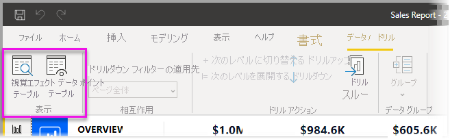
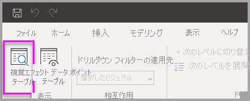
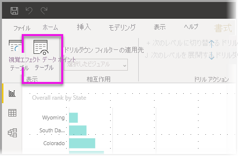

# Power BI Desktop の視覚エフェクト テーブルとデータ ポイント テーブルを使用する
**Power BI Desktop** では、視覚エフェクトの詳細にドリルダウンして、基になるデータのテキスト表現または選択したビジュアルの個々のデータ レコードを見ることができます。 これらの機能は、"*クリックスルー*"、"*ドリルスルー*"、"*詳細情報へのドリルスルー*" などとも呼ばれます。

**[視覚エフェクト テーブル]** を使用して視覚エフェクト内のデータをテーブルとして表示したり、 **[データ ポイント テーブル]** を使用して 1 つのデータ ポイントの計算に使用されるデータのテーブルを表示したりできます。 

>[!IMPORTANT]
>**[視覚エフェクト テーブル]** と **[データ ポイント テーブル]** では、次の視覚化の種類のみがサポートされています。
>  - 横棒グラフ
>  - 縦棒グラフ
>  - ドーナツ グラフ
>  - 塗り分け地図
>  - じょうごグラフ
>  - マップ
>  - 円グラフ
>  - ツリーマップ

## Power BI Desktop の視覚エフェクト テーブルを使用する

**[視覚エフェクト テーブル]** では、視覚エフェクトの基になるデータが表示されます。 **[視覚エフェクト テーブル]** は、視覚エフェクトを選択したときにリボンの **[表示]** セクションの **[データ/ドリル]** タブに表示されます。

データは、視覚化を右クリックし、表示されるメニューから **[データの表示]** を選択するか、視覚化の右上隅で**その他のオプション** (...) を選択し、 **[テーブルとして表示]** を選択することでも表示できます。

![右クリックの [データの表示]](media/desktop-see-data-see-records/visual-table-02.png)&nbsp;&nbsp;![その他のオプションの [データの表示]](media/desktop-see-data-see-records/visual-table-03.png)

> [!NOTE]
> 右クリック メニューを使うには、ビジュアル内のデータ ポイントの上にマウス ポインターを移動する必要があります。

**[視覚エフェクト テーブル]** または **[データ ポイント テーブル]** を選択すると、Power BI Desktop キャンバスに、データの視覚化表現とテキスト表現の両方が表示されます。 "*横表示*" では、ビジュアルがキャンバスの上部に表示され、データが下部に表示されます。 

キャンバスの右上隅のアイコンを選ぶことで、横表示と "*縦表示*" の間を切り替えることができます。

レポートに戻るには、キャンバスの左上隅にある **[< レポートに戻る]** を選びます。

## Power BI Desktop のデータ ポイント テーブルを使用する

視覚エフェクト内の 1 つのデータ レコードに注目して、その背後にあるデータにドリルダウンできます。 **[データ ポイント テーブル]** を使用するには、視覚化を選択し、リボンの **[ビジュアル ツール]** セクションの **[データ/ドリル]** タブで **[データ ポイント テーブル]** を選択し、その視覚化上のデータ ポイントまたは行を選択します。 

> [!NOTE]
> リボンの **[データ ポイント テーブル]** ボタンが無効になって淡色表示されている場合は、選択したビジュアルで **[データ ポイント テーブル]** がサポートされていないことを意味します。

データ要素を右クリックし、表示されるメニューから **[データ ポイント テーブル]** を選択することもできます。

データ要素に対して **[データ ポイント テーブル]** を選択すると、Power BI Desktop キャンバスに、選択した要素に関連付けられているすべてのデータが表示されます。 

レポートに戻るには、キャンバスの左上隅にある **[< レポートに戻る]** を選びます。

> [!NOTE]
>**[データ ポイント テーブル]** には次の制限事項があります。
> - **[データ ポイント テーブル]** ビューでデータを変更してレポートに保存することはできません。
> - 視覚化で、(多次元) メジャー グループの計算されるメジャーが使用される場合、**データ ポイント テーブル**は使用できません。
> - ライブ多次元 (MD) モデルに接続されている場合は、 **[データ ポイント テーブル]** を使用できません。

## 次の手順
**Power BI Desktop** には、あらゆる種類のレポートの書式指定とデータ管理機能があります。 例については、次のリソースをご覧ください。

* [Power BI Desktop でグループ化とビン分割を使用する](desktop-grouping-and-binning.md)
* [Power BI Desktop レポートで、グリッド線、グリッドへのスナップ、重ね順、配置、および分布を使用する](desktop-gridlines-snap-to-grid.md)

