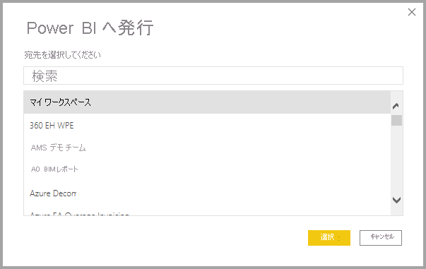

# Power BI Desktop からデータセットとレポートを発行する
Power BI Desktop ファイルを Power BI サービスに発行すると、モデル内のデータが Power BI ワークスペースに発行されます。 **レポート** ビューで作成したレポートの場合も同様です。 ワークスペース ナビゲーターに、同じ名前の新しいデータセットおよびレポートが表示されます。

Power BI Desktop から発行すると、Power BI で **[データの取得]** を使用して接続し、Power BI Desktop ファイルをアップロードした場合と同じ効果を得られます。

> [!NOTE]
> Power BI でどのような変更をレポートに加えても、元の Power BI Desktop ファイルには保存されません。 これには、レポートで視覚化を追加、削除、または変更した場合が含まれます。

## Power BI Desktop データセットおよびレポートを発行するには
1. Power BI Desktop で、 **[ファイル]** \> **[発行]** \> **[Power BI へ発行]** を選択するか、リボンの **[発行]** を選択します。  

   ![[発行] ボタン](media/desktop-upload-desktop-files/pbid_publish_publishbutton.png)

2. まだサインインしていない場合は、Power BI にサインインします。
3. 発行先を選択します。 2020 年 9 月のリリース以降、利用可能なワークスペースの一覧を検索して、発行先にするワークスペースを見つけることができます。 検索ボックスを使用すると、ワークスペースをフィルター処理できます。 ワークスペースを選択し、 **[選択]** ボタンをクリックして発行します。

   

発行が完了すると、レポートのリンクを受け取ります。 リンクを選択し、Power BI サイトでレポートを開きます。

## Power BI Desktop から発行されたデータセットの再発行または置換
Power BI Desktop ファイルを発行すると、Power BI Desktop で作成したデータセットとすべてのレポートが Power BI サイトにアップロードされます。 Power BI Desktop ファイルを再発行すると、Power BI サイト内のデータセットが、Power BI Desktop ファイルから取得された更新済みデータセットと置き換えられます。

このプロセスは簡単ですが、いくつかの点について理解しておく必要があります。

* Power BI Desktop ファイルと同じ名前のデータセットが Power BI 内に複数あると、発行が失敗する可能性があります。 同じ名前のデータセットが Power BI に 1 つだけ存在するようにしてください。 ファイルの名前を変更して発行することもでき、その場合はファイルと同じ名前の新しいデータセットが作成されます。
* 列またはメジャーの名前を変更するか、これらを削除すると、Power BI でそのフィールドを使用している既存の視覚化が壊れる可能性があります。 
* Power BI は、既存列の形式変更の一部を無視します。 たとえば、列の形式を 0.25% から 25% に変更した場合などです。
* Power BI の既存のデータセット用に構成された更新スケジュールがあるとします。 ファイルに新しいデータ ソースを追加してから再発行する場合は、次にスケジュールされている更新の前に、それらにサインインしておく必要があります。
* Power BI Desktop から発行されたデータセットを再発行し、定義された更新スケジュールがある場合、再発行後すぐにデータセットの更新が開始されます。
* データセットに変更を加えてから再発行すると、その変更の影響を受ける可能性があるワークスペース、レポート、ダッシュボードの数がメッセージに表示され、現在発行されているデータセットを、変更したものに置き換えるかどうかを確認するよう求められます。 また、メッセージでは、Power BI サービスの完全なデータセットの影響分析へのリンクも提供され、そこで、詳細を確認し、変更のリスクを軽減するための措置を取ることができます。

   

   [データセットによる影響の分析の詳細を参照してください](../collaborate-share/service-dataset-impact-analysis.md)。

> [!NOTE]
> Power BI レポートの一部のデータ接続には、Power BI サービスにインポートされたデータセットのデータが含まれるのではなく、データへのリンクが含まれる場合があります。 たとえば、DirectQuery 接続では、データ自体をインポートするのではなく、更新または相互作用が発生するとデータにリンクされます。 レポート内のリンクされたデータ ソースがオンプレミスの場合、Power BI からそれらにアクセスするためのゲートウェイが必要になる場合があります。 詳細については、「[オンプレミス データ ゲートウェイとは](../connect-data/service-gateway-onprem.md)」を参照してください。
> 

## 次の手順

Power BI Desktop では、あらゆる種類の操作を実行できます。 そのような機能について詳しくは、次のリソースをご覧ください。

* [Power BI Desktop とは何ですか?](../fundamentals/desktop-what-is-desktop.md)
* [Power BI Desktop でのクエリの概要](../transform-model/desktop-query-overview.md)
* [Power BI Desktop でのデータ型](../connect-data/desktop-data-types.md)
* [チュートリアル: Power BI Desktop でデータの整形と結合](../connect-data/desktop-shape-and-combine-data.md)
* [Power BI Desktop での一般的なクエリ タスク](../transform-model/desktop-common-query-tasks.md)
