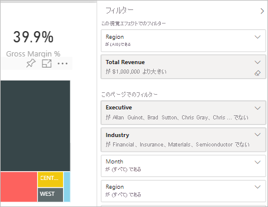
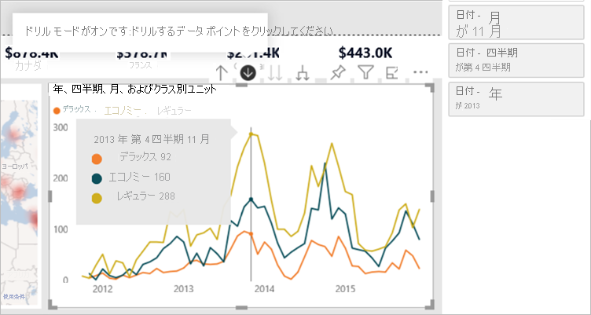
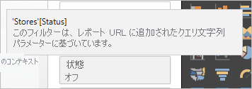
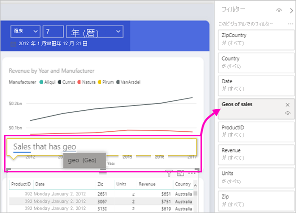

# Power BI レポート内のフィルターの種類

フィルターがどのように作成されたかはそれぞれ異なるため、その動作もそれぞれ異なります。 フィルターをどのように作成するかが、編集モードでの新しいフィルター ウィンドウの動作に影響を及ぼします。 この記事では、さまざまなフィルターの種類、作成方法、各フィルターが何に適しているかを説明します。 [フィルターをレポートに追加](power-bi-report-add-filter.md)する方法をお読みください。 

まずは 2 種類の一般的なフィルター、手動フィルターと自動フィルターについて説明します。

## 手動フィルター 

手動フィルターは、レポート作成者が新しいフィルター ウィンドウで任意の場所にドラッグ アンド ドロップするフィルターです。 レポートに対する編集アクセス許可を持つユーザーが、新しいウィンドウで、このフィルターに対して編集、削除、クリア、非表示、ロック、名前変更、または並べ替えの操作を行うことができます。

## 自動フィルター 

自動フィルターは、ビジュアルを作成するときにフィルター ウィンドウのビジュアル レベルに自動的に追加されるフィルターです。 これらのフィルターは、ご自身のビジュアルを構成するフィールドに基づいています。 レポートに対する編集アクセス許可を持つユーザーが、新しいウィンドウで、このフィルターに対して編集、クリア、非表示、ロック、名前変更、または並べ替えの操作を行うことができます。 自動フィルターを削除することはできません。それらのフィールドは、ビジュアルによって参照されているためです。

## 高度なフィルター

このフィルターの種類はあまり一般的ではありませんが、お使いのレポートに表示されている場合は、やはり理解しておくことが重要です。 また、レポートに適したフィルターを作成するうえで、これが役に立つこともあります。

## 含める/除外するフィルター

含めるフィルターと除外するフィルターは、ビジュアルに対して含める機能または除外する機能を使用すると、フィルター ウィンドウに自動的に追加されます。 レポートに対する編集アクセス許可を持つユーザーが、新しいウィンドウで、このフィルターに対して削除、ロック、非表示、または並べ替えの操作を行うことができます。 含めるフィルターまたは除外するフィルターを編集、クリア、または名前変更することはできません。これはビジュアルの含める機能および除外する機能に関連付けられているためです。

## ドリルダウン フィルター

ドリルダウン フィルターは、お使いのレポートのビジュアルに対してドリルダウン機能を使用すると、フィルター ウィンドウに自動的に追加されます。 レポートに対する編集アクセス許可を持つユーザーが、新しいウィンドウでフィルターを編集またはクリアできます。 このフィルターに対して削除、非表示、ロック、名前変更、または並べ替えの操作を行うことはできません。これはビジュアルのドリルダウン機能に関連付けられているためです。 ドリルダウン フィルターを削除するには、ビジュアルのドリルアップ ボタンをクリックします。

## クロス詳細フィルター

クロス詳細フィルターは、ドリルダウン フィルターがクロス フィルターやクロス強調表示機能を介してレポート ページの他のビジュアルに渡された場合に、自動的に新しいウィンドウに追加されます。 レポートに対する編集アクセス許可を持つユーザーが、このフィルターに対して削除、クリア、非表示、ロック、名前変更、または並べ替えの操作を行うことはできません。これはビジュアルのドリルダウン機能に関連付けられているためです。 また、このフィルターは、他のビジュアルでのドリルダウンによって取得されるため、編集することもできません。 ドリルダウン フィルターを削除するには、フィルターを渡しているビジュアルのドリルアップ ボタンをクリックします。

## ドリルスルー フィルター

ドリルスルー フィルターは、ドリルスルー機能を使用してページからページに渡され、 ドリルスルー ウィンドウに表示されます。 ドリルスルー フィルターには 2 種類あります。 1 つ目はドリルスルーを呼び出すフィルターで、 レポート エディターが、この種類のフィルターに対して、編集、削除、クリア、非表示、またはロックの操作を行うことができます。 2 つ目は、ソース ページのページ レベル フィルターに基づいてターゲットに渡されるドリルスルー フィルターです。 レポート エディターは、この一時的な種類のドリルスルー フィルターを編集、削除、またはクリアすることができます。 エンド ユーザー向けのこのフィルターに対して、ロックまたは非表示の操作を行うことはできません。

## URL フィルター

URL フィルターは、URL クエリ パラメーターを追加することで、新しいウィンドウに追加されます。 レポートに対する編集アクセス許可を持つユーザーが、新しいウィンドウでフィルターを編集、削除、またはクリアできます。 このフィルターに対して非表示、ロック、名前変更、または並べ替えの操作を行うことはできません。これは URL パラメーターに関連付けられているためです。 フィルターを削除するには、URL からパラメーターを削除します。 パラメーターを持つ URL の例を次に示します。

app.powerbi.com/groups/me/apps/*app-id*/reports/*report-id*/ReportSection?filter=Stores~2FStatus%20eq%20'Off'

詳細については、[URL フィルター](../collaborate-share/service-url-filters.md)に関するページをご覧ください。

## パススルー フィルター

パススルー フィルターは、Q&A によって作成されたビジュアル レベル フィルターです。 作成者が、新しいウィンドウで、これらのフィルターに対して削除、非表示、または並べ替えの操作を行うことができます。 ただし、これらのフィルターの名前を変更したり、フィルターを編集、クリア、ロックしたりすることはできません。

## フィルターの種類の比較

この表では、作成者がさまざまな種類のフィルターを使って行える操作を比較します。

| フィルターの種類 | [編集] | Clear | 削除 | 非表示 | ロック | 並べ替え | 名前の変更 |
|----|----|----|----|----|----|----|----|
| 手動フィルター | Y | Y | Y | Y | Y | Y | Y |
| 自動フィルター | Y | Y | N | Y | Y | Y | Y |
| 含める/除外するフィルター | N | N | Y | Y | Y | Y | N |
| ドリルダウン フィルター | Y | Y | N | N | N | N | N |
| クロス詳細フィルター | N | N | N | N | N | N | N |
| ドリルスルー フィルター (ドリルスルーを呼び出す) | Y | Y | Y | Y | Y | N | N |
| ドリルスルー フィルター (一時的) | Y | Y | Y | N | N | N | N |
| URL フィルター - 一時的 | Y | Y | Y | N | N | N | N |
| パススルー フィルター | N | N | Y | Y | N | Y | N |

## 次のステップ

[フィルターをレポートに追加する](power-bi-report-add-filter.md)

[レポート フィルター ウィンドウの使用方法](../consumer/end-user-report-filter.md)

[レポート内のフィルターと強調表示](power-bi-reports-filters-and-highlighting.md)

他にわからないことがある場合は、 [Power BI コミュニティを利用してください](https://community.powerbi.com/)。
