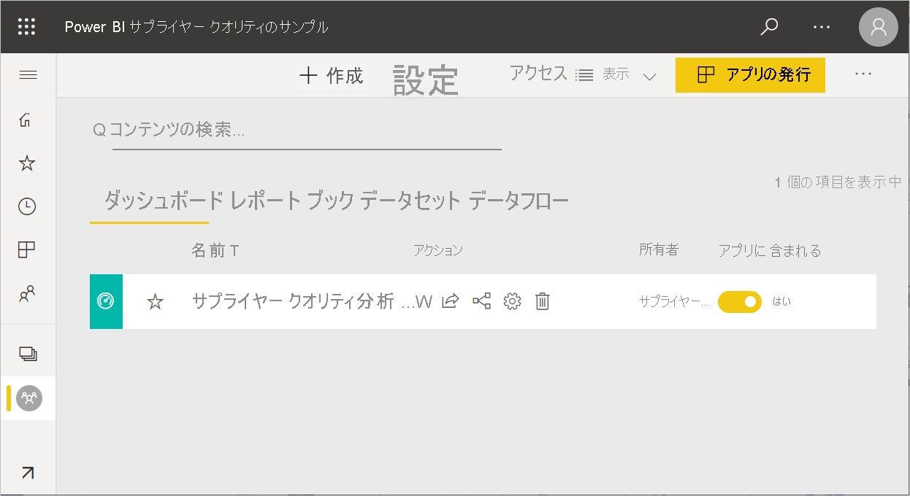
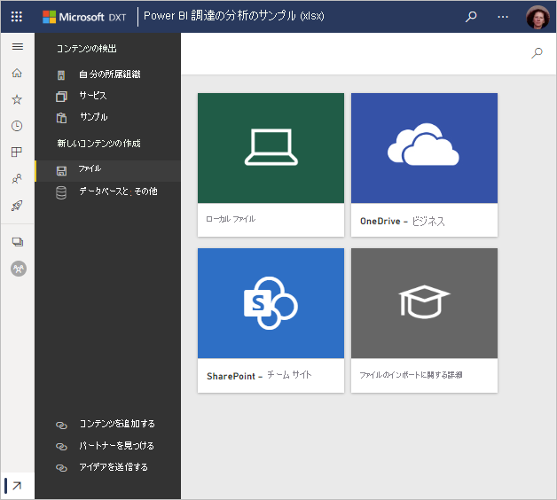

# Power BI のサンプルを入手する
Power BI を初めて試してみたくてもデータがない場合や、  または、Power BI の機能の一部を示すレポートを表示したいと思う場合があります。 そのような場合でもご利用いただけます。

Power BI には、目的ごとにさまざまな種類のサンプルが用意されています。 
- **[Power BI レポート](#sales--returns-sample-pbix-file) (.pbix ファイル)** は、データ ストーリー ギャラリーで表示したり、Power BI Desktop で開いて探索したり、Power BI サービスにアップロードしたりできます。
- **[サンプル アプリ](#sample-app-from-appsource)** は、AppSource からダウンロードします。Power BI サービスにもあります。 アプリには、ダッシュボード、レポート、データセットが含まれます。 これらを変更してから、同僚に配布することができます。
- **[8 つのオリジナルの組み込みサンプル](#eight-original-samples)** は、ダッシュボード、レポート、データセットを含む "*コンテンツ パック*" として Power BI サービス内にあります。 これらは Power BI サービスに直接インストールします。 組み込みのサンプルは、Power BI レポート (.pbix) および Excel ブック (.xlsx) としても使用できます。
- データ モデルと Power View シートが含まれている組み込みのサンプルの **[Excel ブック](#download-sample-excel-files)** バージョン。 Excel でデータ モデルを調べたり編集したり、Power BI レポートのデータ ソースとして Excel ブックを使用したりできます。 また、ブックを Excel ファイルとしてアップロードし、Power BI レポートに Excel のビジュアルとピボットテーブルを表示することもできます。 
- また、Excel ファイル内の単純なフラット テーブルである **[財務データ サンプル ブック](sample-financial-download.md)** をダウンロードすることもできます。 これには架空の製品を含む匿名化データが含まれており、売上はセグメントと国で分けられています。 これにより、Power BI レポートに有用な基本データ ソースが作成されます。

オンライン ドキュメントでは、これらの同じサンプルがチュートリアルと例で使用されているため、手順に沿って進めることができます。

## 売上と返品のサンプル.pbix ファイル

:::image type="content" source="media/sample-datasets/sales-returns-sample-pbix.png" alt-text="売上と返品のサンプル.pbix ファイル":::

*売上と返品のサンプル レポート*

売上と返品の .pbix ファイルは、Power BI の多くの新機能を示すために、Power BI レポート デザイナーの Miguel Myers と Chris Hamill によって作成されました。これには、ボタン、ドリルスルー、条件付き書式、what-if、カスタマイズされたツールヒントが含まれています。 

このレポートのシナリオは、Microsoft をテーマにしたスケートボードを販売する企業です。 彼らは、売上と返品の状態を確認し、その業務をどのように変更する必要があるかを分析したいと考えています。 

次の方法で調べることができます。

- Power BI コミュニティ [データ ストーリー ギャラリー](https://community.powerbi.com/t5/Data-Stories-Gallery/Sales-amp-Returns-Sample-Report/m-p/876607)で表示および操作します。
- .pbix ファイルをダウンロードし、詳細に調査します。 Miguel がそれをどのように作成したか、その背景を見ます。 このリンクを選択すると、ファイルが自動的にダウンロードされます。[売上と返品のサンプル レポート](https://go.microsoft.com/fwlink/?linkid=2113239)。
- レポートの詳細については、Power BI のブログ記事「[新しい売上と返品のサンプル レポートのツアー](https://powerbi.microsoft.com/blog/take_a_tour_of_the_new_sales_returns_sample_report/)」を参照してください。

## AppSource からのサンプル アプリ

Marketing & Sales "*アプリ*" は、Microsoft AppSource から入手できます。 アプリとは、関連するダッシュボードとレポートを結合した Power BI のコンテンツの種類です。 アプリでは、1 つ以上のダッシュ ボードと 1 つ以上のレポートをすべてまとめることができます。 Marketing & Sales アプリは、Power BI サービスで **[アプリ]** から、またはブラウザーで AppSource に移動してダウンロードすることができます。

- [アプリのインストールと使用](../consumer/end-user-app-view.md)に関する記事では、Power BI サービス内からアプリをダウンロードする方法について説明されています。
- このリンクを使用すると、AppSource の [Sales & Marketing アプリ](https://appsource.microsoft.com/product/power-bi/microsoft-retail-analysis-sample.salesandmarketingsample?tab=Overview)に移動できます。

インストールすると、それがアプリの自分のコレクション内に表示されます。

:::image type="content" source="media/sample-datasets/power-bi-sales-marketing-app.png" alt-text="Sales & Marketing アプリのタイル":::

これを開くときに、 **[サンプル データで探索する]** を選択します。 

:::image type="content" source="media/sample-datasets/power-bi-explore-app.png" alt-text="アプリを探索する":::

ダッシュボードと個々のレポート ページがナビゲーション ウィンドウに表示された、アプリ ビューが表示されます。 

:::image type="content" source="media/sample-datasets/power-bi-sales-marketing-app-navigation.png" alt-text="アプリのナビゲーション ウィンドウ":::

インストールしたので、"*ワークスペース*" を開き、アプリの要素を編集することもできます。 **[編集]** の鉛筆アイコンを選択して、ワークスペースを開きます。

:::image type="content" source="media/sample-datasets/power-bi-app-edit-pencil.png" alt-text="アプリを編集する":::

これで、ワークスペースのリスト ビューに、アプリのダッシュボード、レポート、データセットが表示されます。 ワークスペースで、それぞれを編集できます。

:::image type="content" source="media/sample-datasets/power-bi-sales-marketing-workspace.png" alt-text="Sales & Marketing ワークスペース":::

必要に応じて、このアプリを組織内の誰にでも配布できます。 **[アプリを更新]** を選択します。

:::image type="content" source="media/sample-datasets/power-bi-update-app.png" alt-text="[アプリを更新] ボタン":::

**[アプリのテーマの色]** の選択も含め、 **[セットアップ]** タブを完了します。 

:::image type="content" source="media/sample-datasets/power-bi-app-setup.png" alt-text="アプリのセットアップの選択":::

**[ナビゲーション]** タブと **[アクセス許可]** タブを完了し、 **[アプリを更新]** を選択します。

:::image type="content" source="media/sample-datasets/power-bi-select-update-app.png" alt-text="[アプリを更新] を選択して発行する":::

詳細については、[Power BI でのアプリの発行](../collaborate-share/service-create-distribute-apps.md)に関するページをご覧ください。

## 8 つのオリジナルのサンプル
使用可能な 8 つのオリジナルのサンプルがあります。 各サンプルは、異なる業界を表しています。 それぞれ異なる形式で使用することができます。

- Power BI サービスに[組み込みコンテンツ パック](#install-built-in-content-packs)をインストールします。
- [Power BI レポート ファイル](#download-original-sample-power-bi-files) (.pbix) をダウンロードします。
- [Excel ブック ファイル](#download-sample-excel-files) (.xlsx) をダウンロードし、それを Power BI サービスにアップロードします。
- [Excel で Excel ファイルを](#explore-excel-samples-inside-excel)探索します。

obviEnce 社 ([www.obvience.com](http://www.obvience.com/)) と Microsoft が協力して、Power BI で使用するためのサンプルを作成しました。  データは匿名化されており、金融、人材、販売など、さまざまな業種のものがあります。 

これらのサンプルはいずれも、コンテンツ パック、Excel ブック、Power BI .pbix ファイルなどの複数の形式で利用できます。 内容や入手方法がわからなくても心配することはありません。 この記事では、そのすべてを説明します。 これらの各サンプルについて、"*ツアー*" を作成しました。 ツアーは、サンプルの背景にあるストーリーを伝え、さまざまなシナリオを一通り紹介する記事です。 マネージャーの質問に答える、競争力について詳しく調べる、レポートやダッシュボードを作成して共有する、ビジネスのシフトを説明するなど、さまざまなシナリオがあります。

始める前に、これらのサンプルの使用に関するこちらの法的なガイドラインをお読みください。 その後、サンプルとその使用方法を紹介します。

### サンプル Excel ブックの使用ガイドライン

&copy;2015 Microsoft Corporation. All rights reserved. 文書やブックは「現状有姿のまま」提供されます。 このブックに記載されている情報や見解 (URL 等のインターネット Web サイトに関する情報を含む) は、将来予告なしに変更されることがあります。 お客様は、その使用に関するリスクを負うものとします。 いくつかの例は架空のものであり、説明のためだけに使用されます。 実在するものとは一切関係ありません。 Microsoft は、ここに記載されている情報について、明示または黙示を問わず、一切保証しません。

このブックは、Microsoft 製品の知的財産権に関する法的な権利をお客さまに許諾するものではありません。 内部的な参照目的に限り、このブックを複製して使用することができます。

ブックおよび関連するデータは obviEnce によって提供されます。 [www.obvience.com](http://www.obvience.com)

ObviEnce は、Microsoft Business Intelligence に重点を置いた ISV および知的財産 (IP) インキュベータです。 ObviEnce は Microsoft と密接に連携して、Microsoft ビジネス インテリジェンス ソリューションを活性化して配置するためのベスト プラクティスとソート リーダーシップを開発しています。

ブックとデータは obviEnce, LLC の財産であり、Power BI の機能を業界のサンプル データを使用して例示するためだけに共有されています。

ブックやデータを使用する場合には、上記の帰属が含まれている必要があります (これは各ブックの [Info] ワークシートにも記載されています)。 ブックおよびすべての視覚エフェクトには、obviEnce &copy; という著作権表示を付ける必要があります。

次のいずれかのリンクをクリックして Excel ブック ファイルまたは .pbix ファイルをダウンロードすると、上記の条項に同意したことになります。

### お客様の収益性のサンプル  
[お客様の収益性のサンプルを使ってみる](sample-customer-profitability.md)

この業界サンプルは、会社の経営陣、製品、顧客に関する CFO の主要な指標を分析します。 会社の収益性に影響を与える要因を調査することができます。

### 人事のサンプル 
[人事のサンプルを使ってみる](sample-human-resources.md)

この業界サンプルは、新規採用者、現役勤務の従業員、退職した従業員を分析することにより、会社の採用戦略に焦点を合わせています。  データを探索することにより、自主退職の傾向と採用戦略の偏りを調べることができます。

### IT 支払い分析のサンプル 
[IT 支出分析のサンプルを使ってみる](sample-it-spend.md)

この業界サンプルは、会社の IT 部門の予定コストと実績コストを比較分析します。 比較することで当年度における予算が適切に組まれたかどうかを把握し、当初の計画から大きく乖離している分野を調べることができます。 この例の会社では年間予算が組まれ、四半期ごとに最新予測 (LE) が出されて当該会計年度における IT 支出の変化を分析しています。

### 営業案件の分析のサンプル 
[営業案件の分析のサンプルを使ってみる](sample-opportunity-analysis.md)

この業界サンプルは、ソフトウェア会社の販売チャネルを調べます。 セールス マネージャーは直販と代理店の販売チャネルをモニターするため、地域、商談の規模、チャネルごとの営業案件と売上を追跡します。

### 調達の分析のサンプル  
[調達の分析のサンプルを使ってみる](sample-procurement.md)

この業界サンプルは、会社の経営陣、製品、顧客に関する CFO の主要な指標を分析します。 会社の収益性に影響を与える要因を調査することができます。

### 小売りの分析のサンプル  
[小売りの分析のサンプルを使ってみる](sample-retail-analysis.md)

この業界サンプルは、複数の店舗や地域で販売されたアイテムの小売店の売上データを分析したものです。 メトリックは、売上、出荷単位、粗利、差異、および新店舗の分析に関して、本年度と昨年度の業績を比較します。

### 売上およびマーケティングのサンプル  
[売上およびマーケティングのサンプルを使ってみる](sample-sales-and-marketing.md)

この業界サンプルは、製造会社 VanArsdel Ltd を分析します。これにより、最高マーケティング責任者は業界動向と VanArsdel の市場シェアを監視できます。  このサンプルを調査することにより、会社の市場シェア、製品の数量、売り上げ、およびセンチメントを見つけることができます。

### サプライヤー クオリティ分析のサンプル  
[サプライヤー品質のサンプルを使ってみる](sample-supplier-quality.md)

この業界サンプルは、典型的なサプライ チェーンの課題の 1 つである、サプライヤー クオリティ分析に焦点を合わせています。 この分析では、欠陥の総数と、欠陥が引き起こす総ダウンタイムという 2 つの主要な指標を確認できます。 このサンプルには、2 つの主要な目的があります。1 つは品質の点で最良と最悪のサプライヤーを把握すること、2 つ目はどのプラントがより的確に欠陥を検出して排除し、ダウンタイムを最小化しているかを特定することです。

### 組み込みのコンテンツ パックをインストールする

"*コンテンツ パック*" から始めましょう。 組み込みのサンプルは、Power BI サービスで入手できるので、Power BI を離れて探す必要はありません。 コンテンツ パックは、他のユーザーが作成したものを Power BI サービスで使用できる、1 つ以上のダッシュボード、データセット、レポートのバンドルです。 各 Power BI サンプルのコンテンツ パックには、データセット、レポート、およびダッシュボードが含まれます。  コンテンツ パックは引き続き利用できますが、非推奨となっています。 これらを Power BI Desktop で使用することはできません。

1. Power BI サービス (app.powerbi.com) を開いてサインインします。
2. マイ ワークスペース、またはサンプルをインストールする別のワークスペースに移動します。 
2. 左下隅にある **[データの取得]** を選びます。

    ![[Get Data]\(データの取得\) アイコン](media/sample-datasets/power-bi-get-data.png)
3. 表示された [データを取得] ページで、 **[サンプル]** を選びます。

   ![[データを取得] のサンプル](media/sample-datasets/get-data-samples.png)
4. サンプルの 1 つを選び、そのサンプルの説明を開き、 **[接続]** を選択します。  

   ![サンプルを選択して [接続] を選択](media/sample-datasets/power-bi-connect.png)
5. Power BI がコンテンツ パックをインポートし、新しいダッシュボード、レポート、データセットを現在のワークスペースに追加します。 サンプルを使って Power BI を試してみます。  

   

データが用意できたので、それを使ってみてください。  サンプルのコンテンツ パックを使ってチュートリアルを試したり、単に Power BI サービスを開いて調べたりできます。

### オリジナルの Power BI サンプル ファイルをダウンロードする
各サンプル コンテンツ パックは、Power BI .pbix ファイルでも入手できます。 .pbix ファイルは、Power BI Desktop で使うように設計されています。  

1. 下のリンクを使って、ファイルを個別にダウンロードします。 次のリンクを選択すると、ファイルが自動的にご利用のダウンロード フォルダーに保存されます。 

   - [お客様の収益性のサンプル PBIX](https://download.microsoft.com/download/6/A/9/6A93FD6E-CBA5-40BD-B42E-4DCAE8CDD059/Customer%20Profitability%20Sample%20PBIX.pbix)
   - [人事のサンプル PBIX](https://download.microsoft.com/download/6/9/5/69503155-05A5-483E-829A-F7B5F3DD5D27/Human%20Resources%20Sample%20PBIX.pbix)
   - [調達の分析のサンプル PBIX](https://download.microsoft.com/download/D/5/3/D5390069-F723-413B-8D27-5888500516EB/Procurement%20Analysis%20Sample%20PBIX.pbix)
   - [小売りの分析のサンプル PBIX](https://download.microsoft.com/download/9/6/D/96DDC2FF-2568-491D-AAFA-AFDD6F763AE3/Retail%20Analysis%20Sample%20PBIX.pbix)
   - [売上およびマーケティングのサンプル PBIX](https://download.microsoft.com/download/9/7/6/9767913A-29DB-40CF-8944-9AC2BC940C53/Sales%20and%20Marketing%20Sample%20PBIX.pbix)
   - [サプライヤー クオリティ分析サンプル PBIX](https://download.microsoft.com/download/8/C/6/8C661638-C102-4C04-992E-9EA56A5D319B/Supplier-Quality-Analysis-Sample-PBIX.pbix)

1. Power BI Desktop で **[ファイル]、[開く]** の順に選択し、サンプル .pbix ファイルを保存した場所に移動します。

4. .pbix ファイルを選択して、Power BI Desktop で開きます。

### Excel のサンプル ファイルをダウンロードする
各サンプル コンテンツ パックは、Excel ブックでも入手できます。 Excel ブックは、Power BI サービスで使うように設計されています。  

1. 以下のリンクを使ってファイルを個別にダウンロードするか、[すべてのサンプル ファイルを 1 つにまとめた zip ファイルをダウンロードしてください](https://go.microsoft.com/fwlink/?LinkId=535020)。 経験のあるユーザーは、Excel ブックをダウンロードしてデータ モデルを自由に調査したり編集したりしてかまいません。

   - [お客様の収益性のサンプル](https://go.microsoft.com/fwlink/?LinkId=529781)
   - [人事のサンプル](https://go.microsoft.com/fwlink/?LinkId=529780)
   - [営業案件の追跡のサンプル](https://go.microsoft.com/fwlink/?LinkId=529782)
   - [調達の分析のサンプル](https://go.microsoft.com/fwlink/?LinkId=529784)
   - [小売の分析のサンプル](https://go.microsoft.com/fwlink/?LinkId=529778)
   - [売上およびマーケティングのサンプル](https://go.microsoft.com/fwlink/?LinkId=529785)
   - [サプライヤー クオリティ分析サンプル](https://go.microsoft.com/fwlink/?LinkId=529779)

2. ダウンロードしたファイルを保存します。 どこにファイルを保存するかによって違いがあります。

      **ローカル** - Power BI から、お使いのコンピューターのローカル ドライブまたはご自分の組織内の別の場所にお使いのファイルを保存した場合、ファイルを Power BI にインポートできます。 ファイルはローカル ドライブに残ったままになるため、ファイル全体が Power BI にインポートされるわけではありません。 Power BI サイトに新しいデータセットが作成され、データ (場合によってはデータ モデル) がデータセットに読み込まれるという処理が発生しています。 ファイルにレポートが含まれている場合、これらのレポートは Power BI サイトの [レポート] に表示されます。
    
     **OneDrive - Business** ‐ OneDrive for Business を利用していて、Power BI にサインインするときと同じアカウントを使ってサインインした場合、Excel、Power BI、または .CSV ファイルでのご自分の作業内容とお使いの Power BI のデータセット、レポート、ダッシュボードとを同期させる最良の場所は OneDrive for Business です。 Power BI と OneDrive はどちらもクラウドにあるため、Power BI は約 1 時間ごとに OneDrive 上のファイルに接続します。 なんらかの変更が見つかった場合には、データセット、レポート、およびダッシュボードが Power BI で自動的に更新されます。
    
     **SharePoint チーム サイト**    お使いの Power BI のファイルを SharePoint ‐ チーム サイトに保存することは、OneDrive for Business に保存することとほぼ同じです。 最も大きな違いは、Power BI からファイルに接続する方法にあります。 URL を指定したり、ルート フォルダーに接続したりできます。
1. Power BI サービス (app.powerbi.com) を開いてサインインします。

1. マイ ワークスペースまたは別のワークスペースに移動するか、サンプルのためだけにワークスペースを作成します。

4. ナビゲーション ウィンドウの左下隅にある **[データを取得]** を選択します。

    ![[Get Data]\(データの取得\) アイコン](media/sample-datasets/power-bi-get-data.png)
5. 表示される **[データを取得]** ページで、 **[ファイル]、[取得]** の順に選びます。

    ![[ファイル] > [Get]\(取得\)](media/sample-datasets/power-bi-files.png)
6. サンプルをダウンロードして保存した場所を選択します。

    
7. ファイルを選択します。 ファイルを保存した場所に応じて、 **[接続]** または **[開く]** を選択します。

8. データをインポートするか、またはブックを Power BI に取り込んで Excel Online とまったく同じように表示するかを選びます。

    ![[インポート] または [接続]](media/sample-datasets/sample-files-import-connect.png)
9. **[インポート]** を選択すると、Power BI によってサンプル ブックがインポートされ、新しいダッシュボード、レポート、データセットとして追加されます。この場合、それぞれ "**調達の分析のサンプル**" という名前が付けられます。

    - ブックには Power View シートがあるため、Power BI によって Power BI シートごとに 1 ページのレポートが作成されます。 
    - Power BI によって新しい空のタイルがある新しいダッシュボードが作成されます。  このタイルを選択すると、追加したレポートが表示されます。

10. レポートを開きます。 レポートのさまざまな要素を選択して、その相互作用を調べます。 

    

### Excel 内で Excel のサンプルを調べる

(省略可能) Excel ブックのデータが Power BI のデータセットやレポートにどのように変換されるのかを確認したい場合は、 Excel のサンプルを *Excel で*開いてワークシートを調べると、理解する役に立ちます。

- 最初にサンプル Excel ブックを開くと、2 つの警告が表示されることがあります。 1 つ目の警告は、ブックが保護ビューになっていることを示します。 **[編集を有効にする]** を選択してください。 2 つ目の警告は、ブックに外部データ接続があることを示します。 **[コンテンツの有効化]** を選択してください。
- 各ブックには、複数の Power View シートが含まれています。 Excel で Power View シートを表示する場合、レジストリ キーのパッケージをダウンロードし、[Power View アドインを有効にする](https://support.office.com/article/flash-silverlight-and-shockwave-controls-blocked-in-microsoft-office-55738f12-a01d-420e-a533-7cef1ff6aeb1)必要があります。
- 実際のデータは、 Power Pivot データ モデルに存在しています。 データを表示するために Power View シートは必要ありません。 **[PowerPivot]** タブで **[管理]** を選択します。

    **[Power Pivot]** タブが表示されない場合は、以下を行います。 [Power Pivot のアドインを有効にします](https://support.office.com/article/Start-Power-Pivot-in-Microsoft-Excel-2013-add-in-A891A66D-36E3-43FC-81E8-FC4798F39EA8)。

    Power Pivot には、すべての基礎テーブルのデータと、すべての DAX 数式が表示されます。 

- [Info] タブには obviEnce (サンプルを作成した会社) に関する情報が示されています。

## 次の手順
[Power BI サービスのデザイナー向けの基本的な概念](../fundamentals/service-basic-concepts.md)

[チュートリアル: Power BI のサンプルに接続する](sample-tutorial-connect-to-the-samples.md)

[Power BI のデータ ソース](../connect-data/service-get-data.md)

他にわからないことがある場合は、 [Power BI コミュニティを利用してください](https://community.powerbi.com/)。
