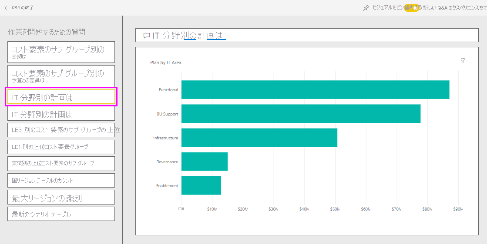

# Power BI の IT 支出分析のサンプル: 使ってみる

IT 支出分析のサンプル コンテンツ パックには、IT 部門の予定コストと実績コストを比較分析するダッシュボード、レポート、データセットが含まれます。 比較することで当年度における予算が適切に組まれたかどうかを把握し、当初の計画から大きく乖離している分野を調べることができます。 この例の会社では年間予算が組まれ、四半期ごとに最新予測 (LE) が出されて当該会計年度における IT 支出の変化を分析しています。

このサンプルは、ビジネス用のデータ、レポート、ダッシュボードを用いて Power BI を使う方法について説明するシリーズの一部です。 匿名化された実際のデータを使用し、[obviEnce](http://www.obvience.com/) によって作成されています。 データは複数の形式 (コンテンツ パック、Power BI Desktop の .pbix ファイル、Excel ブック) で使用できます。 [Power BI 用のサンプル](sample-datasets.md)を参照してください。 

このチュートリアルでは、Power BI サービス内の IT 支出分析のサンプル コンテンツ パックを調べます。 Power BI Desktop とサービスのレポート エクスペリエンスは似ているので、Power BI Desktop 内のサンプルの .pbix ファイルを使用して作業することもできます。 

Power BI Desktop 内でサンプルを調べるために Power BI ライセンスは不要です。 Power BI Pro ライセンスを持っていない場合は、Power BI サービス内で、マイ ワークスペースにサンプルを保存できます。 

## サンプルを入手する

 このサンプルを使用するには、事前にサンプルを[コンテンツ パック](#get-the-content-pack-for-this-sample)、[.pbix ファイル](#get-the-pbix-file-for-this-sample)、または [Excel ブック](#get-the-excel-workbook-for-this-sample)としてダウンロードしておく必要があります。

### このサンプルのコンテンツ パックを入手する

1. Power BI サービス (app.powerbi.com) を開いてサインインし、サンプルを保存するワークスペースを開きます。

   Power BI Pro ライセンスを持っていない場合は、マイ ワークスペースにサンプルを保存できます。

2. 左下隅にある **[データを取得]** を選びます。
   
   ![[データを取得] を選択](media/sample-datasets/power-bi-get-data.png)
3. 表示された **[データを取得]** ページで、 **[サンプル]** を選びます。
   
4. **[IT 支出分析のサンプル]** を選び、 **[接続]** を選びます。  
  
   
   
5. Power BI によってコンテンツ パックがインポートされ、新しいダッシュボード、レポート、およびデータセットが現在のワークスペースに追加されます。
   
   
  
### このサンプルの .pbix ファイルを取得する

あるいは、Power BI Desktop で使用するために設計された [.pbix ファイル](https://download.microsoft.com/download/E/9/8/E98CEB6D-CEBB-41CF-BA2B-1A1D61B27D87/IT%20Spend%20Analysis%20Sample%20PBIX.pbix)として、IT 支払い分析のサンプルをダウンロードすることもできます。

### このサンプルの Excel ブックを取得する

このサンプルのデータ ソースを確認する場合は、[Excel ブック](https://go.microsoft.com/fwlink/?LinkId=529783) として入手することもできます。 ブックには、表示および変更可能な Power View シートが含まれています。 生データを表示するには、データ分析アドインを有効にし、 **[PowerPivot] > [管理]** を選択します。 Power View および Power Pivot のアドインを有効にするための詳細については、[Excel での Excel のサンプルの確認](sample-datasets.md#explore-excel-samples-inside-excel)に関するセクションを参照してください。

## IT 支出分析のサンプル ダッシュボード
ダッシュボードの左側の 2 つの数値タイル、 **[Var Plan %]** と **[Variance Latest Estimate % Quarter 3]** から、予算および最新四半期予測値 (LE3 = 最新予測第 3 四半期) に対する達成度の概要が得られます。 全体的に見て、予算を約 6% 下回っています。 この差異が生じる原因について、時、場所、カテゴリを調べましょう。

## [YTD IT Spend Trend Analysis] ページ
**[Var Plan % by Sales Region]** ダッシュボード タイルを選択すると、IT 支出分析サンプル レポートの **[YTD IT Spend Analysis]** ページが表示されます。 米国とヨーロッパでは正の差異があり、カナダ、ラテン アメリカ、オーストラリアでは負の差異があることが一目見ただけでわかります。 米国では LE 差異が約 +6% あり、オーストラリアでは LE 差異が約 -7% あります。

ただし、このグラフだけを見て結論を導き出すと判断を誤る可能性があります。 大局的に見るため、実際の金額の確認が必要です。

1. **[Var Plan % by Sales Region]** グラフで **[Aus and NZ]** を選択して、 **[Var Plan by IT Area]** グラフに注目します。

   ![[YTD IT Spend Trend Analysis] ページ](media/sample-it-spend/it3.png)
2. ここで **[USA]** \(米国) を選択します。 オーストラリアとニュージーランドが総支出に占める割合は米国と比べて非常に小さいことに注目してください。

    次に、米国内で差異の原因となっているのは、どのカテゴリかを見てみましょう。

## データに関する質問
1. 上部のナビ ペインで **[IT Spend Analysis Sample]** を選んでダッシュボードに戻ります。
2. **[データについて質問する]** を選択します。
3. 左側の **[作業を開始するための質問]** 一覧から、 **[what is the plan by IT area]** を選択します。

   

4. Q&A ボックスで、以前のエントリをクリアし、「*show IT areas, var plan % and var le3 % bar chart*」と入力します。

   

   最初の IT 領域 **[Infrastructure]** で、初期予算との差異と、最新予測値との差異で割合が大幅に変化したことに注意してください。

## [YTD Spend by Cost Elements] ページ

1. ダッシュボードに戻ると、 **[Variance Plan %, Variance Latest Estimate % - Quarter 3]** タイルが表示されます。

   ![[Var Plan %, Var LE3] タイル](media/sample-it-spend/it5.png)

   [Infrastructure] 領域は、予算に対して大きな差異が目立つことに注意してください。

1. このタイルを選択してレポートを開き、 **[YTD Spend by Cost Elements]** ページを表示します。
2. 右下の **[Var Plan % and Var LE3 % by IT Area]** グラフの **[Infrastructure]** バーを選択し、左下の **[Var Plan % by Sales Region]** グラフの予算との差異の値に注目します。

    ![[YTD Spend by Cost Elements] ページ](media/sample-it-spend/it6.png)
3. **[Cost Element Group]** スライサーで各名前を順番に選択して、最も大きな差異があったコスト要素を見つけます。
4. **[Other]** を選択した状態で、 **[IT Area]** スライサーで **[Infrastructure]** を選択し、 **[IT Sub Area]** スライサーでサブ領域を選択して、最も差異が大きいサブ領域を見つけます。  

   **[Networking]** の差異が大きいことに注目してください。 見たところ、そのような移行は予算に入れられていなかったにもかかわらず、会社では従業員の便宜のために電話サービスを提供することにしたようです。

## [Plan Variance Analysis] ページ

1. ページの下部にある **[Plan Variance Analysis]** タブを選択します。

2. 左側にある **[Var plan % by Month and Business Area]** グラフで **[Infrastructure]** 列を選択すると、ページの残りのインフラストラクチャ ビジネス領域の値が強調表示されます。

    ![[Plan Variance Analysis] ページ](media/sample-it-spend/it7.png)

   **[Var plan % by Month and Business Area]** グラフで、インフラストラクチャ ビジネス領域が 2 月に正の差異に転じていることに注目してください。 また、他のビジネス領域と比較して、このビジネス領域の予算への差異が国によって異なることに注目してください。 

3. 右側の **[IT Area]** スライサーと **[IT Sub Area]** スライサーを使用して、ページの残りの値をフィルター処理し、データを調べます。 

## レポートの編集
左上隅の **[レポートの編集]** を選択して、編集ビューで探索します。

* ページの作りを見てください。各グラフのフィールド、ページ上のフィルターなどがあります。
* 同じデータに基づいて、ページやグラフを追加します。
* 各グラフの視覚エフェクトの種類を変更します。
* 関心のあるグラフをダッシュボードにピン留めします。

## 次の手順: データへの接続
変更内容を保存しないことを選択できるため、この環境で試してみるのは安全です。 一方、それらを保存した場合は、 **[データを取得]** を選択して、常にこのサンプルの新しいコピーを取得できます。

この記事から、Power BI ダッシュボード、Q&A、レポートからサンプル データの分析情報をどのように得られるかがご理解いただけたでしょうか。 次はあなたの番です。ご自分のデータに接続してみてください。 Power BI を使用すると、広範なデータ ソースに接続することができます。 詳細については、[Power BI サービスの概要](../fundamentals/service-get-started.md)に関するページを参照してください。
