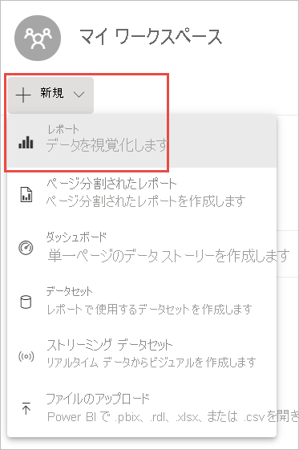
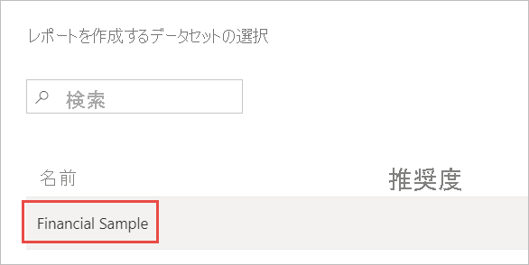
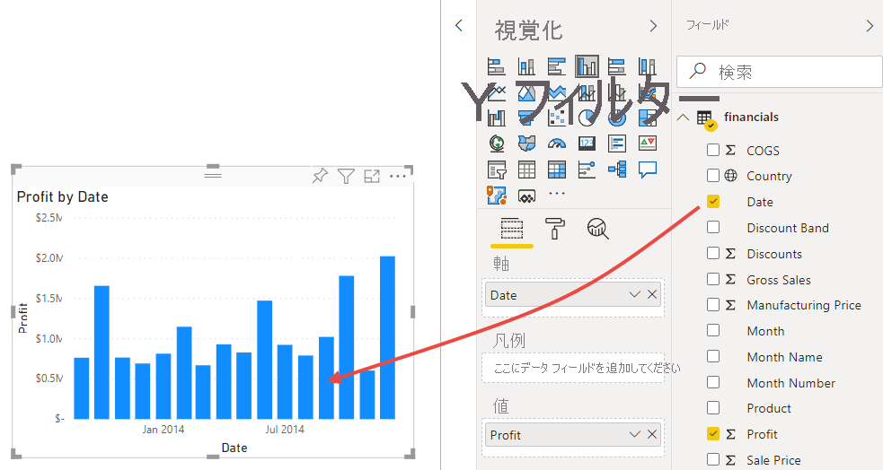
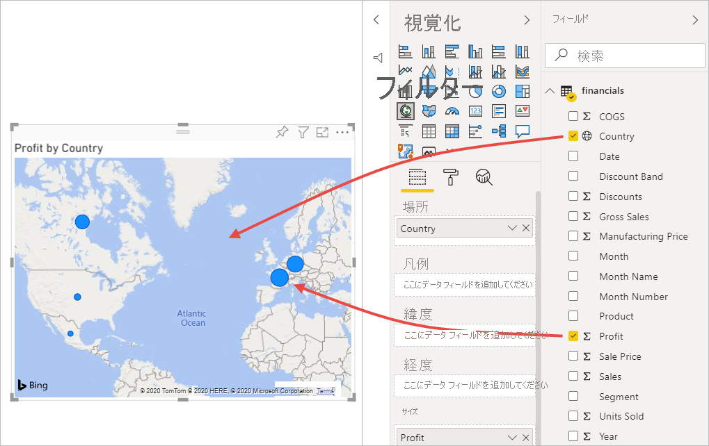
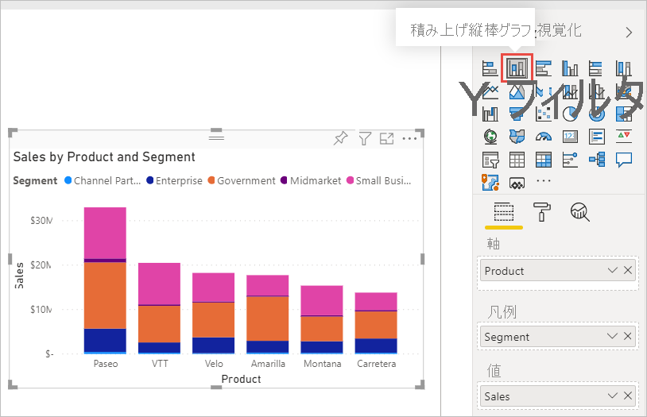
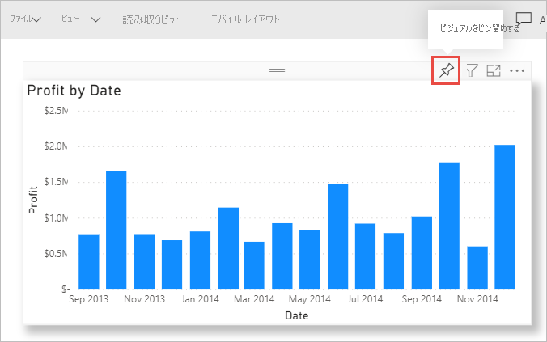

# チュートリアル:Excel ブックから Power BI サービスのレポート、Microsoft Teams へ
あなたの上司は、最新の売上と利益の数値に関するレポートを今日中に見たいと考えています。 しかし、最新のデータはさまざまなサードパーティ システムと、あなたのノート PC 上のファイルにあります。 以前なら、ビジュアルとレポート書式を作成するのに何時間もかかって、次第に不安になったことでしょう。

ご心配なく。 Power BI を使用すれば、魅力的なレポートを作成し、Microsoft Teams ですぐに共有できます。

:::image type="content" source="media/service-from-excel-to-stunning-report/power-bi-financial-report-service.png" alt-text="完成した財務サンプル レポートのスクリーンショット":::

このチュートリアルでは、Excel ファイルをアップロードし、新しいレポートを作成して Microsoft Teams で仕事仲間と共有します。このすべてを Power BI 内から実行できます。 学習内容は次のとおりです。

> [!div class="checklist"]
> * Excel でデータを準備する。
> * サンプル データをダウンロードする。
> * Power BI サービスでレポートを作成する。
> * レポートのビジュアルをダッシュボードにピン留めする。
> * ダッシュボードへのリンクを共有する。
> * Microsoft Teams でダッシュボードを共有する

## Excel でデータを準備する
例として、単純な Excel ファイルを見てみましょう。 

1. Power BI に Excel ファイルを読み込む前に、データをフラット テーブルに整理する必要があります。 フラット テーブルでは、各列に同じデータ型 (テキスト、日付、数値、通貨など) が含まれます。 テーブルにはヘッダー行が必要ですが、合計を表示する列や行は必要ありません。

   

2. 次に、データをテーブルとして書式設定します。 Excel で **[ホーム]** タブの **[スタイル]** グループから **[テーブルとして書式設定]** を選択します。 

3. ワークシートに適用するテーブルのスタイルを選んでください。 

   これで、Excel ワークシートを Power BI に読み込む準備ができました。

   

## Excel ファイルを Power BI サービスにアップロードする
Power BI サービスは、多くのデータ ソースに接続できます。自分のコンピューターで使用中の Excel ファイルもそれに含まれます。 

 > [!NOTE] 
 > このチュートリアルの残りの部分の作業を進めるには、[財務サンプル ブック](https://go.microsoft.com/fwlink/?LinkID=521962)をダウンロードします。

1. 作業を始めるには、まず Power BI サービスにサインインします。 まだサインアップしていない場合は、[無料で登録できます](https://powerbi.com)。
1. **[マイ ワークスペース]** で、 **[新規]**  >  **[ファイルのアップロード]** を選択します。

    :::image type="content" source="media/service-from-excel-to-stunning-report/power-bi-new-upload.png" alt-text="[ファイルのアップロード] オプションのスクリーンショット。":::

1. **[ローカル ファイル]** を選択し、財務サンプル Excel ファイルを保存した場所に移動して、 **[開く]** を選択します。
7. **[ローカル ファイル]** ページで、 **[インポート]** を選択します。

    これで、財務サンプル データセットが作成されました。 Power BI によって、自動的に空のダッシュボードも作成されました。 ダッシュボードが表示されない場合は、ブラウザーを更新します。

    :::image type="content" source="media/service-from-excel-to-stunning-report/power-bi-financial-dataset.png" alt-text="財務サンプル データセットが示されている [マイ ワークスペース] のスクリーンショット。":::

2. あなたはレポートを作成したいと考えています。 引き続き、 **[マイ ワークスペース]** で、 **[新規]**  >  **[レポート]** の順に選択します。

   

3. **[レポートを作成するデータセットの選択]** ダイアログ ボックスで、**財務サンプル** データセット > **[作成]** の順に選択します。

   

## レポートの構築
 
レポートは編集ビューで開き、空のレポート キャンバスが表示されます。 右側には、 **[視覚化]** 、 **[フィルター]** 、および **[フィールド]** ウィンドウがあります。 **[フィールド]** ウィンドウには、Excel ブックのテーブルのデータが表示されます。 一番上には、テーブルの名前である、**financials** と示されています。 その下には、Power BI によって、列見出しが個別のフィールドとして一覧表示されます。

[フィールド] 一覧にシグマ記号があるのがわかりますか? Power BI によって、これらのフィールドが数値であることが検出されました。 また、Power BI によって、地球の記号が付いた地理的フィールドが示されています。

![[フィールド] ウィンドウで Excel データがどのように表示されるかを示すスクリーンショット。](media/service-from-excel-to-stunning-report/power-bi-fields-list-financial.png)

1. レポート キャンバス用の領域を大きくするには、 **[ナビゲーション ウィンドウの非表示]** を選択し、 **[フィルター]** ウィンドウを最小化します。

    :::image type="content" source="media/service-from-excel-to-stunning-report/power-bi-hide-nav-pane.png" alt-text="ナビゲーション ウィンドウの最小化のスクリーンショット。"::: 

1. これで、視覚化の作成を開始できるようになりました。 上司が確認したいのは、時間の経過に伴う利益の推移です。 **[フィールド]** ウィンドウから **[Profit]** をレポート キャンバスまでドラッグします。 

   既定では、Power BI によって、縦棒が 1 つある縦棒グラフが表示されます。 

    :::image type="content" source="media/service-from-excel-to-stunning-report/power-bi-profit-column.png" alt-text="縦棒が 1 つある縦棒グラフのスクリーンショット。":::

3. **[Date]** をレポート キャンバスまでドラッグします。 

   Power BI によって、縦棒グラフが更新され、日付ごとの利益が表示されます。

   

    2014 年 12 月は最も収益性の高い月でした。
   
    > [!TIP]
    > グラフの値が期待どおりにならない場合は、集計を確認してください。 たとえば、 **[値]** で、先ほど追加した **[Profit]** フィールドを選択し、確実にデータが期待どおりに集計されるようにします。 この例では、 **[合計]** を使用しています。
    > 

### マップを作成する

また、上司は、利益が大きいのはどの国かについて知りたいと考えています。 上司に気に入ってもらうため、マップの視覚化を使うことにします。 

1. レポート キャンバスの空白領域を選択します。 

2. **[フィールド]** ウィンドウから **[Country]** フィールドをレポート キャンバスにドラッグし、次に、 **[Profit]** フィールドをマップにドラッグします。

   Power BI によって、各場所の相対的な利益を表すバブルの表示された地図ビジュアルが作成されます。

   

    ヨーロッパの国が北米の国を上回っているようです。

### 売上を示すビジュアルを作成する

製品ごとに市場セグメントごとの売上を示したビジュアルを表示するにはどうしたらよいでしょうか? 簡単です。 

1. 空のキャンバスを選択します。

1. **[フィールド]** ウィンドウで、 **[Sales]** 、 **[Product]** 、 **[Segment]** の各フィールドを選択します。 
   
   Power BI によって、集合縦棒グラフが作成されます。 

2. **[視覚化]** メニューで、アイコンのいずれかを選択すると、グラフの種類を変更できます。 たとえば、**積み上げ縦棒グラフ**に変更します。 

   

3. グラフを並べ替えるには、**その他のオプション** (...)、 **[並べ替え]** の順に選択します。

### ビジュアルを整理する

[視覚化] ウィンドウの **[書式]** タブで、次の変更を行います。

:::image type="content" source="media/desktop-excel-stunning-report/power-bi-format-tab-visualizations.png" alt-text="[視覚化] ウィンドウの [書式] タブのスクリーンショット。":::

1. **[日付別利益]** 縦棒グラフを選択します。 **[タイトル]** セクションで、 **[テキスト サイズ]** を **[16 pt]** に変更します。 **[影]** を **[オン]** に切り替えます。 

1. **[製品およびセグメント別の売上]** 積み上げ縦棒グラフを選択します。 **[タイトル]** セクションで、タイトルの **[テキスト サイズ]** を **[16 pt]** に変更します。 **[影]** を **[オン]** に切り替えます。

1. **[国別の利益]** マップを選択します。 **[マップ スタイル]** セクションで、 **[テーマ]** を **[グレースケール]** に変更します。 **[タイトル]** セクションで、タイトルの **[テキスト サイズ]** を **[16 pt]** に変更します。 **[影]** を **[オン]** に切り替えます。

## ダッシュボードにピン留めする

これで、既定で作成 Power BI によって作成された空のダッシュボードに、すべてのビジュアルをピン留めできるようになりました。 

1. ビジュアルをポイントし、 **[ビジュアルをピン留めする]** アイコンを選択します。

   

1. ビジュアルをダッシュボードにピン留めするには、レポートを先に保存する必要があります。 レポートに名前を付けて、 **[保存]** を選択します。
1. Power BI によって作成されたダッシュボード (**財務サンプル.xlsx**) に各ビジュアルをピン留めします。
1. 最後のビジュアルをピン留めするときに、 **[ダッシュボードへ移動]** を選択します。
1. Power BI によって自動的に、プレースホルダーの財務サンプル.xlsx タイルがダッシュボードに追加されました。 **[その他のオプション] (...)**  >  **[タイルの削除]** の順に選択します。

    :::image type="content" source="media/service-from-excel-to-stunning-report/power-bi-tile-more-options.png" alt-text="タイルの [その他のオプション] のスクリーンショット。":::

1. 任意の方法で、タイルを並べ替えてサイズを変更します。

ダッシュボードとレポートの準備ができました。

## ダッシュボードへのリンクを共有する

ここで、ダッシュボードを上司と共有します。 ダッシュボードと基になるレポートは、Power BI アカウントを持つ仕事仲間と共有できます。 仕事仲間はレポートを操作できますが、変更は変更できません。 それを許可すると、彼らは他のユーザーと再共有したり、基になるデータセットに基づいて新しいレポートを作成したりすることができます。

1. レポートを共有するには、ダッシュボードの上部にある **[共有]** を選択します。

   ![[共有] アイコンのスクリーンショット。](media/service-from-excel-to-stunning-report/power-bi-share-dashboard.png)

2. **[ダッシュボードの共有]** ページで、 **[メール アドレスを入力してください]** ボックスに受信者のメール アドレスを入力し、その下のボックスにメッセージを追加します。 

3. 次のいずれかのオプションを決定します (存在する場合)。

    - **受信者がダッシュボードを共有できるようにする**。 
    - **基になるデータセットからの新しいコンテンツのビルドを受信者に許可する**。
    - **受信者に電子メールの通知を送信する**。

   ![[ダッシュボードの共有] ウィンドウのスクリーンショット](media/service-from-excel-to-stunning-report/power-bi-share-dashboard-pane.png)

1. **[共有]** を選択します。

## Microsoft Teams で共有する

Microsoft Teams で仕事仲間とレポートやダッシュボードを直接共有することもできます。

1. Teams で共有するには、ダッシュボードの上部にある **[Teams で共有]** を選択します。

   ![[Teams で共有] オプションのスクリーンショット。](media/service-from-excel-to-stunning-report/power-bi-share-teams.png)

2. Power BI に、 **[Teams で共有]** ダイアログが表示されます。 個人、グループ、またはチャネルの名前を入力し、 **[共有]** を選択します。 
   
    :::image type="content" source="media/service-from-excel-to-stunning-report/power-bi-share-teams-dialog.png" alt-text="[Teams で共有] ダイアログのスクリーンショット":::

3. その個人、グループ、またはチャネルの **[投稿]** にリンクが表示されます。

   

## 次の手順

* Power BI サービスに基本的なレポートを作成したので、Power BI Desktop でレポートを作成してみませんか? 「[チュートリアル: Power BI Desktop で Excel ブックから魅力的なレポートを作成する](desktop-excel-stunning-report.md)」をお試しください。

他にわからないことがある場合は、 [Power BI コミュニティを利用してください](https://community.powerbi.com/)。
