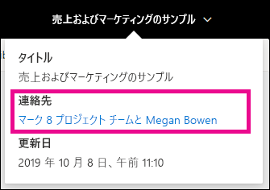
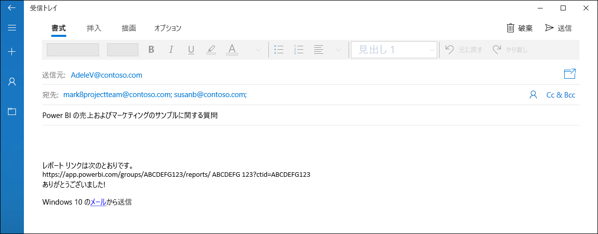

# Power BI サービスでレポートとダッシュボードの連絡先情報を設定する
この記事では、Power BI サービスでダッシュボードまたはレポートに連絡先情報を設定する方法について説明します。

> [!NOTE]
> 連絡先情報は、旧式のワークスペースまたは新しいワークスペースの項目に対して設定できます。 マイ ワークスペースの項目に連絡先情報を設定することはできません。 [新しい外観](../consumer/service-new-look.md)でレポートまたはダッシュボードを表示すると、情報カードが表示されます。

ある項目の連絡先に複数のユーザーまたはグループを追加できます。 連絡先として指定できるもの:
* 人
* Office 365 グループ
* 電子メールが有効なセキュリティ グループ
* 配布リスト

既定では、新しいレポートまたはダッシュボードを作成した人がその連絡先になります。 値を設定すると、既定値よりも優先されます。 もちろん、連絡先リストからすべてのユーザーまたはグループを削除することもできます。 その場合、旧式のワークスペースには、ワークスペースの Office 365 グループが表示されます。 新しいワークスペースには、[ワークスペースの連絡先リスト](../collaborate-share/service-create-the-new-workspaces.md#workspace-contact-list)が使用されます。 ワークスペースの連絡先リストが設定されていない場合は、ワークスペース管理者が表示されます。

連絡先情報は、項目を参照すると表示されます。 

 

連絡先リストをクリックすると、電子メールが作成され、そのメールで質問したり、サポートを依頼したりできます。 

 
 
連絡先リスト情報は他の場所でも使用されます。 たとえば、エラー ダイアログ ボックスのエラーで表示されることがあります。 アクセス要求など、項目に関連付けられている自動メール メッセージが連絡先リストに送信されます。 

> [!NOTE]
> アプリを発行すると、そのアプリを発行または更新した人に、個々の項目に設定されている連絡先情報が設定されます。 アプリの利用者が必要なサポートを得られるように、アプリのサポート URL を設定できます。

## レポートに連絡先情報を設定する
1. ワークスペースで、 **[レポート]** タブを選択します。
2. 目的のレポートを見つけ、 **[設定]** アイコンを選択します。
3. **[連絡先]** 入力フィールドを見つけ、値を設定します。

     

## ダッシュボードに連絡先情報を設定する
1. ワークスペースで、 **[ダッシュボード]** タブを選択します。
2. 目的のダッシュボードを見つけ、 **[設定]** アイコンを選択します。
3. **[連絡先]** 入力フィールドを見つけ、値を設定します。

     

## 制限事項と考慮事項
* 連絡先は、Power BI サービスで作成される新しい項目に対して自動的に設定されます。 既存の項目には、ワークスペースの既定値が表示されます。
* 連絡先リストには任意のユーザーまたはグループを設定できますが、項目へのアクセス許可が自動的に付与されることはありません。 共有を使用するか、それを必要とするユーザーにロールを使用してワークスペースへのアクセス権を付与します。 
* 項目レベルの連絡先リストは、発行時にアプリにプッシュされることはありません。 新しいアプリのナビゲーション エクスペリエンスには、多数のアプリ ユーザーからのフィードバックを管理するために役立つサポート URL が提供されています。

## 次のステップ

他にわからないことがある場合は、 [Power BI コミュニティを利用してください](https://community.powerbi.com/)。
