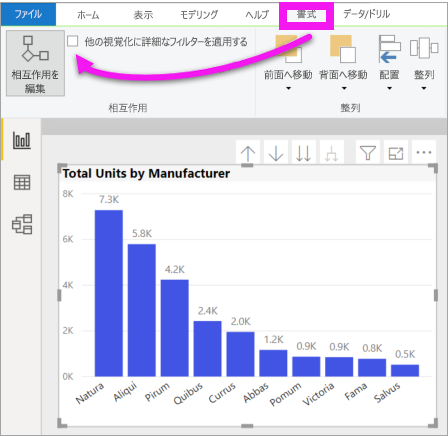

# Power BI レポート内でのビジュアルの相互作用を変更する
レポートの編集アクセス許可が与えられている場合、 **[ビジュアル対話]** を使い、レポート ページの視覚エフェクトの相互作用を変更できます。 

## ビジュアル対話の概要
既定では、レポート ページ上の 1 つの視覚化を使って、そのページ上の他の視覚化に処理とクロス強調表示を適用できます。
たとえば、マップの視覚化で州を選択した時に、その州の縦棒グラフを強調表示し、その 1 つの州に当てはまるデータのみを表示するように折れ線グラフをフィルター処理できます。
「[フィルター処理と強調表示について](power-bi-reports-filters-and-highlighting.md)」を参照してください。 また、視覚エフェクトが[詳細表示](../consumer/end-user-drill.md)に対応している場合、既定では、ある視覚エフェクトに詳細表示を適用してもレポート ページの他の視覚エフェクトは変更されません。 ただし、このような既定の動作はいずれもオーバーライドできます。また、相互作用は視覚エフェクトごとに設定できます。

この記事では、Power BI Desktop で**ビジュアル対話**を使用する方法について説明します。 プロセスは、Power BI サービスの[編集ビュー](service-interact-with-a-report-in-editing-view.md)と同じです。 読み取りビューにのみアクセスできる場合、または他のユーザーとレポートを共有している場合、ビジュアル対話の設定を変更することはできません。

"*クロスフィルター処理*" と "*クロス強調表示*" という用語は、ここで説明する動作を、 **[フィルター]** ウィンドウで視覚化の "*フィルター処理*" と "*強調表示*" を使用した場合に起こる動作と区別するために使用されています。  

> [!NOTE]
> このビデオでは、古いバージョンの Power BI Desktop と Power BI サービスが使用されています。 
>
>

<iframe width="560" height="315" src="https://www.youtube.com/embed/N_xYsCbyHPw?list=PL1N57mwBHtN0JFoKSR0n-tBkUJHeMP2cP" frameborder="0" allowfullscreen></iframe>

## ビジュアル対話コントロールを有効にする
レポートの編集アクセス許可を持っている場合は、ビジュアル対話コントロールをオンにした後、レポート ページの視覚化が互いにどのようにフィルター処理され、どのように強調表示されるかをカスタマイズできます。 

1. 視覚化を選んでアクティブにします。  
2. **[ビジュアル対話]** オプションを表示します。
    

    - デスクトップで、 **[書式]、[相互作用]** の順に選びます。

        ![[書式]、[相互作用] の順に選択](media/service-reports-visual-interactions/power-bi-interaction.png)

    - Power BI サービスで、レポートを編集ビューで開き、レポートのメニュー バーからドロップダウンを選択します。

        ![[ビジュアル対話] ドロップダウン](media/service-reports-visual-interactions/power-bi-service.png)

3. ビジュアル対話コントロールを表示するには、 **[相互作用を編集]** を選択します。 Power BI によって、レポート ページのその他すべての視覚化に [フィルター] アイコンと [強調表示] アイコンが追加されます。 ツリー マップによって、折れ線グラフとマップがクロスフィルター処理され、縦棒グラフがクロス強調表示されていることがわかります。 これで、レポート ページで選択した視覚化が他の視覚化と対話する方法を変更できるようになりました。
   
    

## 対話の動作を変更する
レポート ページ上の各視覚化を一度に 1 つずつ選択して、視覚化の対話について理解を深めます。  データ ポイント、バー、または図形を選択し、他の視覚化に対する影響を観察します。 確認した動作が望ましいものでない場合は、対話を変更できます。 これらの変更はレポートと共に保存されるため、ユーザーとレポート コンシューマーのビジュアル対話エクスペリエンスは同じになります。

まず、視覚化を選択してアクティブにします。  ページ上の他のすべての視覚化に相互作用アイコンが表示されていることに注目してください。 太字のアイコンが現在適用されているものです。 次に、**選択した視覚化**が他の視覚化にどのような影響を与えるかを決定します。  また、必要に応じて、レポート ページの他のすべての視覚エフェクトに対して繰り返します。

選択した視覚化が次の条件の場合:
   
   * ページ上の他の視覚化のいずれかをフィルター処理するために使う場合、その視覚化 **フィルター アイコン** の右上隅にある  アイコンを選択します。
   * ページ上の他の視覚化のいずれかをクロス強調表示するために使う場合、**強調表示**アイコン  を選択します。
   * ページ上の他の視覚化のいずれにも影響しない場合、**影響なし**アイコン  を選択します。

## ドリル可能な視覚化の対話を変更する
[Power BI の特定の視覚化をドリルダウンできます](../consumer/end-user-drill.md)。 既定では、視覚化をドリルダウンしても、レポート ページ上の他の視覚化には影響しません。 ただし、その動作を変更できます。 

> [!TIP]
> [ヒューマン リソース サンプル .PBIX ファイル](https://download.microsoft.com/download/6/9/5/69503155-05A5-483E-829A-F7B5F3DD5D27/Human%20Resources%20Sample%20PBIX.pbix)を使用して、ご自分で試してみてください。 **[新しい採用者]** タブにドリルダウンが表示された縦棒グラフがあります。
>

1. ドリル可能なビジュアルを選択してアクティブにします。 

2. ドリル ダウン アイコンを選択して、ドリル ダウンを有効にします。

    

2. メニューバーから **[形式]**  >  **[他の視覚化に詳細なフィルターを適用する]** を選択します。  視覚化でドリルダウン (およびドリルアップ) すると、レポート ページの他の視覚エフェクトで現在の詳細表示選択が反映されます。 

    

3. 確認した動作が望ましいものでない場合は、[前述のように](#change-the-interaction-behavior)対話を変更できます。

## 考慮事項とトラブルシューティング
異なるテーブルからのフィールドを含むマトリックスを作成した後、階層の異なるレベルにある複数の項目を選択することでクロス強調表示を試みると、他のビジュアルでエラーが表示されます。 

    
## 次のステップ
[Power BI レポートのフィルター処理と強調表示](power-bi-reports-filters-and-highlighting.md)