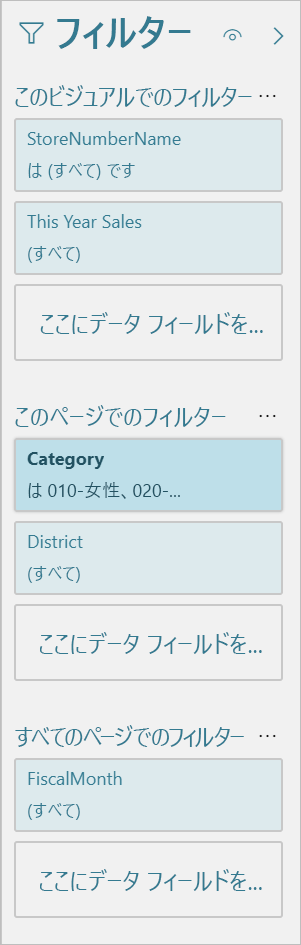
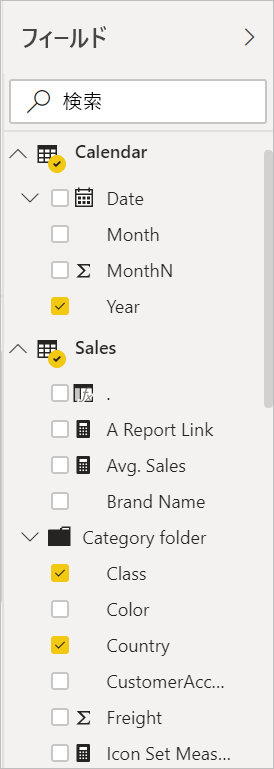

# Power BI でのレポート エディターのツアー

Power BI Desktop と Power BI サービスで、"*レポート エディター*" は、コンシューマーがグラフ、テーブル、マップ、その他のビジュアルを使用して、表示するレポートをデザインする場所です。 これは 2 つの環境で同様になります。 通常は、Power BI Desktop でレポートを作成し始めます。 次に、それを Power BI サービスに公開します。ここでは引き続きそれを変更できます。 Power BI サービスでは、レポートに基づくダッシュボードを作成することもできます。

ダッシュボードとレポートを作成した後、それらをレポート コンシューマーに配布します。 その共有方法に応じて、エンド ユーザーは Power BI サービスの読み取りビューでそれらとやりとりできますが、編集はできません。 詳細については、[Power BI サービスでレポート コンシューマーが実行できる操作](../consumer/end-user-reading-view.md)に関するページをご覧ください。 

この動画では、Power BI Desktop のレポート エディターをご覧いただけます。 この記事では、Power BI Desktop のレポート エディターについても示します。 

<iframe width="560" height="315" src="https://www.youtube.com/embed/IkJda4O7oGs" frameborder="0" allowfullscreen></iframe>

Power BI サービスでは、レポート エディターは編集ビューでのみ使用できます。 編集ビューでレポートを開くには、レポートの所有者、作成者、またはレポートが収納されているワークスペースの共同作成者である必要があります。

Power BI のレポート エディターは、次のいくつかのメイン セクションに分かれています。  

1. 上部のナビ ペイン
1. レポート キャンバス
1. フィルター ウィンドウ
1. 視覚化ウィンドウ
1. [フィールド] ウィンドウ

## 1.上部のナビ ペイン
上部のナビ ペインからさまざまな操作を実行できます。新しい操作が常時追加されています。 特定の操作については、Power BI ドキュメントの目次や検索ボックスを使用してください。

## 2.レポート キャンバス
レポート キャンバスは、作業内容が表示される場所です。 フィールド、フィルター、視覚化のウィンドウを使用してビジュアルを作成すると、ビジュアルはレポート キャンバスで構築され、表示されます。 キャンバスの下部にあるタブは、それぞれレポート内のページを表します。 タブを選択すると、そのページが開きます。 

## レポート エディターのウィンドウ

レポートを最初に開くと、フィルター、視覚化、フィールドという 3 つのウィンドウが表示されます。 左側にある最初の 2 つのウィンドウ (フィルターと視覚化) では、視覚化がどのように表示されるか (種類、色、フィルター、書式) を制御します。 右側にある最後のウィンドウ (フィールド) では、視覚化で使用される基になるデータを管理します。 レポート エディターに表示されるコンテンツは、レポート キャンバスで選択した内容によって異なります。 

たとえば、この縦棒グラフなどの個々のビジュアルを選択すると、次のようになります。

**フィルター ウィンドウ**には、ビジュアル、ページ、またはすべてのページのフィルターが表示されます。 この場合、ページ レベルのフィルターはありますが、ビジュアル レベルのフィルターはありません。

**視覚化ウィンドウの上部**では、使用中のビジュアルの種類が識別されます。 この例では、集合縦棒グラフです。 

**視覚化ウィンドウの下部**には、タブが 3 つ備わっています。

 **フィールド**では、ビジュアルのフィールドが表示されます。 詳細をすべて表示するには、下にスクロールする必要がある場合があります。 このグラフでは、StoreNumberName と "今年の売上" を使用しています。

 **書式** 選択した視覚化の書式ペインを表示するには、ペイント ローラーのアイコンを選択します。

 **分析** 分析ペインを表示するには、拡大鏡アイコンを選択します。

**フィールド ウィンドウ**には、データ モデルで利用できるすべてのテーブルが一覧表示されます。 テーブルを展開すると、そのテーブル内のフィールドが表示されます。 黄色のチェック マークは、そのテーブルの少なくとも 1 つのフィールドが視覚化にあることを示します。

各ウィンドウの詳細について読み続けてください。

## 3.フィルター ウィンドウ
フィルター ウィンドウを使うと、ページ、レポート、ドリルスルーおよびビジュアルの各レベルでレポートの固定フィルターの閲覧、設定、変更ができます。 そうです。ビジュアルの要素を選ぶか、スライサーのようなツールを使うと、レポート ページとビジュアルに対してアドホック フィルター処理を行うことができます。 フィルター ウィンドウのフィルター処理には、フィルターの状態はレポートと共に保存されるという利点があります。 

フィルター ウィンドウには、もう 1 つ強力な機能があります。これにより、*ご利用のレポート内のビジュアルのいずれかにまだない*フィールドを使ってフィルター処理することができます。 説明しましょう。 視覚化を作成すると、Power BI によって、視覚化のすべてのフィールドがフィルター ウィンドウのビジュアル レベル フィルター領域に自動的に追加されます。 視覚化で現在使用されていないフィールドを使うビジュアル フィルター、ページ フィルター、ドリルスルー フィルター、またはレポート フィルターを設定する場合は、フィルター バケットの 1 つにそれをドラッグするだけです。

新しいフィルター エクスペリエンスでは、より高い柔軟性が提供されます。 たとえば、それ自体がレポートのように見えるように、フィルターを書式設定できます。 また、フィルターをロックしたり、それをレポート コンシューマーから非表示にしたりもできます。 

詳細については、[新しいフィルター エクスペリエンス](power-bi-report-filter.md)に関する記事をご覧ください。

## 4.視覚化ウィンドウ

視覚化ウィンドウには、それ自体に 4 つのセクションが用意されています。 そのウィンドウの上部から始めます。

ここで視覚化の種類を選択します。 小さいアイコンは、作成できるさまざまな視覚化の種類を示しています。 上の画像では、バブル チャートが選択されています。 最初に視覚化の種類を選択しないで、フィールドを選択することで視覚化の作成を始めた場合、Power BI によって視覚化の種類が自動的に選択されます。 Power BI による選択をそのまま使用することも、別のアイコンを選んで種類を変更することもできます。

カスタムの視覚エフェクトを Power BI Desktop にダウンロードできます。 このウィンドウにもこれらのアイコンが表示されます。 

### 視覚化でフィールドを管理する

このウィンドウにあるバケット (*ウェル*と呼ばれることもあります) は、どの種類の視覚化を選択したかによって異なります。  たとえば、横棒グラフを選択した場合は、軸、凡例、値が表示されます。 フィールドを選択するか、キャンバス上にドラッグすると、Power BI によってそのフィールドがバケットのいずれかに追加されます。  フィールドの一覧からバケットにフィールドを直接ドラッグすることもできます。  いくつかのバケットは、特定の種類のデータにしか使用できません。  たとえば、 **値** は数値以外のフィールドを受け付けません。 つまり、**カテゴリ** フィールドを**値**バケットにドラッグすると、Power BI によってそれは**カテゴリの数**に変更されます。

詳細については、「[Power BI レポートへの視覚化の追加](../visuals/power-bi-report-add-visualizations-i.md)」を参照してください。

ウィンドウのこの部分には、[ドリルスルー](desktop-drillthrough.md)とフィルター動作を制御するオプションもあります。

### ビジュアルの書式設定
ペイント ローラー アイコンを選択して書式ウィンドウを表示します。 使用可能なオプションは、選択した視覚エフェクトの種類に応じて異なります。

書式設定の可能性は幅広いです。  詳しくは、実際に使ってみるか、次の記事を参照してください。

* [視覚エフェクト タイトル、背景、および凡例のカスタマイズ](../visuals/power-bi-visualization-customize-title-background-and-legend.md)
* [色の書式設定](../visuals/service-getting-started-with-color-formatting-and-axis-properties.md)
* [X 軸と Y 軸のプロパティのカスタマイズ](../visuals/power-bi-visualization-customize-x-axis-and-y-axis.md)

### 視覚化に分析を追加する
拡大鏡アイコンを選択して分析ウィンドウを表示します。 使用可能なオプションは、選択した視覚エフェクトの種類に応じて異なります。

Power BI サービスの分析ウィンドウでは、視覚化に動的な参照行を追加し、重要な傾向や分析情報にフォーカスを設定できます。 詳細については、「[Power BI Desktop の [分析] ウィンドウを使用する](../transform-model/desktop-analytics-pane.md)」を参照してください。

## 5.フィールド ウィンドウ
フィールド ウィンドウには、視覚化を作成するために使用できるデータ内にあるテーブル、フォルダー、フィールドが表示されます。

|  |  |
| --- | --- |
|  |<ul><li>ページにフィールドをドラッグして、新しい視覚化を作成します。  既存の視覚化にフィールドをドラッグし、その視覚化にフィールドを追加することもできます。  </li> <li>フィールドの横にチェックマークを追加すると、そのフィールドがアクティブな (または新しい) 視覚化に追加されます。 また、そのフィールドをどのバケットに配置するかも決定されます。  たとえば、フィールドを凡例、軸、値のいずれに使用するかについて決定されます。 Power BI で最良の判断が行われますが、配置されたフィールドを必要に応じて別のバケットに移動できます。   </li><li>どちらの方法でも、選択された各フィールドは、レポート エディターの視覚化ウィンドウに追加されます。</li></ul> |

Power BI Desktop では、フィールドの表示/非表示、計算の追加などのオプションも備わっています。

## フィールド アイコン

Power BI では、レポート内のフィールドの種類を示すために、多くのアイコンが使用されます。 それらを認識できる場合、さまざまなビジュアルでどのように動作するかをより適切に理解できます。 より一般的なものの一部を次に示します。

|アイコン  |意味  |
|---------|---------|
|  | [フィールド] リストのフォルダー |
| | 数値フィールド: 数値フィールドは、合計や平均などが可能な集計です。 集計は、データと一緒にインポートされ、レポートの基となるデータ モデルで定義されます。 詳細については、「[Power BI レポートの集計](service-aggregates.md)」を参照してください。 |
| | 数値以外のデータ型を含む計算列: 列の値を定義する Data Analysis Expressions (DAX) 式を使用して作成する新しい数値以外の列です。 [計算列](../transform-model/desktop-calculated-columns.md)に関する詳細情報を表示します。 |
|     |   数値の計算列: 列の値を定義する Data Analysis Expressions (DAX) 式を使用して作成する新しい列です。 [計算列](../transform-model/desktop-calculated-columns.md)に関する詳細情報を表示します。 |
| |  メジャー: メジャーには、独自のハードコーディングされた式があります。 計算を変更することはできません、たとえば、合計であれば、合計のままにしかできません。 値は列に格納されません。 これらは、ビジュアル内の場所のみに応じて、すぐに計算されます。 詳細については、「[メジャーについて](../transform-model/desktop-measures.md)」を参照してください。 |
|     | メジャー グループ  |
| |      KPI: 測定可能な目標に対する進捗状況を視覚的に伝える方法の 1 つです。 主要業績評価指標 (KPI) ビジュアルに関する詳細については、[こちら](../visuals/power-bi-visualization-kpi.md)を参照してください |
|     |  フィールドの階層: 矢印を選択し、階層を構成するフィールドを表示します。  詳細については、YouTube で[階層の作成と使用](https://www.youtube.com/watch?v=q8WDUAiTGeU)についてのこの Power BI ビデオをご覧ください。 |
|     | Geo データ: これらの場所フィールドは、地図の視覚化を作成するために使用できます。 |
|      | ID フィールド: このアイコンのフィールドは、*一意のフィールド*であり、重複するものがあっても、すべての値が表示されるように設定されています。 たとえば、データに 'Robin Smith' という名前のユーザーのためのレコードが 2 つあったとしても、それぞれが一意として扱われます。 これらは合算されることはありません。   |
|   | パラメーター: 1 つまたは複数のパラメーター値に応じて、レポートおよびデータ モデルの一部 (クエリ フィルター、データ ソース参照、メジャー定義など) にするパラメーターを設定します。 詳細については、この Power BI の[クエリ パラメーター](https://powerbi.microsoft.com/blog/deep-dive-into-query-parameters-and-power-bi-templates/)に関するブログ投稿を参照してください。 |
|  | 組み込みの日付テーブルを含むカレンダー日付フィールド |

## 次の手順
[レポートの作成](service-report-create-new.md)

[Power BI サービス](service-report-create-new.md)、[Power BI Desktop](desktop-report-view.md)、[Power BI モバイル アプリ](../consumer/mobile/mobile-apps-view-phone-report.md)の各レポートについての詳細をご覧ください。

[Power BI デザイナーの基本的な概念](../fundamentals/service-basic-concepts.md)

他にわからないことがある場合は、 [Power BI コミュニティを利用してください](https://community.powerbi.com/)。
