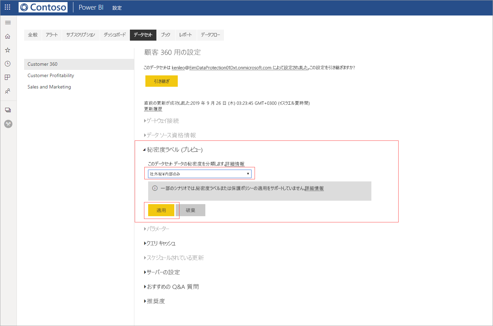
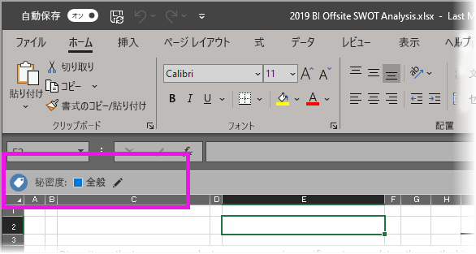

# Power BI でデータの秘密度ラベルを適用する (プレビュー)

Power BI サービスで秘密度ラベルを有効にすると、ダッシュボード、レポート、データセット、データフローにデータ秘密度ラベルを適用することによって、承認されていないアクセスや漏えいからそれらを保護できます。 データ秘密度ラベルを使用してデータに正しくラベルを付けると、承認されたユーザーのみがデータにアクセスできるようになります。

データ保護が有効になっていると、ダッシュボード、レポート、データセット、およびデータフローのリスト ビューの秘密度列に秘密度ラベルが表示されます。

> [!NOTE]
> Power BI のダッシュボード、レポート、データセット、データフローに秘密度ラベルを適用するには、特定のライセンスとアクセス許可が必要です。 詳しくは、「[秘密度ラベルを適用する](#applying-sensitivity-labels)」をご覧ください。

## 秘密度ラベルを適用する

Power BI で秘密度ラベルを適用するには、ユーザーと組織に次の要件が適用されている必要があります。

* 組織により、[Microsoft 365 セキュリティ センター](https://security.microsoft.com/)または [Microsoft 365 コンプライアンス センター](https://compliance.microsoft.com/)で秘密度ラベルが定義されている必要があります。
* ユーザーは、データ秘密度ラベルを適用するためのアクセス許可を持つセキュリティ グループに属している必要があります。詳しくは、「[Power BI 内でデータの秘密度ラベルを有効にする (プレビュー)](../admin/service-security-enable-data-sensitivity-labels.md#enable-data-sensitivity-labels)」をご覧ください。
* ユーザーは、Power BI Pro ライセンスと、ラベルを付けるリソースに対する編集アクセス許可を持っている必要があります。 
* ユーザーは、Azure Information Protection Premium P1 または Premium P2 ライセンスを持っている必要があります。 Microsoft Azure Information Protection は、スタンドアロンとして、またはいずれかの Microsoft ライセンス スイートを介して購入できます。 詳細については、「[Azure Information Protection の価格](https://azure.microsoft.com/pricing/details/information-protection/)」を参照してください。

レポートで秘密度ラベルを適用または変更するには、ワークスペース リスト項目でレポート設定アイコンをクリックし、設定サイド ペインのデータ秘密度セクションに移動します。 適切な秘密度ラベルを選択し、設定を保存します。

更新された秘密度ラベルが、秘密度列に表示されます。 

ダッシュボードでの秘密度ラベルの適用または変更は、レポートの場合と同じプロセスに従います。 

データセットおよびデータフローで秘密度ラベルを設定することもできます。 次の図では、データセットに対して秘密度ラベルを設定する方法を示します。データフローの手順は似ています。

データセットで秘密度ラベルを設定するには、データセット タブを選択し、ラベルを適用するデータセットの省略記号をクリックして、 **[設定]** を選択します。

データセットの設定ページで、秘密度ラベル セクションを開き、目的の秘密度ラベルを選択して、 **[適用]** をクリックします。

データフローでの秘密度ラベルの適用または変更は、データセットの場合と同じプロセスに従います。

## 秘密度ラベルの削除
レポート、ダッシュボード、データセット、またはデータフローから秘密度ラベルを削除する場合は、[ラベルの適用で使用するのと同じ手順](#applying-sensitivity-labels)に従いますが、データの秘密度を分類するように求められたら、 **(なし)** を選択してください。 

## エクスポートされたファイルでのデータ保護

秘密度ラベルが設定されている[レポートからデータをエクスポートする](https://docs.microsoft.com/power-bi/consumer/end-user-export)と、秘密度ラベルが生成されるファイル (Excel、PowerPoint、PDF の場合、CSV は非サポート) に継承されます。 秘密度ラベルはファイルに表示され、ファイルへのアクセスは、十分なアクセス許可を持つユーザーに制限されます。

## 考慮事項と制限事項

データの秘密度ラベルの適用には、次の考慮事項があります。

* Power BI 内で Microsoft Information Protection の秘密度ラベルを適用および表示するには、Azure Information Protection Premium P1 または Premium P2 ライセンスが必要です。 Microsoft Azure Information Protection は、スタンドアロンとして、またはいずれかの Microsoft ライセンス スイートを介して購入できます。 詳細については、「[Azure Information Protection の価格](https://azure.microsoft.com/pricing/details/information-protection/)」を参照してください。
* 秘密度ラベルは、ダッシュボード、レポート、データセット、およびデータフローにのみ適用できます。
* エクスポートされたファイルに対するラベルおよび保護制御の適用は、Excel、PowerPoint、および PDF ファイルに対してのみサポートされています。 データの .CSV ファイルへのエクスポート、メールの受信登録、ビジュアルの埋め込み、印刷を行う場合は、ラベルと保護は適用されません。
* Power BI からファイルをエクスポートしたユーザーには、秘密度ラベルの設定に従って、そのファイルにアクセスして編集するためのアクセス許可が与えられます。 データをエクスポートしたユーザーに、そのファイルに対する所有者のアクセス許可を与えられません。 
* 現在、秘密度ラベルは[ページ分割されたレポート]( https://docs.microsoft.com/power-bi/paginated-reports-report-builder-power-bi)とブックでは使用できません。 
* Power BI 資産の秘密度ラベルは、ワークスペースの一覧と系列ビューでのみ表示されます。現在、お気に入り、自分と共有、最近使用、アプリ ビューでは表示されません。 ただし、Power BI 資産に適用されているラベルは、表示されない場合でも、Excel、PowerPoint、および PDF ファイルにエクスポートされたデータに常に保持されることに注意してください。
* [Microsoft 365 セキュリティ センター](https://security.microsoft.com/)または [Microsoft 365 コンプライアンス センター](https://compliance.microsoft.com/)内で構成されている秘密度ラベルの "*ファイル暗号化設定*" は Power BI "*からエクスポートされた*" ファイルにのみ適用されます。Power BI "*内*" で適用されることはありません。
* Power BI 内で適用されているラベルでは、[HYOK 保護](https://docs.microsoft.com/azure/information-protection/configure-adrms-restrictions)はサポートされていません。
* Office アプリ内でラベルを表示および適用するには、[ライセンス要件](https://docs.microsoft.com/microsoft-365/compliance/get-started-with-sensitivity-labels#subscription-and-licensing-requirements-for-sensitivity-labels)があります。
* 秘密度ラベルは、グローバル (パブリック) クラウド内のテナントに対してのみサポートされています。 秘密度ラベルは、他のクラウド内のテナントではサポートされません。
* [外部ユーザー (Azure Active Directory B2B ゲスト ユーザー)](../service-admin-azure-ad-b2b.md) については、秘密度ラベルはサポートされていません。 これは、外部ユーザーはラベルを表示できず、Excel、PDF、および PPTX ファイルへのデータのエクスポートがブロックされることを意味します。 外部ユーザーがこれらのファイルの種類にデータをエクスポートできるようにするには、[ラベルを削除](#removing-sensitivity-labels)します。

## 次の手順

この記事では、Power BI 内でデータの秘密度ラベルを適用する方法を説明しました。 次の記事では、Power BI におけるデータ保護の詳細について説明しています。 

* [Power BI におけるデータ保護の概要](../admin/service-security-data-protection-overview.md)
* [Power BI 内でデータの秘密度ラベルを有効にする](../admin/service-security-enable-data-sensitivity-labels.md)
* [Power BI 内で Microsoft Cloud App Security の制御を使用する](../admin/service-security-using-microsoft-cloud-app-security-controls.md)