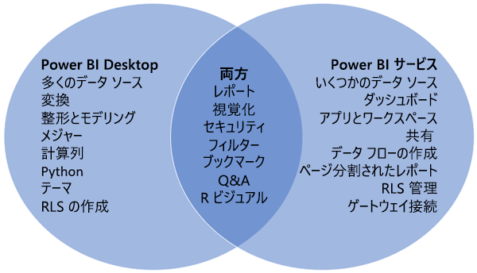

# Power BI Desktop と Power BI サービスの比較

Power BI Desktop と Power BI サービスを比較したベン図では、中央の領域にこの 2 つが重なる部分が示されます。 一部のタスクは Power BI Desktop でも Power BI サービスでも実行できます。 ベン図の右側と左側には、アプリケーションとサービスに固有の機能が示されています。  

**Power BI Desktop** は、ローカル コンピューターに無料でアプリケーションをインストールする完全なデータ分析とレポート作成ツールです。 これには、さまざまなデータ ソースに接続し、それらを 1 つのデータ モデルに結合できる (これはモデリングと呼ばれることがあります) クエリ エディターが含まれています。 その後、そのデータ モデルに基づいてレポートを設計します。 「[Power BI Desktop 概要ガイド](../desktop-getting-started.md)」でこのプロセスが説明されています。

**Power BI サービス**はクラウドベースのサービスです。 チームや組織のための簡単なレポート編集や共同作業をサポートします。 Power BI サービスでもデータ ソースに接続できますが、モデリングに制限があります。 

Business Intelligence プロジェクトに取り組んでいるほとんどのレポート デザイナーは、**Power BI Desktop** を使用してレポートを作成した後、**Power BI サービス**を使用して、レポートを他のユーザーに配布します。

## レポートの編集

アプリケーションとサービスの両方で、*レポート*を構築し、編集します。 レポートには任意の数のページとビジュアルを含めることができます。 レポート内の移動機能を強化する目的で、ブックマーク、ボタン、フィルター、ドリルスルーを追加します。

Power BI Desktop と Power BI サービスのレポート エディターは同じようなものです。 3 つのセクションから構成されています。  

1. 上部のナビ ペイン。Power BI Desktop と Power BI サービスで異なります    
2. レポート キャンバス     
3. **フィールド**、**視覚化**、**フィルター**の各ウィンドウ

この動画では、Power BI Desktop のレポート エディターをご覧いただけます。 

<iframe width="560" height="315" src="https://www.youtube.com/embed/IkJda4O7oGs" frameborder="0" allowfullscreen></iframe>

## Power BI サービスでの作業

### 共同作業

レポートを作成したら、それを **Power BI サービス**の*ワークスペース*に保存し、そこで同僚と共同作業できます。 このレポートの上に*ダッシュボード*を構築します。 その後、組織内外のレポート利用者とダッシュボードやレポートを共有します。 レポート利用者は Power BI サービスの編集ビューではなく、"*読み取りビュー*" でダッシュボードやレポートを閲覧します。 レポート作成者が利用できる機能をすべて利用することはできません。  また、データセットを共有し、他のユーザーが独自のレポートを作成できるようにすることもできます。 Power BI サービスでの共同作業の詳細については、[こちら](../service-new-workspaces.md)をご覧ください。

### データフローを使用したセルフサービスのデータ準備

データフローは、組織がばらばらのソースからデータを取りまとめてモデリング用に準備するのに役立ちます。 アナリストは、使い慣れたセルフサービス ツールを使用して簡単にデータフローを作成できます。 アナリストは、データフローを使用して、データ ソース接続、ETL ロジック、更新スケジュールなどを定義することにより、ビッグ データの取り込み、変換、統合、補強を行います。 データフローを使用したセルフサービスのデータ準備の詳細については、[こちら](../service-dataflows-overview.md)をご覧ください。

## 次の手順

[Power BI Desktop とは何ですか?](../desktop-what-is-desktop.md)

Power BI サービスで[レポートを作成する](../service-report-create-new.md)

[レポート デザイナーの基本的な概念](../service-basic-concepts.md)

他にわからないことがある場合は、 [Power BI コミュニティを利用してください](https://community.powerbi.com/)。

