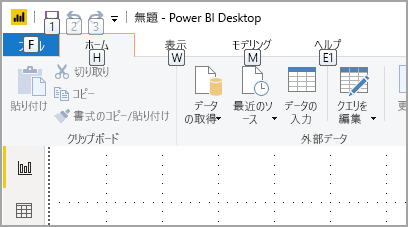
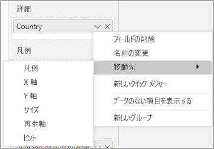
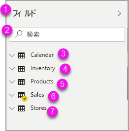

# Power BI でアクセシビリティ ツールを使用してレポートを作成する

アクセシビリティ ツールを使用してレポートを作成するレポート作成者のために、Power BI には、プロセスに役立つ多くの組み込み機能があります。

この記事では、Power BI Desktop でレポート作成者が使用できるさまざまな種類のアクセシビリティ ツールについて説明します。

## アプリ レベルのナビゲーション
Power BI Desktop 内を移動する場合は、**Ctrl + F6** キーを押して、アプリのメイン領域にフォーカスを移すことができます。 Power BI Desktop のメイン領域内でのフォーカスの移動は、次の順序で行われます。

1. キャンバス上のオブジェクト
2. ページのタブ
3. ペイン (個別に、開いているものについて左から右に)
4. ビュー ナビゲーター
5. フッター
6. サインイン
7. 黄色の警告/エラー/更新バー

ほとんどの場合、**Enter** キーを使用して領域を選択するか、領域に入り、**Esc** キーを使用して終了するのが、Power BI の一般的な手順です。

## リボン ナビゲーション

**Alt** キーを押すと、"*キーヒント*" と呼ばれる小さいボックスが、リボンの現在のビューで使用できる各コマンドに表示されます。 次に、使用したいコマンドの上に表示されている "*キーヒント*" で示されている文字のキーを押します。 

たとえば、次の図では、**Alt** キーが押されて、使用可能なコマンドの文字を含むキーヒントが表示されています。 次に、**M** キーを押すと、リボンの **[モデリング]** タブが開きます。

押す文字によっては、追加のキーヒントが表示されることがあります。 たとえば、 **[ホーム]** タブがアクティブになっている状態で **W** キーを押すと、 **[表示]** タブが開き、 **[表示]** リボン タブにあるグループのキーヒントが表示されます。使用する特定のコマンドの文字を押すまで、キーヒントに表示される文字を続けて押すことができます。 前のキーヒントのセットに移動するには、**Esc** キーを押します。行っている操作をキャンセルし、キーヒントを非表示にするには、**Alt** キーを押します。

## [視覚化] ペインのナビゲーション

**[視覚化]** ペイン内を移動するには、まず **Ctrl + F6** キーを繰り返し押して [視覚化] ペインまで移動し、[視覚化] ペインにフォーカスを設定する必要があります。 ユーザーが [視覚化] ペイン内を移動するとき、フォーカスは最初にヘッダーに設定されます。 上部から開始して、タブ オーダーは次のとおりであり、図に示すようになります。

1. ヘッダー タイトル
2. 展開/折りたたみカラット
3. 最初の視覚化アイコン

視覚化の領域に移ったら、方向キーを使用して特定の視覚化に移動し、**Enter** キーを押して選択します。 スクリーン リーダーを使用している場合は、新しいグラフを作成していることとその種類、または特定の種類のグラフを別の種類のグラフに変更したことが、音声で通知されます。 

次の図に示すように、ペインの視覚化セクションの後、フォーカス オーダーはペインのピボットに移ります。

フォーカスがペイン ピボットにおあるとき、Tab キーを押すと、選択されているペインのアイコンだけに移動します。 他のペインに切り替えるには、方向キーを使用します。

## フィールド ウェル

前のセクションで説明したように、フォーカスがペイン ピボットにあるとき、もう一度 Tab キーを押すと、**フィールド ウェル**にフォーカスが移動します。 

**フィールド ウェル**では、フォーカスは次のような順序で移動します。

* 各ウェルのタイトル (最初)
* 各ウェルの特定のフィールド (次)
* フィールド メニューを開くドロップダウン ボタン (その後)
* 削除ボタン (最後)

次の図は、このフォーカス移動順序を示したものです。

スクリーン リーダーでは、ウェルの名前とそのツールヒントが音声で示されます。 ウェルの各フィールドでは、フィールド名とツールヒントが読み上げられます。 ウェルが空の場合、フォーカスは空のウェル全体に移動します。 スクリーン リーダーでは、ウェルの名前、ツールヒント、それが空であることがを読み上げられます。

フィールド メニューが開いている場合は、**Tab** キー、**Shift + Tab** キー、または**上** / **下**方向キーを使用して移動できます。 スクリーン リーダーでは、オプションの名前が読み上げられます。

フィールド ウェル内のあるバケットから別のバケットにフィールドを移動したい場合は、次の図に示すように、キーボードを使用し、フィールド ウェル メニューの **[移動先]** オプションを使用できます。

## 書式設定ウィンドウ

**[書式]** ペインのフォーカス順序は、上から下にカードの順序で移動します。 フォーカスは、カード名の次に、**オン/オフ** トグル ボタン (存在する場合) に移動します。 カード名にフォーカスがある場合、スクリーン リーダーでカードの名前、カードが展開されているか折りたたまれているかが読み上げられます。 **Eenter** キーを押して、カードを展開または折りたたむことができます。 **Enter** キーは、トグル ボタンの**オン**または**オフ**の切り替えにも使用します。

![[書式] ウィンドウでのフォーカスの移動](media/desktop-accessibility/accessibility-create-reports-06.png)

カードが開いている場合は、**Tab** キーを押すとカード内のコントロール間を移動してから次のカードに移動します。 カード内のコントロールでは、タイトル、現在の値、およびコントロールの種類がスクリーン リーダーで読み上げられます。  

## フィールド一覧のナビゲーション

**Tab** キーを押して、 **[フィールド]** 一覧内を移動できます。 [書式] ペインと同様に、テーブルが折りたたまれている場合、フォーカス順序は次のように切り替わります。

1. **[フィールド]** 一覧ヘッダー
2. 検索バー
3. 各テーブル名

**[フィールド]** ウェル内のすべてのテーブルを展開するには、**Alt + Shift + 9** キーを押します。 すべてのテーブルを折りたたむには、**Alt + Shift + 1** キーを押します。 1 つのテーブルを展開するには、**右方向**キーを押します。 1 つのテーブルを折りたたむには、**左方向**キーを押します。 [書式] ペインと同様に、テーブルが展開されている場合は、Tab キーによるフィールド一覧内の移動には、表示されているフィールドが含まれます。 スクリーン リーダーでは、テーブルが展開されているか折りたたまれているかが読み上げられます。

目的のフィールドに移動して **Enter** キーを押すことにより、フィールドにチェックマークを付けることができます。   スクリーン リーダーでは、フォーカスがあるフィールド、およびフィールドがオンになっているかどうかが読み上げられます。

マウス ユーザーは、通常、フィールドをキャンバスにまたは目的の関連するフィルター バケットにドラッグ アンド ドロップします。 キーボードを使用したい場合は、**Shift + F10** キーを押してフィールドのコンテキスト メニューに入り、方向キーを使用して **[フィルターに追加]** に移動し、フィールドを追加するフィルターの種類で **Enter** キーを押すことにより、フィールドをフィルター バケットに追加できます。

## [選択] ウィンドウのナビゲーション
**[選択項目]** ペインのフォーカスの順序は次のとおりです。

1. ヘッダー タイトル
2. 終了ボタン
3. レイヤー/タブ オーダー スイッチャー
4. レイヤーの上へ移動ボタン
5. レイヤーの下へ移動ボタン
6. 表示ボタン
7. 非表示ボタン
8. オブジェクト

![[選択項目] ペインのフォーカスの推移](media/desktop-accessibility/accessibility-create-reports-11.png)

フォーカスの順序を Tab キーで移動し、**Enter** キーを押して、目的の要素を選択できます。  

レイヤー/タブ オーダー スイッチャーに移動したら、左右の方向キーを使用して、レイヤーの順序とタブ オーダーを切り替えます。

**[選択項目]** ペインでオブジェクトに移動したら、**F6** キーを押して **[選択項目]** ペインをアクティブにします。 **[選択項目]** ペインをアクティブにした後、上下の方向キーを使用して **[選択項目]** ペイン内の別のオブジェクトに移動できます。
目的のオブジェクトに移動したら、いくつかの異なる操作を実行できます。

* オブジェクトの表示/非表示を切り替えるには、**Ctrl + Shift + S** キーを押します
* レイヤーの順序でオブジェクトを上に移動するには、**Ctrl + Shift + F** キーを押します
* レイヤーの順序でオブジェクトを下に移動するには、**Ctrl + Shift + B** キーを押します
* 複数のオブジェクトを選択するには、**Ctrl + Space** キーを押します

## Power BI Desktop ダイアログ

Power BI Desktop のすべてのダイアログは、キーボード ナビゲーションを使用してアクセスでき、スクリーン リーダーと連携します。

Power BI Desktop のダイアログには、次のものが含まれます。

* [クイック メジャー] ダイアログ
* [条件付き書式] および [データ バー] ダイアログ
* [Q&A Explorer] ダイアログ
* [作業の開始] ダイアログ
* [ファイル] メニューおよび [バージョン情報] ダイアログ
* [警告] バー
* [ファイルの復元] ダイアログ
* [Frowns]\(問題点\) ダイアログ

## ハイ コントラストのサポート

Windows でハイ コントラスト モードを使用する場合、選択したその設定とパレットは Power BI Desktop のレポートにも適用されます。

Power BI Desktop では、Windows で使用されているハイ コントラストのテーマが自動的に検出され、それらの設定がご利用のレポートに適用されます。 Power BI サービスやその他の場所に発行する場合、ハイ コントラストの色はそのレポートに従います。

## 次の手順

Power BI のアクセシビリティに関する記事のコレクションは次のとおりです。

* [Power BI でのアクセシビリティの概要](desktop-accessibility-overview.md) 
* [アクセシビリティ対応の Power BI レポートの作成](desktop-accessibility-creating-reports.md) 
* [アクセシビリティ ツールを使用した Power BI レポートの使用](desktop-accessibility-consuming-tools.md)
* [Power BI レポートのアクセシビリティ キーボード ショートカット](desktop-accessibility-keyboard-shortcuts.md)
* [レポートのアクセシビリティ チェックリスト](desktop-accessibility-creating-reports.md#report-accessibility-checklist)

