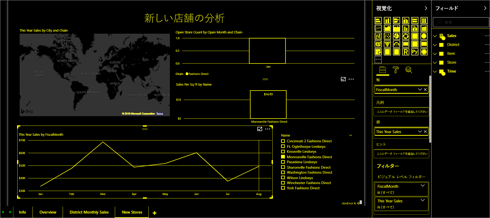

# Power BI でのユーザー補助の概要

Power BI を使用する場合は、レポートを操作する可能性のあるさまざまな種類のユーザーを考慮してください。 キーボードまたはスクリーンリーダーのユーザーが簡単に移動したり理解したりできるレポートを作成できます。 このようなレポートを使用すると、視覚や身体に障碍を持つユーザーもレポートを活用できるようになります。

この記事では、Power BI とアクセシビリティの概要について説明します。 追加の記事では、アクセシビリティを念頭に置いて優れたレポートを作成するのに役立つガイダンスとツールを紹介しています。

## ユニバーサル デザイン

ユニバーサル デザインとは、特別な調整や特殊なデザインを必要とせず、できるだけ多くの人が使用できる製品のデザインです。 Power BI 内でレポートやエクスペリエンスを作成する場合は、実際のユーザーのニーズを考慮することが重要です。 アクセシビリティ対応のエクスペリエンスを設計した場合、恩恵を受けるのは、聴覚、運動、認知、または視覚障碍のあるエンド ユーザーだけではありません。 組織内のすべてのエンド ユーザーの役に立ちます。 Power BI には、アクセシビリティ対応のレポートを作成および利用するためのツールが用意されています。 レポート作成者は、そうしたツールを使用してすべてのユーザーのエクスペリエンスを向上させることができます。

## アクセシビリティ標準

Power BI では、次のアクセシビリティ標準に準拠しています。 この標準は、Power BI の実際のエクスペリエンスをできるだけ多くのユーザーが確実に利用できるようにする際に役立ちます。 アクセシビリティ対応のレポートまたはダッシュボードを構築すると、Power BI Mobile を使用して表示するすべてのユーザーがそのコンテンツにアクセスできるようになります。

### WCAG 2.1

Web Content Accessibility Guidelines (WCAG) は、障碍のある方が Web コンテンツを利用できるようにするのに役立ちます。 ガイドラインの重要な原則は次のとおりです。

1. **知覚可能**。 情報およびユーザー インターフェイス コンポーネントは、ユーザーが知覚できる方法でユーザーに提示可能でなければならない。
2. **操作可能**。 ユーザー インターフェイス コンポーネントおよびナビゲーションは操作可能でなければならない。
3. **理解可能**。 情報およびユーザー インターフェイスの操作は理解可能でなければならない。

### 米国第 508 条

米国第 508 条は、政府機関および連邦政府機関に対して、障碍のある方が電子技術や情報技術を利用できるようにすることを義務付けている標準です。

### EN 301 549

EN 301 549 は、ICT 製品とサービスのアクセシビリティ要件に関する欧州整合規格です。  

## 次の手順

Power BI のアクセシビリティの詳細については、次のリソースを参照してください。

* [アクセシビリティ対応の Power BI レポートを設計する](desktop-accessibility-creating-reports.md)
* [アクセシビリティ機能を使用して Power BI レポートを使用する](desktop-accessibility-consuming-tools.md)
* [Power BI でアクセシビリティ ツールを使用してレポートを作成する](desktop-accessibility-creating-tools.md)
* [Power BI Desktop のキーボード ショートカット](desktop-accessibility-keyboard-shortcuts.md)
* [レポートのアクセシビリティ チェックリスト](desktop-accessibility-creating-reports.md#report-accessibility-checklist)

