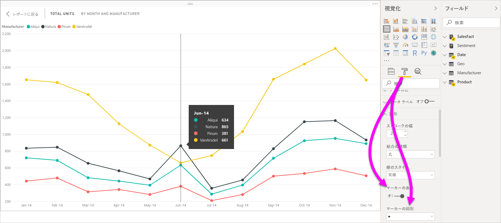
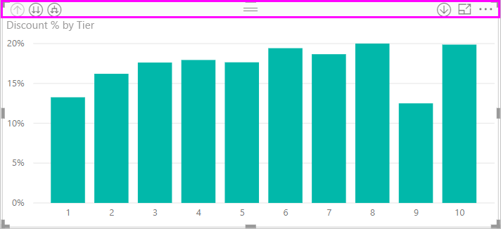
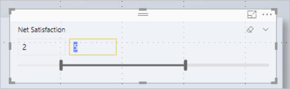
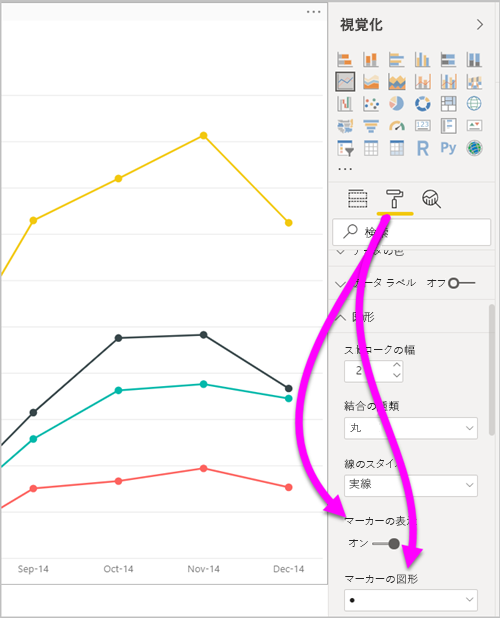
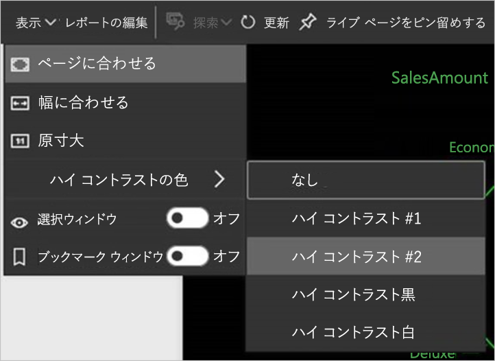

# Power BI Desktop レポートのアクセシビリティ
Power BI には、障碍のある方がより簡単に Power BI レポートを使用し、レポートと対話できる機能があります。 これらは、レポートでキーボードやスクリーンリーダーを使用したり、ページ上のさまざまなオブジェクトにフォーカスをタブ移動したり、マーカーを使用して気の利いた視覚化を実行するための機能です。

## キーボードまたはスクリーン リーダーでの Power BI Desktop レポートの使用
2017 年 9 月リリースの **Power BI Desktop** より、**Shift + ?** キーを押すと、 **Power BI Desktop** で利用できるアクセシビリティ キーボード ショートカットについて説明するウィンドウが開くようになりました。

アクセシビリティ機能の強化により、次の方法で、Power BI レポートをキーボードまたはスクリーン リーダーで使用できるようになりました。

> [!NOTE]
> レポートを表示するときには、通常スキャン モードをオフにする必要があります。

**Ctrl + F6** キーを使用して、特定のレポート ページ上のレポート ページ タブまたはオブジェクトのフォーカスを切り替えることが可能です。

* フォーカスがレポート ページ タブ上にある場合、**Tab** キーまたは**方向**キーを使用して、1 つのレポート ページから次のレポート ページへフォーカスを移動します。 レポート ページのタイトルおよびそれが現在選択されているかどうかがスクリーン リーダーによって読み上げられます。 現在フォーカスのあるレポート ページを読み込むには、**Enter** キーまたは Space キーを使用します。
* 読み込まれているレポート ページにフォーカスがある場合、**Tab** キーを使用してページのすべてのテキスト ボックス、画像、図形、およびグラフなどの各オブジェクトにフォーカスを移動します。 スクリーン リーダーでは、オブジェクトの種類とオブジェクトのタイトル (存在する場合) が読み取られます。 また、レポート作成者からオブジェクトの説明が提供されている場合は、スクリーン リーダーによってそれも読み取られます。 

ビジュアル間を移動する場合は、**Alt + Shift + F10** キーを押すことで、ビジュアル ヘッダーにフォーカスを移動することができます。 ビジュアル ヘッダーには、並べ替え、グラフの背後にあるデータのエクスポート、フォーカス モードなど、さまざまなオプションが含まれています。 

**Alt + Shift + F11** キーを押すと、 **[データの表示]** ウィンドウがアクセシビリティ バージョンで表示されます。 このウィンドウにより、通常はスクリーン リーダーで使用するのと同じキーボード ショートカットを使って、HTML テーブルで、ビジュアルで使用されるデータを調べることができます。 

![Power BI Desktop で Alt + Shift + F11 キーを押して、ビジュアルに対して [データの確認] ウィンドウをアクセシビリティ バージョンで表示する](media/desktop-accessibility/accessibility-04.png)

> [!NOTE]
> **[データの表示]** 機能にアクセスできるのは、このキーボード ショートカットからスクリーン リーダーを使用する場合のみです。 ビジュアル ヘッダーのオプションを使用して **[データの表示]** を開いた場合、スクリーン リーダーからはアクセスできません。 **[データの表示]** を使用するときには、ご利用のスクリーン リーダーで提示されるホット キーをすべて活用するためにスキャン モードをオンにしてください。

**Power BI Desktop** の 2018 年 7 月のリリースから、スライサーにはアクセシビリティ機能も組み込まれています。 スライサーを選択するときにスライサーの値を調整するには、**Ctrl + 右方向**キー (Ctrl キーを押しながら右矢印キー) を押してスライサー内のさまざまなコントロール間を移動します。 たとえば、最初に **Ctrl + 右方向**キーを押すと、消しゴムにフォーカスが移動します。 次に、Space キーを押すことは、スライサーのすべての値を消去する消しゴム ボタンをクリックすることと同じです。 

**Tab** キーを押すと、スライサー内のコントロール間を移動できます。 消しゴムにフォーカスがあるときに **Tab** キーを押すと、ドロップダウン ボタンに移動します。 もう一度 **Tab** キーを押すと、最初のスライサー値に移動します (範囲など、スライサーに複数の値がある場合)。 

これらの追加のアクセシビリティにより、ユーザーはスクリーン リーダーとキーボード ナビゲーションを使って Power BI レポートを十分に活用することができます。

## アクセスしやすいレポートを作成するためのヒント
次のヒントを使用すると、よりアクセスしやすい **Power BI Desktop** レポートを作成できます。

### アクセスしやすいレポートに関する一般的なヒント

* **[線]** 、 **[面]** 、 **[複合]** 、 **[散布]** 、 **[バブル]** の各ビジュアルでは、 **[マーカーの表示]** トグルをオンにし、線ごとに異なる **[マーカーの図形]** を使用できます。
  
  * **[マーカーの表示]** トグルをオンにするには、 **[視覚化]** ウィンドウで **[書式]** セクションを選択し、 **[図形]** セクションを展開します。 下にスクロールして **[マーカーの表示]** トグルを見つけ、それを **[オン]** にします。
  * 個々の行をカスタマイズするには、 **[系列のカスタマイズ]** トグルを見つけて、それを **[オン]** にします。 次に、各線の名前 (または **[領域]** グラフを使用している場合は領域) をその **[図形]** セクションのドロップダウン ボックスから選択します。 ドロップダウン リストの下では、選択した線に使用されるマーカーの形状、色、サイズなどの多くの側面を調整できます。
  
    
  
  * 各線に別の**マーカーの図形**を使用すると、レポートの使用者は個々の線 (または領域) を区別するのが容易になります。
* 前の項目に加えて、色を使って情報を伝達してはいけません。 折れ線グラフと散布図グラフで図形を使用するときに、条件付き書式を使って、テーブルやマトリックスで分析情報を提供してはいけません。 
* レポートのビジュアルごとに意図的な並べ替え順序を選択します。 スクリーン リーダー ユーザーがグラフの背後にあるデータを移動するときに、ビジュアルと同じ並べ替え順序が選択されます。
* テーマ ギャラリーから、コントラストが高く、色の識別が困難なユーザーにやさしいテーマを選択します。 [ **[テーマ]** プレビュー機能](desktop-report-themes.md)を使用してそれをインポートします。
* レポートのすべてのオブジェクトに、[代替テキスト] を用意します。 そうすることで、あなたがビジュアルで伝えようとしている内容をレポート コンシューマーは確実に理解できます。 ビジュアル、画像、図形、またはテキスト ボックスが表示されない場合でも役立ちます。 **PowerBI Desktop** レポート上の任意のオブジェクトに代替テキストを指定するには、オブジェクト (ビジュアルや図形など) を選択し、 **[視覚化]** ウィンドウで **[書式]** を選択します。 次に、 **[全般]** を展開し、一番下までスクロールして、 **[代替テキスト]** テキスト ボックスに入力します。
  
  ![レポートのすべてのオブジェクトには、[視覚エフェクト]、[形式]、[全般]、[代替テキスト ボックス] から代替テキストを追加できます。](media/desktop-accessibility/accessibility-02.png)
  
  ビジュアルに適用されたフィルターを反映するなど、式を使用して代替テキストを動的に変更することもできます。 ビジュアルのタイトルの場合と同じように、式を設定します。 [ビジュアルのタイトルの条件付き書式](desktop-conditional-format-visual-titles.md)
  
* レポートのテキストと背景色の間に十分なコントラストがあることを確認します。 [Color Contrast Analyser](https://developer.paciellogroup.com/resources/contrastanalyser/) など、レポートの色を確認するために使用できるツールがいくつかあります。 
* 読みやすいテキストのサイズとフォントを使います。 小さいテキスト サイズや読みにくいフォントは、アクセシビリティを損ないます。
* すべてのビジュアルにタイトル、軸ラベル、データ ラベルを含めます。
* すべてのレポート ページにわかりやすいタイトルを使用します。
* できれば、レポートでの装飾用の図形やイメージの使用は避けてください。これらはレポートのタブの順序で含まれます。 レポートに装飾用のオブジェクトを含める必要がある場合は、オブジェクトの代替テキストを更新し、装飾用であることをスクリーン リーダー ユーザーが認識できるようにしてください。

### フィールド バケットでの項目の整理
2018 年 10 月リリース以降の **Power BI Desktop** では、 **[フィールド]** ウェルをキーボードを使って移動し、スクリーン リーダーを操作することができます。 

スクリーン リーダーを使用してレポートの作成プロセスを改善するには、コンテキスト メニューを使用します。 このメニューを使用すると、 **[フィールド]** リストで、ウェル内のフィールドを上または下に移動できます。 このメニューではまた、 **[凡例]** や **[値]** などの他のウェルにフィールドを移動することもできます。

![[フィールド] ウェルのコンテキスト メニューを使って、フィールドの上下移動や他の領域への移動を行うことができます](media/desktop-accessibility/accessibility-09.png)

## レポートに対するハイ コントラストのサポート

Windows でハイ コントラスト モードを使用する場合、選択したその設定とパレットは **Power BI Desktop** のレポートにも適用されます。 

**Power BI Desktop** では、Windows で使用されているハイ コントラストのテーマが自動的に検出され、それらの設定がご利用のレポートに適用されます。 Power BI サービスやその他の場所に発行する場合、ハイ コントラストの色はそのレポートに従います。

Power BI サービスでは、Windows 用に選択されたハイ コントラストの設定も検出が試みられます。 その検出の有効性と精度は、Power BI サービスを表示しているブラウザーによって異なります。 Power BI サービスでテーマを手動で設定する場合は、 **[表示]**  >  **[ハイ コントラストの色]** の順に選択して、レポートに適用するテーマを選択します。

## 考慮事項と制限事項
アクセシビリティ機能には、既知の問題と制限がいくつかあります。 これらの問題と制限事項について、次の一覧で説明します。

* **Power BI Desktop** でスクリーン リーダーを使用する場合、**Power BI Desktop** でいずれかのファイルを開く前にご利用のスクリーン リーダーを開くと最良のエクスペリエンスが得られます。
* ナレーターを使用する場合、HTML テーブルとしての **[データの表示]** の移動に関する制限がいくつあります。

## キーボード ショートカット
キーボード ショートカットは、キーボードを使用して Power BI レポートの中を移動するのに役立ちます。 Power BI レポート内で使用できるショートカットについて、次の表で説明します。 **Power BI Desktop** でのこれらのキーボード ショートカットの使用に加えて、各ショートカットは次のエクスペリエンスでも同様に機能します。

* **[Q&A Explorer]** ダイアログ
* **[作業の開始]** ダイアログ
* **[ファイル]** メニューおよび **[バージョン情報]** ダイアログ
* **[警告]** バー
* **[ファイルの復元]** ダイアログ
* **[Frowns]\(問題点\)** ダイアログ

Microsoft はアクセシビリティを改善する取り組みを続けています。前の一覧のエクスペリエンスでは、スクリーン リーダーやハイ コントラスト設定もサポートされています。

### 頻繁に使用されるショートカット
| この操作を行うには           | 押すキー                |
| :------------------- | :------------------- |
| セクション間でフォーカスを移動する  | **Ctrl + F6** |
| セクション内でフォーカスを移動します | **Tab**         |
| セクション内でフォーカスを逆方向に移動します | **Shift + Tab** |
| オブジェクトを選択または選択解除します | **Enter** または **Space** |
| オブジェクトを複数選択します | **Ctrl + Space** |

### 視覚エフェクト上で
| この操作を行うには           | 押すキー                |
| :------------------- | :------------------- |
| 視覚化メニューにフォーカスを移動します | **Alt + Shift + F10** |
| データの表示 | **Alt + Shift + F11**  |
| 視覚エフェクトを入力します | **Ctrl + →** |
| レイヤーを入力します | **Enter** |
| レイヤーまたは視覚エフェクトを終了します | **Esc** |
| データ ポイントを選択または選択解除します | **Enter** または **Space** |
| 複数選択 | **Ctrl + Enter** または **Ctrl + Space** |
| 右クリック | <ul><li>Windows のキーボード:**Windows コンテキスト キー + F10**。 Windows コンテキスト キーは左側の Alt キーと左側の矢印キーの間にあります</li><li>その他のキーボード:**Shift + F10**</li></ul> |
| 選択を解除します | **Ctrl + Shift + C** |

### テーブルおよびマトリックス ナビゲーション
| この操作を行うには          | 押すキー                |
| :------------------- | :------------------- |
| 1 つ上または下のセルにフォーカスを移動します (すべての領域のすべてのセルにわたって)  | **↑ キー** / **↓ キー** |
| 1 つ左または右のセルにフォーカスを移動します (すべての領域のすべてのセルにわたって)  | **← キー** / **→ キー** |

### ウィンドウのナビゲーション
| この操作を行うには           | 押すキー                |
| :------------------- | :------------------- |
| 複数選択 | **Ctrl + Space** |
| 1 つのテーブルを折りたたむ | **← キー** |
| 1 つのテーブルを展開する | **→ キー** |
| すべてのテーブルを折りたたむ | **Alt + Shift + 1** |
| すべてのテーブルを展開する | **Alt + Shift + 9** |
| コンテキスト メニューを開く | <ul><li>Windows のキーボード:**Windows コンテキスト キー + F10**。  Windows コンテキスト キーは左側の Alt キーと左側の矢印キーの間にあります</li><li>その他のキーボード:**Shift + F10**</li></ul> |

### スライサー
| この操作を行うには         | 押すキー                |
| :------------------- | :------------------- |
| スライサーを操作する | **Ctrl + → キー** |

### 選択ウィンドウ
| この操作を行うには           | 押すキー                |
| :------------------- | :------------------- |
| 選択ウィンドウをアクティブ化する | **F6** |
| 階層内の上のオブジェクトに移動する | **Ctrl + Shift + F** |
| 階層内の下のオブジェクトに移動する | **Ctrl + Shift + B** |
| オブジェクトの表示/非表示を切り替える | **Ctrl + Shift + S** |

### DAX エディター
| この操作を行うには          | 押すキー                |
| :------------------- | :------------------- |
| 行を上/下に移動 | **Alt + ↑ キー** / **↓ キー** |
| 行を上/下にコピー | **Shift + Alt + ↑ キー** / **↓ キー** |
| 行を下に挿入 | **Ctrl + Enter** |
| 行を上に挿入 | **Ctrl + Shift + Enter** |
| 対応するかっこにジャンプ | **Ctrl + Shift +**  \ |
| 行のインデント/余白への行の拡張 | **Ctrl + ]**  /  **[** |
| カーソルの挿入 | **Alt + Click** |
| 現在の行の選択 | **Ctrl + I** |
| 現在の選択範囲のすべての出現箇所を選択 | **Ctrl + Shift + L** |
| 現在の単語のすべての出現箇所を選択 | **Ctrl + F2** |

### データの入力
| この操作を行うには           | 押すキー                |
| :------------------- | :------------------- |
| 編集可能グリッドの終了 | **Ctrl + Tab** |

## 次の手順
* [Power BI Desktop でレポートのテーマを使用する (プレビュー)](desktop-report-themes.md)

