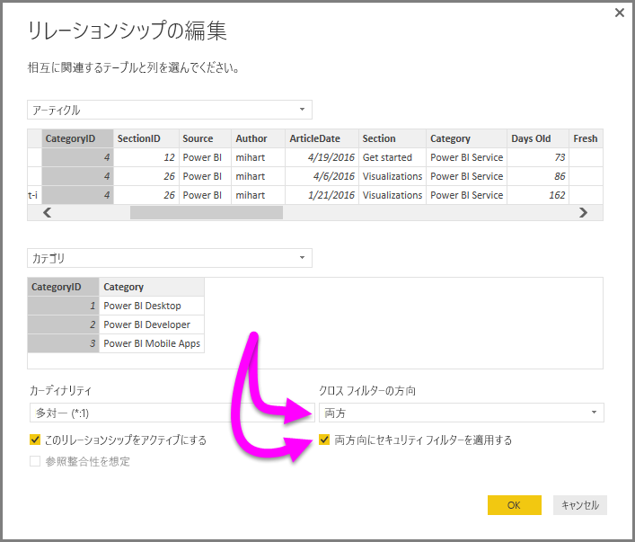

# Power BI Desktop の DirectQuery で双方向のクロス フィルタリングを有効にする

テーブルをフィルター処理してデータの適切なビューを作成する場合、レポート作成者とデータ モデラーは、レポートにフィルターを適用する方法を決定するという課題に直面します。 以前は、テーブルのフィルター コンテキストはリレーションシップの一方で保持され、もう一方では保持されていませんでした。 この配置では、多くの場合、必要な結果を得るために複雑な DAX 式が必要でした。

双方向のクロスフィルター処理により、レポート作成者とデータ モデラーは、関連テーブルを操作するときにフィルターを適用する方法をより詳細に制御できるようになりました。 双方向のクロスフィルター処理により、テーブル リレーションシップの "*両*" 側にフィルターを適用できます。 テーブル リレーションシップの反対側にある 2 つ目の関連テーブルにフィルター コンテキストを反映することにより、フィルターを適用できます。

## DirectQuery の双方向のクロスフィルタリングを有効にする

**[リレーションシップの編集]** ダイアログ ボックスでクロスフィルター処理を有効にできます。 リレーションシップのクロスフィルター処理を有効にするには、次のオプションを構成する必要があります。

* **[クロス フィルターの方向]** を **[双方向]** に設定します。
* **[両方向にセキュリティ フィルターを適用する]** を選択します。

  

> [!NOTE]
> Power BI Desktop でクロスフィルターの DAX 数式を作成する場合は *UserPrincipalName* を使用します。 多くの場合、このフィールドはユーザーのログインと同じです。たとえば、*UserName* ではなく、<em>joe@contoso.com</em> です。 そのため、*UserName* または *EmployeeID* を *UserPrincipalName* にマップする関連テーブルの作成が必要です。

双方向のクロス フィルター処理の詳細としくみの例については、[Power BI Desktop の双方向クロスフィルター処理のホワイト ペーパー](https://download.microsoft.com/download/2/7/8/2782DF95-3E0D-40CD-BFC8-749A2882E109/Bidirectional%20cross-filtering%20in%20Analysis%20Services%202016%20and%20Power%20BI.docx)を参照してください。

