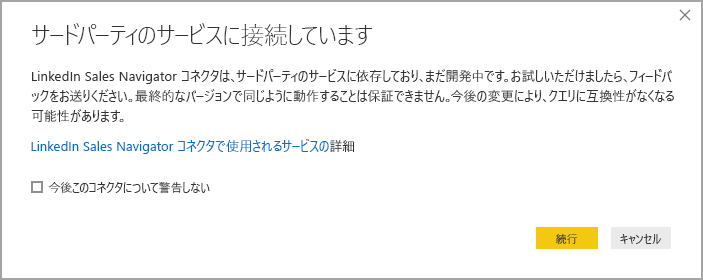
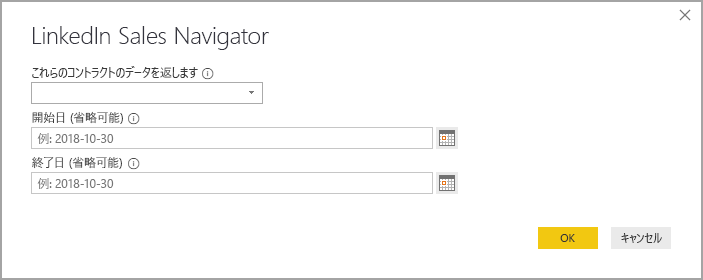
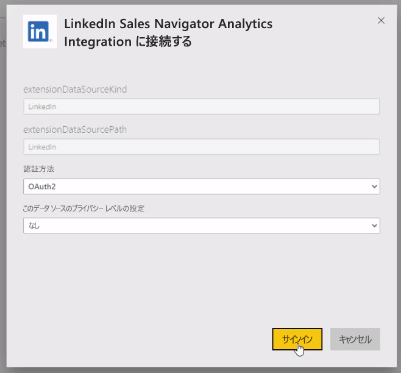

# Power BI Desktop で LinkedIn Sales Navigator に接続する

**Power BI Desktop** では、**LinkedIn Sales Navigator** に接続して、Power BI Desktop 内の他のデータ ソースと同じようにリレーションシップを見つけて構築したり、進行状況に関する既製のレポートを作成したりすることができます。

![LinkedIn Sales Navigator の [Usage]\(使用状況\) タブ](media/desktop-connect-linkedin-sales-navigator/linkedin-sales-navigator-01.png)

**Linkedin Sales Navigator** を使用して LinkedIn データに接続するには、LinkedIn Sales Navigator Enterprise プランが必要です。また、Sales Navigator Contract で管理者またはレポート ユーザーのいずれかである必要があります。

次のビデオでは、**LinkedIn Sales Navigator** テンプレート アプリを使用するためのクイック ツアーとチュートリアルが紹介されています。その詳細を[この記事で後述](#using-the-linkedin-sales-navigator-template-app)します。 

> [!VIDEO https://www.youtube.com/embed/ZqhmaiORLw0]

## LinkedIn Sales Navigator に接続する

**LinkedIn Sales Navigator** のデータに接続するには、Power BI Desktop の **[ホーム]** リボンで **[データの取得]** を選択します。 左側のカテゴリから **[オンライン サービス]** を選択し、 **[LinkedIn Sales Navigator (Beta)]** が表示されるまでスクロールします。

開発中のサードパーティのコネクタに接続しようとしていることが通知されます。 

**[続行]** を選択すると、必要なデータを指定することを求められます。

表示された **[LinkedIn Sales Navigator]** ウィンドウで、返してほしいデータを選択します。最初のドロップダウン セレクターから、 *[All contacts]\(すべての連絡先\)* または *[Selected contacts]\(選択した連絡先\)* のいずれかを選択します。 次に、開始日と終了日を指定して、受信するデータを特定の時間枠に制限できます。

情報を指定すると、Power BI Desktop が LinkedIn Sales Navigator 契約に関連付けられているデータに接続されます。 Web サイトから LinkedIn Sales Navigator にサインインするために使用するのと同じ電子メール アドレスを使用します。 

正常に接続されると、 **[Navigator]\(ナビゲーター\)** ウィンドウで、必要なデータを LinkedIn Sales Navigator Contract から選択することを求められます。

LinkedIn Sales Navigator データを使用して、任意のレポートを作成できます。 また、作業を簡単にするためにダウンロードできる LinkedIn Sales Navigator .PBIX ファイルがあります。このファイルには、サンプル データが既に提供されているので、一から始めなくても、データとレポートについて理解することができます。

PBIX は、次の場所からダウンロードできます。
* [LinkedIn Sales Navigator 用の PBIX](service-template-apps-samples.md)

PBIX ファイルに加えて、LinkedIn Sales Navigator には、ダウンロードして使用できるテンプレート アプリも用意されています。 次のセクションで、テンプレート アプリの詳細を説明します。

## LinkedIn Sales Navigator テンプレート アプリの使用

**LinkedIn Sales Navigator** をできるだけ簡単に使用できるようにするには、LinkedIn Sales Navigator データから既製のレポートが自動的に作成される[テンプレート アプリ](service-template-apps-overview.md) を使用します。

アプリをダウンロードするときに、自分のデータに接続するか、サンプル データを使用してアプリを探索するかを選択できます。 サンプル データを探索した後、いつでも自分の LinkedIn Sales Navigator データに接続できます。 

次のリンクから **LinkedIn Sales Navigator** テンプレート アプリを取得できます。
* [LinkedIn Sales Navigator テンプレート アプリ](https://appsource.microsoft.com/product/power-bi/pbi-contentpacks.linkedin_navigator-preview?flightCodes=17ad4c68-fbc5-4925-a351-139fd384ec33)

このテンプレート アプリには、情報の分析と共有に役立つ 4 つのタブが用意されています。

* Usage
* 検索
* InMail
* SSI

**[Usage]\(使用状況\)** タブには、LinkedIn Sales Navigator データ全体が表示されます。

![LinkedIn Sales Navigator の [Usage]\(使用状況\) タブ](media/desktop-connect-linkedin-sales-navigator/linkedin-sales-navigator-12.png)

**[Search]\(検索\)** タブでは、検索結果をさらに詳しく調べることができます。

![LinkedIn Sales Navigator の [Search]\(検索\) タブ](media/desktop-connect-linkedin-sales-navigator/linkedin-sales-navigator-13.png)

**[InMail]** では、InMail の使用状況に関する分析情報が提供されます。送信された InMail の数、受け入れ率、その他の有用な情報が含まれます。

![LinkedIn Sales Navigator の [InMail] タブ](media/desktop-connect-linkedin-sales-navigator/linkedin-sales-navigator-14.png)

**[SSI]** タブには、SSI (Social Selling Index) の詳細情報が提供されます。

![LinkedIn Sales Navigator の [SSI] タブ](media/desktop-connect-linkedin-sales-navigator/linkedin-sales-navigator-15.png)

サンプル データから自分のデータに移動するには、右上隅にある **[Edit App]\(アプリの編集\)** (鉛筆アイコン) を選択し、表示された画面から **[Connect your data]\(自分のデータに接続\)** を選択します。

そこから自分のデータを接続し、読み込むデータの日数を選択できます。 最大 365 日分のデータを読み込むことができます。 サインインする必要があります。ここでも、Web サイトから LinkedIn Sales Navigator にサインインするために使用するのと同じ電子メール アドレスを使用します。 

テンプレート アプリで、アプリ内のデータが自分のデータに更新されます。 スケジュールされた更新を設定することもできるため、アプリ内のデータは、更新頻度によって指定された最新の状態になります。 

データが更新された後、アプリに自分のデータが入力されていることを確認できます。

## ヘルプの表示

ご利用のデータに接続する際に問題が発生した場合は、LinkedIn Sales Navigator サポート (https://www.linkedin.com/help/sales-navigator ) にご連絡ください。 

## 次の手順
Power BI Desktop を使用して接続できるデータの種類は他にもあります。 データ ソースの詳細については、次のリソースを参照してください。

* [Power BI Desktop とは何ですか?](desktop-what-is-desktop.md)
* [Power BI Desktop のデータ ソース](desktop-data-sources.md)
* [Power BI Desktop でのデータの整形と結合](desktop-shape-and-combine-data.md)
* [Power BI Desktop で Excel ブックに接続する](desktop-connect-excel.md)   
* [Power BI Desktop にデータを直接入力する](desktop-enter-data-directly-into-desktop.md)   

