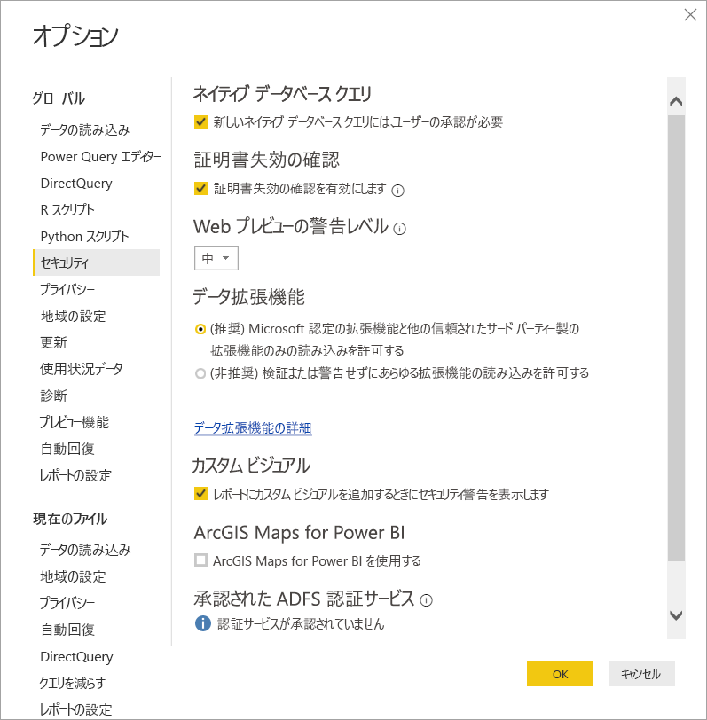

# Power BI でのコネクタの機能拡張

Power BI では、顧客と開発者が、さまざまな方法で接続するデータ ソースを拡張できます。 既存のコネクタと汎用データ ソース (ODBC、OData、Oledb、Web、CSV、XML、JSON など) を使用します。 または、開発者が**カスタム コネクタ**と呼ばれるデータ拡張機能を作成し、それらを**認定コネクタ**にします。

現在は、システムで実行するカスタム コードのレベルを安全に制御できるメニューを使用して、**カスタム コネクタ**を有効にします。 **[データの取得]** ダイアログで、すべてのカスタム コネクタまたは Microsoft によって認定され配信されたコネクタのみを選択できます。

## カスタム コネクタ

**カスタム コネクタ**では、ビジネスにとって不可欠な小規模 API から、Microsoft がコネクタをリリースしていない大規模な業界固有のサービスまで、さまざまなことができます。 多くのコネクタは、ベンダーによって配布されます。 特定のデータ コネクタが必要な場合は、ベンダーに問い合わせる必要があります。

**カスタム コネクタ**を使用するには、 *\[Documents]\\Power BI Desktop\\Custom Connectors* フォルダーにそのコネクタを置き、次のセクションの説明のとおりセキュリティ設定を調整します。

**認定コネクタ**を使用するためにセキュリティ設定を調整する必要はありません。

## データ拡張機能のセキュリティ

データ拡張機能のセキュリティ設定を変更するには、**Power BI Desktop** で、 **[ファイル]、[オプションと設定]、[オプション]、[セキュリティ]** の順に選択します。

**[データ拡張機能]** の下では、2 つのセキュリティ レベルから選択できます。

* [(Recommended) Only allow certified extensions to load]\(推奨) 認定されている拡張機能のみ読み込みを許可する\
* [(Not Recommended) Allow any extension to load without warning]\(非推奨) あらゆる拡張機能の読み込みを警告なしで許可する\

**カスタム コネクタ**、あるいは自分かサードパーティが開発したコネクタを使用する予定の場合、 **[(Not Recommended) Allow any extension to load without warning]\((非推奨) あらゆる拡張機能の読み込みを警告なしで許可する\)** を選択する必要があります。 カスタム コネクタを完全に信頼している場合を除き、このセキュリティ設定はお勧めしません。 その理由は、そこにあるコードで、HTTP 経由での送信や、プライバシー レベルの無視など、資格情報を処理できるからです。

**"(推奨)"** セキュリティ設定でシステムにカスタム コネクタがある場合は、"次のコネクタは認定されていないため、安全に使用できることを確認できませんでした" というエラーの後に、安全に読み込むことができないコネクタのリストが表示されます。

セキュリティを変更せずにエラーを解決するには、'カスタム コネクタ' フォルダーから署名されていないコネクタを削除します。

エラーを解決してこれらのコネクタを使用するには、前述のように、セキュリティ設定を **[(Not Recommended) Allow any extension to load without warning]\((非推奨) あらゆる拡張機能の読み込みを警告なしで許可する\)** 設定に変更します。 次に、**Power BI Desktop** を再起動します。

## 認定コネクタ

データ拡張機能の限られたサブセットは、**認定済み**と見なされます。 **[データの取得]** ダイアログで、認定されたコネクタにアクセスします。 ただし、コネクタを作成したサードパーティの開発者が、そのメンテナンスとサポートを担当します。 Microsoft はこれらのコネクタを配布しますが、パフォーマンスや機能の継続性については責任を負いません。

カスタム コネクタの認定を希望する場合は、dataconnectors@microsoft.com に連絡するようにベンダーにご依頼ください。
