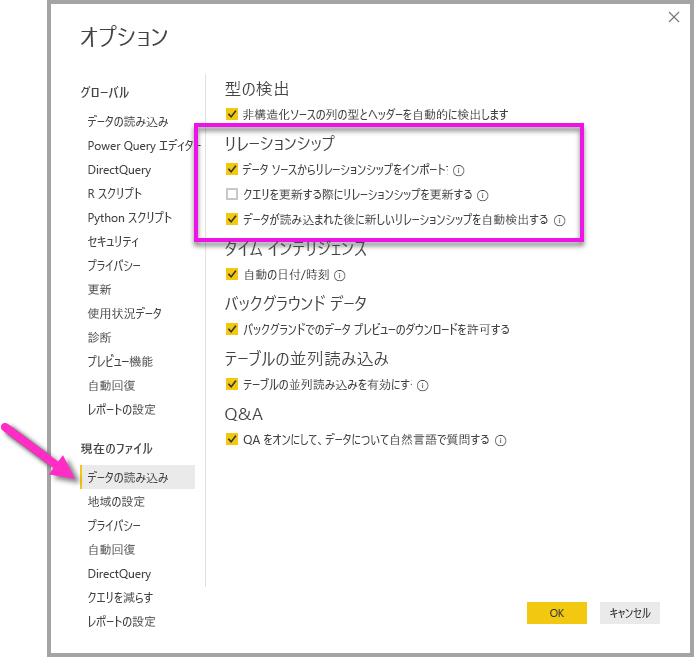

# Power BI Desktop でのリレーションシップの作成と管理
複数のテーブルをインポートするとき、それらのすべてのテーブルからデータを使用して分析を実行する可能性が高くなります。 結果を正確に計算し、レポートに正しい情報を表示するためには、これらのテーブル間のリレーションシップが必要です。 Power BI Desktop を使用すると、これらのリレーションシップを簡単に作成できます。 実際、ほとんどの場合、自動検出機能が実行してくれるため、何もすることはありません。 ただし、場合によっては、自分でリレーションシップを作成したり、リレーションシップを変更したりすることが必要な場合があります。 いずれの場合も、Power BI Desktop におけるリレーションシップおよびその作成方法と編集方法を理解することが重要です。

## 読み込み中の自動検出
データが読み込まれるときに、同時に複数のテーブルのクエリを実行する場合、Power BI Desktop はリレーションシップの検索および作成を試みます。 リレーションシップのオプション **[カーディナリティ]** 、 **[クロス フィルターの方向]** 、 **[このリレーションシップをアクティブにする]** は、自動的に設定されます。 Power BI Desktop では、クエリを実行しているテーブルの列名が調べられて、潜在的なリレーションシップがあるかどうかが判断されます。 そのようなリレーションシップがある場合は、自動的に作成されます。 Power BI Desktop によって高いレベルの信頼度で一致するものがあると判断できない場合、リレーションシップは作成されません。 ただし、その場合でも、 **[リレーションシップの管理]** ダイアログ ボックスを使用して、手動でリレーションシップを作成または編集できます。

## 自動検出を使用してリレーションシップを作成する
**[ホーム]** タブで、 **[リレーションシップの管理]** \> **[自動検出]** の順に選択します。

## 手動でのリレーションシップの作成
1. **[ホーム]** タブで、 **[リレーションシップの管理]** \> **[新規]** の順に選択します。

2. **[リレーションシップの作成]** ダイアログ ボックスで、最初のテーブルのドロップダウン リストからテーブルを選択します。 リレーションシップで使用する列を選択します。

3. 2 番目のテーブルのドロップダウン リストで、リレーションシップに必要なもう一方のテーブルを選択します。 使用する他の列を選択し、 **[OK]** を選択します。

   

既定では、新しいリレーションシップの **[カーディナリティ]** (方向)、 **[クロス フィルターの方向]** 、 **[このリレーションシップをアクティブにする]** の各オプションは、Power BI Desktop によって自動的に構成されます。 ただし、これらの設定は必要に応じて変更できます。 詳しくは、「[詳細設定オプションについて](#understanding-additional-options)」をご覧ください。

リレーションシップに対して選択したどのテーブルにも一意の値がない場合は、次のエラーが表示されます: "*いずれかの列に、一意の値が必要です*"。 リレーションシップの少なくとも 1 つのテーブルに別個の (一意の) キー値リストが含まれている*必要があります*。これはあらゆるリレーショナル データベース技術における共通の要件です。 

このエラーに遭遇した場合、いくつかの方法で問題を解決できます。

* **[重複の削除]** を使用して、一意の値を含む列を作成します。 この方法の短所は、重複行が削除されると、情報が失われる可能性があることです。多くの場合、キー (行) は正当な理由があって複製されます。
* 個別キー値の一覧で構成される中間テーブルをモデルに追加します。このモデルがリレーションシップの両方の元の列にリンクされます。

詳細については、こちらの[ブログ記事](https://blogs.technet.microsoft.com/cansql/2016/12/19/relationships-in-power-bi-fixing-one-of-the-columns-must-have-unique-values-error-message/)を参照してください。

## リレーションシップの編集
1. **[ホーム]** タブで、 **[リレーションシップの管理]** を選択します。

2. **[リレーションシップの管理]** ダイアログ ボックスでリレーションシップを選択し、 **[編集]** を選択します。

## 詳細設定オプションの構成
リレーションシップを作成または編集するときは、詳細設定オプションを構成できます。 既定では、Power BI Desktop により、最善の推測に基づいて追加のオプションが自動的に構成されます。これは、列のデータに応じてリレーションシップごとに異なる可能性があります。

### カーディナリティ
**[カーディナリティ]** オプションには、次のいずれかの設定を指定できます。

**多対一 (\*:1)** : 多対一のリレーションシップは最も一般的なものであり、既定の種類のリレーションシップです。 つまり、一方のテーブル内の列には、1 つの値の複数のインスタンスが存在していてもよく、関連するもう一方のテーブル (多くの場合ルックアップ テーブルとして知られる) では 1 つの値のインスタンスは 1 つだけです。

**一対一 (1:1)** : 一対一のリレーションシップでは、一方のテーブル内の列には特定の値のインスタンスが 1 つだけあり、関連するもう一方のテーブルも、特定の値のインスタンスは 1 つだけです。

**一対多 (1:*)** : 一対多のリレーションシップでは、一方のテーブル内の列には特定の値のインスタンスが 1 つだけあり、関連するもう一方のテーブルには、ある値のインスタンスが複数存在していてもかまいません。

**多対多 (\*:\*)** : 複合モデルでは、テーブル間に多対多のリレーションシップを確立できます。これにより、テーブル内の値が一意である必要がなくなります。 また、リレーションシップを作成するためだけに新しいテーブルを導入するなどの以前の回避策も除外されます。 詳しくは、[多対多カーディナリティのリレーションシップ](https://docs.microsoft.com/power-bi/desktop-many-to-many-relationships)に関する記事をご覧ください。 

どのようなときにカーディナリティを変更するのかについて詳しくは、「[詳細設定オプションについて](#understanding-additional-options)」をご覧ください。

### クロス フィルターの方向
**[クロス フィルターの方向]** オプションには、次のいずれかの設定を指定できます。

**双方向**: フィルター処理の場合は、両方のテーブルが 1 つのテーブルであるかのように扱われます。 **[双方向]** の設定は、周囲に複数のルックアップ テーブルが存在する 1 つのテーブルの場合に、上手く機能します。 一例として、部門のルックアップ テーブルのある販売実績テーブルがあります。 この構成は、多くの場合、スター スキーマ構成 (複数のルックアップ テーブルと 1 つの中心テーブル) と呼ばれます。 ただし、複数のルックアップ テーブル (一部は共通) を含むテーブルが 2 つ以上ある場合は、**双方向**の設定を使用しません。 前の例で言えば、この場合、各部門のターゲット予算を記録する予算売上テーブルもあるということです。 そして、部門テーブルが、売上テーブルと予算のテーブルの両方に接続されます。 この種の構成には、**双方向**の設定を使わないようにします。

**単一**: 最も一般的な、既定の方向です。接続されたテーブルでのフィルター処理の選択内容が、値が集約されているテーブルに対して機能することを意味します。 Excel 2013 以前のデータ モデルに Power Pivot をインポートすると、すべてのリレーションシップが一方向になります。 

どのようなときにクロス フィルターの方向を変更するのかについて詳しくは、「[詳細設定オプションについて](#understanding-additional-options)」をご覧ください。

### このリレーションシップをアクティブにする
オンにすると、リレーションシップはアクティブな既定のリレーションシップとして機能します。 2 つのテーブル間に複数のリレーションシップがある場合、両方のテーブルを含む視覚化を Power BI Desktop が自動的に作成するには、アクティブなリレーションシップが使用されます。

どのようなときに特定のリレーションシップをアクティブにするかについて詳しくは、「[詳細設定オプションについて](#understanding-additional-options)」をご覧ください。

## リレーションシップについて
2 つのテーブルをリレーションシップでつなぐと、両方のテーブルにあるデータを 1 つのテーブルであるかのように操作できます。これにより、リレーションシップの詳細について考慮したり、インポートする前にこれらのテーブルを 1 つのテーブルにフラット化したりする必要がなくなります。 多くの場合、Power BI Desktop ではリレーションシップを自動的に作成できます。 ただし、2 つのテーブル間にリレーションシップが存在することがかなり確実に特定できる場合以外、Power BI Desktop ではリレーションシップは自動的に作成されません。 その場合は、手動で行う必要があります。 

Power BI Desktop でのリレーションシップのしくみを理解できるように、簡単なチュートリアルを見てみましょう。

>[!TIP]
>このレッスンは自分で行うことができます。 
>
> 1. 次の **ProjectHours** テーブルを Excel のワークシートにコピーし (タイトルを除く)、すべてのセルを選択して、 **[挿入]** \> **[テーブル]** を選択します。 
> 2. **[テーブルの作成]** ダイアログ ボックスで、 **[OK]** を選択します。 
> 3. テーブルの任意のセルを選択し、 **[テーブル デザイン]** \> **[テーブル名]** を選択して、「*ProjectHours*」と入力します。 
> 4. **CompanyProject** テーブルについても同じ操作を行います。 
> 5. Power BI Desktop の **[データを取得]** を使用して、データをインポートします。 データソースとして 2 つのテーブルを選択し、 **[読み込み]** を選択します。

最初のテーブル **ProjectHours** は、ある人が特定のプロジェクトで作業した時間数を記録する作業チケットのレコードです。 

**ProjectHours**

| **Ticket** | **SubmittedBy** | **Hours** | **Project** | **DateSubmit** |
| ---:|:--- | ---:|:--- | ---:|
| 1001 |Brewer, Alan |22 |ブルー |2013 年 1 月 1 日 |
| 1002 |Brewer, Alan |26 |レッド |2013 年 2 月 1 日 |
| 1003 |Ito, Shu |34 |イエロー |2012 年 12 月 4 日 |
| 1004 |Brewer, Alan |13 |オレンジ |2012 年 1 月 2 日 |
| 1005 |Bowen, Eli |29 |紫 |2013/10/1 |
| 1006 |Bento, Nuno |35 |グリーン |2013 年 2 月 1 日 |
| 1007 |Hamilton, David |10 |イエロー |2013/10/1 |
| 1008 |Han, Mu |28 |オレンジ色 |2012 年 1 月 2 日 |
| 1009 |Ito, Shu |22 |パープル |2013 年 2 月 1 日 |
| 1010 |Bowen, Eli |28 |グリーン |2013 年 10 月 1 日 |
| 1011 |Bowen, Eli |9 |ブルー |2013 年 10 月 15 日 |

2 番目のテーブル **CompanyProject** は、次の優先度が割り当てられたプロジェクトの一覧です: A、B、C。 

**CompanyProject**

| **ProjName** | **Priority** |
| --- | --- |
| ブルー |A |
| 赤 |B |
| グリーン |C |
| 黄 |C |
| パープル |B |
| オレンジ |C |

各テーブルにプロジェクトの列があることに注意してください。 それぞれのテーブルで名前はわずかに異なりますが、値は同じように見えます。 これは重要な点です。後でまた説明します。

2 つのテーブルをモデルにインポートしたので、レポートを作成してみましょう。 最初に取得するものは、プロジェクトの優先度ごとに送信された時間数です。そのため、 **[フィールド]** ペインから **Priority** と **Hours** を選択します。

![[フィールド] ペインから Priority と Hours を選択する](media/desktop-create-and-manage-relationships/candmrel_reportfiltersnorel.png)

レポート キャンバスでテーブルを見ると、各プロジェクトの時間数が 256 で、これが合計でもあることがわかります。 この値は明らかに正しくありません。 なぜでしょうか。 理由は、2 つのテーブル間にリレーションシップがない状態では、1 つのテーブルの値 (**ProjectHours** テーブルの **Hours**) の合計を、別のテーブルの値 (**CompanyProject** テーブルの **Priority**) でスライスして計算することはできないためです。

そこで、これら 2 つのテーブル間のリレーションシップを作成しましょう。

両方のテーブルのプロジェクト名が含まれる列を見たとき、値が似ていたことを覚えていますか。 ここでは、これら 2 つの列を使用して、テーブル間のリレーションシップを作成します。

なぜこれらの列なのでしょうか。 **ProjectHours** テーブルの **Project** 列を見ると、ブルー、レッド、イエロー、オレンジなどの値があります。 そして、いくつかの行が同じ値を持っていることがわかります。 実際、**Project** には多数の色の値があります。

**CompanyProject** テーブルの **ProjName** 列を見ると、プロジェクト名の色の値ごとに 1 つの色の値だけがあります。 このテーブルの各色の値は一意です。このことは、これら 2 つのテーブル間にリレーションシップを作成できるようになるという点で重要です。 この場合は、多対一リレーションシップです。 多対一のリレーションシップでは、いずれかのテーブルの少なくとも 1 つの列に一意の値が含まれる必要があります。 一部のリレーションシップには他にもいくつかオプションがあります。これについては後で説明します。 ここでは、2 つの各テーブルのプロジェクト列の間にリレーションシップを作成します。

### リレーションシップを新規作成するには
1. **[ホーム]** タブから、 **[リレーションシップの管理]** を選択します。
2. **[リレーションシップの管理]** で、 **[新規]** を選択して **[リレーションシップの作成]** ダイアログ ボックスを開きます。ここでは、リレーションシップに必要なテーブル、列、および追加の設定を選択できます。
3. 最初のドロップダウン リストで、最初のテーブルとして **ProjectHours** を選択してから、**Project** 列を選択します。 この側は、リレーションシップの "*多*" の側になります。
4. 2 番目のドロップダウン リストでは、2 番目のテーブルとして **CompanyProject** が既に選択されています。 **ProjName** 列を選択します。 この側は、リレーションシップの "*一*" の側になります。 
5. リレーションシップのオプションは既定値のままにして、 **[OK]** を選択します。

   ![[リレーションシップの作成] ダイアログ ボックス](media/desktop-create-and-manage-relationships/candmrel_create_compproj.png)

6. **[リレーションシップの管理]** ダイアログ ボックスで、 **[閉じる]** を選択します。

すべてを示すために、ここではリレーションシップを厳密な方法で作成しました。 **[リレーションシップの管理]** ダイアログ ボックスの **[自動検出]** を選択するだけでもかまいませんでした。 実際、両方の列の名前が同じ場合は、データを読み込むと、自動検出によってリレーションシップが自動的に作成されます。 しかし、そこにどのような課題があるのでしょうか。

ここで、もう一度レポート キャンバスで、テーブルを見てみましょう。

全体的な見た目が良くなっています。

**Priority** ごとに時間数を集計すると、Power BI Desktop によって、**CompanyProject** ルックアップ テーブルで一意の色の値のすべてのインスタンスが検索され、**ProjectHours** テーブルでそれらの各値に対するすべてのインスタンスが検索された後、一意の値ごとに合計が計算されます。

ここまでは簡単でした。 実際、自動検出を使用すると、これらの操作さえ不要な可能性があります。

## 詳細設定オプションについて
自動検出または手動でリレーションシップを作成する場合、Power BI Desktop により、テーブル内のデータに基づいて詳細設定オプションが自動的に構成されます。 リレーションシップのこれらの詳細オプションは、 **[リレーションシップの作成]** および **[リレーションシップの編集]** ダイアログ ボックスの下部にあります。

 

Power BI では、通常、これらのオプションは自動的に設定され、調整する必要はありません。ただし、いくつかの状況では、自分でこれらのオプションを構成することが必要になる場合があります。

## リレーションシップの自動更新

レポートおよびモデル内のリレーションシップを Power BI で処理し、自動的に調整する方法を管理できます。 Power BI によるリレーションシップ オプションの処理方法を指定するには、Power BI Desktop の **[ファイル]**  >  **[オプションと設定]**  >  **[オプション]** を選択し、左側のペインで **[データの読み込み]** を選択します。 **[リレーションシップ]** のオプションが表示されます。

   

選択して有効にすることができるオプションが 3 つあります。 

- **[最初の読み込みでデータ ソースからリレーションシップをインポートします]** : 既定では、このオプションはオンになっています。 オンにすると、データ ウェアハウス内の外部キーと主キーのリレーションシップなど、データ ソースで定義されているリレーションシップが Power BI によって確認されます。 このようなリレーションシップが存在する場合は、データを最初に読み込むときに、これらのリレーションシップが Power BI データ モデルに反映されます。 このオプションを使用すると、自分でリレーションシップを検索または定義する必要がなく、モデルの操作をすぐに開始できます。

- **[データを更新する際にリレーションシップを更新または削除します]** : 既定では、このオプションはオフになっています。 オンにすると、データセットが更新されたときに、Power BI によってデータ ソースのリレーションシップの変更が確認されます。 これらのリレーションシップが変更または削除された場合、Power BI では、それらの変更を独自のデータ モデルでミラー化し、同じになるように更新または削除を行います。

   > [!WARNING]
   > 定義されたリレーションシップに依存する行レベルのセキュリティを使用している場合は、このオプションをオンにしないことをお勧めします。 RLS の設定が依存しているリレーションシップを削除すると、モデルのセキュリティが低下する可能性があります。 

- **[データが読み込まれた後に新しいリレーションシップを自動検出する]** : このオプションについては、「[読み込み中の自動検出](#autodetect-during-load)」で説明しています。 

## データの今後の更新には、異なるカーディナリティが必要になります。
通常、Power BI Desktop は、リレーションシップに最適なカーディナリティを自動的に判断できます。 今後データが変更されることがわかっているため、自動設定をオーバーライドする必要がある場合は、 **[カーディナリティ]** コントロールで変更できます。 異なるカーディナリティを選択する必要がある場合の例を見てみましょう。

**CompanyProjectPriority** テーブルは、会社のプロジェクトとその優先度の一覧です。 **ProjectBudget** テーブルは、予算が承認されたプロジェクトのセットです。

**CompanyProjectPriority**

| **ProjName** | **Priority** |
| --- | --- |
| ブルー |A |
| 赤 |B |
| グリーン |C |
| 黄 |C |
| パープル |B |
| オレンジ |C |

**ProjectBudget**

| **Approved Projects** | **BudgetAllocation** | **AllocationDate** |
|:--- | ---:| ---:|
| ブルー |40,000 |2012 年 12 月 1 日 |
| レッド |100,000 |2012 年 12 月 1 日 |
| 緑 |50,000 |2012 年 12 月 1 日 |

**ProjectBudget** テーブルの **Approved Projects** 列と、**CompanyProjectPriority** テーブルの **ProjectName** 列の間にリレーションシップを作成すると、Power BI によって自動的に、 **[カーディナリティ]** は **[一対一 (1:1)]** に、 **[クロス フィルターの方向]** は **[双方向]** に設定されます。 

 

Power BI によってこのような設定が行われる理由は、Power BI Desktop にとって 2 つのテーブルの最適な組み合わせは次のようなものであるためです。

| **ProjName** | **Priority** | **BudgetAllocation** | **AllocationDate** |
|:--- | --- | ---:| ---:|
| 青 |A |40,000 |2012 年 12 月 1 日 |
| レッド |B |100,000 |2012 年 12 月 1 日 |
| グリーン |C |50,000 |2012 年 12 月 1 日 |
| イエロー |C |  |  |
| パープル |B |  |  |
| オレンジ |C |  |  |

結合されたテーブルの **ProjName** 列には値の繰り返しがないため、2 つのテーブル間には一対一のリレーションシップがあります。 各値が 1 回のみ発生するため、**ProjName** 列は一意です。したがって、2 つのテーブルの行を重複なしで直接結合することができます。

しかし、次回データを更新すると、データが変更されることが分かっているとしましょう。 更新後の **ProjectBudget** テーブルには、ブルーとレッドのプロジェクトの行が追加されています。

**ProjectBudget**

| **Approved Projects** | **BudgetAllocation** | **AllocationDate** |
| --- | ---:| ---:|
| ブルー |40,000 |2012 年 12 月 1 日 |
| レッド |100,000 |2012 年 12 月 1 日 |
| 緑 |50,000 |2012 年 12 月 1 日 |
| ブルー |80,000 |2013 年 6 月 1 日 |
| レッド |90,000 |2013 年 6 月 1 日 |

 追加されたこれらの行は、2 つのテーブルの最適な組み合わせが次のようになることを意味します。 

| **ProjName** | **Priority** | **BudgetAllocation** | **AllocationDate** |
| --- | --- | ---:| ---:|
| 青 |A |40,000 |2012 年 12 月 1 日 |
| レッド |B |100,000 |2012 年 12 月 1 日 |
| グリーン |C |50,000 |2012 年 12 月 1 日 |
| イエロー |C |  |  |
| パープル |B |  |  |
| オレンジ |C |  |  |
| ブルー |A |80000 |2013 年 6 月 1 日 |
| レッド |B |90000 |2013 年 6 月 1 日 |

この結合された新しいテーブルでは、**ProjName** 列に値の繰り返しがあります。 テーブルが更新されると、元の 2 つのテーブルに一対一のリレーションシップはなくなります。 この場合、今後の更新によって **ProjName** 列に重複が生じることがわかっているため、 **[カーディナリティ]** を **[多対一 (\*:1)]** に設定する必要があります。"*多*" の側は **ProjectBudget** で、"*一*" の側は **CompanyProjectPriority** 側です。

## 複雑なテーブルとリレーションシップのセットでクロス フィルターの方向を調整する
ほとんどのリレーションシップでは、クロス フィルターの方向は**双方向**に設定されています。 ただし、一般的ではありませんが、一部の状況では、このオプションを既定値とは異なる値に設定し (古いバージョンの Power Pivot からモデルをインポートする場合など)、各リレーションシップを一方向に設定することが必要になる場合があります。 

**[双方向]** に設定すると、Power BI Desktop では、接続されたテーブルのすべての側面を、1 つのテーブルであるかのように扱えるようになります。 ただし、状況によっては、Power BI Desktop がリレーションシップのクロス フィルターの方向を**双方向**に設定できず、レポート作成のために使用できる既定値のセットを曖昧さのない状態に維持できない場合もあります。 リレーションシップのクロス フィルターの方向が**双方向**に設定されていない場合、通常は曖昧さが生じていることが原因です。 既定のクロス フィルターの設定が適切でない場合は、特定のテーブルに対して設定するか、**双方向**に設定してみてください。

一方向のクロス フィルターは、多くの状況で機能します。 実際に、Excel 2013 以前の Power Pivot からモデルをインポートした場合、すべてのリレーションシップは一方向に設定されます。 一方向とは、接続されたテーブルでのフィルター処理の選択内容が、集約作業が発生しているテーブルで機能することを意味します。 クロス フィルター処理を理解することは少し難しいことがあるので、例を見てみましょう。

一方向のクロス フィルターを使用すると、プロジェクトの時間数をまとめたレポートを作成する場合、**CompanyProject** テーブルとその **Priority** 列または **CompanyEmployee** テーブルとその **City** 列でまとめる (またはフィルター処理する) ことができます。 ただし、プロジェクトごとの従業員数をカウントする場合 (あまり一般的なテーマではありません) は機能しません。 すべてが同じ値の列が得られます。 次の例では、両方のリレーションシップのクロス フィルターの方向を、**ProjectHours** テーブルへの一方向に設定しています。 **[値]** ウェルでは、**Project** フィールドが **Count** に設定されています。

 

フィルターの指定では、**CompanyProject** から **CompanyEmployee** へは流れますが (次の図に示すように)、**CompanyEmployee** に向かっては流れません。 

 

ただし、クロス フィルターの方向を**双方向**に設定すると、流れるようになります。 **[双方向]** に設定すると、フィルターの指定で **CompanyEmployee** に向かって流れるように指定できます。

 

クロス フィルターの方向を **[双方向]** に設定すると、レポートが正しく表示されるようになります。

 

上記のパターンのようなテーブルのリレーションシップのパターンでは、双方向のクロス フィルターは適切に機能します。 このスキーマの最も一般的な呼び方はスター スキーマで、次のようなものです。

 

クロス フィルターの方向は、この図のように、データベースによく見られるより一般的なパターンでは適切に機能しません。

 

このようなループがあるテーブルのパターンの場合、クロス フィルターによりあいまいなリレーションシップのセットが作成されます。 たとえば、TableX のフィールドを合計してから、TableY のフィールドでフィルター処理する場合、フィルター処理が上のテーブルを通るのか、下のテーブルを通るのか、どのように進むかが明確ではありません。 この種のパターンの一般的な例は、TableX を実際のデータを含む売上テーブルとして使用し、TableY を予算のデータに使用するというものです。 次に、中央のテーブルは、部門や地域など、両方のテーブルが使用するルックアップ テーブルです。 

アクティブと非アクティブのリレーションシップのように、レポートで曖昧さが生じる場合、Power BI Desktop ではリレーションシップを**双方向**に設定することはできません。 このような状況は、いくつかの方法で対処できます。 最も一般的なものは次の 2 つです。

* あいまいさを減らすため、リレーションシップを削除するか、非アクティブとしてマークする。 その後、リレーションシップのクロス フィルターを**双方向**に設定できる場合があります。
* ループをなくすために、テーブルを 2 回指定する (2 回目は異なる名前で)。 このようにすると、リレーションシップのパターンはスター スキーマのようになります。 スター スキーマでは、すべてのリレーションシップを**双方向**に設定できます。

## 正しくないアクティブなリレーションシップ
Power BI Desktop が自動的にリレーションシップを作成する際、2 つのテーブル間に複数のリレーションシップが作成される場合があります。 このような状況が発生すると、1 つのリレーションシップだけがアクティブに設定されます。 アクティブなリレーションシップは、既定のリレーションシップとして機能します。それにより、2 つの異なるテーブルからフィールドを選択すると、Power BI Desktop で自動的に視覚エフェクトを作成できるようになります。 ただし、場合によっては、自動的に選択したリレーションシップが正しくないことがあります。 **[リレーションシップの管理]** ダイアログ ボックスを使用して、リレーションシップをアクティブまたは非アクティブに設定します。または、 **[リレーションシップの編集]** ダイアログ ボックスで、アクティブなリレーションシップを設定します。 

既定のリレーションシップが確実にあるようにするため、Power BI Desktop では、特定の時点で 2 つのテーブル間に許可されるアクティブなリレーションシップは 1 つだけです。 したがって、まず、現在のリレーションシップを非アクティブにしてから、アクティブにするリレーションシップを設定する必要があります。

例を見てみましょう。 1 つ目のテーブルは **ProjectTickets** で、2 つ目のテーブルは **EmployeeRole** です。

**ProjectTickets**

| **Ticket** | **OpenedBy** | **SubmittedBy** | **Hours** | **Project** | **DateSubmit** |
| ---:|:--- |:--- | ---:|:--- | ---:|
| 1001 |Perham, Tom |Brewer, Alan |22 |ブルー |2013 年 1 月 1 日 |
| 1002 |Roman, Daniel |Brewer, Alan |26 |レッド |2013 年 2 月 1 日 |
| 1003 |Roth, Daniel |Ito, Shu |34 |イエロー |2012 年 12 月 4 日 |
| 1004 |Perham, Tom |Brewer, Alan |13 |オレンジ |2012 年 1 月 2 日 |
| 1005 |Roman, Daniel |Bowen, Eli |29 |紫 |2013/10/1 |
| 1006 |Roth, Daniel |Bento, Nuno |35 |グリーン |2013 年 2 月 1 日 |
| 1007 |Roth, Daniel |Hamilton, David |10 |イエロー |2013/10/1 |
| 1008 |Perham, Tom |Han, Mu |28 |オレンジ色 |2012 年 1 月 2 日 |
| 1009 |Roman, Daniel |Ito, Shu |22 |パープル |2013 年 2 月 1 日 |
| 1010 |Roth, Daniel |Bowen, Eli |28 |グリーン |2013 年 10 月 1 日 |
| 1011 |Perham, Tom |Bowen, Eli |9 |ブルー |2013 年 10 月 15 日 |

**EmployeeRole**

| **Employee** | **ロール** |
| --- | --- |
| Bento, Nuno |プロジェクト マネージャー |
| Bowen, Eli |プロジェクト リーダー |
| Brewer, Alan |プロジェクト マネージャー |
| Hamilton, David |プロジェクト リーダー |
| Han, Mu |プロジェクト リーダー |
| Ito, Shu |プロジェクト リーダー |
| Perham, Tom |プロジェクト スポンサー |
| Roman, Daniel |プロジェクト スポンサー |
| Roth, Daniel |プロジェクト スポンサー |

ここには 2 つのリレーションシップが存在しています。
- **EmployeeRole** テーブルの **Employee** と、**ProjectTickets** テーブルの **SubmittedBy** の間。
- **ProjectTickets** テーブルの **OpenedBy** と、**EmployeeRole** テーブルの **Employee** の間。

 

モデルに両方のリレーションシップを追加した場合 (**OpenedBy** が先)、 **[リレーションシップの管理]** ダイアログ ボックスでは **OpenedBy** がアクティブであることが表示されます。

 ![[リレーションシップの管理] ダイアログ ボックスでアクティブな OpenedBy](media/desktop-create-and-manage-relationships/candmrel_managerelactive.png)

ここで、レポート キャンバスのテーブルの視覚化に含まれる **EmployeeRole** の **Role** フィールドと **Employee** フィールド、および **ProjectTickets** の **Hours** フィールドを使用してレポートを作成すると、プロジェクト スポンサーのみが表示されます。これは、プロジェクト チケットを開いたのがプロジェクト スポンサーのみであるためです。

 

アクティブなリレーションシップを変更すると、**OpenedBy** ではなく **SubmittedBy** を取得することができます。 **[リレーションシップの管理]** で、**ProjectTickets(OpenedBy)** から **EmployeeRole(Employee)** へのリレーションシップをオフにした後、**EmployeeRole(Employee)** から **Project Tickets(SubmittedBy)** へのリレーションシップをオンにします。

![[リレーションシップの管理] ダイアログ ボックスでアクティブなリレーションシップを変更する](media/desktop-create-and-manage-relationships/candmrel_managerelactivesubmittedby.png)

## リレーションシップ ビューですべてのリレーションシップを表示する
場合によっては、モデルに複数のテーブルがあり、それらのテーブル間に複雑なリレーションシップが含まれることがあります。 Power BI Desktop の **[リレーションシップ]** ビューでは、モデル内のすべてのリレーションシップ、その方向、カーディナリティが、わかりやすくカスタマイズ可能なダイアグラムに表示されます。 

詳しくは、「[Power BI Desktop でリレーションシップ ビューを操作する](desktop-relationship-view.md)」をご覧ください。

