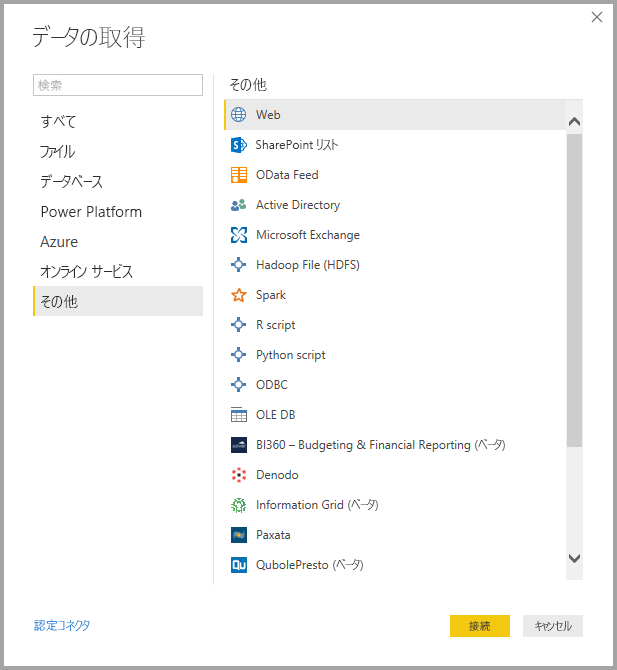
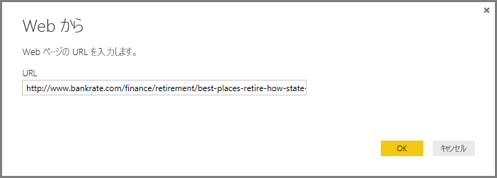

# <a name="data-sources-in-power-bi-desktop"></a>Power BI Desktop のデータ ソース

Power BI Desktop を使用すると、多種多様なソースからデータに接続できます。 利用できるデータ ソースの完全な一覧が必要な場合、「[Power BI データ ソース](power-bi-data-sources.md)」を参照してください。

データに接続するには、 **[ホーム]** リボンの **[データの取得]** を選択します。 下向きの矢印を選択するか、ボタン上の **[データの取得]** テキストを選択すると、次の画像に示されているように **[最も一般的]** なデータ型が記載されたメニューが表示されます。


**[その他]** を **[最も一般的]** メニューから選択すると、 **[データの取得]** ウィンドウが表示されます。 **[データを取得]** **アイコン ボタン**を直接選択して、 **[データを取得]** ウィンドウを表示することもできます ( **[最も一般的]** メニューをパイパスします)。

![[データの取得] ボタン](media/desktop-data-sources/data-sources-02.png)

> [!NOTE]
> Power BI チームは **Power BI Desktop** や **Power BI サービス**で利用できるデータ ソースを継続的に拡張しています。 そのため、*ベータ*や*プレビュー*などのマークが付いた、未完成の早期バージョンのデータ ソースが頻繁に公開されています。 データ ソースに*ベータ*や*プレビュー*などのマークが付いている場合、サポートや機能が限定されています。運用環境では利用しないでください。 また、**Power BI Desktop** の "*ベータ*" または "*プレビュー*" とマークされているデータ ソースは、データ ソースが一般提供 (GA) になるまで、**Power BI サービス**または他の Microsoft サービスで使用できない可能性があります。

## <a name="data-sources"></a>データ ソース
データ型は、次のカテゴリに分類されます。

* すべて
* ファイル
* データベース
* Power BI
* Azure
* オンライン サービス
* その他

**[すべて]** カテゴリには、すべてのカテゴリにあるすべてのデータ接続の種類が含まれます。

**[ファイル]** カテゴリには、次のデータ接続があります。

* Excel
* テキスト/CSV
* XML
* JSON
* フォルダー
* PDF
* SharePoint フォルダー

次の図は、 **[ファイル]** の **[データの取得]** ウィンドウを示しています。

![[データの取得] > [ファイル]](media/desktop-data-sources/data-sources-03.png)

**[データベース]** カテゴリには、次のデータ接続があります。

* SQL Server データベース
* Access データベース
* SQL Server Analysis Services
* Oracle データベース
* IBM DB2 データベース
* IBM Informix データベース (ベータ)
* IBM Netezza
* MySQL データベース
* PostgreSQL データベース
* Sybase データベース
* Teradata
* SAP HANA データベース
* SAP Business Warehouse Application サーバー
* SAP Business Warehouse メッセージ サーバー
* Amazon Redshift
* Impala
* Google BigQuery
* Vertica
* Snowflake
* Essbase
* AtScale キューブ
* BI コネクタ
* Dremio
* Exasol
* Indexima (ベータ)
* InterSystems IRIS (ベータ)
* Jethro (ベータ)
* Kyligence Enterprise (ベータ)
* MarkLogic (ベータ)

> [!NOTE]
> 一部のデータベース コネクタの場合、有効にするためには、 **[ファイル]、[オプションと設定]、[オプション]** の順に選択し、 **[プレビュー機能]** を選択し、コネクタを有効にする必要があります。 前途コネクタの一部が表示されず、その中に使用したいコネクタも含まれている場合は、 **[プレビュー機能]** を確認してください。 データ ソースに*ベータ*や*プレビュー*などのマークが付いている場合、サポートや機能が限定されていることにもご注意ください。運用環境では利用しないでください。

次の図は、 **[データベース]** の **[データの取得]** ウィンドウを示しています。

![[データの取得] > [データベース]](media/desktop-data-sources/data-sources-04.png)

**[Power Platform]** カテゴリには、次のデータ接続があります。

* Power BI データセット
* Power BI データフロー
* Common Data Service
* Power Platform データフロー

次の図は、 **[Power Platform]** の **[データの取得]** ウィンドウを示しています。

![[データの取得] > [Power BI]](media/desktop-data-sources/data-sources-05.png)

**[Azure]** カテゴリには、次のデータ接続があります。

* Azure SQL Database
* Azure SQL Data Warehouse
* Azure Analysis Services データベース
* Azure Blob Storage
* Azure Table Storage
* Azure Cosmos DB
* Azure Data Lake Storage Gen2
* Azure Data Lake Storage Gen1
* Azure HDInsight (HDFS)
* Azure HDInsight Spark
* HDInsight 対話型クエリ
* Azure Data Explorer (Kusto)
* Azure Cost Management
* Azure Time Series Insights (ベータ)

次の図は、 **[Azure]** の **[データの取得]** ウィンドウを示しています。

![[データの取得] > [Azure]](media/desktop-data-sources/data-sources-06.png)

**[オンライン サービス]** カテゴリには、次のデータ接続があります。

* SharePoint Online リスト
* Microsoft Exchange Online
* Dynamics 365 (オンライン)
* Dynamics NAV
* Dynamics 365 Business Central
* Dynamics 365 Business Central (オンプレミス)
* Microsoft Azure Consumption Insights (ベータ)
* Azure DevOps (ベータ)
* Azure DevOps Server (ベータ)
* Salesforce オブジェクト
* Salesforce レポート
* Google Analytics
* Adobe Analytics
* appFigures (ベータ)
* Data.World - データセットの取得 (ベータ)
* Facebook
* GitHub (Beta)
* MailChimp (ベータ)
* Marketo (Beta)
* Mixpanel (ベータ)
* Planview Enterprise One - PRM (ベータ)
* Planview Projectplace (ベータ)
* QuickBooks Online (ベータ)
* Smartsheet
* SparkPost (ベータ)
* Stripe (ベータ)
* SweetIQ (ベータ)
* Planview Enterprise One - CMT (ベータ)
* Twilio (ベータ)
* tyGraph (Beta)
* Webtrends (Beta)
* Zendesk (ベータ)
* Dynamics 365 Customer Insights (ベータ版)
* Emigo Data Source (ベータ)
* Entersoft Business Suite (ベータ)
* Industrial App Store
* Intune データ ウェアハウス (ベータ)
* Microsoft Graph Security (ベータ)
* Quick Base
* TeamDesk (Beta)


次の図は、 **[オンライン サービス]** の **[データの取得]** ウィンドウを示しています。

![[データの取得] > [オンライン サービス]](media/desktop-data-sources/data-sources-07.png)

**[その他]** カテゴリには、次のデータ接続があります。

* Web
* SharePoint リスト
* OData フィード
* Active Directory
* Microsoft Exchange
* Hadoop ファイル (HDFS)
* Spark
* R スクリプト
* Python スクリプト
* ODBC
* OLE DB
* BI360 - Budgeting & Financial Reporting (ベータ)
* Denodo
* Information Grid (ベータ)
* Paxata 
* QubolePresto (ベータ)
* Roamler (ベータ)
* SurveyMonkey (ベータ)
* Tenforce (Smart)List (ベータ)
* Workforce Dimensions (ベータ)
* 空のクエリ

次の図は、 **[その他]** の **[データの取得]** ウィンドウを示しています。

![[データの取得] > [その他]](media/desktop-data-sources/data-sources-08.png)

> [!NOTE]
> 現時点では、Azure Active Directory を使用して保護されているカスタム データ ソースに接続することはできません。

## <a name="connecting-to-a-data-source"></a>データ ソースに接続する
データ ソースに接続するには、 **[データの取得]** ウィンドウでデータ ソースを選択し、 **[接続]** を選びます。 次の図の場合、 **[その他]** データ接続カテゴリで **[Web]** が選択されています。



対象のデータ接続に固有の接続ウィンドウが表示されます。 資格情報が必要な場合には、入力を求めるプロンプトが表示されます。 次の図には、Web データ ソースに接続するために URL を入力している様子が示されています。



URL またはリソースの接続情報を入力したら、 **[OK]** を選択します。 Power BI Desktop はデータ ソースに接続し、 **[ナビゲーター]** に利用可能なデータ ソースが示されます。

![[ナビゲーター] 画面](media/desktop-data-sources/datasources-fromnavigatordialog.png)

**[ナビゲーター]** ウィンドウの下部にある **[読み込み]** ボタンを選択してデータを読み込むか、 **[編集]** ボタンを選択してクエリを編集してからデータを読み込みます。

これで、Power BI Desktop でデータ ソースに接続できます。 データ ソースの一覧は拡大を続けており、ここからデータへの接続をお試しください。一覧への追加は絶えず続いているため、頻繁にご確認ください。

## <a name="using-pbids-files-to-get-data"></a>PBIDS ファイルを使用したデータの取得

PBIDS ファイルは、特定の構造を持つ Power BI Desktop ファイルであり、Power BI データ ソース ファイルであることを識別するための .PBIDS 拡張子が付いています。

.PBIDS ファイルを作成すると、組織のレポート作成者の**データの取得**エクスペリエンスを効率化できます。 管理者は一般的に使用される接続用にこれらのファイルを作成し、新しいレポート作成者が PBIDS ファイルを簡単に使用できるようにすることをお勧めします。 

作成者が .PBIDS ファイルを開くと、Power BI Desktop が開き、認証を受けてファイルに指定されているデータ ソースに接続することができる資格情報の入力がユーザーに求められます。 [ナビゲーション] ダイアログが表示されると、ユーザーはモデルに読み込むデータ ソースからテーブルを選択する必要があります。 .PBIDS ファイルで指定されていない場合、ユーザーは必要に応じてデータベースを選択します。 

以降、ユーザーはビジュアルの構築を開始するか、"*最近のソース*" に再度アクセスして新しいテーブル セットをモデルに読み込むことができるようになります。 

現在、.PBIDS ファイルでは、1 つのファイルで 1 つのデータ ソースのみがサポートされています。 複数のデータ ソースを指定すると、エラーが発生します。 

.PBIDS ファイルを作成するには、管理者は 1 つの接続に必要な入力を指定する必要があります。また、接続のモードを **DirectQuery** または **Import** に指定することができます。 ファイルに **mode** がないか null の場合、ユーザーが Power BI Desktop でファイルを開くと、DirectQuery または Import を選択するよう求められます。 

### <a name="pbids-file-examples"></a>PBIDS ファイルの例

このセクションでは、一般的に使用されるデータ ソースの例をいくつか示します。 ファイルの種類 .PBIDS は、Power BI Desktop でもサポートされているデータ接続のみをサポートしますが、2 つの例外があります。ライブ接続と空のクエリ。 

.PBIDS ファイルには、認証情報と、テーブルとスキーマの情報が含まれて "*いません*"。  

ここで紹介するのは .PBIDS ファイルのいくつかの一般的な例であり、完全な、また網羅した内容ではありません。 その他のデータ ソースについては、[プロトコルおよびアドレス情報のデータ ソース参照 (DSR) 形式](https://docs.microsoft.com/azure/data-catalog/data-catalog-dsr#data-source-reference-specification)に関する記事を参照してください。

これらの例は便宜上のものであり、網羅する目的はありません。また、DSR 形式のサポートされているすべてのコネクタが含まれているわけではありません。 管理者または組織は、これらの例をガイドとして使用して独自のデータ ソースを作成し、そこから独自のデータ ソース ファイルを作成およびサポートすることができます。 


**Azure AS**
```
{ 
    "version": "0.1", 
    "connections": [ 
    { 
        "details": { 
        "protocol": "analysis-services", 
        "address": { 
            "server": "server-here" 
        }, 
        } 
    } 
    ] 
}
```


 

**フォルダー**
```
{ 
  "version": "0.1", 
  "connections": [ 
    { 
      "details": { 
        "protocol": "folder", 
        "address": { 
            "path": "folder-path-here" 
        } 
      } 
    } 
  ] 
} 
```

**OData**
```
{ 
  "version": "0.1", 
  "connections": [ 
    { 
      "details": { 
        "protocol": "odata", 
        "address": { 
            "url": "URL-here" 
        } 
      } 
    } 
  ] 
} 
```
 
**SAP BW**
```
{ 
  "version": "0.1", 
  "connections": [ 
    { 
      "details": { 
        "protocol": "sap-bw-olap", 
        "address": { 
          "server": "server-name-here", 
          "systemNumber": "system-number-here", 
          "clientId": "client-id-here" 
        }, 
      } 
    } 
  ] 
} 
```
 
**SAP Hana**
```
{ 
  "version": "0.1", 
  "connections": [ 
    { 
      "details": { 
        "protocol": "sap-hana-sql", 
        "address": { 
          "server": "server-name-here:port-here" 
        }, 
      } 
    } 
  ] 
} 
```

**SharePoint リスト**

URL は、サイト内のリストではなく、SharePoint サイト自体を指す必要があります。 ユーザーはナビゲーターを利用し、そのサイトから、それぞれがモデルのテーブルになる 1 つ以上のリストを選択できます。 
```
{ 
  "version": "0.1", 
  "connections": [ 
    { 
      "details": { 
        "protocol": "sharepoint-list", 
        "address": { 
          "url": "URL-here" 
        }, 
       } 
    } 
  ] 
} 
```
 
 
**SQL Server**
```
{ 
  "version": "0.1", 
  "connections": [ 
    { 
      "details": { 
        "protocol": "tds", 
        "address": { 
          "server": "server-name-here", 
          "database": "db-name-here (optional) "
        } 
      }, 
      "options": {}, 
      "mode": "DirectQuery" 
    } 
  ] 
} 
```
 

**テキスト ファイル**
```
{ 
  "version": "0.1", 
  "connections": [ 
    { 
      "details": { 
        "protocol": "file", 
        "address": { 
            "path": "path-here" 
        } 
      } 
    } 
  ] 
} 
```
 

**Web**
```
{ 
  "version": "0.1", 
  "connections": [ 
    { 
      "details": { 
        "protocol": "http", 
        "address": { 
            "url": "URL-here" 
        } 
      } 
    } 
  ] 
} 
```
 

**データフロー**
```
{
  "version": "0.1",
  "connections": [
    {
      "details": {
        "protocol": "powerbi-dataflows",
        "address": {
          "workspace":"workspace id (Guid)",
          "dataflow":"optional dataflow id (Guid)",
          "entity":"optional entity name"
        }
       }
    }
  ]
}
```


## <a name="next-steps"></a>次の手順
Power BI Desktop を使用すると、さまざまなことを行えます。 そのような機能について詳しくは、次のリソースをご覧ください。

* [Power BI Desktop とは何ですか?](desktop-what-is-desktop.md)
* [Power BI Desktop でのクエリの概要](desktop-query-overview.md)
* [Power BI Desktop でのデータ型](desktop-data-types.md)
* [Power BI Desktop でのデータの整形と結合](desktop-shape-and-combine-data.md)
* [Power BI Desktop での一般的なクエリ タスク](desktop-common-query-tasks.md)    
